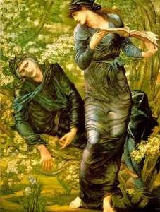

  
[Intangible Textual Heritage](../../../index) 
[Legends/Sagas](../../index)  [Celtic](../index) 

------------------------------------------------------------------------

[Buy this Book at
Amazon.com](https://www.amazon.com/exec/obidos/ASIN/0809531534/internetsacredte)

------------------------------------------------------------------------

<table width="75%">
<colgroup>
<col style="width: 50%" />
<col style="width: 50%" />
</colgroup>
<tbody>
<tr class="odd">
<td width="50%" data-valign="CENTER"> 
</td>
<td width="50%" data-valign="CENTER"><h1 id="celtic-myth-and-legend" data-align="CENTER">Celtic Myth and Legend</h1>
<h2 id="by-charles-squire" data-align="CENTER">by Charles Squire</h2>
<h4 id="section" data-align="CENTER">[1905]</h4></td>
</tr>
</tbody>
</table>

------------------------------------------------------------------------

|                                                                                                                           |
|---------------------------------------------------------------------------------------------------------------------------|
|  |

Part of the 'Myths and Legends' series published by Gresham in the early
20th century, 'Celtic Myth and Legend' is actually a reissue of a 1905
work, 'The Mythology of the British Islands'. It differs from the rest
of the Gresham series because it is a bit more scholarly (it actually
has an adequate set of footnotes) and a bit more didactic. There is [an
extensive index](cml31) with over 8,000 references (all hyperlinked
here). Another great feature is a [glossary](cml32) of dozens of Irish
and Welsh words and phrases with phonetic transcriptions--finally
everyone can learn how to properly pronounce terms such as 'Táin Bo
Chuailgné' and 'Pwyll'! This is a good thing. More importantly, Squire
is summarizing a (fairly mainstream) school of thought about the
mythology of Britain, in which many names and incidents in the tangled
legends of the dark ages can be traced to ancient Pagan myths. The
Celtic fairy faith is explained as a survival of the worship of ancient
tutelary gods and goddesses. When one considers that the other two
leading theories are that the fairies are supernatural transdimensional
entities or reclusive troglodyte pygmies, this seems to be fairly
rational.

Through the ancient chronologies of Irish invasions and the heroic age
of the Fenians, through the Welsh tales from the Mabinogion, and into
the age of Arthur, we see similar names, themes and story elements crop
up again and again. For instance, the ancient sky-God Lludd, is confused
with a sea-god, Llyr, who eventually morphs into King Lear. Llud's
daughter Creudylad, becomes Cordelia. The magic cauldron of ancient
Celtic mythology becomes the Holy Grail. And so on.

There are many parallels to classical mythology, and Squire uses these
as reference points, e.g. by calling the War of the Bull of Cualgne,
'The Irish Iliad,' Cuchulainn, 'The Irish Achilles,' and Branwen, 'The
British Aphrodite.' Some of these analogies do break down on close
examination, but they can aid the reader's absorption of this
lesser-known branch of mythology.

While Squire is trying to make a point, and there is more apparatus than
the typical Gresham *Myths and Legends* book, he also tells these
timeless stories in a very entertaining fashion.

--John B. Hare, November 28th, 2005.

------------------------------------------------------------------------

[Title Page](cml00)  
[Preface](cml01)  
[Contents](cml02)  
[Plates in Colour](cml03)  
[Plates in Monochrome](cml04)  
[Chapter I. The Interest and Importance of Celtic Mythology](cml05)  
[Chapter II. The Sources of Our Knowledge of the Celtic
Mythology](cml06)  
[Chapter III. Who Were the ''Ancient Britons''?](cml07)  
[Chapter IV. The Religion of the Ancient Britons and Druidism](cml08)  

### The Gaelic Gods

[Chapter V. The Gods of the Gaels](cml09)  
[Chapter VI. The Gods Arrive](cml10)  
[Chapter VII. The Rise of the Sun-God](cml11)  
[Chapter VIII. The Gaelic Argonauts](cml12)  
[Chapter IX. The War with the Giants](cml13)  
[Chapter X. The Conquest of the Gods by Mortals](cml14)  
[Chapter XI. The Gods in Exile](cml15)  
[Chapter XII. The Irish Iliad](cml16)  
[Chapter XIII. Some Gaelic Love-Stories](cml17)  
[Chapter XIV. Finn and the Fenians](cml18)  
[Chapter XV. The Decline and Fall of the Gods](cml19)  

### The British Gods

[Chapter XVI. The Gods of the Britons](cml20)  
[Chapter XVII. The Adventures of the Gods of Hades](cml21)  
[Chapter XVIII. The Wooing of Branwen and the Beheading of
Brân](cml22)  
[Chapter XIX. The War of Enchantments](cml23)  
[Chapter XX. The Victories of Light Over Darkness](cml24)  
[Chapter XXI. The Mythological ''Coming of Arthur''](cml25)  
[Chapter XXII. The Treasures of Britain](cml26)  
[Chapter XXIII. The Gods as King Arthur's Knights](cml27)  
[Chapter XXIV. The Decline and Fall of the Gods](cml28)  

### Survivals of Celtic Paganism

[Chapter XXV. Survivals of the Celtic Paganism into Modern
Times](cml29)  

### Appendix

[A Few Books upon Celtic Mythology and Literature](cml30)  
[Index](cml31)  
[Table of Pronunciation for the More Difficult Words](cml32)  
