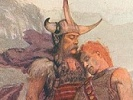

  
[Intangible Textual Heritage](../../../index)  [Legends and
Sagas](../../index)  [Celtic](../index)  [Index](index) 
[Previous](crc19)  [Next](crc21) 

------------------------------------------------------------------------

[Buy this Book on
Kindle](https://www.amazon.com/exec/obidos/ASIN/B0037Z6ILA/internetsacredte)

------------------------------------------------------------------------

  
*The Cattle Raid of Cualnge*, by L. Winifred Faraday, \[1904\], at
Intangible Textual Heritage

------------------------------------------------------------------------

### The Death of the Princes [1](#fn_66)

'Let a sword-truce be asked of Cuchulainn for us,' said Ailill and Medb.

Lugaid goes on that errand, and Cuchulainn grants the truce.

'Put a man on the ford for me to-morrow,' said Cuchulainn.

p. 68

There were with Medb six princes, *i.e.* six king's heirs of the Clanna
Dedad, the three Blacks of Imlech, and the three Reds of Sruthair.

'Why should we not go against Cuchulainn?' said they.

They go next day, and Cuchulainn slew the six of them.

------------------------------------------------------------------------

### Footnotes

[67:1](crc20.htm#fr_67) Or 'royal mercenaries.'

------------------------------------------------------------------------

[Next: The Death of Cur](crc21)

