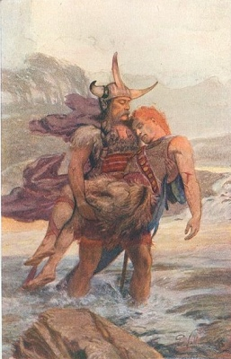

  
[Intangible Textual Heritage](../../../index)  [Legends and
Sagas](../../index)  [Celtic](../index) 

------------------------------------------------------------------------

[Buy this Book on
Kindle](https://www.amazon.com/exec/obidos/ASIN/B0037Z6ILA/internetsacredte)

------------------------------------------------------------------------

<table width="75%">
<colgroup>
<col style="width: 50%" />
<col style="width: 50%" />
</colgroup>
<tbody>
<tr class="odd">
<td width="50%" data-valign="TOP"></td>
<td width="50%" data-valign="CENTER"><h1 id="the-cattle-raid-of-cualnge" data-align="CENTER">The Cattle Raid of Cualnge</h1>
<h2 id="by-l.-winifred-faraday" data-align="CENTER">by L. Winifred Faraday</h2>
<h4 id="section" data-align="CENTER">[1904]</h4></td>
</tr>
</tbody>
</table>

------------------------------------------------------------------------

[Contents](#contents)    [Start Reading](crc00)    [Page
Index](pageidx)    [Text \[Zipped\]](crc.txt.gz)    [PDF](crc.pdf)

------------------------------------------------------------------------

This is a translation of a story cycle at the core of the saga of
Cuchulainn, one of the masterpieces of Irish literature. Cuchulainn was
the son of the God Lug and the daughter of the king of Ulster.
Cuchulainn had the strength of Hercules, but was slow in gaining control
over his powers, which turned him into a monster, leaving a trail of
mayhem in his wake. At the age of seventeen, still beardless, Cuchulainn
single-handedly repeals an invasion of Ulster by Queen Mebd of Connacht
to steal the mythic bull Donn Cuailnge. Cuchulainn has parallels in
other great sagas worldwide, such as the Mahabharata and the Iliad.

This was apparently one the first English translation of this story from
the original manuscripts. This account and the rest of the 'Ulster
Cycle' is widely retold (e.g. Lady Gregory's [Cuchulain of
Muirthemne](../cuch/index)).

------------------------------------------------------------------------

 [Title Page](crc00)  
[Contents](crc01)  
[Introduction](crc02)  
[The Cattle-Raid of Cualnge](crc03)  
[Cuchulainn's Boyish Deeds](crc04)  
[The Death of Fraech](crc05)  
[The Death of Orlam](crc06)  
[The Death of the Meic Garach](crc07)  
[The Death of the Squirrel](crc08)  
[The Death of Lethan](crc09)  
[The Death of Lochu](crc10)  
[The Harrying of Cualnge](crc11)  
[The Death of Etarcomol](crc12)  
[The Death of Nadcrantail](crc13)  
[The Finding of the Bull](crc14)  
[The Death of Redg the Satirist](crc15)  
[The Meeting of Cuchulainn and Findabair](crc16)  
[The Combat of Munremar and Curoi](crc17)  
[The Death of the Boys](crc18)  
[The Woman-fight of Rochad](crc19)  
[The Death of the Princes](crc20)  
[The Death of Cur](crc21)  
[The Number of the Feats](crc22)  
[The Death of Ferbaeth](crc23)  
[The Combat of Larine Mac Nois](crc24)  
[The Conversation of the Morrigan with Cuchulainn](crc25)  
[The Death of Loch Mac Emonis](crc26)  
[The Healing of the Morrigan](crc27)  
[The Death of the Boys (second version)](crc28)  
[The Arming of Cuchulainn](crc29)  
[Continuation (from the Yellow Book of Lecan)](crc30)  
[The Combat of Fer Diad and Cuchulainn](crc31)  
[The Long Warning of Sualtaim](crc32)  
[The Muster of the Ulstermen](crc33)  
[The Vision of Dubthach](crc34)  
[The March of the Companies](crc35)  
[The Muster of the Men of Ireland](crc36)  
[The Battle on Garach and Irgarach](crc37)  
[The Meeting of the Bulls](crc38)  
[The Peace](crc39)  
[Advertisements](crc40)  
