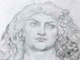
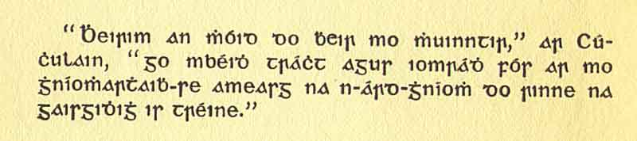

  
[Intangible Textual Heritage](../../../index)  [Legends and
Sagas](../../index)  [Celtic](../index)  [Index](index) 
[Previous](lgc00)  [Next](lgc02) 

------------------------------------------------------------------------

[Buy this Book at
Amazon.com](https://www.amazon.com/exec/obidos/ASIN/B00267T84E/internetsacredte)

------------------------------------------------------------------------

  
*Cuchulain of Muirthemne*, by Lady Augusta Gregory, \[1902\], at
Intangible Textual Heritage

------------------------------------------------------------------------

p. iv

 

"I SWEAR BY THE OATH OF MY PEOPLE," SAID CUCHULAIN, "I WILL MAKE MY
DOINGS BE SPOKEN OF AMONG THE GREAT DOINGS OF HEROES IN THEIR STRENGTH."

p. v

#### DEDICATION OF THE IRISH EDITION

#### TO THE PEOPLE OF KILTARTAN

My Dear Friends,  
                    When I began to gather these stories together, it is
of you I was thinking, that you would like to have them and to be
reading them. For although you have not to go far to get stories of Finn
and Goll and Oisin from any old person in the place, there is very
little of the history of Cuchulain and his friends left in the memory of
the people, but only that they were brave men and good fighters, and
that Deirdre was beautiful.

When I went looking for the stories in the old writings, I found that
the Irish in them is too hard for any person to read that has not made a
long study of it. Some scholars have worked well at them, Irishmen and
Germans and Frenchmen, but they have printed them in the old cramped
Irish, with translations into German or French or English, and these are
not easy for you to get, or to understand, and the stories themselves
are confused, every one giving a different account from the others in
some small thing, the way there is not much pleasure in reading them. It
is what

p. vi

\[paragraph continues\] I have tried to
do, to take the best of the stories, or whatever parts of each will fit
best to one another, and in that way to give a fair account of
Cuchulain's life and death. I left out a good deal I thought you would
not care about for one reason or another, but I put in nothing of my own
that could be helped, only a sentence or so now and again to link the
different parts together. I have told the whole story in plain and
simple words, in the same way my old nurse Mary Sheridan used to be
telling stories from the Irish long ago, and I a child at Roxborough.

And indeed if there was more respect for Irish things among the learned
men that live in the college at Dublin, where so many of these old
writings are stored, this work would not have been left to a woman of
the house, that has to be minding the place, and listening to
complaints, and dividing her share of food.

My friend and your friend the *Craoibhin Aoibhin* has put Irish of
to-day on some of these stories that I have set in order, for I am sure
you will like to have the history of the heroes of Ireland told in the
language of Ireland. And I am very glad to have something that is worth
offering you, for you have been very kind to me ever since I came over
to you from Kilchriest, two-and-twenty years ago.

AUGUSTA GREGORY.

March 1902.

------------------------------------------------------------------------

[Next: Preface by W.B. Yeats](lgc02)
