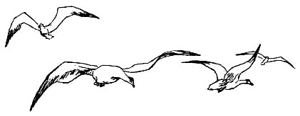
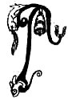
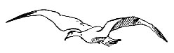
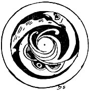

  
[Intangible Textual Heritage](../../../index)  [Sagas and
Legends](../../index)  [Celtic](../index)  [Index](index) 
[Previous](cwt12)  [Next](cwt14) 

------------------------------------------------------------------------

The Luck-Child

 

 \[A\]IDAN, Osric, and Teigue,
were the cow-herds of Eterscel, the High King of Ireland. Aidan was old
and gentle, Osric was young and fierce, Teigue was an omadhaun--a
fool--they watched the cattle of the king and chased the wild beasts
from them. At night they slept in little wicker huts on the edge of the
forest.

One day as Teigue was gathering dry sticks for his fire he saw a very
young child lying wrapped in a mantle at the foot of a pine tree. He
went over to the child and it smiled in his face. He left off gathering
sticks and sat down beside it. Osric came to see what was keeping
Teigue.

"A fool's errand is long a-doing," he said. "What are you loitering here
for, when the meat is waiting for the fire and the fire is waiting for
the sticks? "

"I have here," said Teigue, "what is better than meat, a gift from the
Hidden People."

Osric looked at the child.

"We have little use for a nine-months' infant," he said.

The child smiled at him.

"Where could we keep it? " he asked Teigue. " I will make a house for
it," said Teigue, "a little house in the middle of the forest, that no
one can find but myself."

"'Tis a pity the child should perish in the forest," said Osric. " Of a
truth the house must be built."

Aidan came. He lifted the child in his arms and looked at the mantle
wrapped about it. The mantle was thickly embroidered with gold flowers.

"This is the child of some queen," he said. "One day great folk will
come seeking her."

"I will not let the great folk take her away," said Teigue. "She is my
Luck-Child. She is Osric's Luck-Child too, and we are going to make a
house for her, and she will bring us good luck every day of our lives."

"She is my Luck-Child too," said Aidan. "We three will make a secret
house in the forest, and there we will keep her from prying eyes."

They sought out a place, a hidden green spot in the forest. They made a
house, and there they nurtured the child in secret. Year by year she
throve and grew with them. Teigue brought her berries and taught her to
play on a little reed flute. When she made music on it the wild
creatures of the woods came about her. She played with the spotted
fawns, and the king of the wolves crouched before her and licked her
hands. Osric made a bow for her, and taught her how to shoot with
arrows, but she had no wish

to kill any beast, for all the forest-creatures were her friends. Aidan
told her stories. He told her how the sun changed into a White Hound at
night, and Lugh the Long-Handed put a silver chain on it and led it away
to his Secret Palace, and it crouched at his feet till the morning, when
he loosed it and let it run through the sky again. He told her how
Brigit counted the stars so that no littlest one got lost, and how she
hurried them away in the morning before Lugh's great hound came out to
frighten them. He said that Brigit came in the very early mornings to
gather herbs of healing, for it was she who gave the secret of healing
to wise physicians, and it was she gave power and virtue to every herb
that grows. He said that once the High King's Poet had seen Brigit and
had made a song about her and called her 'The Pure Perpetual Ashless
Fire of the Gael.'

The Luck-Child loved to hear Aidan's Stories. She loved them even when
she had grown quite tall and wise and was no longer a child.

Teigue was sorry that she grew up so quickly. He sat down one day and
began to lament and cry Ochone! about it.

"Why are you lamenting and crying Ochone?" said Osric.

"Because my Luck-Child has grown up and the Hidden People will see that
she is no longer a child. They will take her and make her a queen
amongst them, and she will never come back to us. Ochone! Ochone!"

"If the chiefs and warriors of King Eterscel do not see her," said
Osric, " she is safe enough: and if they do come to take her I will not
let her go without a fight."

Aidan heard them talking.

"Do not speak of trouble or sorrow when you speak of the Luck-Child," he
said. "One day she will come to her own, and then she will give each of
us his heart's wish."

"I will wish for a robe all embroidered with gold," said Teigue. "What
will you wish for, Osric?"

"For a shield and spear and the right to go into battle with warriors."

"What will you wish for, Aidan?

"I will wish, O Teigue, to sit in the one dun with the Luck-Child, and
hear the poets praising her.

"I will go and tell the Luck-Child our wishes," said Teigue, "so that
she may know when she comes to her own."

He ran to the little hut in the forest, and the Luck-Child came out to
meet him. She laughed to hear of the wishes, and said she would have a
wish herself in the day of good fortune, and it would be to have Teigue,
Osric, and Aidan, always with her. She took a little reed flute and
began to play on it.

"Listen now," she said to Teigue, "and I will play you music I heard
last night when the wind swept down from the hills."

Teigue sat under a pine tree and listened.

A great white hound came through the wood, and when it saw Teigue it
stood and bayed. The hound had a gold collar set with three crystal
stones.

"O my Luck-Child," said Teigue, "a king will come after this hound. Go
quickly where he can get no sight of you."

She had the will to go, but the hound bayed about her feet and would not
let her move. A clear voice called the hound, and through the trees came
the High King of Ireland: there was no one with him but his
foster-brother.

The king had the swiftness and slenderness of youth on him. 'Tis he that
was called the Candle of Beauty in Tara of the Kings--and nowhere on the
yellow-crested ridge of the world could his equal be found for hardiness
and high-heartedness and honey-sweet wisdom of speech.

His foster-brother had a thick twist of red gold in his hair, and he was
the son of a proud northern king. The Luck-Child seemed to both of them
a great wonder.

"What maiden is this? " said the king, and stood looking at her.

"She is my Luck-Child, O King," said Teigue. "She is no child of thine!"
said the king's foster-brother.

"She is a child of the Hidden People," said Teigue, "and she has brought
me luck every day since I found her."

"Tell me," said the king, "how you found her."

"I found her under a pine tree, a nine-months' child wrapped in a mantle
all sewn over with little golden flowers. She is my Luck-Bringer since
that day."

"She is mine to-day!" said the king. "O Luck-Child," he said, "will you
come and live in my palace and bring me good fortune? It is you will be
the High Queen of Ireland, and you will never have to ask a thing the
second time."

"Will you give Teigue a gold-embroidered robe and let him stay always
with me?"

"I will do that," said the king.

"Will you give Osric a sword and let him go into battle like a warrior?
"

"Who is Osric?"

"It was Osric who built the house for me and taught me to shoot with
arrows and speared salmon in the rivers for me. I will not go with you
without Osric."

"I will give Osric what you ask," said the king, "let him come to me."

"I will bring him," said Teigue, and he ran to find Osric and Aidan.

"O Foster-Brother," said the king, "it is well we lost our way in the
woods, for now I have found the queen the druids promised me. 'Good
luck,' said they, 'will come to King Eterscel when he weds a queen of
unknown lineage.' It is this maiden who will bring me luck."

He took the Luck-Child by the hand, and they went through the wood with
the hound following them.

Soon they met Teigue, Osric, and Aidan, coming together. The Luck-Child
ran to them and brought them to the king.

"Here is Osric," she said, "and Aidan who told me stories."

"I will give Osric one of my own war-chariots and his choice of
weapons," said the king. "What am I to give to Aidan?"

"Is there a carved seat in your palace where lie can sit and listen to
your poet who made the song about Brigit?"

"There are many carved seats in my palace, and he shall sit in one,"
said Eterscel. "All the three shall sit in seats of honour, for they
will be the Foster-Fathers of the High Queen of Ireland."

He turned to the three cow-herds.

"On the day ye built the little hut in the forest for your nurseling ye
built truth into the word of my druids, and now I will build honour into
your fortune. Ye shall rank with chiefs and the sons of chiefs. Ye shall
drink mead in feast-halls of your own, and while I live ye shall have my
goodwill and protection."

"May honour and glory be with you for ever, O King," said Aidan. "In a
good hour you have come to us."

"We are all going to the palace," said the Luck-Child. "Teigue, where is
your flute?"

"It is in the little hut," said Teigue. " I will go back for it."

"Nay," said the king, "there are flutes enough in the palace! I will
give you one of silver, set with jewels."

The Luck-Child clapped her hands for joy.

"I love you," she said to the king. "Come, let us go!"

She took Teigue by the one hand and the king by the other, and they all
went to the palace. Every one wondered at the Luck-Child, for since the
days of Queen Ethaun, who came out of Fairyland, no one so beautiful was
seen in Ireland. The king called her Ethaun, and all the people said
that in choosing her he had done well.

There was feasting and gladness on the day they swore troth to each
other, and Teigue said the sun got up an hour earlier in the morning and
stayed an hour later in the sky that night for gladness.

 

 

 

 

 

------------------------------------------------------------------------

[Next: Conary Mor](cwt14)
