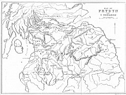
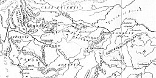
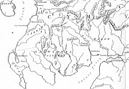

  
[Intangible Textual Heritage](../../../index)  [Legends &
Sagas](../../index)  [Celtic](../index)  [Index](index) 
[Previous](fab001)  [Next](fab003) 

------------------------------------------------------------------------

 

[  
Click to enlarge](img/map.jpg)  
Map of Prydyn or Y Gogled  

[  
Click to enlarge](img/mapdet01.jpg)  
Map Detail 1  

[  
Click to enlarge](img/mapdet02.jpg)  
Map Detail 2  

------------------------------------------------------------------------

[Next: Chapter I. The Poems Contained in the Four Ancient Books of
Wales](fab003)
