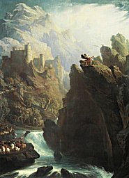

  
[Intangible Textual Heritage](../../../index)  [Legends &
Sagas](../../index)  [Celtic](../index) 

------------------------------------------------------------------------

<table width="75%">
<colgroup>
<col style="width: 50%" />
<col style="width: 50%" />
</colgroup>
<tbody>
<tr class="odd">
<td width="50%" data-valign="CENTER"><a href="img/bard.jpg"> 
Click to enlarge</a></td>
<td width="50%" data-valign="CENTER"><h1 id="the-four-ancient-books-of-wales" data-align="CENTER">The Four Ancient Books of Wales</h1>
<h3 id="by-william-f.-skene" data-align="CENTER">by William F. Skene</h3>
<h4 id="section" data-align="CENTER">[1868]</h4></td>
</tr>
</tbody>
</table>

------------------------------------------------------------------------

[Contents](#contents)    [Start Reading](fab000)

------------------------------------------------------------------------

This is William Skene's anthology of dark-age Welsh Bardic poetry. Often
cited, but difficult to obtain, this book contains every remaining piece
of Bardic poetry known. The poems are translated from four manuscripts:
the Black Book of Caermarthen, the Red Book of Hergest (which is also
the source of the [Mabinogion](../mab/index)), the Book of Taliessin and
the Book of Aneurin, all of which date from the twelfth to the fifteenth
centuries C.E. The poems themselves date from much earlier, probably
from the sixth century by internal evidence.

This corpus is one of the treasures of world literature. It is also the
only true source material for the study of Bardic lore, which reputedly
preserved the esoteric (and long-lost) beliefs of the Druids. Largely
written to satisfy wealthy patrons, much of the subject matter is
related to mead-inspired battles, particularly the renowned Gododin
cycle. However, the poetry rises above the gory combat and toadying to
achieve an artistic height that would not be reached for many centuries.
Some of the later works, which use Christian themes as a jumping-off
point, have an almost haiku-like quality. The poems are infused
throughout with mystic clarity, strange flashes of wisdom, and insight
into humanity and nature.

This book is very rare, and only available for purchase today in a
print-on-demand edition. This etext, produced at Intangible Textual
Heritage, is the first comprehensive posting of this fascinating
material on the Internet.

John Bruno Hare, March 17th, 2004.

------------------------------------------------------------------------

 [Title Page](fab000)  
[Contents](fab001)  
[Map of Prydyn or Y Gogled](fab002)  

### Introduction

[Chapter I. The Poems Contained in the Four Ancient Books of
Wales](fab003)  
[Chapter II. The Literature of Wales Subsequent to the Twelfth
Century](fab004)  
[Chapter III. Sources of the Early History of Wales](fab005)  
[Chapter IV. State of the Country in the Sixth Century, and its History
Prior To A.D. 560](fab006)  
[Chapter V. State of Britain in A.D. 560 When Gildas Wrote, and Kings of
the Line of Dyfi](fab007)  
[Chapter VI. Manau Gododin and the Picts](fab008)  
[Chapter VII. The Races of Britain and the Place of the Picts Among
Them](fab009)  
[Chapter VIII. The Celtic Dialects and the Probable Character of the
Pictish Language](fab010)  
[Chapter IX. The Celtic Topography of Scotland, and the Dialectic
Differences Indicated by it](fab011)  
[Chapter X. Cumbria and the Men of the North](fab012)  
[Chapter XI. Recent Criticism of Mythological Poems Examined](fab013)  
[Chapter XII. Recent Criticism of Historical Poems Examined](fab014)  
[Chapter XIII. True Place of the Poems in Welsh Literature.](fab015)  
[Chapter XIV. Result of the Examination of the Poems, and their
Classification](fab016)  

### TRANSLATION OF THE POEMS

### I. Historical Poems Containing Allusions to Events Prior to A.D. 560

### A. Poems Referring to Early Traditions

[I. The Reconciliation of Llud the Less. Book of Taliessin
LIV.](fab017)  
[II. The Death-Song of Corroi, Son of Dayry. Book of Taliessin
XLII.](fab018)  
[III. The Death-Song of Erof. Book of Taliessin XL.](fab019)  
[IV. Book of Taliessin XLI.](fab020)  
[V. Book of Taliessin XLVI.](fab021)  

### B. Poems Referring to Arthur the Guledig

[VI. The Chair of the Sovereign. Book of Taliessin XV.](fab022)  
[VII. Black Book of Caermarthen XXXI.](fab023)  
[VIII. Book of Taliessin XXX.](fab024)  
[IX. Geraint, Son of Erbin. Black Book of Caermarthen XXII., Red Book Of
Hergest XIV.](fab025)  

### C. Poems Referring to Gwydyon ap Don and his Gwyddyl and the Brithwyr.

[X. Daronwy. Book of Taliessin X.](fab026)  
[XI. The Praise of Lludd the Great. Book of Taliessin LII.](fab027)  
[XII. Book Of Taliessin XIV.](fab028)  
[XIII. The Battle of Godeu. Book of Taliessin VIII.](fab029)  
[XIV. Book of Taliessin I. Red Book of Hergest XXIII.](fab030)  
[XV. Death-Song of Dylan Son of the Wave. Book of Taliessin
XLIII.](fab031)  
[XVI. Black Book of Caermarthen XXXV.](fab032)  
[XVII. Red Book of Hergest XXII.](fab033)  

### D. Poem Referring to Gwyddno and Gwynn ap Nudd

[XVIII. Black Book of Caermarthen XXXIII](fab034)  

### E. Poems Referring to Early Traditions which Belong to a Later School

[XIX. The Chair of Ceridwen. Book of Taliessin XVI.](fab035)  
[XX. The Death-Song of Uthyr Pendragon. Book of Taliessin
XLVIII.](fab036)  
[XXI. Book of Taliessin XLV.](fab037)  
[XII. The Praise of Taliessin. Book of Taliessin XII.](fab038)  
[XXIII. Black Book of Caermarthen XXXVIII.](fab039)  

### F. Poems Relating to Cities of the Cymry and their Legendary Heroes

[XXIV. Black Book of Caermarthen XV.](fab040)  
[XXV. Book of Taliessin XXI. Black Book of Caermarthen XIV.](fab041)  
[XXVI. Black Book of Caermarthen VIII.](fab042)  
[XXVIII. Book of Taliessin XXV.](fab043)  
[XXIX. The Verses of the Graves. Black Book of Caermarthen
XIX.](fab044)  

### II. Historical Poems Containing Allusions to Events Subsequent to A.D. 560.

### G. Poems Referring to War Between Sons of Llywarch Hen and Mwg Mawr Drefydd.

[XXX. Names of the Sons Of Llywarch Hen. Black Book of Caermarthen
XXXIX.](fab045)  
[XXXI. Black Book of Caermarthen XXX](fab046)  
[XXXII. Black Book of Caermarthen XXXIV.](fab047)  
[XXXIII. Red Book of Hergest XI.](fab048)  

### H. Poems Relating to Gwallawg ap Lleenawg

[XXXIV. Black Book of Caermarthen XXXII.](fab049)  
[XXXV. Book of Taliessin XI.](fab050)  
[XXXVI. Book of Taliessin XXXVIII.](fab051)  

### I. Poems Relating to Urien Reged.

[XXXVII. Red Book of Hergest XVII.](fab052)  
[XXXVIII. Book Of Taliessin XXXI.](fab053)  
[XXXIX. Book of Taliessin XXXII.](fab054)  
[XL. Book of Taliessin XXXIII.](fab055)  
[XLI. Book of Taliessin XXXIV.](fab056)  
[XLII. Book of Taliessin XXXVI.](fab057)  
[XLIII. The Satisfaction of Urien. Book of Taliessin XXIX.](fab058)  
[XLIV. The Spoils of Taliessin, a Song to Urien. Book of Taliessin
XXVII.](fab059)  
[XLV. Red Book of Hergest XII.](fab060)  

### J. Poems Relating to Urien and his Son Owen.

[XLVI. Book of Taliessin XVIII.](fab061)  
[XLVII. The Affair of Argoed Llwyfain. Book of Taliessin
XXXV.](fab062)  
[XLVII. The Death-Song of Owain. Book of Taliessin XLIV.](fab063)  

### K. Poems Relating to the Battle of Ardderyd.

[XLIX. Black Book of Caermarthen I](fab064)  
[L. Black Book Of Caermarthen XVII.](fab065)  

### L. The Gododin Poems.

[LI. Book of Aneurin I.](fab066)  
[LII. Book of Aneurin II.](fab067)  
[LIII. Book of Aneurin IV.](fab068)  
[LIV. Book of Aneurin V.](fab069)  
[LV. Song to Ale. Book of Taliessin XX.](fab070)  

### M. Poems Relating to Cadwallawn.

[LVI. Book of Taliessin XLIX.](fab071)  
[LVII. Book of Taliessin L.](fab072)  
[LVIII. Red Book of Hergest XV.](fab073)  

### N. Predictive Poems Relating to Cadwaladyr.

[LIX. The Omen of Prydein the Great. Book of Taliessin VI.](fab074)  
[LX. Book of Taliessin XLVII.](fab075)  
[LXI. Book of Taliessin LIII.](fab076)  

### O. Poems Connected With Powys.

[LXII. Satire of Cynan Garwyn Son of Brochwael. Book of Taliessin
XXIII.](fab077)  
[LXIII. Red Book of Hergest XVI.](fab078)  

### P. Poems Which Mention Henry, or the Son of Henry

[LXIV. A Dialogue Between Myrdin and His Sister Gwendydd. Red Book of
Hergest I.](fab079)  
[LXV. A Fugitive Poem of Myrdin in His Grave. Red Book of Hergest
II.](fab080)  
[LXVI. Black Book of Caermarthen XVI.](fab081)  
[LXVII. Black Book of Caermarthen XVIII.](fab082)  
[LXVIII. Red Book of Hergest XX.](fab083)  
[LXIX. Red Book of Hergest XIX.](fab084)  
[LXX. Red Book of Hergest XXI.](fab085)  

### III. Miscellaneous Poems from the Black Book of Caermarthen

### Q. Poems Attributed to Other Early Bards

[LXXI. Meigant. Black Book of Caermarthen II.](fab086)  
[LXXII. Cuhelyn. Black Book of Caermarthen III.](fab087)  
[XXIII. Black Book of Caermarthen IV.](fab088)  
[LXXIV. The Cynghogion of Elaeth. Black Book of Caermarthen
XX.](fab089)  
[LXXV. Black Book Of Caermarthen XXI.](fab090)  

### R. Anonymous Poems on Religious Subjects

[LXXVI. Black Book of Caermarthen V.](fab091)  
[LXXVII. Black Book of Caermarthen VI.](fab092)  
[LXXVIII. Black Book of Caermarthen VII.](fab093)  
[LXXIX. Black Book of Caermarthen IX.](fab094)  
[LXXX. Black Book of Caermarthen X](fab095)  
[LXXXI. Black Book of Caermarthen XI.](fab096)  
[LXXXII. Black Book of Caermarthen XII.](fab097)  
[LXXXIII. Black Book of Caermarthen XIII.](fab098)  
[LXXXIV. Black Book of Caermarthen XXV.](fab099)  
[LXXXV. Black Book of Caermarthen XXIX.](fab100)  

### S. Poems Relating to Yscolan.

[LXXXVI. Black Book of Caermarthen XXVI.](fab101)  
[LXXXVII. Black Book of Caermarthen XXVII.](fab102)  

### IV. Miscellaneous Poems from the Book of Aneurin.

### T. Poem Containing Ancient Proverbs

[LXXXVIII. Book of Aneurin III.](fab103)  

### V. Miscellaneous Poems from the Book of Taliessin.

### U. Poems Relating to the Life and Opinions of Taliessin.

[LXXXIX. The Fold of the Bards. Book of Taliessin III.](fab104)  
[XC. Hostile Confederacy. Book of Taliessin VII.](fab105)  
[XCI. The Chair of Taliessin. Book of Taliessin XIII.](fab106)  
[XCII. Song to the Wind. Book of Taliessin XVII.](fab107)  
[XCIII. Song to Mead. Book of Taliessin XIX.](fab108)  
[XCIV. Song to the Great World. Book of Taliessin LV.](fab109)  
[XCV. Song to the Little World. Book of Taliessin LVI.](fab110)  
[XCVI. Juvenile Ornaments of Taliessin. Book of Taliessin IX.](fab111)  
[XCVII. The Elegy of the Thousand Sons. Book of Taliessin II.](fab112)  
[XCVIII. The Pleasant Things of Taliessin. Book of Taliessin
IV.](fab113)  
[XCIX. Book of Taliessin V.](fab114)  
[C. Book Of Taliessin XXVII.](fab115)  

### V. Poems Relating to Jewish History.

[CI. The Plagues of Egypt. Book of Taliessin XXII.](fab116)  
[CII. The Rod of Moses. Book of Taliessin XXIV.](fab117)  
[CIII. Book of Taliessin XXIX.](fab118)  
[CIV. Book of Taliessin LI.](fab119)  

### W. Poems Relating to Legends of Alexander the Great.

[CV. The Contrived World. Book of Taliessin XXVI.](fab120)  
[CVI. Book of Taliessin XXVIII.](fab121)  

### VI. Miscellaneous Poems from the Red Book of Hergest.

### X. Poems Attributed to Llywarch Hen.

[CVII. Red Book of Hergest V](fab122)  
[CVIII. Red Book of Hergest VI.](fab123)  
[CIX. Red Book of Hergest VII.](fab124)  
[CX. Red Book of Hergest VIII.](fab125)  
[CXI. Red Book of Hergest IX.](fab126)  
[CXII. Red Book of Hergest X](fab127)  
[CXIII. Red Book of Hergest XIII.](fab128)  

### Y. Poems Beginning ''Eiry Mynyd.''

[CXIV. Red Book of Hergest IV](fab129)  
[CXV. Red Book of Hergest III.](fab130)  

### Z. Poems on Various Subjects.

[CXVI. Red Book of Hergest XVIII.](fab131)  
[CXVII. The Viaticum of Llevoed Wynebglawr. Red Book of Hergest
XXIV.](fab132)  
