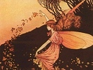

  
[Intangible Textual Heritage](../../../index)  [Legends and
Sagas](../../index)  [Celtic](../index)  [Index](index) 
[Previous](ffcc240)  [Next](ffcc260) 

------------------------------------------------------------------------

[Buy this Book at
Amazon.com](https://www.amazon.com/exec/obidos/ASIN/B0026FCI5W/internetsacredte)

------------------------------------------------------------------------

  
*The Fairy-Faith in Celtic Countries*, by W.Y. Evans-Wentz, \[1911\], at
Intangible Textual Heritage

------------------------------------------------------------------------

p. 308

# SECTION II

## THE RECORDED FAIRY-FAITH

## CHAPTER V

### BRYTHONIC DIVINITIES AND THE BRYTHONIC FAIRY-FAITH [1](#fn_265)

'On the one hand we have the man Arthur, whose position we have tried to
define, and on the other a greater Arthur, a more colossal figure, of
which we have, so to speak, but a *torso* rescued from the wreck of the
Celtic pantheon.'--The Right Hon. Sir JOHN RHY^S.

The god Arthur and the hero Arthur--Sevenfold evidence to show Arthur as
an incarnate fairy king--Lancelot the foster-son of a fairy
woman--Galahad the offspring of Lancelot and the fairy woman
Elayne--Arthur as a fairy king in *Kulhwch and Olwen*--Gwynn ab
Nudd--Arthur like Dagda, and like Osiris--Brythonic fairy-romances:
their evolution and antiquity--Arthur in Nennius, Geoffrey, Wace, and in
Layamon--Cambrensis' Otherworld tale--Norman-French writers of twelfth
and thirteenth centuries--*Romans* *d'Aventure* and *Romans
Bretons*--Origins of the 'Matter of Britain'--Fairy-romance episodes in
Welsh literature--Brythonic origins.

### ARTHUR AND ARTHURIAN MYTHOLOGY

As we have just considered the Gaelic Divinities in their character as
the Fairy-Folk of popular Gaelic tradition, so now we proceed to
consider the Brythonic Divinities in the same way, beginning with the
greatest of them all, Arthur. Even a superficial acquaintance with the
Arthurian Legend

p. 309

shows how impossible it is to place upon it any one interpretation to
the exclusion of other interpretations, for in one aspect Arthur is a
Brythonic divinity and in another a sixth-century Brythonic chieftain.
But the explanation of this double aspect seems easy enough when we
regard the historical Arthur as a great hero, who, exactly as in so many
parallel cases of national hero-worship, came--within a comparatively
short time--to be enshrined in the imagination of the patriotic Brythons
with all the attributes anciently belonging to a great Celtic god called
Arthur. [1](#fn_266) The hero and the god were
first confused, and then identified, [2](#fn_267) and hence arose that wonderful body of
romance which we call Arthurian, and which has become the glory of
English literature.

Arthur in the character of a culture hero, [3](#fn_268) with god-like powers to instruct mortals
in wisdom, and, also, as a being in some way related to the sun--as a
sun-god perhaps--can well be considered the human-divine institutor of
the mystic brotherhood known as the Round Table. We ought, probably, to
consider Arthur, like Cuchulainn, as a god incarnate in a human body for
the purpose of educating the race of men; and thus, while living as a
man, related definitely and, apparently, consciously to the invisible
gods or fairy-folk. Among the Aztecs and Peruvians in the New World,
there was a widespread belief that great heroes who had once been men
have now their celestial abode in the sun, and from time to time
reincarnate to become teachers of

p. 310

their less developed brethren of our own race; and a belief of the same
character existed among the Egyptians and other peoples of the Old
World, including the Celts. It will be further shown, in our study of
the Celtic Doctrine of Re-birth, that anciently among the Gaels and
Brythons such heroes as Cuchulainn and Arthur were also considered
reincarnate sun-divinities. As a being related to the sun, as a sun-god,
Arthur is like Osiris, the Great Being, who with his brotherhood of
great heroes and god-companions enters daily the underworld or Hades to
battle against the demons and forces of evil, [1](#fn_269) even as the Tuatha De Danann battled
against the Fomors. And the most important things in the traditions of
the great Brythonic hero connect him directly with this strange world of
subjectivity. First of all, his own father, Uthr Bendragon, [2](#fn_270) as a king of Hades, so that Arthur
himself, being his child, is a direct descendant of this Otherworld.
Second, the Arthurian Legend traces the origin of the Round Table back
to Arthur's father, Hades being 'the realm whence all culture was fabled
to have been derived'. [3](#fn_271) Third, the
name of Arthur's wife, Gwenhwyvar, resolves itself into White Phantom or
White Apparition, in harmony with Arthur's line of descent from the
region of phantoms and apparitions and fairy-folk. Thus:--*Gwenhwyvar*
or *Gwenhwyfar* equals *Gwen* or *Gwenn*, a Brythonic word meaning
white, and *hwyvar*, a word not found in the Brythonic dialects, but
undoubtedly cognate with the Irish word *siabhradh*, a fairy, equal to
*siabhra*, *siabrae*, *siabur*, a fairy, or ghost, the Welsh and the
Irish word going back to the form \**seibayo.* [4](#fn_272) Hence the name of Arthur's wife means
the *white ghost* or *white phantom*, quite in keeping with the nature
of the Tuatha De Danann and that of the fairy-folk of Wales or *Tylwyth
Teg*--the 'Fair Family'.

Fourth, as a link in the chain of evidence connecting

p. 311

\[paragraph continues\] Arthur with the
invisible world where the Fairy-People live, his own sister is called
*Morgan le Fay* in the romances, [1](#fn_273)
and is thus definitely one of the fairy women who, according to
tradition, are inhabitants of the Celtic Otherworld sometimes known as
Avalon. Fifth, in the Welsh Triads, [2](#fn_274) Llacheu, the son of Arthur and
Gwenhwyvar, is credited with clairvoyant vision, like the fairy-folk, so
that he understands the secret nature of all solid and material things;
and 'the story of his death as given in the second part of the Welsh
version of the Grail, makes him hardly human at all.' [3](#fn_275) Sixth, the name of Melwas, the abductor
of Arthur's wife, is shown by Sir John Rhy^s to mean a prince-youth or a
princely youth, and the same authority considers it probable that, as
such, Melwas or Maelwas was a being endowed with eternal youth,--even as
Midir, the King of the Tuatha De Danann, who though a thousand years old
appeared handsome and youthful. So it seems that the abduction of
Gwenhwyfar was really a fairy abduction, such as we read about in the
domestic troubles of the Irish fairy-folk, on a level with the abduction
of Etain by her Otherworld husband Midir. [4](#fn_276) And in keeping with this superhuman
character of the abductor of the White Phantom or Fairy, Chrétien de
Troyes, in his metrical romance *Le Conte de la Charrette*, describes
the realm of which Melwas was lord as a place whence no traveller
returns. [5](#fn_277) As further proof that the
realm of Melwas was meant by Chrétien to be the subjective world, where
the god-like Tuatha De Danann, the *Tylwyth Teg*, and the shades of the
dead equally exist, it is said that access to it was by two narrow
bridges; 'one called *li Ponz Evages* or the Water Bridge, because it
was a narrow passage a foot and a half wide and as much in height, with
water above and below it as well as on both sides'; the other

p. 312

li Ponz de l'Espée or the Sword Bridge, because it consisted of the edge
of a sword two lances in length. [1](#fn_278)
The first bridge, considered less perilous than the other, was chosen by
Gauvain (Gwalchmei), when with Lancelot he was seeking to rescue
Gwenhwyfar; but he failed to cross it. Lancelot with great trouble
crossed the second. In many mythologies and in world-wide folk-tales
there is a narrow bridge or bridges leading to the realm of the dead.
Even Mohammed in the *Koran* declares it necessary to cross a bridge as
thin as a hair, if one would enter Paradise. And in living folk-lore in
Celtic countries, as we found among the Irish peasantry, the crossing of
a bridge or stream of water when pursued by fairies or phantoms is a
guarantee of protection. There is always the mystic water between the
realm of the living and the realm of subjectivity. [2](#fn_279) In ancient Egypt there was always the
last voyage begun on the sacred Nile; and in all classical literature
Pluto's realm is entered by crossing a dark, deep river,--the river of
forgetfulness between physical consciousness and spiritual
consciousness. Burns has expressed this belief in its popular form in
his *Tam O'Shanter*. And in our Arthurian parallel there is a clear
enough relation between the beings inhabiting the invisible realm and
the Brythonic heroes and gods. How striking, too, as Gaston Paris has
pointed out, is the similarity between Melwas' capturing Gwenhwyvar as
she was in the woods a-maying, and the rape of Proserpine by Pluto, the
god of Hades, while she was collecting flowers in the fields. [3](#fn_280)

A curious matter in connexion with this episode of Gwenhwyvar's
abduction should claim our attention. Malory relates [4](#fn_281) that when Queen Guenever advised her
knights of the Table Round that on the morrow (May Day, when fairies
have special powers) she would go on maying, she warned them all to be
well-horsed and *dressed in green*. This was the colour that nearly all
the fairy-folk of Britain and

p. 313

\[paragraph continues\] Ireland wear. It
symbolizes, as many ancient mystical writings declare, eternal youth,
and resurrection or re-birth, as in nature during the springtime, when
all vegetation after its death-sleep of winter springs into new
life. [1](#fn_282) In the *Myvyrian
Archaiology*, [2](#fn_283) Arthur when he has
reached the realm of Melwas speaks with Gwenhwyvar, [3](#fn_284) he being

p. 314

on a black horse and she on a green one:--'Green is my steed of the tint
of the leaves.' Arthur's black horse--black perhaps signifying the dead
to whose realm he has gone--being proof against all water, may have
been, therefore, proof against the inhabitants of the world of shades
and against fairies:--

Black is my steed and brave beneath me,  
No water will make him fear,  
And no man will make him swerve.

\[paragraph continues\] The fairy colour,
in different works and among different authors differing both in time
and country, continues to attach itself to the abduction episode. Thus,
in the fourteenth century the poet D. ab Gwilym alludes to Melwas
himself as having a cloak of green:--'The sleep of Melwas beneath (or
in) the green cloak.' Sir John Rhy^s, who makes this translation,
observes that another reading still of *y glas glog* resolves it into a
green bower to which Melwas took Gwenhwyvar. [1](#fn_285) In any case, the reference is
significant, and goes far, in combination with the other references, to
represent the White Phantom or Fairy and her lover Melwas as beings of a
race like the Irish *Sidhe* or People of the Goddess Dana. And though by
no means exhausting all examples tending to prove this point, we pass on
to the seventh and most important of our links in the sequence of
evidence, the carrying of Arthur to Avalon in a fairy ship by fairy
women.

From the first, Arthur was under superhuman guidance and protection.
Merlin the magician, born of a spirit or daemon, claimed Arthur before
birth and became his teacher afterwards. From the mysterious Lady of the
Lake, Arthur received his magic sword *Excalibur*, [2](#fn_286) and to her returned it, through Sir
Bedivere. During all his time on earth the' lady

p. 315

of the lake that was always friendly to King Arthur' [1](#fn_287) watched over him; and once when she saw
him in great danger, like the Irish *Morrigu* who presided over the
career of Cuchulainn, she sought to save him, and with the help of Sir
Tristram succeeded. [1](#fn_287) The passing of
Arthur to Avalon or Faerie seems to be a return to his own native realm
of subjectivity. His own sister was with him in the ship, for she was of
the invisible country too. [2](#fn_288) And
another of his companions on his voyage from the visible to the
invisible was his life-guardian Nimue, the lady of the lake. Merlin
could not be of the company, for he was already in Faerie with the Fay
Vivian. Behold the passing of Arthur as Malory describes it:--'. . .
thus was he led away in a ship wherein were three queens; that one was
King Arthur's sister, Queen Morgan le Fay; the other was the Queen of
Northgalis; the third was the Queen of the Waste Lands. Also there was
Nimue, the chief lady of the lake, that had wedded Pelleas the good
knight; and this lady had done much for King Arthur, for she would never
suffer Sir Pelleas to be in no place where he should be in danger of his
life.' [3](#fn_289) Concerning the great
Arthur's return from Avalon we shall speak in the chapter dealing with
Re-birth. And we pass now from Arthur and his Brotherhood of gods and
fairy-folk to Lancelot and his son Galahad--the two chief knights in the
Arthurian Romance.

According to one of the earliest accounts we have of Lancelot, the
German poem by Ulrich von Zatzikhoven, as analysed by Gaston Paris, he
was the son of King Pant and Queen Clarine of Genewis. [4](#fn_290) In consequence of the hatred

p. 316

of their subjects the royal pair were forced to flee when Lancelot was
only a year old. During the flight, the king, mortally wounded, died;
and just as the queen was about to be taken captive, a fairy rising in a
cloud of mist carried away the infant Lancelot from where his parents
had placed him under a tree. The fairy took him to her abode on an
island in the midst of the sea, from whence she derived her title of
Lady of the Lake, and he, as her adopted son, the name of *Lancelot du
Lac*; and her island-world was called the Land of Maidens. Having lived
in that world of Faerie so long, it was only natural that Lancelot
should have grown up more like one of its fair-folk than like a mortal.
No doubt it was on account of his half-supernatural nature that he fell
in love with the White Phantom, Gwenhwyvar, the wife of the king who had
power to enter Hades and return again to the land of the living. Who
better than Lancelot could have rescued Arthur's queen? No one else in
the court was so well fitted for the task. And it was he who was able to
cross one of the magic bridges into the realm of Melwas, the Otherworld,
while Gauvain (in the English form, Gawayne) failed.

Malory's narrative records how Lancelot, while suffering from the malady
of madness caused by Gwenhwyvar's jealous expulsion of Elayne his
fairy-sweetheart,--quite a parallel case to that of Cuchulainn when his
wife Emer expelled his fairy-mistress Fand,--fought against a wild boar
and was terribly wounded, and how afterwards he was nursed by his own
Elayne in Fairyland, and healed and restored to his right mind by the
Sangreal. Then Sir Ector and Sir Perceval found him there in the Joyous
Isle enjoying the companionship of Elayne, where he had been many years,
and from that world of Faerie induced him to return to Arthur's court.
And, finally, comes the most important element of all to show how
closely related Lancelot is with the fairy world and its people, and how
inseparable from that invisible realm another of the fundamental
elements in the life of Arthur is--the Quest of the Holy Grail, and the
story of Galahad, who of all the knights was pure and good

p. 317

enough to behold the Sacred Vessel, and who was the offspring of the
foster-son of the Lady of the Lake and the fairy woman Elayne. [1](#fn_291)

In the strange old Welsh tale of *Kulhwch and Olwen* we find Arthur and
his knights even more closely identified with the fairy realm than in
Malory and the Norman-French writers; and this is important, because the
ancient tale is, as scholars think, probably much freer from foreign
influences and re-working than the better-known romances of Arthur, and
therefore more in accord with genuine Celtic beliefs and folk-lore, as
we shall quickly see. The court of King Arthur to which the youth
Kulhwch goes seeking aid in his enterprise seems in some ways--though
the parallel is not complete enough to be emphasized--to be a more
artistic, because literary, picture of that fairy court which the Celtic
peasant locates under mountains, in caverns, in hills, and in knolls, a
court quite comparable to that of the Irish Sidhe-folk or Tuatha De
Danann. Arthur is represented in the midst of a brilliant life where, as
in the fairy palaces, there is much feasting; and Kulhwch being invited
to the feasting says, 'I came not here to consume meat and drink.'

And behold what sort of personages from that court Kulhwch has pledged
to him, so that by their supernatural assistance he may obtain Olwen,
herself perhaps a fairy held under fairy enchantment [2](#fn_292): the sons of Gwawrddur Kyrvach,

p. 318

whom Arthur had power to call from the confines of hell; Morvran the son
of Tegid, who, because of his ugliness, was thought to be a demon;
Sandde Bryd Angel, who was so beautiful that mortals thought him a
ministering angel; Henbedestyr, with whom no one could keep pace 'either
on horseback, or on foot', and who therefore seems to be a spirit of the
air; Henwas Adeinawg, with whom 'no four-footed beast could run the
distance of an acre, much less go beyond it'; Sgilti Yscawndroed, who
must have been another spirit or fairy, for 'when he intended to go on a
message for his Lord (Arthur, who is like a Tuatha De Danann king), he
never sought to find a path, but knowing whither he was to go, if his
way lay through a wood he went along the tops of the trees', and 'during
his whole life, a blade of reed-grass bent not beneath his feet, much
less did one ever break, so lightly did he tread'; Gwallgoyc, who 'when
he came to a town, though there were three hundred houses in it, if he
wanted anything, he would not let sleep come to the eyes of any whilst
he remained there'; Osla Gyllellvawr, who bore a short broad dagger, and
'when Arthur and his hosts came before a torrent, they would seek for a
narrow place where they might pass the water, and would lay the sheathed
dagger across the torrent, and it would form a bridge sufficient for the
armies of the three Islands of Britain, and of the three islands
adjacent, with their spoil.' It seems very evident that this is the
magic bridge, so often typified by a sword or dagger, which connects the
world invisible with our own, and over which all shades and spirits pass
freely to and fro. In this case we think Arthur is very clearly a ruler
of the spirit realm, for, like the great Tuatha De Danann king Dagda, he
can command its fairy-like inhabitants, and his army is an army of
spirits or fairies. The unknown author of *Kulhwch*, like Spenser in
modern times in his *Faerie Queene*, seems to have made the Island of
Britain the realm of Faerie--the Celtic Otherworld--and Arthur its king.
But let us take a look at more of the men pledged to

p. 319

\[paragraph continues\] Kulhwch from among
Arthur's followers: Clust the son of Clustveinad, who possessed
clairaudient faculties of so extraordinary a kind that 'though he were
buried seven cubits beneath the earth, he would hear the ant fifty miles
off rise from her nest in the morning'; and the wonderful Kai, who could
live nine days and nine nights under water, for his breath lasted this
long, and he could exist the same length of time without sleep. 'A wound
from Kai's sword no physician could heal.' And at will he was as tall as
the highest tree in the forest. 'And he had another peculiarity: so
great was the heat of his nature, that, when it rained hardest, whatever
he carried remained dry for a hand-breadth above and a handbreadth below
his hand; and when his companions were coldest, it was to them as fuel
with which to light their fire.'

Yet besides all these strange knights, Arthur commanded a being who is
without any reasonable doubt a god or ruler of the subjective
realm--'Gwynn ab Nudd, whom God has placed over the brood of devils in
Annwn, lest they should destroy the present race. He will never be
spared thence.' Whatever each one of us may think of this wonderful
assembly of warriors and heroes who recognized in Arthur their chief,
they are certainly not beings of the ordinary type,--in fact they seem
not of this world, but of that hidden land to which we all shall one day
journey. [1](#fn_293) But to avoid too much
conjecture and to speak with a degree of scientific exactness as to how
Arthur and these companions of his are to be considered, let us
undertake a brief investigation into the mythological character and
nature of the chief one of them next to the great hero--Gwynn ab Nudd.
Professor J. Loth has said that 'nothing shows better the evolution of
mythological personages than the history of Gwynn'; [2](#fn_294) and in Irish we have the equivalent form
of Nudd in the name Nuada--famous for having had a hand

p. 320

of silver; and Nuada of the Silver Hand was a king of the Tuatha De
Danann. The same authority thus describes Gwynn, the son of
Nudd:--'Gwynn, like his father Nudd, is an ancient god of the Britons
and of the Gaels. Christian priests have made of him a demon. The people
persisted in regarding him as a powerful and rich king, the sovereign of
supernatural beings.' [1](#fn_295) And
referring to Gwynn, Professor Loth in his early edition of *Kulhwch*
says:--'Our author has had an original idea: he has left him in hell, to
which place Christianity had made him descend, but for a motive which
does him the greatest honour: God has given him the strength of demons
to control them and to prevent them from destroying the present race of
men: he is indispensable down there.' [1](#fn_295) Lady Guest calls Gwynn the King of
Faerie, [2](#fn_296) the ruler of the *Tylwyth
Teg* or' Family of Beauty', who are always joyful and well-disposed
toward mortals; and also the ruler of the Elves (Welsh *Ellyllon*), a
goblin race who take special delight in misleading travellers and in
playing mischievous tricks on men. It is even said that Gwynn himself is
given to indulging in the same mischievous amusements as his elvish
subjects.

The evidence now set forth seems to suggest clearly and even definitely
that Arthur in his true nature is a god of the subjective world, a ruler
of ghosts, demons, and demon rulers, and fairies; that the people of his
court are more like the Irish Sidhe-folk than like mortals; and that as
a great king he is comparable to Dagda the over-king of all the Tuatha
De Danann. Arthur and Osiris, two culture heroes and sun-gods, as we
suggested at first, are strikingly parallel. Osiris came from the
Otherworld to this one, became the first Divine Ruler and Culture Hero
of Egypt, and then returned to the Otherworld, where he is now a king.
Arthur's father was a ruler in the Otherworld, and Arthur evidently came
from there to be the Supreme Champion of the Brythons, and then returned
to that realm whence he

p. 321

took his origin, a realm which poets called Avalon. The passing of
Arthur seems mystically to represent the sunset over the Western Ocean:
Arthur disappears beneath the horizon into the Lower World which is also
the Halls of Osiris, wherein Osiris journeys between sunset and sunrise,
between death and re-birth. Merlin found the infant Arthur floating on
the waves: the sun rising across the waters is this birth of Arthur, the
birth of Osiris. In the chapter on Re-birth, evidence will be offered to
show that as a culture hero Arthur is to be regarded as a sun-god
incarnate in a human body to teach the Brythons arts and sciences and
hidden things--even as Prometheus and Zeus are said to have come to
earth to teach the Greeks; and that as a sixth-century warrior, Arthur,
in accordance with the Celtic Doctrine of Re-birth, is an ancient
Brythonic hero reincarnate.

### THE LITERARY EVOLUTION AND THE ANTIQUITY OF THE BRYTHONIC FAIRY-ROMANCES

After the Norman Conquest of England in 1066, the ancient fairy-romances
of the Brythons began to exercise their remarkable literary influence as
we see it now in the evolution of the Arthurian Legend. And in this
evolution of the Arthurian Legend we find the proof of the antiquity of
the Brythonic Fairy-Faith, just as we find in the old Irish manuscripts
the proof of the antiquity of the Gaelic Fairy-Faith.

Long before 1066, Gildas gives the first recorded germs of the Arthurian
story in his *De Excidio et Conquestu Britanniae*, though they are
hardly distinguishable as such. His failure to mention the name of
Arthur, though treating of the whole period when Arthur is supposed to
have lived, he himself being contemporary with the period, raises the
very difficult question which we have already mentioned, Did the mighty
Brythonic hero ever have an actual historical existence? Almost three
hundred years later--a period sufficiently removed from Gildas to have
made Arthur the supreme champion of the falling Brythons, granting that
he did exist during the sixth century as a Brythonic chieftain--in the

p. 322

\[paragraph continues\] *Historia
Britonum,* completed about the year 800, and attributed to Nennius,
Arthur, for the first time in a known manuscript, is mentioned as a
character of British history. [1](#fn_297) All
that can be definitely said of the narrative of Nennius 'is that it
represents more or less inconsistent British traditions of uncertain
age', [1](#fn_297) That it is not always
historical, many scholars are agreed. Dr. R. H. Fletcher says, 'There is
always the possibility that Arthur never existed at all, and that even
Nennius's comparatively modest eulogy has no firmer foundation than the
persistent stories of ancient Celtic myth or the patriotic figments of
the ardent Celtic imagination. [2](#fn_298) Sir
John Rhy^s also propounds a similar view. [3](#fn_299) Thus, for example, Nennius states that
Arthur in one battle slew single handed more than nine hundred men; and,
again, that the number of Arthur's always-successful battles was twelve,
as though Arthur were the sun or a sun-god, and his battles the twelve
months of the solar year. [2](#fn_298)

Between Nennius and Geoffrey of Monmouth there is an intermediate stage
in the development of the Arthurian Legend, during which the character
of Arthur tends to become more romantic; but for our purpose this period
is of slight importance. Thereafter, by means of Geoffrey's famous
*Historia Regum Britanniae*, written about 1136, the Arthurian Legend
gained popularity throughout Western Europe. In this work Arthur ceases
to be purely historical, and appears as a great king enveloped in the
mythical atmosphere of a Celtic hero, and with him Merlin and Lear are
for the first time definitely enshrined in the literature of
Britain. [4](#fn_300) Arthur's career is
completely sketched in the *Historia*, from birth to his mysterious
departure for the Isle of Avalon after the last fight with Modred, when
fairy

p. 323

women take him to cure him of his wounds (Book XI, 1--2). Geoffrey, thus
the father of the Arthurian Legend in English and European literature,
was undoubtedly a Welshman who probably had natural opportunities of
knowing the true character of Arthur from genuine Brythonic sources,
though we know little about his life. His *Historia*, as the researches
of scholars have shown, was the sum total in his time of all Arthurian
history and myth, whether written or orally transmitted, which he could
collect; just as Malory's *Le Morte d'Arthur* was a compendium of
Arthurian material in the time of Edward IV.

There followed many imitations and translations of the *Historia*. The
most important of these appeared in 1155, *Le Roman de Brut* or 'The
Story of Brutus', by the Norman poet Wace. The *Brut*, though
fundamentally a rimed version of the *Historia*, is much more than a
mere translation: Wace has improved on it; and he gives a convincing
impression that he had access to Celtic Arthurian stories not drawn upon
by Geoffrey, for he gives new touches about Gawain, mentions the
Britons' expectation of Arthur's return from Faerie, and the institution
of the Round Table. [1](#fn_301)

Somewhere about the year I200, Layamon, a simple-hearted Saxon priest,
wrote another *Brut*, based upon the metrical one by Wace; and in the
literature of England, Layamon's work is the most valuable single
production between the Conquest and Chaucer. The life of Layamon is very
obscure, but it seems reasonably certain that for a long time he lived
on the Welsh marches in North Worcester-shire, in the midst of living
Brythonic traditions, which he used at first hand; and, as a result, we
find in his *Brut* legends not recorded in Geoffrey, or Wace, or in any
earlier or contemporary literature. For our purposes the most
interesting of many interesting additions made by Layamon are the
curious passages about the fairy elves at Arthur's birth, and about the
way in which Arthur was taken by them to their queen Argante in Avalon
to be cured of his wounds:--'The time came that was chosen, then was

p. 324

\[paragraph continues\] Arthur born. So
soon as he came on earth elves took him; they enchanted the child into
magic most strong; they gave him might to be the best of all knights;
they gave him another thing, that he should be a rich king; they gave
him the third, that he should live long; they gave to him the prince
virtues most good, so that he was most generous of all men alive. This
the elves gave him, and thus the child thrived.' [1](#fn_302)

In the last fatal battle Modred is slain and Arthur is grievously
wounded. As Arthur lies wounded, Constantine, Cador's son, the earl of
Cornwall, and a relative of Arthur, comes to him. Arthur greets him with
these words:--'"Constantine, thou art welcome; thou wert Cador's son. I
give thee here my kingdom . . . And I will fare to Avalun, to the
fairest of all maidens, to Argante the queen, and elf most fair, and she
shall make my wounds all sound; make me all whole with healing draughts.
And afterwards I will come \[again\] to my kingdom, and dwell with the
Britons with mickle joy." Even with the words, there approached from the
sea that was, a short boat, floating with the waves; and two women
therein, wondrously formed; and they took Arthur anon, and bare him
quickly, and laid him softly down, and forth gan depart. Then it was
accomplished that Merlin whilom said, that mickle care (sorrow) should
be of Arthur's departure. The Britons believe that he is alive, and
dwelleth in Avalun with the fairest of all elves; and the Britons even
yet expect when Arthur shall return.' [2](#fn_303)

During this same period, Giraldus Cambrensis (1147-1223) in his
*Itinerarium Cambriae* (Book I, c. 8) collected a popular Otherworld
tale. It is about a priest named Elidorus, who when a boy in Gower, the
western district of Glamorganshire, had free passage between this world
of ours and an underground country inhabited by a race of little people
who spoke a language like Greek. This tends to prove that

p. 325

the Fairy-Faith was then flourishing among the people of Wales.

It was chiefly during the twelfth and thirteenth centuries that the
Arthurian Legend as a thing of literature began to take definite shape.
The old romances of the Brythons were cultivated and revised, and
written down by men and women of literary genius. Chrétien de Troyes,
who recorded a large number of legendary stories in verse, Marie de
France, famous for her *Lais*, Thomas, the author of the chief version
of the *Tristan* legend, [1](#fn_304) Béroul,
who recorded a less important version of this legend, [2](#fn_305) and Robert de Boron, who did much to
develop the legend of the Holy Grail, were among the greatest workers in
the French Celtic Revival of this time.

Professor Brown has shown that 'almost every incident in Chrétien's
*Iwain* was suggested by an ancient Celtic tale, dealing with the
familiar theme of a journey to win a fairy mistress in the
Otherworld.' [3](#fn_306) The fay whom Iwain
marries is called Laudine; and, like one of the fairies who live in
sacred waters, she has her favourite fountain which the knight guards,
as though he were the Black Knight in the old Welsh tale of *The Lady of
the Fountain*. Both Gaston Paris and Alfred Nutt have also recognized
the tale of *Iwain* as a fairy romance. [4](#fn_307) Professor Loth observes that, 'It is not
impossible that Chrétien had known, among fairy legends, Armorican
legends, concerning the fairies of waters, whose role is identical with
that of the Welsh *Tylwyth Teg*.' [5](#fn_308)

In *Lanval,* one of the *Lais* [6](#fn_309) by
Marie de France, written during the twelfth century, probably while its
author was living in England, we have direct proof that there was then
flourishing in Brittany--well known to Marie de France,

p. 326

who was French by birth and training--a popular belief in fairy women
who lived in the Otherworld, and who could *take* mortals on whom their
love fell. It is probable that the older lay, to which Marie de France
refers in the beginning of her *Lanval*, may have been the anonymous one
of *Graelent*, sometimes improperly attributed to her. Zimmer and
Foerster place the origin of *Graelent* in Brittany [1](#fn_310) and the similarity of the heroes in the
two poems seems to be due to a very ancient Brythonic Fairy-Faith. Dr.
Schofield sees in *Graelent* an older form of the more polished
*Lanval*; and remarks that the chief difference in the two *lais* is
found in the way the hero meets the fairy women. In the case of Lanval,
when he leaves the court, he goes to rest beside a river where two
beautiful maidens come to him; Graelent is alone in the woods when he
sees a hind whiter than snow, and following it comes to a place where
fairy damsels are bathing in a fountain. There seems to be no doubt that
in both poems the maidens and damsels are fairies quite like the Tuatha
De Danann, with power to cast their spell over beautiful young men whom
they wish to have for husbands. In *Guingemor*, another of the old
Breton lays, ascribed by (Gaston Paris to Marie de France, we find again
fairy-romance episodes similar to those in *Lanval* and
*Graelent*. [2](#fn_311) The *Lais* of Marie de
France had many imitators in England. Chaucer, too, has made it clear
that he knew a good deal about the old Breton *lais* and their subjects
or 'matter', for in the *Prologue to the Frankeleyn's Tale* he writes:--

Thise olde gentil Britons in hir dayes  
Of diverse aventures maden layes,  
Rymeyed in hir firste Briton tonge.

We may now briefly examine, in a general way, some of the most
noteworthy of the more obscure, but for us important Old French
fairy-romances of a kindred Brythonic or Arthurian character, called
*Romans d'Aventure* and *Romans* 

p. 327

\[paragraph continues\] *Bretons,* wherein
*fées* appear or are mentioned: i. e. *Le Bel Inconnu*, *Blancadin*,
*Brun de La Montaigne*, *Claris et Laris*, *Dolopathos*, *Escanor*,
*Floriant et Florete*, *Partonopeus*, *La Vengeance Raguidel*,
*Joufrois*, and *Amada et Ydoine*. [1](#fn_312)
In these romances, fairies commonly appear as most beautiful supernormal
women who love mortal heroes. They are seen chiefly at night,
frequenting forests and fountains, and like all fairies disappear at or
before cock-crow. They are skilled in magic and astrology; like the
Greek Fates, some of them spin and weave and have great influence over
the lives of mankind. They are represented as relatively immortal, so
long is their span of life compared to ours; but, ultimately, they seem
to be subject to a change such as we call death. This indeed is never
specifically mentioned, only implied by the statements that they enjoy
childhood and then womanhood, being thus created and not eternal beings.
Some are very prominent figures, like *Morgain La Fée*, Arthur's sister.
In most cases they are beneficent, and frequently act as guardian
spirits for their special hero, just as the Lake Lady for Arthur and the
*Morrigu* for Cuchulainn. So strong is the faith in these *fées* that a
man meeting unusual success is often described as feed--that is endowed
with fairy power or under fairy protection, as Perceval's adversary, the
Knight of the Dragon, states. [2](#fn_313) In
*Joufrois*, too, the power of the fairies, or else the special
protection of God, is considered the cause of success in arms. [3](#fn_314) In *Brun de La Montaigne*, *Morgain La
Fée* is represented as the cousin of Arthur; and Butor, the father of
Brun, mentions several localities in different lands, which, like the
Forest of Brocéliande in Brittany, the chief theatre of this romance,
are fairy haunts; and he names them as being under the

p. 328

dominion of Arthur, who is described as a great fairy king. [1](#fn_315)

Such fairy romances as the above (and they are but a few examples
selected from among a vast number) often localized in Brittany, raise
the perplexing and far-reaching problem concerning the origin of the
'Matter of Britain'. The most reasonable position to take with respect
to this problem would seem to be that Celtic traditions flourished
wherever there were Gaels and Brythons, that there was much interchange
of these traditions between one Celtic country and another--especially
between Wales and Ireland and across the channel between Brittany and
South England, including Cornwall and Wales, both before and after the
Christian era. Further, the Arthurian fairy-romances, based upon such
interchanged Celtic traditions, grew up with a Brythonic background,
chiefly after the Norman Conquest, both in Armorica and in Britain, and
became in the later Middle Ages one of the chief glories of English and
of European literature.

In concluding this slight examination of Brythonic fairy-romances, we
may very briefly suggest by means of a few selected examples what
fairies are like in the *Mabinogion* stories and in the *Four Ancient
Books of Wales*. *Kulhwch and Olwen*, the chief literary treasure-house
of ancient magical and mystical Otherworld and fairy traditions of the
Brythons, which we have already considered in relation to Arthur,
'appears to be built upon Arthurian and other legends of native
growth.' [2](#fn_316) Unmistakable Welsh
parallels to the Irish fairy-belief appear in the *Mabinogi of Pwyll*,
*Prince of Dyfed*, where the two chief incidents are Pwyll's journey to
the Otherworld after he and Arawn its ruler have exchanged shapes and
kingdoms for a year, and the marriage of Pwyll to a fairy damsel; in the
*Mabinogi* of *Manawyddan*, which contains much magic and
shape-shifting, and the

p. 329

description of a fairy castle belonging to Llwyd; and in the *Mabinogi*
of *Branwen, the Daughter of Llyr*, where there is the episode of the
seven-year feast at Harlech over the Head of Bran, during which the
Birds of Rhiannon's realm sing so sweetly that time passes abnormally
fast. The subject-matter of the four true *Mabinogion* (composed before
the eleventh century) is, as Sir John Rhy^s has pointed out, the
fortunes of three clans of superhuman beings comparable to the Irish
Tuatha De Danann: (1) the Children of Llyr, (2) the Children of Don, (3)
and the Family of Pwyll. [1](#fn_317) Herein,
then, the ancient Gaelic and Brythonic Fairy-Faiths coincide, and show
the unity of the Celtic race which evolved them.

In the *Four Ancient Books of Wales*, which are poetical compositions,
whereas the *Mabinogion* tales are prose with extremely little verse,
there are certain interesting passages to illustrate the ancient
Fairy-Faith of the Brythons from some of its purest sources. The first
selected example comes from the *Black Book of Caermarthen*. It is a
poem, sometimes called the *Avallenau*, from among the poems relating to
the Battle of Arderydd; and it represents *Myrddin* or Merlin, the
famous magician of Arthur, quite at the mercy of sprites. The passage is
an interesting one as showing that in the region where Merlin is
supposed to be under the enchantment of the fairy woman Vivian he was
regarded as no longer able to exercise his wonted control over spirits
like fairies. As in ancient non-Celtic belief, where the loss of
chastity in a magician, that is to say in one able to command certain
orders of invisible beings, always leads to his falling under their
lawless power, so was it with Merlin when overcome by Vivian. And this
is Merlin's lamentation:--

Ten years and forty, as the toy of lawless ones,  
Have I been wandering in gloom among sprites.  
After wealth in abundance and entertaining minstrels,  
I have been \[here so long that\] it is useless for gloom and sprites to
lead me astray. [2](#fn_318)

 

p. 330

In a dialogue between Myrddin and his sister Gwenddydd, contained in the
*Red Book of Hergest I*, [1](#fn_319) there is
a curious reference to ghosts of the mountain who, just like fairies
that live in the mountains, steal away men's reason when they *strike*
them,--in death which may appear natural, in sickness, or in accident.
And after his death--after he has been *taken* by these ghosts of the
mountain--Myrddin returns as a ghost and speaks from the grave a
prophecy which 'the ghost of the mountain in Aber Carav' [2](#fn_320) told him. Not only do these passages
prove the Celtic belief in ghosts like fairies to have existed anciently
in Wales; but they show also that the recorded Fairy-Faith of the
Brythons, like that of the Gaels of Ireland and Scotland, directly
attests and confirms our Psychological Theory. Like a record from the
official proceedings of the Psychical Research Society itself, they form
one of the strongest proofs that fairies, ghosts, and shades were
confused, all alike, in the mind of the Welsh poet, mingling together in
that realm where mortals see with a new vision, and exist with a body
invisible to us.

Our study of the literary evolution of the Brythonic fairy-romances
shows that as early as about the year 800 Arthurian traditions were
known, though possibly Arthur himself never had historical existence. By
about 1136, when Geoffrey's famous *Historia* appeared, these traditions
were already highly developed in Britain, and Arthur had become a great
Brythonic hero enveloped in a halo of romance and myth, and, as an
Otherworld being, was definitely related to Avalon and its fairy
inhabitants. This new literary material of Celtic origin opened up to
Europe by Geoffrey rapidly began to influence profoundly the form of
continental as well as English poetry and prose, chiefly through the
writers of the Norman-French period of the twelfth and thirteenth
centuries. In itself it was in no wise

p. 331

essentially different from what we find as fairy romances in the old
Irish manuscripts written during the same and earlier periods. Welsh
literature, however it may be related to Irish, shows a common origin
with it. The four true *Mabinogion* as stories are earlier than 1100;
*Kulhwch and Olwen* in its present form most probably dates from the
latter half of the twelfth century; the *Four Ancient Books of Wales*
date from the twelfth to the fifteenth centuries as manuscripts. In both
ancient and modern times there was much interchange of material between
Irish Gaels and Brythons; and Brittany as well as Britain and Ireland
undoubtedly contributed to the evolution of the complex fairy romances
which formed the germ of the Arthurian Legend.

When we stop to consider how long it may have taken the Brythonic
Fairy-Faith, as well as that of the Gaels, to become so widespread and
popular among the Celtic peoples that it could take such definite shape
as it now shows in all the oldest manuscripts in different languages, we
can easily wander backward into periods of enlightenment and
civilization beyond the horizon of our little fragments of recorded
history. Who can tell how many ages ago the Fairy-Faith began its first
evolution, or who can say that there was ever a Celt who did not believe
in, or know about fairies?

------------------------------------------------------------------------

### Footnotes

[308:1](ffcc250.htm#fr_292) Chief general
reference: Sir John Rhy^s, *Arthurian Legend* (Oxford, 1891). Chief
sources: Nennius, *Historia Britonum* (circa 800); Geoffrey of Monmouth,
*Historia Regum Britanniae* (circa 1136); Wace, *Le Roman de Brut*
(circa 1155) Layamon's *Brut* (circa 1200); Marie de France, *Lais*
(twelfth-thirteenth century); *The Four Ancient Books of Wales*
(twelfth-fifteenth century), edited by W. F. Skene; *The Mabinogion*
(based on the *Red Book of Hergest*, a fourteenth-century manuscript),
edited by Lady Charlotte Guest, Sir John Rhy^s and J. G. Evans, and
Professor J. Loth; Malory, *Le Morte D'Arthur* (1470); *The Myvyrian
Archaiology of Wales*, collected out of ancient manuscripts (Denbigh,
1870); *Iolo Manuscripts*, a selection of ancient Welsh manuscripts
(Llandovery, 1848).

[309:1](ffcc250.htm#fr_293) In a Welsh poem of
the twelfth century (see W. F. Skene, *Four Ancient Books*, Edinburgh,
1868, ii. 37, 38) wherein the war feats of Prince Geraint are described,
his men, who lived and fought a long time after the period assigned to
Arthur, are called the men of Arthur; and, as Sir John Rhy^s thinks,
this is good evidence that the genuine Arthur was a mythical figure, one
might almost be permitted to say a god, who overshadows and directs his
warrior votaries, but who, never descending into the battle, is in this
respect comparable with the Irish war-goddess the *Badb* (cf. Rhy^s,
*Celtic Britain*, London, 1904, p. 236).

[309:2](ffcc250.htm#fr_294) Cf. Rhy^s, *Arth.
Leg.*, chap. I.

[309:3](ffcc250.htm#fr_295) *Cf.* Rhy^s, *Arth.
Leg.*, pp. 24, 48. Sir John Rhy^s sees good reasons for regarding Arthur
as a culture hero, because of Arthur's traditional relation with
agriculture, which most culture heroes, like Osiris, have taught their
people (Ib., pp. 41-3).

[310:1](ffcc250.htm#fr_296) Cf. G. Maspero,
*Contes populaires de l'Égypte Ancienne* 3 (Paris, 1906),
Intro., p. 57.

[310:2](ffcc250.htm#fr_297) Sommer's Malory's
*Morte D'Arthur*, iii. i.

[310:3](ffcc250.htm#fr_298) Rhy^s, *Arth.
Leg.*, p. 9.

[310:4](ffcc250.htm#fr_299) I am indebted to
Professor J. Loth for help with this etymology.

[311:1](ffcc250.htm#fr_300) Cf. Rhy^s, *Arth
Leg.*, p. 22.

[311:2](ffcc250.htm#fr_301) i. 10; ii.
21b; iii. 70; cf. Rhy^s, *Arth. Leg.*, p. 60.

[311:3](ffcc250.htm#fr_302) See Williams'
*Seint Greal*, pp. 278*,* 304, 341, 617, 634, 658, 671; Rhy^s, *Arth.
Leg.*, p. 61.

[311:4](ffcc250.htm#fr_303) Cf. Rhy^s, *Arth.
Leg.*, pp. 51, 35; and see our study, pp. [374](ffcc270.htm#page_374)-6.

[311:5](ffcc250.htm#fr_304) *Chevalier de la
Charrette* (ed. by Tarbé), p. 22; *Romania*, xii. 467, 515; cf. Rhy^s,
*Arth. Leg.*, p. 54.

[312:1](ffcc250.htm#fr_305) *Romania*, xii.
467-8, 473-4; cf. Rhy^s, *Arth. Leg.*, p. 55

[312:2](ffcc250.htm#fr_306) Cf. Tylor, *Prim.
Cult.*,4 ii. 93-4.

[312:3](ffcc250.htm#fr_307) *Romania*, xii.
508; cf. Rhy^s, *Arth. Leg.*, p. 54.

[312:4](ffcc250.htm#fr_308) Book XIX, c. i.

[313:1](ffcc250.htm#fr_309) In the *Lebar
Brecc* there is a tract describing eight Eucharistic Colours and their
mystical or hidden meaning; and green is so described that we recognize
in its Celtic-Christian symbolism the same essential significance as in
the writings of both pagan and non-Celtic Christian mystics,
thus:--'This is what the Green denotes, when he (the priest) looks at
it: that his heart and his mind be filled with great faintness and
exceeding sorrow for what is understood by it is his burial at the end
of life under mould of earth; for green is the original colour of every
earth, and therefore the colour of the robe of Offering is likened unto
green' (Stokes, *Tripartite Life*, Intro., p. 189). During the
ceremonies of initiation into the Ancient Mysteries, it is supposed that
the neophyte left the physical body in a trance state, and in full
consciousness, which he retained afterwards, entered the subjective
world and beheld all its wonders and inhabitants; and that coming out of
that world he was clothed in a robe of sacred green to symbolize his own
spiritual resurrection and re-birth into real life--for he had
penetrated the Mystery of Death and was now an initiate. Even yet there
seems to be an echo of the ancient Egyptian Mysteries in the Festival of
Al-Khidr celebrated in the middle of the wheat harvest in Lower Egypt.
Al-Khidr is a holy personage who, according to the belief of the people,
was the Vizier of Dhu'l-Karnen, a contemporary of Abraham, and who,
never having died, is still living and will continue to live until the
Day of Judgement. And he is always represented 'clad in green garments,
whence probably the name' he bears. Green is thus associated with a hero
or god who is immortal and unchanging, like the Tuatha De Danann and
fairy races (see Sir Norman Lockyer's *Stonehenge and Other Stone
Monuments*, London, 1909, p. 29*).* In modern Masonry, which preserves
many of the ancient mystic rites, and to some extent those of initiation
as anciently performed, green is the symbol of life, immutable nature,
of truth, and victory. In the evergreen the Master Mason finds the
emblem of hope and immortality. And the masonic authority who gives this
information suggests that in all the Ancient Mysteries this symbolism
was carried out--green symbolizing the birth of the world and the moral
creation or resurrection of the initiate (*General History, Cyclopedia,
and Dictionary of Freemasonry*, by Robert Macoy, 33°, New York, 1869).

[313:2](ffcc250.htm#fr_310) *Myv. Arch.*, i.
175*.* The text itself in this work is said to be copied from the *Green
Book*--now unknown. Cf. Rhy^s, *Arth. Leg.* p. 56 n.

[313:3](ffcc250.htm#fr_311) In this text, the
Gwenhwyvar who is in the power of Melwas is referred to as Arthur's
second wife Gwenhwyvar, for according to the Welsh Triads (i. 59; ii.
16; iii. 109) there are three wives of Arthur all named Gwenhwyvar. As
Sir John Rhy^s observes, no poet has ever availed himself of all three,
for the evident reason that they would have spoilt his plot *(Arth.
Leg.*, p. 35).

[314:1](ffcc250.htm#fr_312) D. ab Gwilym's
Poetry (London, 1789),poem cxi, line 44. Cf. Rhy^s, *Arth. Leg.*, p. 66.

[314:2](ffcc250.htm#fr_313) Malory, Book I, c.
xxv. One account of Arthur's sword *Caledvwlch* or *Caleburn* describes
it as having been made in the Isle of Avalon (Lady Ch. Guest's
*Mabinogion*, ii. 322 n.; also *Myv. Arch.*, ii. 306).

[315:1](ffcc250.htm#fr_315) Malory, Book IX, c.
xv; Sir John Rhy^s takes the Lady of the Lake who sends Arthur the sword
and the one who aids him afterwards (though, apparently by error, two
characters in Malory) as different aspects of the one lake-lady *Morgen*
(*Arth. Leg.*, p. 348).

[315:2](ffcc250.htm#fr_316) Merlin explained to
Arthur that King Loth's wife was Arthur's own sister (Sommer's *Malory*,
i. 64-5); and King Loth is one of the rulers of the Otherworld.

[315:3](ffcc250.htm#fr_317) Book XXI, c. vi.

[315:4](ffcc250.htm#fr_318) This poem,
according to Gaston Paris, was translated during the late twelfth
century from a French original now lost (*Romania*, x. 471). Cf. Rhy^s,
*Arth. Leg.*, p. 127.

[317:1](ffcc250.htm#fr_319) Malory, Book XII,
cc. lii-x; Rhy^s, *Arth. Leg.*, pp. 145, 164. Galahad, however, does not
belong to the more ancient Arthurian romances at all, so far as scholars
can determine; and, therefore, too much emphasis ought not to be placed
on this episode in connexion with the character of Arthur.

[317:2](ffcc250.htm#fr_320) We should like to
direct the reader's attention to the interesting similarity shown
between this old story of *Kulhwch and Olwen* and the fairy legend which
we found living in South Wales, and now recorded by us on page 161,
under the title of *Einion and Olwen.* As we have there suggested, the
legend seems to be the remnant of a very ancient bardic tale preserved
in the oral traditions of the people; and the prevalence of such bardic
traditions in a part of Wales where some of the *Mabinogion* stories
either took shape, or from where they drew folk-lore material, would
make it probable that there may even be some close relationship between
the Olwen of the story and the Olwen of our folk-tale. If it could be
shown that there is, we should be able at once to regard both p. 318 Olwens as 'Fair-Folk' or of the *Tylwyth
Teg*, and the quest of Kulhwch as really a journey to the Otherworld to
gain a fairy wife.

[319:1](ffcc250.htm#fr_321) We may even have in
the story of *Kulhwch and Olwen* a symbolical or mystical account of
ancient Brythonic rites of initiation, which have also directly to do
with the spiritual world and its invisible inhabitants.

[319:2](ffcc250.htm#fr_322) Cf. J. Loth, *Les
Mabinogion* (Paris, 1889), p. 252 fl.

[320:1](ffcc250.htm#fr_324) Cf. J. Loth, *Le
Mabinogi de Kulhwch et Olwen* (Saint-Brieuc, 1888), Intro., p. 7.

[320:2](ffcc250.htm#fr_325) Lady Ch. Guest's
*Mabinogion* (London, 1849), ii. 323 n.

[322:1](ffcc250.htm#fr_327) Cf. R. H. Fletcher,
*Arthurian Material in the Chronicles*, in *Harv. Stud, and Notes in
Phil. and Lit.*, x. 20--1.

[322:2](ffcc250.htm#fr_330) Fletcher, ib., x.
29; 26.

[322:3](ffcc250.htm#fr_329) Rhy^s, *Arth.
Leg.*, p. 7; and Rhy^s, *The Welsh People* (London, 1902), p. 105.

[322:4](ffcc250.htm#fr_331) Cf. Fletcher, op.
cit., x. 43-115; from ed. by San-Marte (A. Schulz), *Gottfried's von
Monmouth Hist. Reg. Brit.* (Halle, 1854), Eng. trans. by A, Thompson,
*The British History*, &c. (1718).

[323:1](ffcc250.htm#fr_332) Cf. Fletcher, op.
cit., pp. 117-44.

[324:1](ffcc250.htm#fr_333) Sir Frederic
Madden, *Layamons's Brut* (London, 1847), ii. 384. Here the Germanic
elves are by Layamon made the same in character and nature as Brythonic
elves or fairies.

[324:2](ffcc250.htm#fr_334) Madden, *Layamon's
Brut*, ii. 144.

[325:1](ffcc250.htm#fr_335) J. Bédier's ed.,
*Société des anciens textes français* (Paris, 1902).

[325:2](ffcc250.htm#fr_336) E. Muret's ed.,
*Société anciens texts français* (Paris, 1903).

[325:3](ffcc250.htm#fr_337) A. C. L. Brown,
*The Knight and the Lion*; also, by same author, *Iwain*, in *Harv.
Stud. and Notes in Phil. and Lit.*, vii. 146, &c.

[325:4](ffcc250.htm#fr_338) *Celtic Mag.*, xii.
555; *Romania* (1888); cf. Brown, ib.

[325:5](ffcc250.htm#fr_339) J. Loth, *Les
Romans arthuriens*, in *Rev. Celt.*, xiii. 497.

[325:6](ffcc250.htm#fr_340) *Bibliotheca
Normannica*, iii, *Die Lais der Marie de France*, pp. 86-112.

[326:1](ffcc250.htm#fr_341) Cf. W. H.
Schofield, *The Lays of Gravelent and Lanval, and the Story of Wayland*,
in Pub. Mod. Lang. Ass, of America, xv. 176.

[326:2](ffcc250.htm#fr_342) Cf*.* Schofield,
*The Lay of Guingamor*, in *Harv. Stud. and Notes in Phil. and Lit.*, v.
221-2.

[327:1](ffcc250.htm#fr_343) For editions, and
fuller details of the fairy elements, see De La Warr B. Easter, *A Study
of the Magic Elements in the* ROMANS D'AVENTURE *and the* ROMANS BRETONS
(Johns Hopkins Univ., Baltimore, 1906). See also Lucy A. Paton, *Studies
in the Fairy Mythology of the Arthurian Romance*, Radcliffe College
Monograph XIII (New York, 1903).

[327:2](ffcc250.htm#fr_344) Perc., vi. 235; cf.
Easter's Dissertation, p. 42 n.

[327:3](ffcc250.htm#fr_345) *Joufrois*, 3179
ff.; ed. Hofmann und Muncker (Halle, 1880); cf. Easter's Diss., pp. 40-2
n.

[328:1](ffcc250.htm#fr_346) *Brun*, 562 ff.,
3237, 3251, 3396, 3599 ff.; ed. Paul Meyer (Paris, 1875); cf. ib., pp.
42 n., 44 n.

[328:2](ffcc250.htm#fr_347) E. Anwyl, *The Four
Branches of the Mabinogi*, in *Zeit. für Celt. Phil.* (London, Paris,
1897), i. 278.

[329:1](ffcc250.htm#fr_348) Cf. Nutt, *Voy. of
Bran*, ii. 19, 21.

[329:2](ffcc250.htm#fr_349) *Black Book of
Caermarthen*, xvii, stanza 7*,* ll. 5-8. This book dates from 1154 to
1189 as a manuscript; cf. Skene, *Four Anc. Books*, i. 3, 372.

[330:1](ffcc250.htm#fr_350) Stanzas 19--20.
This book took shape as a manuscript from the fourteenth to fifteenth
century, according to Skene. Cf. Skene, *Four Anc. Books*, i. 3, 464.

[330:2](ffcc250.htm#fr_351) See *A Fugitive
Poem of Myrddin in his Grave. Red Book of Hergest*, ii. Skene, ib., i.
478--81, stanza 27.

------------------------------------------------------------------------

[Next: Chapter VI. Celtic Otherworld](ffcc260)
