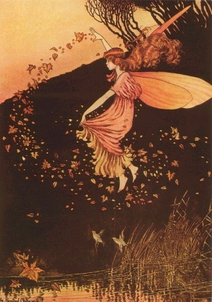

  
[Intangible Textual Heritage](../../../index)  [Legends and
Sagas](../../index)  [Celtic](../index) 

------------------------------------------------------------------------

[Buy this Book at
Amazon.com](https://www.amazon.com/exec/obidos/ASIN/B0026FCI5W/internetsacredte)

------------------------------------------------------------------------

<table width="75%">
<colgroup>
<col style="width: 50%" />
<col style="width: 50%" />
</colgroup>
<tbody>
<tr class="odd">
<td width="50%" data-valign="TOP"></td>
<td width="50%" data-valign="CENTER"><h1 id="the-fairy-faith-in-celtic-countries" data-align="CENTER">The Fairy-Faith in Celtic Countries</h1>
<h2 id="by-w.-y.-evans-wentz" data-align="CENTER">By W. Y. Evans-Wentz</h2>
<h4 id="section" data-align="CENTER">[1911]</h4></td>
</tr>
</tbody>
</table>

------------------------------------------------------------------------

[Contents](#contents)    [Start Reading](ffcctp)    [Page
Index](pageidx)    [Text \[Zipped\]](ffcc.txt.gz)

------------------------------------------------------------------------

|                                                                                                                           |
|---------------------------------------------------------------------------------------------------------------------------|
|  |

This is one of the most in-depth and scholarly attempts to explain the
phenomena of the Celtic belief in fairies. Based on Evans-Wentz' Oxford
doctoral thesis, it includes an extensive survey of the literature from
many different perspectives, including folk-lore, history, anthropology
and psychology. The heart of the book is the ethnographic fieldwork
conducted by Evans-Wentz, an invaluable snapshot of the fairy belief
system taken just on the cusp of modernity. There are regional surveys
of the fairy-faith in Ireland, Wales, Scotland, Brittany and the Isle of
Man. Evan-Wentz later went on to become one of the leading authorities
on Buddhism, and published many of the key documents of Tibetan Buddhism
including the Tibetan Book of the Dead.

Evans-Wentz examines each of the hypothetical explanations of the fairy
phenomena. Among these are the theories that fairies were a reclusive
race of dwarfs, that they are disembodied spirits, or that they are a
figment of our imaginations. Evans-Wentz concludes that they may indeed
be a manifestation of inhabitants of a higher reality that only some of
us are able to view, let alone understand.

We come away from this study with a multi-dimensional view of the
fairies, who, much like the grey aliens of UFO belief, inhabit a
narrative which seems too consistent to be the product of insanity, yet
too bizarre for conventional explanation.

Production Notes: This is a complete overhaul of this etext. I have
added linked footnotes, anchored page numbers, the table of contents, a
previously missing chapter, and corrected numerous formatting and
transcription errors.

--John Bruno Hare  
January 27th, 2004

------------------------------------------------------------------------

 [Title Page](ffcctp)  
[Dedication](ffcc000)  
[Contents](ffcctoc)  
[Preface](ffcc001)  
[Introduction](ffcc002)  

### Section I: The Living Fairy-Faith

[Chapter I: Environment](ffcc110)  
[Chapter II. Taking of Evidence: I. General Introduction](ffcc120)  
[Chapter II. Taking of Evidence: II. In Ireland](ffcc121)  
[Chapter II. Taking of Evidence: III. In Scotland](ffcc122)  
[Chapter II. Taking of Evidence: IV. In the Isle of Man](ffcc123)  
[Chapter II. Taking of Evidence: V. In Wales](ffcc124)  
[Chapter II. Taking of Evidence: VI. In Cornwall](ffcc125)  
[Chapter II. Taking of Evidence: VII: In Brittany](ffcc126)  
[Chapter III. Anthropological Examination of the Evidence](ffcc130)  

### The Recorded Fairy-Faith

[Chapter IV. People of the Goddess Dana](ffcc240)  
[Chapter V. Brythonic Divinities](ffcc250)  
[Chapter VI. Celtic Otherworld](ffcc260)  
[Chapter VII. The Celtic Doctrine of Rebirth](ffcc270)  

### Section III. The Cult Of Gods, Spirits, Fairies, and the Dead

[Chapter VIII. The Testimony of Archaeology](ffcc308)  
[Chapter IX. The Testimony of Paganism](ffcc309)  
[Chapter X. The Testimony of Christianity](ffcc310)  

### Section IV. Modern Science and the Fairy Faith; and Conclusions

[Chapter XI. Science and Fairies](ffcc411)  
[Chapter XII. The Celtic Doctrine of Re-Birth and Otherworld
Scientifically Examined](ffcc412)  
