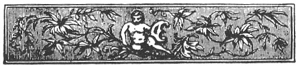

  
[Intangible Textual Heritage](../../../index) 
[Legends/Sagas](../../index)  [Celtic](../index)  [Index](index) 
[Previous](fim02)  [Next](fim04) 

------------------------------------------------------------------------

p. xi

# TABLE OF CONTENTS.

<table data-border="0">
<colgroup>
<col style="width: 33%" />
<col style="width: 33%" />
<col style="width: 33%" />
</colgroup>
<tbody>
<tr class="odd">
<td data-valign="top">
CHAP.
</td>
<td data-valign="top">
 
</td>
<td data-valign="bottom">
PAGE.
</td>
</tr>
<tr class="even">
<td data-valign="top">
 
</td>
<td data-valign="top">
INTRODUCTION
</td>
<td data-valign="bottom">
<a href="fim01.htm#page_i">i</a>-vi.
</td>
</tr>
<tr class="odd">
<td data-valign="top">
I.--
</td>
<td data-valign="top">
MYTHS CONNECTED WITH THE LEGENDARY HISTORY OF THE ISLE OF MAN:

Manannan Mac Lir--Lug--The Story of the Isle of Falga--Culann--Finn--Oshin--The Stories of Sigurd Fafni's Bane, and of the Punishment of Loki
</td>
<td data-valign="bottom">
<a href="fim04.htm#page_1">1</a>-18
</td>
</tr>
<tr class="even">
<td data-valign="top">
II.--
</td>
<td data-valign="top">
HAGIOLOGICAL AND MYTHO-HISTORICAL LEGENDS:

Introductory--<em>Stories</em>: The Conversion of the Manx; the Conversion of St. Maughold; St. Maughold's Fish; St. Maughold and Gilcolum; A Legend of Myrescogh Lake; The Stone Cross of Ballafletcher; Goddard Crovan's Stone; Olave Goddardson and the Sword Macabuin; Alswith the Swift; Ivar and Matilda
</td>
<td data-valign="bottom">
<a href="fim05.htm#page_19">19</a>-32
</td>
</tr>
<tr class="odd">
<td data-valign="top">
III.--
</td>
<td data-valign="top">
FAIRIES AND FAMILIAR SPIRITS:

Introductory--<em>Stories</em>: Origin of the Arms of the Island; The Discovery of the Island; The Fairy Horn; The Fairy Saddle; The Fairy Horse Dealer; Fairy Music; The Fairy Lake; The Unfortunate Fiddler; Objection of Fairies to Noise; The Fairy Cup of Kirk Malew; Fairy Elf; The Kidnappers; A Fairy detected in Changing an Infant; Abduction of a Boy by Fairies; The Christening; The School Boys; Fairy Punishment; The Whipping of the Little Girl; Mischief done by Fairies; Fairy Dogs; The Cup of the Lhiannan-Shee; The Fairy Sweetheart; The Dooiney-oie
</td>
<td data-valign="bottom">
<a href="fim06.htm#page_33">33</a>-51
</td>
</tr>
<tr class="even">
<td data-valign="top">
 
</td>
<td data-valign="top">
p. xii
</td>
<td data-valign="bottom">
 
</td>
</tr>
<tr class="odd">
<td data-valign="top">
IV.--
</td>
<td data-valign="top">
HOBGOBLINS, MONSTERS, GIANTS, MERMAIDS, APPARITIONS, &amp;c.

Introductory--<em>Stories</em>: The Phynnodderee; The Glashtin or Glashan; The Water Bull, or Tarroo-Ushtey; The Buggane; The Black Dog, or Moddey Doo; The Spell-bound Giant; The Old Man; The Three-headed Giant; Jack the Giant Killer; The Captured Mermaid; The Mermaid's Courtship; The Mermaid's Revenge; Dwellings under the Sea; The Apparition of Castle Rushen; Ben Veg Carraghan; A Legend of the Sound; The Chasms; The Spirit "Hoa Hoa."
</td>
<td data-valign="bottom">
<a href="fim07.htm#page_52">52</a>-75
</td>
</tr>
<tr class="even">
<td data-valign="top">
V.--
</td>
<td data-valign="top">
MAGIC, WITCHCRAFT, &amp;c.

Introductory--Cases of Witchcraft from Insular Records--<em>Stories</em>: The Magician's Palace; Origin of King William's Sands; The Devil's Den; The Submerged Island; Tehi-Tegi, the Enchantress; Caillagh-ny-Ghueshag; The Glencrutchery Well; The Effigy; The Witch of Slieu-Whallian; The Burnt Besom; Butter Bewitched; The Manx Witch; Popular Antidotes to Witchcraft; The Evil Eye; Dust as an Antidote; Charmers and their Charms
</td>
<td data-valign="bottom">
<a href="fim08.htm#page_76">76</a>-101
</td>
</tr>
<tr class="odd">
<td data-valign="top">
VI.--
</td>
<td data-valign="top">
CUSTOMS AND SUPERSTITIONS CONNECTED WITH THE SEASONS:

Introductory--New Year's Day; Twelfth-day; St. Paul's Feast-day; Bridget's Feast-day; Candlemas Day; Shrove Tuesday; Periwinkle Fair; Weather Sayings for March and April; Patrick's Feast-day; Good Friday; Easter Sunday; St. Mark's and Maughold's Feast-day; May-day Eve; May-day; Spitlin's Summer Feast-day; Perambulation of Parish Boundaries; Midsummer-eve; Midsummer-day; Luanys's Day; Harvest Festival; Maughold's Feast-day; Hallowe’en; The Twelfth of November; Spitlin's Winter Feast-day; Catherine's Feast-day; Thomas's Feast-day; Christmas-eve; Christmas-day; The White Boys; Stephen's Feast-day ("Hunt the Wren"); John's Christmas Feast-day; Feast-day of the Children; New Year's Eve
</td>
<td data-valign="bottom">
<a href="fim09.htm#page_102">102</a>-140
</td>
</tr>
<tr class="even">
<td data-valign="top">
 
</td>
<td data-valign="top">
p. xiii
</td>
<td data-valign="bottom">
 
</td>
</tr>
<tr class="odd">
<td data-valign="top">
VII.--
</td>
<td data-valign="top">
SUPERSTITIONS CONNECTED WITH THE SUN, ANIMALS, TREES, PLANTS, SACRED EDIFICES, &amp;c.

Nature Worship; The Sun; The Moon and the Stars; Animal Worship; Totemism; Sacrifices; Blood; Nail and Hair Cuttings; Criminals hung by Hair Ropes; Tree Worship; Adoration of Re-productive Power of Nature; May-day, Midsummer, and Harvest Celebrations; The Hare, Herring, Cow, Cock, <em>Bollan</em>; Animals' Weather Wisdom--Stories: The <em>Ushagreaisht</em>; The <em>Lhondoo</em>; The Blackbird and the Thrush; How the Herring became King of the Sea; The Seven Sleepers; The Thorn, Elder, Shamrock, &amp;c.; Virtues of Iron and Salt; The Sin of Sacrilege and its Punishment; Piety of the Manx, &amp;c.
</td>
<td data-valign="bottom">
<a href="fim10.htm#page_141">141</a>-155
</td>
</tr>
<tr class="even">
<td data-valign="top">
VIII.--
</td>
<td data-valign="top">
CUSTOMS AND SUPERSTITIONS CONNECTED WITH BIRTH, MARRIAGE, AND DEATH:

<em>Birth</em>.--Precautions taken to Preserve Women after Child-birth and Children before Baptism from Evil Influences and Fairies; Powers of a Posthumous Child, &amp;c.; Virtues of Salt, and of a Caul.

<em>Marriage</em>.--Waldron's Description of a Manx Wed-ding; Blowing of Horns; The <em>Dooinney-Moyllee</em>; Train's and Harrison's Descriptions of a Manx Wedding.

<em>Death</em>.--Omens which preceded it; Preparations for Burial; Bishop Merick's Mistake about the Winding-sheet; Waldron's Description of Death and Funerals Road Crosses; a Funeral Entertainment; Further Death Signs; Modern Custom after a Funeral; Second Sight; A Supernatural Warning; Mock Funerals
</td>
<td data-valign="bottom">
<a href="fim11.htm#page_156">156</a>-164
</td>
</tr>
<tr class="odd">
<td data-valign="top">
IX.--
</td>
<td data-valign="top">
CUSTOMS FORMERLY ENFORCED BY LAW.

Introductory--Watch and Ward; Customs connected with Land Tenure; Jury for Servants; Custom about Servants Giving Notice; Yarding; The Deemster's Oath; Legal Purgation; The Stocks; The Pillory; The Wooden Horse; Bishop Wilson on Peculiar Laws and Customs; Other Curious Laws; Manx Ecclesiastical Law; Excommunication; Penance; The Nuns' Chairs; The Bridle; The Punishment of being Dragged after a Boat; Bowing to the Altar; Observation of Sunday; The Three Reliques; Games, &amp;c
</td>
<td data-valign="bottom">
<a href="fim12.htm#page_165">165</a>-180
</td>
</tr>
<tr class="even">
<td data-valign="top">
 
</td>
<td data-valign="top">
p. xiv
</td>
<td data-valign="bottom">
 
</td>
</tr>
<tr class="odd">
<td data-valign="top">
X.--
</td>
<td data-valign="top">
PROVERBS AND SAYINGS:

Introductory--(1) Proverbs relating to General Truths; (2) Proverbs inculcating Caution, Contentment, Thrift, Independence, Industry, and Charity; (3) Proverbial Weather-Lore; (4) Miscellaneous Sayings and Proverbs
</td>
<td data-valign="bottom">
<a href="fim13.htm#page_181">181</a>-192
</td>
</tr>
</tbody>
</table>

 

 

 

------------------------------------------------------------------------

[Next: Chapter I. Myths Connected with the Legendary History of the Isle
of Man](fim04)
