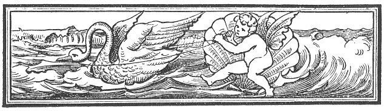
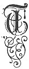
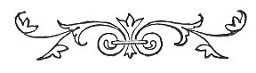

  
[Intangible Textual Heritage](../../../index) 
[Legends/Sagas](../../index)  [Celtic](../index)  [Index](index) 
[Previous](fim03)  [Next](fim05) 

------------------------------------------------------------------------

p. 1

 

# CHAPTER I.

### MYTHS CONNECTED WITH THE LEGENDARY HISTORY OF THE ISLE OF MAN.

|                     |
|---------------------|
|  |

HE reliable history of a country may be said to date from the period
when its written records begin. Before that time, there is an epoch
during which the place of history is usually supplied by tales of
imaginary personages, whose doings are calculated to gratify the
national pride. An unfailing characteristic of such an epoch is the
personification of the race in an eponym, who is its supposed ancestor
and founder. Thus, in the Isle of Man, we have the famous magician and
navigator Manannan Mac Lir in this capacity, and there are various other
mythical personages connected with the Island, all of whom appear in
ancient Irish tales, though nothing can be discovered with regard to
them from purely native sources of early date. In fact, the Isle of Man
was so intimately associated with Ireland till the coming of the
Northmen, that it is not likely that it would have any early myths
distinct from those in Ireland. It is, therefore, to the early Irish
legends that we have to refer for any mention of the Isle of Man, and
they tell us that it was considered to be a sort of Fairy-land to which
the Irish gods and heroes occasionally resorted. In the legends of the
heroic period in Ireland, we find the deities and heroes called Lug,
Cúchulainn, Cúroi, and Cúlann connected with Man as well as Manannan;
while, in the later or Ossianic Cycle of legends, we have Finn and his
son Oisin, who, in the only really early native legend, are made to
associate with the Scandinavian Oree. But of all these deities, the most
important in Man is Manannan, about whom many tales have accumulated. To
understand his place in the Legendary History of Ireland we must bear in
mind that, according to

p. 2

the *Leabhar Gabhala*, or Book of Invasions (a compilation of the late
10th or early 11th century), there were five conquests of Ireland, the
first by Parthol or Bartholemew, and his followers; the second by Nemed
and his followers; the third by the Firbolg; the fourth by the Tuatha Dé
Danann; the fifth by the Milesians. It is with the fourth body of
invaders, the Tuatha Dé Danann, who conquered the Firbolg, that Manannan
is connected. In the legendary and romantic literature of Ireland the
Tuatha Dé Danann are celebrated as magicians. By the Milesians and their
descendants they were regarded as belonging to the spirit world, and, in
the imagination of the people, they became Fairies, who were supposed to
lie in splendid palaces in the interior of green hills. There can be
little doubt that the Tuatha Dé Danann represent the Olympus of the
ancient Irish, that hierarchy of divine beings which the Celts possessed
as well as other Aryan people. In this hierarchy Manannan occupied the
position of god of the sea. But as early as the 9th and 10th centuries
of our era he had suffered the change known as euhemerisation, from an
immortal he had become a mortal. It is thus we meet him in one of the
oldest monuments of Irish literature, the so-called glossary of Cormac,
King-bishop of Cashel, killed in 903:--"Manannan Mac Lir, a celebrated
merchant who was in the Isle of Man. He was the best pilot that was in
the west of Europe. He used to know, by studying the heavens, the period
which would be the fine weather and the bad weather, and when each of
these two times would change. *Inde Scoti et Brittones eum deum
vocaverunt maris*, *et inde filium maris esse dixerunt*, *i.e.*,
*Maclir*, 'son of sea.' *Et de nomine Manannan* the Isle of Man *dictus
est*." [1](#fn_9) This theory of the Isle of Man
being named after Manannan, when so called, has been shown to be highly
improbable by Professor Rhys, who thinks that "Manannan gave his
original name corresponding to *Mann* and its congeners to the Island,
making it *Manavia Insula.* . . . for which we have in Welsh and Irish
respectively *Manaw* and *Manann.* Then from these names of the Island
the god derives his in its attested forms of Manawydan and Manannan,
which would seem to mark an epoch when he had become famous in
connection with the Isle of Man." [2](#fn_10)

To Cormac's account, O'Donovan has added the following note:--"He was
the son of Allot, one of the Tuatha Dé Danann

p. 3

chieftains. He was otherwise called Orbsen, whence Loch Orbsen, now
Lough Corrib. He is still vividly remembered in the mountainous district
of Derry and Donegal, and is said to have an enchanted castle in Lough
Foyle. According to the traditions in the Isle of Man and the Eastern
counties of Leinster, this first man of Man rolled on three legs like a
wheel through the mist."

We can follow the process of euhemerisation in later texts. Thus,
according to the Book of Fermoy, a MS. of the 14th to the 15th century,
"he was a pagan, a lawgiver among the Tuatha Dé Danann, and a
necromancer possessed of power to envelope himself and others in a mist,
so that they could not be seen by their enemies." The Book of Lecan
(14th century) mentions a Manannan whom it calls "son of Athgus, King of
Manain (Man) and the islands of the Galls" (the Western Isles), who
"came with a great fleet to pillage and devastate the Ultonians, to
avenge the children of Uisnech," These children of Uisnech, when
compelled to fly "from Erinn," had sailed eastwards. and conquered "what
was from the Isle of Man northwards of Albain," and after having killed
Gnathal, King of the country, were induced to return to Ireland under a
pledge of safety from Conchobar, King of Ulster. The sons of Gnathal,
who also sought the protection of Conchobar, "killed the sons of
Uisnech," in consequence of which Gaiar, the grandson of Uisnech,
banished Conchobar to the islands of Orc and Cat (the Orkneys and
Caithness), and Gaiar having reigned over Ulster for a year, went into
Scotland with Manannan, and died there. The 15th century version of a
story called "The exile of the children of Uisnech" tells us that Gaiar
was assisted against Conchobar by Manannan, who was the fourth of his
name and dynasty who had ruled in Man.

O'Flaherty speaks of him in his *Ogygia* as follows: "The merchant
Orbsen was remarkable for carrying on a commercial intercourse between
Ireland and Britain. He was commonly called Mananan Mac Lir, that, is,
Mananan, on account of his intercourse with the Isle of Man; and Mac
Lir, *i.e.*, *sprung from* the sea, because he was an expert diver;
besides, he understood the dangerous parts of harbours; and, from his
prescience of the change of weather, always avoided tempests. [1](#fn_11)

The same author, in his *West Connaught*, states that Orbsen's proper
name was Manannan, and that Lough Orbsen was called from him, because
when his grave was being dug the lake broke forth; and he says that, at
the adjacent *Magh Uillin*, "Uillin, grandchild of Nuadh (silver-hand),
King of Ireland twelve hundred years before Christ's birth, overthrew in
battle,

p. 4

and had the killing of Orbsen Mac Alloid, commonly called Mananan (the
Mankish man), Mac Lir (son of the sea) for- his skill in
seafaring." [1](#fn_12)

Keating, in his *General History of Ireland*, written early in the 17th
century, gives Manannan's genealogy as follows: "Mananan, the son of
Alladh, the son of Elathan, son of Dalboeth, an immediate descendant of
Nemedius, the pro genitor of the Tuatha de Danans in Ireland; that weird
and mystic colony who never, through the lapse of ages, have
relinquished their dominion over the superstitions of the peasantry of
Ireland; but who are still believed to rule the spirit or fairy land of
Erin; to reign paramount in the *lis*, the cave, the mine to occupy
genii palaces in the deepest recesses of the mountains, and under the
deep water of our lakes."

But supplementing this pseudo-historical account of Manannan, we find
numerous romantic references to him at all stages of Irish literature.
Thus, the "Sick-bed of Cúchulainn," a tale which goes back,
substantially, to the fifth century of our era, although we only possess
it in transcripts of the 11th century, relates that Manannan became
jealous of Cúchulainn, with whom his wife Fand had fallen in love. He
shook a cloak of invisibility of forgetfulness between the two and
carried off Fand with himself to fairy-land, whereupon
[Cúchulainn](errata.htm#0) returned to his own wife.

Professor Rhys remarks of him that "In Irish literature he appears
mostly as King of the Fairies in the Land of Promise, a mysterious
country in the lochs or the sea. His character seems to have been a most
contradictory one--many tricky actions are ascribed to him, while he was
very strict about other people's morality. At his court no one's food
would get cooked if, while it was on the fire, any one told an untrue
story, and he is said to have banished three men from fairy-land to the
Irish court of Tara for lying or acting unjustly. . . . In the Welsh
Mabinogi, bearing the name of Manannan's counterpart, Manawydan, the
latter is not much associated with the sea, excepting, perhaps, his
sojourn . . . in the lonely Isle of Gresholm. It makes him, however,
take to agriculture, especially the growing of wheat. . . . He is also
called one of the three Golden Cordwainers of Britain, owing to his
having engaged successively in the making of saddles, shields, and
shoes. . . . The sinister aspect of Manannan is scarcely reflected by
Manawydan, who is represented as gentle, scrupulously just, and always a
peacemaker; neither is he described as a magician; but he is made to
baffle utterly one of the greatest wizards known to Welsh literature."
It would

p. 5

appear also that he was connected with the other world, and he figures
as one of the three landless monarchs of Britain. He had, however, a
huge prison in the shape of a bee-hive, the walls of which consisted of
human bones. King Arthur was once incarcerated there for three
months. [1](#fn_13)

The Gaelic Manannan is represented in Brythonic (Welsh) literature by
Manawydan, but it is uncertain if there really was a Brythonic sea-god
corresponding to the Gaelic one, or if the Welsh tales are not simply
literary adaptations of Irish ones. Professor Rhys favours the former
view.

The connection of Manannan with the Isle of Man probably arose in this
way. It was the practice of the earliest Irish to represent their
divinities as living in Islands to which, under exceptional
circumstances, mortals might sail. It is uncertain if this conception of
the Island home of divinities is really older or not than that which
figures them as dwelling in the hollow hills. All one can say is that we
find it earlier in the Irish texts. It has been well studied by
Professor Zimmer in his admirable essay on the Brendan voyage, [2](#fn_14) in which he shows that a number of texts
which have come down to us are still completely pagan in conception, and
reflect a belief which must still have been officially dominant in parts
of Ireland as late as the sixth century. Unofficially these beliefs
linger in the traditions respecting Hy Breasil. But, as a rule, the
Gaelic peasant figures "Faery" as inside a hill, or under the water, and
probably this belief is the older of the two.

Manannan MacLir is an actor in so many of the ancient Irish heroic tales
that it is impossible, with a due regard to space, to give more than
outline of a few of them as we have done. The magic powers of his sword
are frequently mentioned, *e.g.*, in the curious tale of Diarmait and
Grainne. Those interested in such matters will find in Vol. III. of the
Ossianic Society's Publications a marvellous romance of the adventures
of Cormac MacArt in the fairy palace of Manannan in Man; but enough will
have been given to exhibit Manannan in his various attributes as King,
warrior, trader, navigator, and magician; and to show that his
connection with the Isle of Man was supposed to have begun after he and
his Tuatha dé Dananns were defeated by the Milesians, when he was chosen
by the warriors as their leader, and that he and they were supposed to
have taken refuge in the Western Isles and Man, whose inhabitants
acknowledged him as their ruler.

From purely local sources we glean the following information about
Manannan; but it must be remembered that in its

p. 6

present form it is all of comparatively recent origin, as the "Supposed
True Chronicle of Man," and "The Traditionary Ballad," both probably
date from the sixteenth century, though doubtless founded on older
traditions. The former tells us that "he was the first man that had
Mann, or ever was ruler of Mann, and the land was named after him," and
that "he reigned many years, and was a Paynim, and kept, by necromancy,
the Land of Man under mists, and if he dreaded any enemies, he would
make of one man to seem an hundred by his art magick, and he never had
any form of the comons; but each one to bring a certain quantity of
green rushes on Midsummer Eve--some to a place called Warfield (now
South Barrule), and some to a place called Man, [1](#fn_15) and yet is so called. And long after St.
Patrick disturbed him, the said Manannan, and put Christian folks into
the said land." [2](#fn_16) The ballad gives
practically the same account. More recent tradition has endowed him with
the stature of a giant, who by his strength and ferocity became the
terror of the whole Island. It is said that he used to transport himself
with great ease across the gorge between Peel Castle and Contrary Head.
On one occasion, either for amusement or in a fit of rage, he lifted a
large block of granite from the Castle rock, and though it was several
tons in weight, he hurled it with the greatest ease against the slope of
the opposite hill, about three miles distant, where it is seen to this
day, having, as an evidence of the truth of the story, the print of his
hand on it. His grave is said to be the green mound, thirty yards long,
outside the walls of Peel Castle.

The connection of Lug (an Irish divinity, corresponding partly to
Hermes, partly to Apollo) with Manannan and Man, is said to have been a
close one, as will be seen from the following account of him; and, as
will be shown later, his cult had spread to Man as well as to other
Celtic lands (see "August I." chap. vi). Lug is thus described: "Like to
the setting sun was the splendour of his countenance and his forehead;
and they were not able to look in his face from the greatness of its
splendour. And he was *Lugh Lamh-fada*, [3](#fn_17) and (his army was) the Fairy Cavalcade
from the land of Promise, and his own foster brothers, the sons of
Manannan. [4](#fn_18)" He is said to have been
brought up at the Court of Manannan, here called the Land of Promise,
which in many of the ancient tales is identified with Man. Lug was
famous for his mighty blows, and his spear became one of the

p. 7

treasures of the [Tuatha](errata.htm#1) Dé Danann. When he fought
against the sons of Turenn and imposed upon them the impossible
eric-fine of procuring certain fabulous weapons, he rode Enbarr of the
flowing mane, Manannan's steed, who was "as swift as the clear, cold
wind of spring," and travelled with equal ease on land and sea. He wore
Manannan's coat of mail, through, or above and below which no one could
be wounded; also his breast-plate, which no weapon could pierce. His
helmet had two glittering precious stones set in front, and one behind,
and Manannan's sword, called "The Answerer," hung at his side. From the
wound of this sword no one ever recovered, and those who were opposed to
it in the battle-field were so terrified by looking at it, that their
strength left them. He was accompanied by his foster brothers, and by
the Fairy Host, as already mentioned. The sons of Turenn were told that
they could not obtain the eric-fine without the help either of Lug or
Manannan, and they were advised to ask Lug for the loan of Manannan's
steed, and if he refused, for his canoe, the "Wave Sweeper."

Lug, the great warrior of the Tuatha Dé Danann, has his counterpart
among the Ultonians in Cúchulainn, who is said to have been the son of
Lug, or Lug re-born. It is only in the story of "The Isle of Falga,"
given below, that he is mentioned in connection with the Isle of Man,
though there were formerly songs sung about him, and there is a
tradition to the effect that he was called "King of the Mists," like
Manannan. His adversary, Cúroi Mac Daire, was a great magician. The
following tale gives an account of their rivalry for the fair daughter
of the king of Man.

#### THE STORY OF THE ISLE OF FALGA.

The Isle of Falga is variously supposed to have been the Isle of Man, or
*Insi Gall*, *i.e.*, the Western Isles. Cúchulainn and the heroes of
Ulster once on a time resolved to go on a plundering expedition to the
Isle of the Men of Falga, a fairy land ruled by Mider as its King.
Cúroi, who was a great magician, insinuated himself among the raiders in
disguise, and by means of his arts he succeeded in leading the Ultonians
into Mider's stronghold, after they had repeatedly failed in their
attempts. He did this on the condition that he was to have of the
plunder the jewel that pleased him best. They brought away from Mider's
castle Mider's daughter, Bláthnat, as she was a damsel of exceeding
beauty; also Mider's three cows and his cauldron, which were objects of
special value and virtues. When they came to the division of the spoils,
the mean-looking man in grey, who had led the victorious assault, said
that the jewel he chose was Bláthnat, whom he took to himself.

p. 8

\[paragraph continues\] Cúchulainn complained that he had deceived them,
as he had only specified a jewel, which he insisted on interpreting in
no metaphorical sense; but, by means of his magic, the man in grey
managed to carry the girl away unobserved. Cúchulainn pursued, and the
dispute came to be settled by a duel on the spot, in which Cúchulainn
was so thoroughly vanquished that Cúroi left him on the field bound hand
and foot, after having cut off his long hair, which forced Cúchulainn to
hide himself for a whole year in the wilds of Ulster, while Cúroi
carried away to his stronghold of Caher Conree both Bláthnat and her
father's cows and cauldron. Later it would appear that Cúchulainn got
the better of Cúroi, and took Bláthnat away from him, for Bláthnat
proved a faithless wife to Cúroi and plotted with Cúchulainn to kill
him. At the time fixed upon by her, namely, November eve, Cúchulainn and
his followers stationed them selves at the bottom of the hill, watching
the stream that came down past Cúroi's fort; nor had they to wait long
before they observed its waters turning white: it was the signal given
by Bláthnat, for she had agreed to empty the milk of Mider's three cows
from Mider's cauldron into the stream, which has ever since been called
the Finnghlais, or White Brook. The sequel was that Cúchulainn entered
Cúroi's fort unopposed, and slew its owner, who happened to be asleep
with his head on Bláthnat's lap. Cúchulainn took away Bláthnat, with the
famous cows and cauldron; but he was not long to have possession of his
new wife, for Cúroi's poet and harper, called Ferceirtne, resolved to
avenge his master; so he paid a visit to Cúchulainn and Bláthnat in
Ulster, where he was gladly received by them; but one day, when the
Ultonian nobles happened to be at a spot bordering on a high cliff,
Ferceirtne suddenly clasped his arms round Bláthnat, and flinging
himself over the cliff they died together. [1](#fn_19) This old story has been embodied in a
poem, called "Blanid," [2](#fn_20) by Robert D.
Joyce, of which the following, lines describing the combat between Cúroi
and Cúchulainn are perhaps the best:--

"I come to win back thy misgotten prize,  
  Mine own beloved, the bloom-bright Maid of Man!"  
"Thou com’st to dye this grass with ruddy dyes  
  Of thy best blood," cried Cúroi, "and to ban  
All knighthood with thy word forsworn!  
  Her eyes Shall see the fight, so let him take who can!  
Lo! there she stands, with her fear-whitened face;  
  Look thy last on her now, and take thy place!"p.
9

Meanwhile, as one who on a wreck doth stand,  
  That the wide wallowing waves toss to and fro,  
And sees the saving boat put from the land,  
  Now high, now in the sea-trough sunken low,  
Trembling ’tween fear and hope, each lily hand  
  Pressed on her heart, as if to hide her woe,  
And pale as one who had forsaken life,  
  Young Blanid stood to watch the coming strife.

        \*        \*        \*        \*

Then sprang they to their feet, and warily  
  Looked in each other's eyes with look of hate,  
And crossed their jarring swords, and with bent knee  
  Fought a long time, their burning ire to sate,  
Till like a storm-uprooted stately tree  
  Cuhullin fell, and Cúroi stood elate,  
Eyeing him as the hunter eyes the hoar,  
  That fighting falls, but yet may rise once more.

Another mythic Irish figure connected with the Isle of Man is Culann,
the smith, who in this capacity may be compared with Hephœstus, or
Vulcan. Culann was, however, also a Divine and Prophet. He was the
possessor of a terrible hound, which was slain by the youthful Setanta;
who was in consequence called Cú-Chulainn, *i.e.*, Culann's hound.
Culann is said to have lived for a time in the Isle of Man, where he
manufactured sword, spear, and shield of such transcendent excellence
for Conchobar, that he was invited by him to dwell in his realm. The
story about this may perhaps be found of sufficient interest to be
related at length:--Conchobar, who had not yet become King of Ulster,
but was an ambitious young man seeking to gain a kingdom, consulted the
famous oracle at Clogher as to how he might best attain his end. The
oracle advised him to proceed to the Isle of Man and get Culann to make
these weapons for him. Conchobar did so, and prevailed on Culann to
begin his task; but, while awaiting its completion, he sauntered one
morning along the shore, and in the course of his walk met with a
mermaid fast asleep on the beach. He promptly bound the syren, but she,
on waking and perceiving what had happened, besought him to liberate
her; and to induce him to yield to her petition, she informed him that
she was Teeval, the Princess of the Ocean; and promised that if he
caused Culann to form her representation on the shield surrounded with
this inscription, 'Teeval, Princess of the Ocean,' it would possess such
extraordinary powers that when ever he was about engaging his enemy in
battle, and looked upon her figure on the shield, read the legend, and
invoked her name, his enemies would diminish in strength, while he and
his people would acquire a proportionate increase in theirs. Conchobar
had the shield made according to the advice of

p. 10

\[paragraph continues\] Teeval, and, on his return to Ireland, such
extraordinary success attended his arms, that he won the kingdom of
Ulster. Culann accepted Conchobar's offer, referred to above, and
settled on the plain of Murthemne, which was fabled to have been
formerly situated beneath the sea. It was here that he was visited by
Conchobar, accompanied by his Court and Cúchulainn.

Of the later legends, which form a cycle entirely distinct from that of
the heroic age, Finn, the son of Cumall (Finn MacCumaill), is the chief
hero. He is said to have been the chief of a band of mercenaries, or
robbers, called Fianns, and to have flourished in the second part of the
third century. If this were so, he lived on the very threshold of the
historical period in Ireland. Ossin, his son, was a famous warrior and a
great poet. in both of which roles he only reproduced the character of
his father, who was not merely celebrated as a warrior and huntsman, but
especially as a poet and diviner, as already stated. Finn is connected
with the Scandinavian Orree in a Manx heroic poem, and if, as has
recently been conjectured. [1](#fn_21) Finn is
identical with Kettle Finn, a Norseman who yielded great influence in
Ireland and Man about the middle of the ninth century, the connection is
a very natural one. The poem referred to above is undoubtedly the oldest
known poetical composition in the Manx language. We append it, together
with some interesting notes by Deemster Peter John Heywood, who died in
1790. It is not known by whom the spirited English translation was made.
With the exception of lines 9 and 10, which rendered literally are--

"Full threescore whelps, and not one less,  
With three old dames to look after them,"

it is fairly close to the original.

 

FIN AS OSHIN.

HIE Fin as Oshin magh dy helg,  
 [2](#fn_22)Fal, lal, lo, as fal, lal, la,  
Lesh sheshaght trean as moddee elg,  
Cha row un dooinney sloo ny keead,  
Coshee cha bieau cha row ny lheid,  
Lesh feedyn coo eisht hie ad magh,  
Trooid slieau as coan dy yannoo cragh,  
Quoi daag ad ec y thie agh Orree beg [3](#fn_23)p. 11  
Cadley dy kiune fo scadoo’n creg!  
Slane three feed quallian aeg gyn unnane sloo,  
        \*        \*        \*        \*  
Lesh three feed cailleeyn dy yeeaghyn moo,  
--Dooyrt inneen Fin ayns craid as corree,  
"Kys yiow mayd nish cooilleen er Orree?  
Dooyrt inneen Oshin: "kiangle mayd eh,  
Lesh folt y ching chionn gys y clea,  
As chur mayd aile gys y cass cha bieau."  
Clysht tappee eisht hug Orree ass,  
Tra dennee’n smuir roie ass e chiass,  
Loo  [1](#fn_24)*Mollaght Mynney* ad dy
stroie,  
Va er n’yannoo craid er mac y ree,  
Dy farbagh breearrey ry ghrian as eayst,  
Dy losht ad hene as thieyn neesht  
--Hie Orree beg magh dys ny sleityn,  
As speih mooar connee er e geayltyn,  
Hoght bart mooar trome hug eh lesh cart,  
Hoght kionnanyn currit ayns dagh bart;  
Hoght deiney lheid’s ’sy theihll nish t’ayn,  
Cha droggagh bart jeh shoh ny v’ayn  
Ayns dagh uinnag hug eh bart as ayns dagh dorrys,  
Agh mean y thie mooar hene yn bart mooar sollys.  
--Va Fin as Oshin nish shelg dy chionn,  
Lesh ooilley nyn treanee ayns ollish as loan,  
Yaagh wooar ren sheeyney ass y glion, neear,  
Troggal ayns bodjallyn agglagh myr rere;  
Roie Fin as roie Oshin derrey d’aase Oshin skee,  
Agh she Fin mooar hene chum sodjey nish roie;  
Eisht dyllee Fin huggey lesh coraa trome,  
"Cha vel faagit ain nish agh tholtanyn lhome,  
Quoi ren yn assee shoh nagh re Orree beg?  
"V’an chosney voue chelleerid gys oig fo yn creg,  
Raad plooghit lesh yaagh hayrn ad magh er y cass.

\_\_\_\_\_\_\_\_

FIN AND OSHIN.

FIN and Oshin went out to hunt,  
 [2](#fn_25)Fal, lal, loo, as fal, lal, la.  
With a noble train of men and dogs,  
Not less in number than one hundred men,  
So swift of foot and keen, none were their like;  
With scores of Bandogs fierce they sallied forth,  
O’er Hill and Dale, much Havock for to make.  
--Whom left they then at home, but youthful Orree!  
Who slept secure beneath the shadowy rock; p.
12  
Full three score Greyhounds, with their whelps they left,  
(With three score lovely maidens, young and fair,) [1](#fn_26)  
As many old dames to attend the young.  
Says Fin's fair Daughter, in Disdain and Scorn,  
How on young Orree shall we be revenged?  
--Says Oshin's Daughter  
Fast to the Harrows we will tie his Hair,  
And to his nimble feet, we'll set a train of Fire.  
Then up starts Orree, with a nimble Spring;  
Feeling his Feet a broiling with the heat.  
With Curses direful, vowing to destroy,  
Those who presum’d t’ affront a King, his Son!  
Swearing most bitterly by Sun and Moon.  
To burn themselves and all their habitations;  
--Then to the Mountain hies he fast away,  
His heavy Gorse-hack poised upon his shoulder,  
Eight pond’rous Burthens thence he carried off,  
And eight large Faggots cram’d in ilka Burthen.  
Not eight such Men as in the world are now  
Could from the Ground one of these Burthen's raise.  
Into each Window, he a Burthen thrust.  
Into each Door, a Burthen of the same,  
But, the grand blazing Burthen, on the Floor,  
Of the great Hall he laid, and set on Fire.  
--Meanwhile, our Heroes, Fin and Oshin hight,  
They and their hardy men pursued the chase,  
Eager, in sweat and dust, all cover’d o'er.  
--Vast clouds full floating from the west  
Were seen like Billows dreadful, as I ween.  
--Then Fin he ran, and Oshin also ran,  
Till faint, and out of breath, he sat him down:  
But Fin, the hardy chief, still held it out,  
Then lift he up his lamentable Voice,  
Calling to Oshin, who was far behind,  
We've nothing left but rueful, ruin’d walls!  
--"This mischief who has done?  
"Who but young Orree,  
Who fled, and in a rocky Cavern bid himself,  
--Then choak’d with Smoke, they drag him by the heels,  
 [1](#fn_26)(And tore him Limb from Limb (they
say) with Horses wild.)

Cætera desunt.--But the Catastrophe is said to be that they tore him
Limb from Limb with wild horses. The tearing criminals asunder with
Horses fastened to each limb is the punishment in the old Statutes of
the Isle of Mann to be inflicted on those who should presume to draw a
weapon, or strike, or violate the peace within the verge of the Court of
Tynwald, or any Court held by the King of Mann, or his Governor.

We have a tradition, that Mann for about a century was governed by a
Norwegian race of kings called Orrys. According to the *Supposed True
Chronicle*: "Then there came a Son of the King of Denmark; he conquered
the Land, and was the first that was called King Orrye, &c, After him
remained Twelve of the Stock, that were called King Orryees inso much
that the last (named Reginald) had no Son but one Daughter, named Mary,
to whom the right descended, which Mary was Queen of Mann &

p. 13

\[paragraph continues\] Countess of Straherne, who, taking with her all
her Charters, fled to the King of England, Edward the 1st in the 20th
year of his reign, being in St. John's Tower in Scotland, otherwise
called Perthe in Anno Dom., in 1292, for Alexander King of Scots arrived
at Ranoldsway, near Castletown, and took possession of the Land of
Mann." (*See* the Manx Statute Book, p. 1st.) *See* also the Ancient
Chronicle of the Kings of Man in Camden's Brittannia Edition, 1637,
which says "1270, the 7th day of October, a Navy set out by Alexander
King of Scots arrived at Rogalwath; and the next morning before Sun
rising a Battaile was fought between the People of Man, and the Scots in
which were slaine of the Manx men 537, whereupon a certain Versifier
play’d upon the number--

'L. decies Xter, et pente duo cecidere,  
Mannica gens de te, damna futura cave.'

'L. ten times told, X thrice, with five beside and twaine,  
Ware future harmes; Tread (sic) of thy Folke Mann were slaine.'" [1](#fn_27)

A verse from an old song and a proverbial saying contain the only other
references to Finn in Manx tradition:--

In the following verse, Finn Mac Coole is associated with. Fairies and
Demons:--

Finn Mac Coole, as ooilley e heshaght,  
Ferrish ny glionney, as y Buggane,  
Dy jymsagh ad cooidjagh mysh dty lhiabbee,  
As eisht roie lesh oo ayns suggane.

"Finn Mac Coole, and all his company,  
The Fairy of the Glen and the Buggane,  
If they would gather together about thy bed,  
And run off with thee in a straw-rope"

The following quaint saying also relates to him:--

Ny three geayghyn s’feayrey dennee Fion Mac Cooil,  
Geay henneu, as geay huill, as geay fo ny shiauill.

"The three coldest winds that came to Fion Mac Cooil, wind from haw,
wind from a hole, and wind from under the sails."

There are only two Scandinavian tales remaining on record in Man. They
are *Sigurd Fafni's Bane* and *The Punishment of Loki*. These tales have
been preserved neither by tradition, nor by written record, but by
having been carved on stone. Both are found on a stone in Kirk Andreas
Church-yard, and the first only on a stone in Malew Church-yard. [2](#fn_28)

p. 14

\[paragraph continues\] We take the following abstract of the two tales,
which are mythologico-historical lays in the Elder Edda, from an account
of the Andreas stone given by Mr. G. F. Black in the *Proceedings of the
Society of Antiquaries of Scotland*.

#### THE STORY OF SIGURD FAFNI'S BANE.

"There was a king named Sigmund Völsungsson, who married Hiordis, a
daughter of King Eylimi, for his second wife. Some time after his
marriage Sigmund was attacked in his kingdom by King Lingvi Hundingsson
and his brothers, and was mortally wounded through being opposed by a
one-eyed man, with a broad-brimmed hat and blue cloak (Odin), who held
his spear against the sword of Sigmund, which was shivered into
fragments. At night, Hiordis came to the battle- stead and asked Sigmund
whether he could be healed, but he did not wish to be healed, for his
good fortune had forsaken him since Odin had broken his sword, of which
he requested Hiordis to .collect the fragments, and give them to the son
she would bear, who should become the greatest of the Völsung race.
Hiordis was carried off by Alf, son of King Hialprek of Denmark, who had
just landed at the battle-stead with a band of Vikings, and who married
her after she gave birth to Sigmund's child. This child was named
Sigurd [1](#fn_29) and grew up in Hialprek's
court, under the care of the dwarf Regin, who taught him all the
branches of knowledge known at that time. He also urged him to demand
his father's treasure of [Hialprek](errata.htm#2), but Sigurd only asked
a horse of the king, who allowed him to choose one; and Odin, in the
guise of an old man with a long beard, aided him to find out Grana, that
was of Sleipnir's [2](#fn_30) race. Regin then
counselled Sigurd to go in quest of Fafni's gold, of which he gave him
the following account:--

"Hreidmar had three sons, Fafni the Dragon, Ottur, and Regin the
dwarf-smith. Ottur could transform himself into an otter, under which
form he was in the habit of catching fish in Andvari's waterfall, so
called from a dwarf of that name. One day as Ottur was sitting with his
eyes shut eating a salmon, Odin, Hœnir, and Loki passed by; and Loki
cast a stone at Ottur and killed him. The Æsir (gods) then skinned him,
and

p. 15

came well satisfied with their prize to Hreidmar's dwelling. Hreidmar
caused them to be seized, and compelled them to redeem themselves with
as much gold as would both fill and cover the otter's skin. To obtain
the gold Loki borrowed Rán's [1](#fn_31) net,
cast it into the waterfall, and caught in it the dwarf Andvari, who was
accustomed to fish there under the form of a pike. The dwarf was
compelled to give all his gold-hoard as the price of his liberty; but on
Loki taking from him his last ring, with which he hoped to redeem his
fortune, he foretold that it should prove the bane of all its
possessors. With this gold the Æsir covered the otter's skin; but on
Hreidmar perceiving a hair of the beard still uncovered, Odin threw on
it the ring of Andvari. Fafni afterwards slew his father Hreidmar, took
possession of the gold, became one of the worst of serpents, and now
watched over his treasures at Gnitaheid."

Sigurd then asked Regin to forge him a sword, and Regin forged one that
could cleave an anvil, and cut through floating wool. Armed with this
weapon Sigurd fared forth, first to his maternal uncle Grip, who spaed
his fortune. He then sailed with a large fleet collected for him by King
Hialprek to avenge his father's death. During a storm they were hailed
by an old man (Odin) from a cliff, whom they took on board. He told them
his name was Hnikar, together with many other things. The storm abating,
he stepped ashore and vanished. Hunding's son, with a large army,
encountered Sigurd, but were all slain, and Sigurd returned with great
honour. Sigurd now expressed a wish to slay the dragon Fafni, whose lair
had been pointed out to him by Regin. After a hard fight Sigurd pierces
the dragon through the body, but nevertheless it holds a long
conversation with its slayer, in which it answers Sigurd's questions
relative to the Norns and Æsir but strives in vain to dissuade him from
taking the gold.

After the death of Fafni, Regin cut out his heart, and told Sigurd to
roast it for him while he took a sleep. Sigurd took the heart and
roasted it on a spit, and when he thought it roasted enough, and as the
blood frothed from it, he touched it with his finger to see if it were
quite done. He burned his finger, and put it in his mouth, and when
Fafni's heart's blood touched his tongue, he understood the language of
birds. He heard a bird telling its companions that Sigurd should himself
eat the dragon's heart. A second bird said that Regin would deceive him;
a third said that he ought to kill Regin; another one counsels that he
should take the dragon's treasure. All these things Sigurd performs, and
rides off with the treasure on Grana's back."

p. 16

In the upper left-hand corner of what, for convenience, we may call the
front of the stone, is carved the figure of Sigurd roasting the heart of
Fafni. Only the upper part of Sigurd's body is now visible on the stone,
the remainder being broken off. In his left hand Sigurd is represented
holding a spit containing the heart of Fafni, which is divided into
three gobbets, while at the same time he inserts the finger of his right
hand into his mouth. The flames are represented by three small isosceles
triangles, one for each gobbet. Immediately above Sigurd's shoulders is
shown the head and neck of one of the talking birds which warned him of
Regin's intended treachery, and counselled him to forestall the deceiver
by cutting off his head. The head of the bird is shown with the neck
stretched forward, and the beak open as if addressing Sigurd.

The head and neck of Sigurd's horse Grana is also shown above that of
the bird. The whole subject is thus referred to in *Fafnismál*:--

The first bird [1](#fn_32) says:

"There sits Sigurd sprinkled with blood  
Fafni's heart at the fire he roasts.  
Wise methinks were the ring-dispenser,  
If he the glistening life-pulp ate."

Second bird:

"There lies Regin communing with himself;  
He wilt beguile the youth who in him trusts:  
In rage he brings evil words together,  
The framer of evil will avenge his brother."

Third bird:

"By the head shorter, let him the hoary sage [2](#fn_33)  
Send hence to Hell; all the gold then can he  
Possess atone, the mass that under Fafni lay."

Fourth bird:

"He would, methinks, be prudent,  
If he could have your friendly counsel, my sisters!  
If he would bethink himself and Hugin gladden.  
There I expect the wolf where his ears I see."

Fifth bird:

"Not so prudent is that tree of battle,  
As I that warlike leader had supposed.  
If he one brother lets depart,  
Now he the other has of life bereft." p. 17

Sixth bird:

He is most simple, if he longer spares  
That people's pest. There lies Regin,  
Who has betrayed him. He cannot guard against it."

Seventh bird:

"By the head shorter let him  
Make the ice-cold Jötun,  
And of his rings deprive him; then of that treasure thou,  
Which Fafni owned, sole lord wilt be."

Sigurd replies:

Fate shall not so resentless be,  
That Regin shall my death-word bear;  
For the brothers both shall speedily  
Go hence to Hell."

In the lowest left-hand corner is shown the upper half of a human
figure, holding a sword at arm's length. It no doubt represents Sigurd,
but whether before or after slaying the dragon, it is impossible to say.

An historical connection with this tale of Sigurd Fafni's Bane has been
suggested by Professor Browne, which, though not strictly in place in a
book of this kind, is so interesting and suggestive that it may be
briefly narrated--Among the coins found when digging the foundations of
the tower at Andreas Church was one, either of Aulaf Sihtric's son,
surnamed the Red, who was King of Northumbria 941-945, and King of
Dublin till the battle of Tara in 980, or of Aulaf Godfrey's son,
Sihtric's brother's son, who was King of Northumbria till 941. Now, the
Sigurd of Sigurd Fafni's Bane was the great-great-grandfather of these
two Aulafs, and it is, therefore, a reasonable surmise that the crosses
both at Andreas and Malew are memorials to the memory of one -of them.
This is particularly interesting to historians as showing the connection
of these Aulafs, probably that of Aulaf Sihtric's son with Man, and of
equal interest to archæologists as demonstrating that these crosses are
of much earlier date than has generally been supposed.

#### THE STORY OF THE PUNISHMENT OF LOKI.

After Loki had enraged the gods by his many treacheries, he was chased
by them, and took refuge in the waterfall of Frarangr, where he was
caught by the gods in a net under the form of a salmon. After his
capture he changed to his human form, and as a punishment the gods
caused him to be bound to a rock with the entrails of his own son Nari.
After he was bound Skadi (a goddess, daughter of Thiassi and the wife of

p. 18

\[paragraph continues\] Njörd) took a venomous serpent and fastened it
up over Loki's head. The venom dropped down from it on to Loki's face.
Sigyn, Loki's wife, sat beside him, and held a basin under the serpent's
head to catch the venom, and when the basin was full she took it away to
empty it. Meanwhile the venom dropped on Loki, who shrank from it so
violently that the whole earth trembled.

Of all the mythical personages mentioned in this chapter, the only one
remaining in the Folk-Lore of the present day is Manannan, and even
about him comparatively little is known. He is usually called *Maninagh*
"the Manxman," and is supposed to have been the first man in Man, which
he protected by a mist. If, however, his enemies succeeded in
approaching in spite of this, he threw chips into the water, which
became ships. His stronghold was Peel Castle, and he was able to make
one man on its battlements appear as a thousand. Thus he routed his
enemies. These, together with the notion that he went about on three
legs at a great pace, are all the popular ideas about Manannan which
still survive.

 

------------------------------------------------------------------------

### Footnotes

[2:1](fim04.htm#fr_9) Cormac's Glossary.
(O'Donovan's edition), p. 114.

[2:2](fim04.htm#fr_10) Rhys, Hibbert Lectures,
1886, pp. 663-4.

[3:1](fim04.htm#fr_11) Ogygia, p. 26, Dublin,
1793.

[4:1](fim04.htm#fr_12) *West Connaught*, Irish
Arch. Soc., Dublin, 1849, p. 54.

[5:1](fim04.htm#fr_13) Rhys, Hibbert Lectures,
1886, pp. 665-7.

[5:2](fim04.htm#fr_14) Zeitschrift für deut.
Alt., 1889, Mr Alfred Nutt's Summary Folk-Lore June, 1890.

[6:1](fim04.htm#fr_15) This can scarcely mean
the Island.

[6:2](fim04.htm#fr_16) Manx Soc., Vol. XII., p.
6.

[6:3](fim04.htm#fr_17) Long hands.

[6:4](fim04.htm#fr_18) The Fate of the Sons of
Turren, published by O’Curry, in the Atlantis. Vol. iv. p. 160-3.

[8:1](fim04.htm#fr_19) This tale is taken from
Rhys, Hibbert Lectures, pp. 473-6, who quotes, as his authorities, Book
of Leinster, Keating and O'Curry.

[8:2](fim04.htm#fr_20) Published by Roberts
Brothers, Boston, U.S.A.

[10:1](fim04.htm#fr_21) See Mr Alfred Nutt's
abstract of Professor Zimmer's theory of the Ossianic Saga in 'The
Academy," of Feb. 14, 1891.

[10:2](fim04.htm#fr_22) Chorus after every line.

[10:3](fim04.htm#fr_23) Orree beg--Young
Orree--not from his size, but age;--where there are two of the same
family, Father and Son, of the same name, the younger is styled
beg--*i.e.*, the lesser. This Orree beg is supposed to have been a
Scandinavian prince, prisoner on parole, with Fingal and like some
modern gallants, to make love to both young ladies at the same
time,--and thus they shew their resentment. He declines the bunting
party, for an opportunity of intrigueing (sic) with one or other of the
ladies. Meantime he p. 11 falls asleep in a
grotto in the heat of the day; but when he awoke and found the indignity
done to him, he resolves, in revenge, to burn Fingal's palace--takes his
huge bill, an instrument like a hoe, with which they hack and grub up
gorze and heath, or ting, &c., for firing--hies him to the forest, and
made up eight large burthens, such as eight modern men could not heave
from the ground, and with these he fired the house as above described.

[11:1](fim04.htm#fr_24) *Mollaght Mynney*, is
the bitterest curse in our language, that leaves neither root nor
branch, like the Skeabthoan, the besom of destruction.

[11:2](fim04.htm#fr_25) Chorus after every line.

[12:1](fim04.htm#fr_27) Not in the Manx.

[13:1](fim04.htm#fr_28) \["Ten L, thrice X, with
five and two did fall, ye Manx beware of future evil's call," is the
translation given by Munch in his edition of the Chronicle, Manx
Society, Vol. xxii.. p. 3.--ED.\]

[13:2](fim04.htm#fr_29) Mr P. M. C. Kermode has
the credit of being the discoverer of the former, and Canon G. F. Browne
of the latter. Canon Browne, indeed, was the first to indicate the
existence of this tale on any sculptured stone in the United Kingdom, he
having identified it on a cross in Leeds Parish Church-yard and having
pointed out its historical and archaeological significance.

[14:1](fim04.htm#fr_30) The Sigurd here
mentioned is the same person as the Siegfried of the Old High German
*Nibelungenlied*. The northern version, however, is the older, more
mythical, and more simple of the two. A bold attempt has lately been
made by Dr. G. Vigfusson to identify Sigurd with the noble Cheruscan
youth Arminius.--*Sigfried Arminius*, pp. 1-21.

[14:2](fim04.htm#fr_31) *Sleipnir*. "the
slipper," was the eight-footed steed of Odin. *Grana* (commonly *Grani*)
means the "grey steed."

[15:1](fim04.htm#fr_32) *Rán* was the goddess of
the sea, and caught in her net all those who were drowned.

[16:1](fim04.htm#fr_33) The original word is
*igða*, which has been variously interpreted eagle. hawk, nuthatch,
woodpecker, or magpie; *Egðir* is the poetical word for eagle.

[16:2](fim04.htm#fr_34) The original word is
*þulr*, the technical meaning of which is obscure. In the
Cleasby-Vigfusson *Icelandic Dictionary* it is rendered "a sayer of
saws, a wise man, a sage (a bard?)."

------------------------------------------------------------------------

[Next: Chapter II. Hagiogical, and Mytho-historical Legends](fim05)
