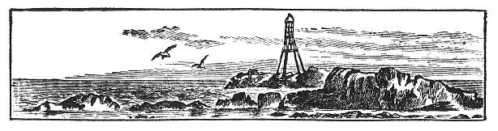
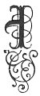
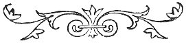

  
[Intangible Textual Heritage](../../../index) 
[Legends/Sagas](../../index)  [Celtic](../index)  [Index](index) 
[Previous](fim08)  [Next](fim10) 

------------------------------------------------------------------------

p. 102

 

# CHAPTER VI.

### CUSTOMS AND SUPERSTITIONS CONNECTED WITH THE SEASONS.

|                     |
|---------------------|
|  |

N the Isle of Man, as elsewhere, many customs and superstitions, as well
as much weather-lore, have attached themselves to the different seasons
of the year. Both the Celts and Norsemen, before the introduction of
Christianity, held high festival at the beginning of summer and winter,
the mid-winter and mid-summer feasts being more especially of
Scandinavian origin. When Christianity was introduced, its ministers,
unable to do away with these feasts, wisely adopted their periods as
Christian festivals, and so they have continued semi-pagan in form till
the present day. Such ancient observances as perambulating the parish
bounds, were also christianised by being associated with Divine worship;
and the wells, which the people were wont to visit, were dedicated to
the Saints and Martyrs of the Church. After the Reformation, the
practice of visiting these holy wells, and of frequenting the tops of
the mountains at Lammas, was denounced as superstitious and wicked, but
in vain, as, even at the present day, it can scarcely be said to have
altogether ceased.

The various customs and superstitions will he considered in the order of
the [Calendar](errata.htm#22):--

January 1, New Year's Day, formerly called *Laa Nolick beg*, "Little
Christmas Day," was the occasion for various superstitions. Among: these
was that about the "first foot." The "first foot," called the *qualtagh*
in Manx, is defined as follows by Kelly in his Dictionary: "The first
person or creature one meets going from home. This person is of great
consequence to the superstitious, particularly to women the first time
they go out after lying-in." The *qualtagh* (he or she) may also be

p. 103

the first person who enters a house on New Year's morning. In this case
it is usual to place before him or her the best fare the family can
afford. It was considered fortunate if the qualtagh were a person (a man
being preferred to a woman), of dark complexion, as meeting a person of
light complexion at this time, especially if his or her hair is red,
would be thought very unlucky. It is curious that the superstition in
Scotland is the exact reverse of this--*i.e.*, to meet a light
complexioned person was fortunate. If the *qualtagh* were *spaagagh*, or
splay-footed, it would be considered very unfortunate. It was important,
too, that the qualtagh on New Year's Day should bring some gift, as if
he or she came empty-handed, misfortunes would be sure to ensue. To meet
a cat first on this day was considered unlucky. It was supposed to be
necessary to exercise great care to sweep the floor of the house on New
Year's morning from the door towards the hearth, so that the dust should
go towards the hearth, for, if this were not done, the good fortune of
the family would be considered to be swept from the house for that year.

It was formerly the custom for a number of young men to go from house to
house on New Year's Day singing the following rhyme:

*Ollick ghennal erriu, as blein feer vie;  
Seihll as slaynt da’n slane lught thie;  
Bea as gennallys eu bioyr ry-cheilley,  
Shee as graih eddyr mraane as deiney;  
Cooil as cowryn stock as stoyr.  
Palchey puddase, as skeddan dy-liooar;  
Arran as caashey, eeym as roauyr;  
Baase myr lugh ayns ullin ny soalt,  
Cadley sauchey tra vees shiu ny lhie,  
Gyn feeackle y jiargan, cadley dy mie*.

"A merry Christmas, and a very good year to you;  
Luck and health to the whole household,  
Life, pleasantness and sprightliness to you together,  
Peace and love between men and women;  
Goods and riches, stock and store.  
Plenty of potatoes and herring enough;  
Bread and cheese, butter and beef. [1](#fn_58)  
Sleeping safely when you are in bed,  
Undisturbed by [2](#fn_59) the flea's tooth,
sleeping well."

Nothing should he lent on this day, as anyone who does so will be
lending all the year. In old times, when tinder and flint were used, no
one would lend them on this day.

p. 104

#### SEASONS.

January 6, or *Twelfth-day*, was the thirteenth or last day of Yule in
the Northern Calendar. It was one of the days on which no one might
borrow fire, but had to purchase it. After the introduction of
Christianity, it became a Church festival in commemoration of the
Manifestation of Christ to the Gentiles. Bishop Phillips, in the Manx
Prayer Book [1](#fn_60) written by him early in
the seventeenth century, calls it *Shen lail chibbert ushtey*, 'old
feast-day of the water-well,' the meaning of which is not clear. It was
formerly a day of much festivity in the Isle of Man, being called *Laa
giense* 'dance or revel day.' Among the games then played were "Cutting
off the Fiddler's Head," "The Lackets," and "The Goggans."

*The Cutting of the Fiddler's Head* is described by Waldron as
follows:--"On Twelfth-day the Fiddler lays his head in some one of the
wenches' laps, and a third person asks who such a maid or such a maid
shall marry, naming the girls then present one after another, to which
he answers according to his own whim, or agreeable to the intimacies he
has taken notice of during this time of merriment. But whatever he says
is as absolutely depended on as an oracle; and if he happens to couple
two people who have an aversion to each other, tears and vexation
succeed the mirth. This they call *Cutting of the Fiddler's Head*, for
after this, he is dead for the whole year." The *Lackets*, *Legads*, or
'valentines,' was the name of a game which was played as follows:--A
*mainster*, or master of ceremonies, was elected, who then proceeded to
appoint a *legad* to every man of the party from among the girls present
in the following words: *Eaisht-jee, as clasht-jee, as cur jee myner; ta
N. as M. legadyn son y vlein shoh, as ny sodjey, my oddys ad cordail.
Moylley as soylley, jingey as pronney daue, &c*. "Listen, and hear, and
give heed; N. and M. are valentines for this year, and longer, if they
be agreeable. Praise and joy, peace and plenty to them, &c." (The
remaining words are lost.) Doubtless, the appointments of the
*mainshter*, who probably had a shrewd idea which of the young people
were attached to each other, were the cause of much merriment. It would
seem that these entertainments were usually held at a public-house,
whose landlord would be elected as the *mainshter*. After the *legads*
had all been appointed, the whole party sat down to supper, each man
paying for his own legad, or valentine. During the supper the *laare
vane*, or white mare, [2](#fn_61) was brought
in. This

p. 105

was a horse's head made of wood, and so contrived that the person who
had charge of it, being concealed under a white sheet, was able to snap
the mouth. He went round the table snapping the horse's mouth at the
guests who finally chased him from the room, after much rough play. A
similar custom is mentioned by Dr. Johnson as taking place on New Year's
Eve, in Scotland: One of the company dressed himself in a cow's hide,
upon which the rest of the party belaboured him with sticks. They all
then left the house and ran round it, only being re-admitted on
repeating the following words; which are still preserved in St. Kilda:
"May God bless this house and all that belongs to it, cattle, stones and
timber. In plenty of meat, of bed and body clothes, and health of men,
may it ever abound." Each then pulled off a piece of the hide, and burnt
it for the purpose of driving away disease. The Manx custom was probably
formerly the same as this.

The *Goggans*, or *Noggins*, were small mugs filled with symbols of
various trades, thus--water, for a sailor; meal, for a farmer, &c. These
were laid in front of the hearth, and then, when the girls had gone
outside, they were changed. The girls were then brought back, and,
according to the *goggan* they laid their hands upon, so was the trade
of their future husband.

It was supposed that the weather on the twelve days after "Old Christmas
Day," indicated the weather of each month in the following year.

January 25, *Laa’l Noo Phaul*, [1](#fn_62) "St.
Paul's Feast-day," is a church festival in commemoration of the
conversion of St. Paul. There seems to have been a very general
superstition throughout Western Europe that, from the state of the
weather on this day, the whole character of the year following might be
predicted. We have, for instance, the old Latin distich:--

*Clara dies pauli bona tempora denotat anni,  
Si nix vel pluvia, designat tempora cara;  
Si fiant nebulæ, pereunt animalia quæque;  
Si fiant venti, design at prælia genti*.

An English version of which is:--

If St Paul's day be fair and clear,  
It does betide a happy year;  
But if it chance to snow or rain,  
Then will be dear all kinds of grain;  
If clouds or mists do dark the skie,  
Great store of birds and beasts shall die;  
And if the winds do flie aloft,  
Then war shall vex the kingdom oft.

p. 106

The Manx version is as follows:

*Laa’l Paul ghorrinagh as gheayagh,  
Ghenney er-y-theill as baase mooar sleih;  
Laa’l Paul aalin as glen,  
Palchey er y-theill dy arroo as mein*.

Paul's day stormy and windy,  
Famine on the earth and much death on people;  
Paul's day beautiful and fair,  
Abundance on the earth of corn and meal.

February 1, *Laa’l Breeshey* "Bridget's Feast-day," when the festival of
this famous Irish saint was celebrated. A parish church, a nunnery, and
no less than seven of the ancient *keeills* or cells are named after her
in the Isle of Man, where she seems to have been a great favourite. An
old custom on this day was to gather rushes, and standing with them on
the threshold, to invite St. Bridget to come and lodge there that night,
saying "*Brede, Brede, tar gys my thie, tar dys thie ayms noght. Foshil
jee yn dorrys da Brede, as lhig da Brede cheet stiagh*." "Bridget,
Bridget, come to my house, come to my house to-night, open the door to
Bridget, and let Bridget come in." After these words were repeated, the
rushes were strewn on the floor by way of a carpet or bed for her. It is
said also that straw was sometimes used, instead of rushes.

A similar custom is described by Martin, [1](#fn_63) as practised in some of the other Sodor
Isles:--"The mistress and servants of each family take a sheaf of oats
and dress it up in woman's apparel, put it in a large basket and lay a
wooden club by it, and this they call Briid's bed, and then the mistress
and servants cry three times, 'Briid is come, Briid is
[welcome](errata.htm#23).' This they do just before going to bed, and
when they rise in the morning, they look among the ashes expecting to
see the impression of Briid's club there, which, if they do, they reckon
it a true presage of a good crop and a prosperous year, and the contrary
they take as an ill omen." [2](#fn_64)

There were various weather sayings with regard to this day, thus:--

*Laa’l Breeshey bane.  
Dy chooilley yeeig lane*.

Bridget's Feast-day white, every ditch full.

*i.e.*. If snowy on St. Bridget's day, there will be a wet mild spring.

*Choud as hig y skell ny-gall-ghreinney stiagh Laa’l Breeshey, hig y
sniaghtey roish Laa Boayldyn*. "As long as the sunbeam comes in on
Bridget's Feast-day, the snow comes before May

p. 107

\[paragraph continues\] Day." *i.e.*, If mild on St. Bridget's day,
there will be a cold spring.

February 2.--The festival of the Purification of the Virgin Mary, or
Candlemas-day, called in Manx *Laa’l Moirrey ny gianle*, "Mary's
Feast-day of the Candle," seems, since St. Bridget has been forgotten,
to have taken the place of the festival of the Irish saint, as the
prognostics founded on the state of the weather on this day are
practically identical with those derived from St. Bridget's festival.
There is a universal superstition throughout Christendom that good
weather on this day indicates a long continuance of winter and a bad
crop, and that its being foul is, on the contrary, a good omen. Sir
Thomas Browne, in his *Vulgar Errors*, quotes a Latin distich expressive
of this idea:--

*Si sol splendescat Maria purificante,  
Major erit glacies post festum quam fuit ante*;

\[paragraph continues\] Of which the Scotch version is:

If Candlemass day be dry and fair,  
The half o’ winter's to come and mair;  
If Candlemass day be wet and foul,  
The half o’ winter's gane at Yule.

\[paragraph continues\] The Manx proverb corresponding with this conveys
a caution to the farmers:

*Laa’l Moirrey ny gianle,  
Lieh foddyr as lieh traagh*.

"Candlemas-day (or Mary's Feast-day of the Candle), half straw and half
hay."

*i.e.--*In the probable event of a mild Candlemas, half the stock of
fodder should still be unconsumed, as much wintry weather will probably
follow.

*Shrove Tuesday*, in Manx *Oie Ynnyd*, "Eve of the Fast," seems to have
been observed in the Isle of Man in much the same way as in England. It
was formerly the custom to have *sollaghan*, which is made of oatmeal
and gravy, for dinner on this day, instead of at breakfast as usual,
while the supper consisted of meat and pancakes. The following Manx
saying is, we suppose, a warning against relying on the continuance of
such sumptuous fare:--

*Ec shibber Oie Ynnyd my vees dty volg lane;  
My jig Laa Caisht yiow traisht son shen*.

"At Shrove-Tuesday supper if thy belly be full;  
Before Easter-day thou mayest fast (hunger) for that."

February 6--A fair, called *Periwinkle* Fair, was held on this day till
50 years ago. It took place on the shore at *Pooyl-Vaaish*, where
cattle, horses, and sheep were bought and sold as usual, and fairings
sold, among them periwinkles. Hence the

p. 108

name. The 6th was St Dorothy's day, but there seems to be no trace of
any special celebration on this day elsewhere.

March--There are various weather sayings about this month:

S*hare craagh ve ’sy cheer, na mee ny Vayrnt cheet stiagh meein*.
"Better a slaughter in the country than the month of March should come
in mild."

*Sheen hishan dy yoan Mayrnt maaill bleeney Vannin*. "A peck of March
dust is worth a year's rent in the Isle of Man."

*Ta’n Vayrnt chionney as yn nah bee fanney*. "March tightens and the
next month skins." This refers to the characteristics of these two
months--dry, with cold winds.

There is an old superstition that a Saturday's new moon was unlucky,
and, if it occurred in March, it was still more so,. Hence the
saying:--*Ta eayst jesarn ’sy Vayrnt dy-liooar ayns shiaght bleeantyn*.
"A Saturday's noon in March is enough in seven years."

March 17 is *L’aal Pharick*, "Patrick's Feast-day," when a fair was
held. This famous Irish saint and missionary has three churches and
seven *keeills* dedicated to Lim in the Isle of Man. This day was also
called *Patermas*, "Patrick's Mass," and on it the saint's staff was
carried in procession by some one who was paid by the owner of the
saint's staffland, who also had to keep in order and renew the staff
itself; for there are two small properties, one in the parish of Patrick
and the other in the parish of Maughold, which seem to have been held on
this tenure. The former of them, first mentioned in a Papal Bull of 1231
as *terram de baculo Sti. Patricii*, "The land of the Staff of St
Patrick," has long since disappeared as a separate property; the latter,
which is part of the Barony of St. Bees, still survives under the name
of The Staffland. This place is considered to be freehold, inasmuch as
no rent or service is rendered in respect of it to the lord. [1](#fn_65) The service

p. 109

of the Staff of St. Patrick seems to have been commuted for a money-rent
at the time of the Reformation, while the Staffland in Maughold fell
into the hands of the Christians of Milntown.

There is an old saying: *Laa’l Pharick arree, yn dow gys e staik as y
dooiney ass e liabbee*. "Patrick's spring Feast-day, the ox to his
stake, and the man from his bed." It thus seems to indicate the time
when active farming operations (March 17) should begin. Seed-sowing is
usually begun in the Isle of Man about this time.

April--There is the following weather saying about the month of April:

*Tra heidys Avril dy-bing e charyn,  
’Sy theihll vees palchey traagh as oarn*.

When April shall shrilly sound his horn,  
On earth there will be plenty of hay and corn (barley).

*i.e.*, A dry April is good for the crops.

*Good Friday*.--*Jy-heiney chaist*, or, as Bishop Phillips has it,
Jy-heny-ghayst, "Easter Friday," was a day on which several
superstitious customs were observed. No iron of any kind was to be put
into the fire, and even the tongs were laid aside, lest any person
should unfortunately stir the fire with them, a stick of the
mountain-ash (*cuirn*) being used as a substitute. To avoid placing the
iron griddle on the fire, a large thick cake, called a *soddag*, [1](#fn_66) which is triangular in shape, was baked on
the hearth. It was also a custom for people to go to the shore on this
day to gather shell-fish.

*Easter Sunday*.--It was believed that anyone who went up to the top of
a high hill on this morning to watch the sunrise would see the sun bow
two or three times, as if in adoration to the risen Saviour. The
superstition that the sun bowed or danced on this day was once very
prevalent in England, and was embodied by Sir John Suckling in the
following verses on a belle of the day:--

Her feet beneath her petticoat  
Like little mice peep’d in and out,  
  As if they feared the light!  
And oh! she dances such a way  
No sun upon an Easter Day  
  Were half so fine a sight,

April 25 is now best known as *Laa’l Noo Markys-yn-sushtallagh*, "St.
Mark the Evangelist's Feast-day"; but it was formerly connected with the
famous Manx saint, Maughold, to whom a parish church is dedicated. He
had two days in the year, this,

p. 110

the first and more important, being called *Laa’l Maghal
toshee*--Maghold's chief Feast-day. The superstitions formerly practised
on the eve of this day were the same as those belonging to the eve of
St. Mark in England. If a person on the eve of this day were to watch in
the churchyard from eleven in the evening till one in the morning he
would see the wraiths of those who are to be buried there during the
year.

May 11--*Oie Voaldyn*, or May-day Eve--was the occasion of many
superstitious observances. On this evening the Fairies were supposed to
be peculiarly active. To propitiate them, and to ward off the influence
of evil Spirits and Witches, who were also active at this time, green
leaves or boughs and *sumark*, or primrose flowers, were strewn on the
threshold, and branches of the *cuirn*, or mountain-ash, were made into
small crosses without the aid of a knife, which was on no account to be
used, and stuck over the doors of the dwelling-houses and cow-houses.
Cows were further protected from the same influences by having the
*bollan-feaill-Eoin* [1](#fn_67) (John's-feast
wort) placed in their houses. This was also one of the occasions on
which no one would give fire, and on which fires were and are lit on the
hills to drive away the Fairies, Witches, &c., and also to purify the
fields, cattle, and horses by the smoke passing over them. It is said
that a handful of gorse was formerly lit in each field to purify it.

With reference to the practice of not giving fire, Waldron remarks that
there was not one of the native families "but keeps a small quantity of
fire continually burning, no one daring to depend on his neighbour's
vigilance in a thing which he imagines is of such consequence: everyone
consequently believing that if it should ever happen that no fire were
to be found throughout, most terrible revolutions and mischiefs would
immediately ensue;"--and, as to the lighting of fires, Kelly says that
"the inhabitants kindle fires on the summits of the highest hills, in
continuation of the practice of the Druids, who made the cattle, and
probably the children, 'to pass through the fire,' using certain
ceremonies to expiate the sins of the people; but the northern practice
is for each *balla* or town to kindle a fire, so that the wind may drive
the smoke over their cornfields, cattle, and habitations. . . . The
inhabitants dress their houses with flowers, and before every door a
considerable space is strewed with primroses. . . . On this eve also the
damsel places a snail between two pewter dishes, and expects to find
next morning the name of her future husband in visible characters on the
dish; but the success of this depends on her watching till midnight, and
having first purified her hands and face by washing them in the dew of
the wheat." [2](#fn_68)

p. 111

Fifty years ago the celebration of May-day Eve was still very general,
as will be seen from the following account extracted from the *Mona's
Herald* newspaper of the 5th of May, 1837; but now it has almost died
out:--"On May Day eve the people of the Isle of Man have, from time
immemorial, burned all the whin (gorse) bushes in the Island, conceiving
that they thereby burned all the witches and fairies which they believe
take refuge there after sunset. The Island presented the scene of a
universal conflagration, and to a stranger, unacquainted with our
customs, it must appear very strange to see both old and young persons
gathering particular herbs, and planting them at their doors and in
their dwellings for the purpose of preventing the entrance of the
witches."

It is thus clear that the Manx people placed very great reliance on the
influence of fire in protecting them from the powers of evil. This
influence was also made use of--or would seem to have been made use
of--by sacrificing animals as propitiatory offerings to the powers above
mentioned. Such a method would naturally be supposed to have belonged to
past ages only if there was not evidence that lambs have been burnt on
May-day Eve or May-day--son oural--for a sacrifice within living memory.
Such sacrifices seem to have been distinct in their purpose from the
burning of animals already mentioned (in Chapter V.) for discovering
Witches or driving away disease. [1](#fn_69)

May 12--*May-Day*, or *Laa-Boaldyn*, the *Beltaine*, as it was called in
Irish, was the fire of the great Celtic feasts, and was held at the
opening of the summer half of the year. Cormac, in his Glossary, says
that this name, *Beltaine*, arose "from two fires which the Druids of
Erinn used to make with great incantations"; and he adds that cattle
used to be brought to these fires and driven between them, as a
safeguard against diseases. According to Jameson, "the Gaelic and Irish
word, *Beal-tine* or *Beil-tine*, signifies Bel's fire; as composed of
*Baal* or *Belis*, one of the names of the sun in Gaelic, and *tein*,
signifying fire;" but, as a matter of fact, this is all pure guess-work,
no one having given a satisfactory derivation of the name. [2](#fn_70)

At an early hour on this morning the maidens went forth to gather the
dew, and wash their faces in it, as it was supposed to ensure a good
complexion, as well as to render the hostility of the Witches innocuous.
At an equally early hour, horns were blown to prevent the Fairies from
enticing children away. Later on in the day a Queen of the May was
chosen, according to Waldron, in the following fashion: "In almost all

p. 112

the great parishes they choose from among the daughters of the most
wealthy farmers a young maid for the Queen of May. She is dressed in the
gayest and best manner they can, and is attended by about twenty others,
who are called maids of honour, she has also a young man, who is her
captain, and has under his command a great number of inferior officers.
In opposition to her is the Queen of Winter, who is a man dressed in
women's clothes, with woollen hoods, fur tippets, and loaded with the
warmest and heaviest habits one upon another; in the same manner are
those who represent her attendants dressed; nor is she without a captain
and troop for her defence. Both being equipped as proper emblems of the
beauty of the spring and the deformity of the winter, they set forth
front their respective quarters; the one preceded by violins and flutes,
the other with the rough music of tongs and cleavers. Both companies
march till they meet on a common, and then their trains engage in a
mock-battle. If the Queen of Winter's forces get the better, so far as
to take the Queen of May prisoner, she is ransomed for as much as pays
the expenses of the day. After this ceremony, Winter and her company
retire and divert themselves in a barn, and the others remain on the
green, where, having danced a considerable time, they conclude the
evening with a feast, the queen at one table with her maids, the captain
with his troop at another. There are seldom less than fifty or sixty
persons at each board." For the seizure of her majesty's person, that of
one of her slippers was substituted more recently, which was in like
manner ransomed to defray the expenses of the pageant. The procession of
the summer, which was subsequently composed of little girls, and called
the *Maceboard*, outlived that of its rival, the winter, some years. The
Maceboard went from door to door, inquiring if the inmates would buy the
queen's favour, which was composed of a small piece of ribbon; this has
also fallen into disuse.

This custom was evidently derived from the Northmen, whose proceedings
on this day are thus described by Olaus Magnus, who wrote in the
sixteenth century:--"The Southern Swedes and Goths that are very far
from the Pole, have a custom, that on the first day of May, when the sun
is in Taurus, there should be two horse troops appointed of young and
lusty men, as if they were to fight some hard conflict. One of these is
led on by a captain, chosen by lot, who has the name and habit of
Winter. He is clothed with divers skins, and adorned with fire forks,
and casting about snow balls and pieces of ice, that he may prolong the
cold, he rides up and down in triumph, and he shows and makes himself
the harder, the more the icicles seem to hang from their stoves (?) The
chieftain of the other is for summer, and is called Captain Floria, and
is clothed with green boughs and leaves and summer garments that are not
very strong.

p. 113

\[paragraph continues\] Both these ride from the fields into the city,
from divers places, one after another, and with their fire spears they
fight, and make a public show, that Summer bath conquered Winter. Both
sides striving to get the victory, that side more forcibly assaults the
other which on that day seems to borrow more force from the air, whether
temperate or sharp. If the winter yet breathes frost, they lay aside
their spears, and riding up and down, cast about upon the spectators
ashes mingled with live sparks of fire taken from the graves or from the
altar; and they, who in the same dress and habit are auxiliary troops,
cast fire-balls from their horses. Summer, with his band of horse, shows
openly his boughs of birch, or tiel-tree, which are made green long
before by art, as by the heat of their stoves and watering them, and
privately brought in as if they newly came from the wood. But because
nature is thus defrauded, those that fight for winter press on the more,
that the victory may not be got by fraud; yet the sentence is given for
summer by the favourable judgement of the people, who are unwilling to
endure the sharp rigor of winter any longer; and so summer gets the
victory with the general applause of them all, and he makes a gallant
feast for his company, and confirms it by drinking cups, which he could
scarcely win with spears. This is the custom of driving away the winter,
and receiving of summer."

The Welsh story of the contest of Gwyn, as representing the powers of
darkness, and Gwythur, as representing the summer sun, makes them fight
for the possession of a beauteous damsel on the first of May. Gwythur
gains the victory, which symbolises the recovery by the Sun-God of his
bride at the beginning of summer, after his antagonist had gained
possession of her at the beginning of winter.

The 12th of May is still the general day for letting houses, paying
house rents, and taking grazing cattle, and also for farm girls going to
their places; but the distinctive observances connected with it have
died out.

On the 10th of this month was the Church festival called *Laa’l Spitlin
souree*, "Spitlin's summer Feast-day," after a Saint now unknown.

*Perambulations of Parish Boundaries*.--On the Monday, Tuesday, or
Wednesday, before Ascension Day it was an ancient custom in the Isle of
Man, as in England, to perambulate the boundaries of the parishes. In
Roman Catholic times, this perambulation was a matter of great ceremony,
and banners, handbells, and lights enlivened the procession. In Queen
Elizabeth's reign it was ordained that the people should, once in a
year, make a circuit of the parish with the curate, who was to admonish
the people to give thanks to God, as they beheld his

p. 114

benefits, and for the increase and abundance of the fruits upon the face
of the earth. This custom seems to have been derived from the Roman
*Terminalia* and *Ambervalia*, which were festivals in honour of the god
Terminus, and the goddess Ceres. In England, and, as we shall see, in
the Isle of Man also, it has likewise a twofold object, firstly to
preserve a correct knowledge of the bounds of the parishes, and secondly
to supplicate the divine blessing on the fruits of the earth. How this
custom was performed in the Isle of Man will be seen from the following
injunction by the Bishop, Henry Bridgeman, in 1677:--"Upon a solemn and
tedious audience of the tennants of my Ld Bp's demesne together with
most or many of the most aged and most substantiall parishioners of the
parish and parish Church of St Mary of Ballaugh, in the Isle of Mann,
concerning the performance of parochiall rights and the payment of
Parochiall duties betwixt the sd tennants and the rest of the
parishioners aforesaid, which difference hath now continued to be
agitated betwixt them for many years. It was finally sentenced and
determined upon the second day of February, 1677, by the Right
Revd Father in God, Henry, Ld Bp of this Isle, before whom it
was clearly proved by the oaths of Thomas Craine, of the Glaick, in
Ballaugh, aged 71 years or thereabouts, and of Thomas Kinred, of
Ballaterson, in the same parish of Ballaugh, aged about 60 years, and of
Thomas Cowley, of Knockan, in the psh aforesaid, aged about 55 years.
Many other aged persons of the said parish being ready to confirme the
same by their respective oaths had they been thereunto admitted or
required, which was forborne for the said Ld. Bp's tenants did before
his L’sp then and there confesse and acknowledge the verity of their
assertions vidt. That they had for severall years known the respective
parsons of Ballaugh and vicars of Kirk Michaell meet upon severall
ascension dayes together with their respective parishes at the gate of
B’sp's Court, and in their perambulation goe into the Chappell of the
said Ld. Bp., and there unanimously agree that the upper or East end
thereof did stand, and was of antient time held to be within the
præcints of the Parish of St. Mary, of Ballaugh, and the tower or West
end of the said Chappell was of ould time accounted and esteemed to be
within the site and præcints of the parish of Kirk Michaell and that the
said respective Parsons and Vicars did severally officiate divine
service, the one at the one side or end of the said Chappell, and the
other at the other side or end of the same Chappell alternately upon the
said same dayes of perambulation. The Parsons of Ballaugh coming down by
a well called Aulcaugh als Phinlowes' well and so along by the river or

p. 115

milne-dam of the said Ld. Bp's demesne up to the said Chappell: and from
thence with a considerable part of his meadow called Ballaugh-third,
conterminating upon the middle-third of the said meadow, and thence to a
parcell of land called John Gawn's Croft, and so to Brough-garge's
lands, which goes along the Strand or seaside whereby it did evidently
appear unto the said Ld Bp that all his tenants upon the Demesne
aforesaid which were inhabitants within the said perambulation of the
Parson of Ballaugh were and ought to be esteemed, and are now by his Lp
accordingly adjudged to be parishioners of the parish and Church of St.
Mary, of Ballaugh, and so subject and liable to all parochial duties and
performances unto ye said church as the rest of the parishioners of the
said parish are (excepting *onely* the payment of such tythes as now are
and of ould usually have been due and payable unto the Ld Bp. And more
particelarly yt it is incumbent upon them (as such) to make their
proportionable part of the Churchyard hedge or ditch of the said parish
of St. Mary's of Ballaugh, according as it is apportioned them in ye
Register Book of the sd church in the year 1660, and it is
now ordered and decreed by the said Ld Bp that henceforth all the said
tenants shall repaire unto divine service and all the offices of the
Holy Church upon every Lds Day, every holy day, and other
extraordinary dayes of public fasts and thanksgivings unto the said
church of St. Marie's, as to their sole proper parish church; and yt if
they shall absent themselves frequently from the same upon such dayes
(without a lawfull and sufficient cause and reason to be allowed by the
sd Ld Bp and his successors or his Vicr
Genle) that they shall be presented by the churchwardens of
the said parish for the time being (whose consciences are hereby
onerated to deall faithfully therein) unto the Bp or his Vicr
Genle that they may be punished or fined 12d apiece for every
such dayes absence whereof they cannot give a reasonable and
satisfactory account. Provided always that ye decree be no longer of
force after they shall produce an antient, sufficient and legall
execution, which some of them seem to pretend unto, but are not or have
not yet been able to produce or make good, and in the intervine (*sic*)
they are hereby required to yield punctual submission and obedience
hereunto upon pain of excommunication. Given under the Episcopal Seal of
the said Ld Bp this second day of February, in the seventh year of his
consecration and in the year of Our Lord, 1677.

JOHAN ALLEN, Actuar  
a Secretis Dmi Epi.

|                                                                                                                                                |
|------------------------------------------------------------------------------------------------------------------------------------------------|
| A copy whereof is hereby enjoyned to be entered in the several registers of both parishes, and the original to be kept in the Ld Bp's records. |

p. 116

The following is taken from the Parochial Register of Lezayre, Anno.
1715:--"The Revd. Mr. Wm. Walker, Vicar Genl. and Rector of Ballaugh,
and the Revd. Mr. Henry Allen, Vicar of Kirk Christ, Lezayre, together
with several of the ancients of both parishes, having met this day at a
place called Cottier's platt in order to determine Boundaries of the two
Parishes from the place aforesaid unto the High-road leading from
Bishop's Court to Ramsey: and both Parties having agreed to leave it to
me to hear what can be sayd on both sides, and to put a final end to all
controversies for the future concerning the said Boundary, I, therefore,
having heard all that hath been sayd by both Parties, and having
carefully viewed and walked the ground, do adjudge and declare that a
straight line drawn from the East side of the platt aforesaid, betwixt
two remarkable trees g rowing in the Highway aforesaid, and betwixt two
large white stones on the other side of the said Highway to the end of
an Hedge leading from thence to the mountains, shall ever hereafter be
looked upon and be the true Boundary of the two Parishes, with which
both sides being entirely satisfied, I do hereby require that nobody do
presume presumptuously to cut down the trees or to remove the stones
aforesaid; and that a true copy of this determination be preserved in
the Registers of both Parishes, as an end of all strife on this account.
Given under my hand and seal at Bishop's Court the day and year above
written.       (Signed) THO: SODOR AND MAN."

A letter of Bishop Wilson's, on the subject of perambulations
follows:--"To the Reverend the Archdeacon and the rest of the Clergy of
the diocese of Sodor and Man: My brethren,--The last Convocation but
one, you were put in mind of a very considerable ommission, in not going
every Holy Thursday the boundary of your severall Parishes or some part
of such as are large which bath been practised till of late, time out of
mind. In order, therefore, to the keeping of this laudable custom, you
are hereby required to give notice to your Parishioners on Rogation
Sunday, May 3rd, that you purpose (God willing) to walk the boundarys of
your Parish, or some considerable part of them, on Holy Thursday
following, and desire the people to meet you at prayers and to accompany
you. And that they may be better dispos’d to do so, you shall inform
them that besides the great advantage of settling and securing the
boundarys of Parishes, the great design is to give publick and national
acknowledgement and thanks to God for all his blessings both by sea and
land, and especially for the fruits of the earth which at this time
begin to appear, as also to beg of God to send us such seasonable
weather, as that we may receive the fruits thereof, to our own comfort,
and for the relief of those that are in want, and lastly to beseech God
of his mercy to preserve us from all infectious

p. 117

diseases and unusual mortality amongst men and beasts and from the rage
of enemies. You shall further inform them, how necessary this is to keep
up a constant sense of our dependence upon Almighty God, for every
blessing we enjoy or hope for, whether peace or plenty, or security from
our enemies, or health to enjoy these blessings. Now, the manner of
observing this laudable custom has been at certain places to read
distinctly the 103rd Psalm, by the Minister only, and in other places to
pronounce openly the curse set down in Deut. 27, 17--'Cursed is he that
removeth his neighbour's landmark,' that is, who defrauds his neighbour
of any of his rights, either by fraud or force, or going to law without
just cause. At the same time people should be exhorted to beware of the
great sin of covetousness, and to be content with the blessing God has
given to their own honest labours. That 'better is the little that the
righteous have,' such as they have gotten by righteous ways, than 'great
riches of the ungodly,' which they have gotten wrongfully, and that God
will never bless such possessions as are gotten, or defended, or kept by
unjust means. Here also it. will be very becoming a clergymen against
the great sin of Litigiousness by which Christian love and charity are
broken, and men hazard the loss of a heavenly inheritance to gain some
trifle often in this world.--Dated at Bishop's Court, the 24th April.
1741.         (Signed) THO . SODOR AND MANN." Below this he appends the
proper "Collects to be used on the perambulation: Quinquagesima Sunday;
Third Sunday in Lent; Septuagesima Sunday; The Prayer for Rain, if then
needful; In time of Death and Famine; In time of Warr; In the Litany,
the last two petitions, viz., That it may please Thee to give and
preserve to our use, &c.,' 'That it may please Thee to forgive us all
our sins,' and the Prayer in Mr Nelson's book for Rogation Week." [1](#fn_71) These Perambulations have not yet fallen
entirely into disuse.

The festival on June 24th, *Midsummer-day*, and on its eve,
*Midsummer-eve*, kept since the change in the Calendar on July 5th and
July 4th, seems to have been of Scandinavian origin, for, among the
ancient Celts, the longest day, as far as is known, was of no especial
account. But to people living within the Arctic circle, who for months
in the winter were altogether deprived of the sun, his ascent and
descent were naturally of greater importance than to people living
further south. This festival was probably originally in honour of
Balder, the northern Sun-God, who at Midsummer attained his greatest
splendour and duration, and from thence began to decline. [2](#fn_72) The beginning

p. 118

of his declination was commemorated by the lighting of his funeral pyre,
which the modern bonfires have perpetuated. Of the later celebration of
this eve and day in Scandinavia, Vigfusson writes:--"St. John Baptist's
Day is in the northern countries a kind of Midsummer Yule, and was in
Norway and Sweden celebrated with bonfires, dance, and merriment; and
tales of fairies and goblins of every kind are connected with St. John's
Eve in the summer as well as Yule-eve in winter." And with regard to its
origin, he says:--"The origin of this feast is no doubt heathen, being a
worship of light and the sun, which has since been adapted to a
Christian name and a Christian Calendar." [1](#fn_73) Very similar are the observances of this
eve in Man. Bonfires were lit on the hills, and blazing wheels were
formerly rolled from their tops, probably originally with the intention
of typifying the beginning of the sun's declination. [2](#fn_74) Cattle were also driven between or over
fires to keep them from disease, and men and boys leaped over the
flames. Train says that "on the eve of St. John the Baptist, the natives
lighted fires to the windward side of every field, so hat the smoke
might pass over the corn; they folded their cattle and carried blazing
furze or gorse round them several times."

These fire observances were in fact the same as on May-day Eve, and they
seem to have been designed as Charms to secure as much sunshine as
possible, which, considering our dull and cloudy climate, is not to be
wondered at; and they were at one time connected with human
sacrifices. [3](#fn_75) There was also a notion
that the corn would grow well as far as the bonfires were seen, and,
therefore, numerous bonfires were lit on these occasions, and it was
supposed that the height of the straw depended on the height that the
men jumped over the flames.

Fairies are supposed to be especially powerful on this eve, and Witches
are said to hold a saturnalia.

A curious belief that the souls of all people left their bodies when
asleep on this night, and wandered to the place where they would die was
formerly prevalent, and from this probably arose the custom of sitting
up to watch, and so avoiding such an occurrence. Those who watched in
the church porches were rewarded with the sight of those who would die
in the year, as on St. Mark's eve and Hollantide eve. On this eve, too,
was gathered the *Bollan-Feaill-Eoin*, "John's Feast-day

p. 119

wort" (mugwort), which was made into wreaths to be worn on the heads of
man and beast to protect them from witchcraft.

The next morning the great *Tinwald Court*, [1](#fn_76) corresponding to the Icelandic *Althing*,
was held, when the laws were promulgated, and the festival proper, all
Witches and evil Spirits having been disposed of on the previous
evening, began. At this festival, which probably lasted a fortnight in
old times, there took place not only the Court, but probably a religious
feast and merry-makings of all kinds, such as hurling and football,
match-making, feasting, and, above all, recitals of legends and
traditions. As regards Man, however, we have no definite information
about the observance of this day from tradition, except that there was a
fair, which still continues; and from written sources there is only
preserved a letter written, in 1636, by Bishop Parr to Archbishop Neile,
in which he states that on St. John Baptist's day he found the people in
a chapel dedicated to that Saint "in the practice of gross
superstitions," which he caused "to be cried down," and, in the place of
them, "appointed Divine services and sermons." We can only wish that the
good Bishop had informed us what these "gross superstitions" were. We
have already seen (Chapter I.) that Manannan received his tribute of
rushes on this day, and it is curious that the pathway leading up to the
chapel is still covered with rushes supplied by a small farm close by,
which is held on the tenure of doing this service.

As we have already seen from the name, St, John, the Church adopted this
heathen festival as that Saint's feast, *Feaill Eoin*, "John's-Feast,"
as it is called in Manx. It has been ingeniously suggested by Mr. Tylor
that this adoption, or rather adaptation, may have arisen from the same
train of symbolism which adapted the heathen Midwinter solar festival to
the Nativity of our Lord, *i.e.*, from our Lord's own words "He must
increase, but I must decrease." It seems, however, much more probable
that St. John was merely substituted for Balder, as our Saviour was
substituted for him in other portions of the northern faith.

The following proverb attached to St. John's Day probably refers to the
desirability of having rain to bring on the straw of the corn crops at
this time rather than later, when it would interfere with the maturing
of the grain: *Lane croie cabbyl dy ushtey L’aal Eoin feeu mayl Vannin*,
"A full horse-shoe of water (on) John's Feast-day is worth the rent of
Man."

July 13 was dedicated to the Saint called German, after whom the
[Cathedral](errata.htm#24) on Peel Island is supposed to be named. [2](#fn_77)

p. 120

August 1st, kept since the change in the calendar, on August 12th, is
called *Laa Luanys*, or *Laa Lunys*, "Luanys's Day." This name was
probably originally associated with the Celtic god *Lug*, or *Lieu*, as
he is called in Wales, who, as he was said to have been brought up at
the court of Manannan, was closely connected with Man. [1](#fn_78) In Ireland, his festival, called the
*Lug-nassad*, or the wedding of Lug, was celebrated on this day by a
fair, at which games and sports took place. In Man, too, there was,
within living memory, a great fair in the parish of Santon, on the same
day. This festival was, according to Professor Rhys, "the great event of
the summer half of the year, which extended from the calends of May to
the calends of winter. The Celtic year was more thermometric than
astronomical; and the *Lugnassad* was, so to say, its summer
solstice," [2](#fn_79) The fair has disappeared;
but the ancient custom of visiting the highest hills and the sacred
wells on this day, cannot be said to be altogether extinct. These wells
are usually found near old ecclesiastical sites, as the holy recluses
would naturally build their *keeills* near springs, where they would
construct wells both for their own personal convenience as well as for
baptizing their disciples. Some of these wells were formerly much
venerated, as their waters were supposed to possess sanative qualities,
and to be of special virtue as charms against witchcraft and Fairies.
The devotees would drop a small coin into the well, drink of the water,
repeat a prayer, in which they mentioned their ailments, and then
decorate the well, or the tree overhanging it, with flowers and other
votive offerings, usually rags. They believed that when the flowers
withered, or the tags rotted, their ailments would be cured. These rites
have been observed in the Isle of Man within the memory of those now
living. There is a well on Gob-y-Vollee, called Chibber Lansh (where the
meaning of *lansh* is uncertain), consisting of three pools, which was
formerly much resorted to for the cure of sore eyes. The cure could only
be effective if the patient came on Sunday, and walked three times round
each pool, saying in Manx, *Ayns enym yn Ayr, as y Vac, as y Spyrryd
Noo*, "In the name of the Father, and of the Son, and of the Holy
Ghost," and then applied the water to his or her eye. Many of these
wells, however, together with the sacred tree which overshadowed them,
were certainly objects of veneration long before the days of the
recluses and their religion. [3](#fn_80)

The Church attempted to put an end to this custom, and failed, but
contrived to give it a religious character by changing

p. 121

the date of its observance from the first day of August to the first
Sunday in that month. [1](#fn_81) The following
representation made to the Ecclesiastical Court by the curate and
wardens of the parish of Lonan, in 1732, will show that this custom was
prevalent at that time:--

"The curate and wardens represent to the Court that there is a
superstitious and wicked custom, which is yearly continued and practised
in this and the neighbouring parishes by many young people (and some of
riper years) going to the top of Snaefell Mountain upon the first Sunday
in August, where (as they are informed) they behave themselves very
rudely and indecently for the greater part of that day. Therefore, they
crave that the Rev. Court may be pleased to order what method must be
taken to put a stop to this profane custom for the future." The Court
(consistorial), in consequence of this order, ordained "that publication
be made yearly on the two last Sundays in July, by the minister for the
time being, after the Nicene Creed, that whoever shall be found to
profane the Lord's Day after this wicked and superstitious manner shall
be proceeded against with severe ecclesiastical censures; and the
minister and wardens are hereby required to do their utmost in
discovering the persons guilty in this particular, and to make
presentment thereof."

But such methods did not avail against this "superstitious and wicked
custom" and in vain, too, did Bishop Wilson fulminate against it, as it
was quite common 70 years ago, and is not quite extinct yet. It is said
that, about 1820, a preacher, named Gick, went up South Barrule and
denounced it, and that consequently it has since then almost ceased,
though a few people still ascend the mountains on the first Sunday after
the 12th of August, pretending that they do so to search for blaberries;
and a few may be seen lurking in the vicinity of the wells. There is now
an idea prevalent that this custom of ascending the hills is in
commemoration of Jepthah's daughter going forth on the hills, with the
daughters of Israel following her, an idea which has probably been
[promulgated](errata.htm#25) by the preachers with a view of causing a
heathen superstition to be superseded by a Christian ceremony.

*Harvest*.--When the landlord, or farmer, entered for the first time the
field where harvesting operations went on, it was customary to bind him
with *sugganes*, or straw ropes, and not to release him till he paid a
forfeit.

The harvest festival is called in Manx *yn mheillea*, or *yn meailley*,
'the harvest home,' "though," says Gill, [2](#fn_82) "more

p. 122

strictly it is the name of the garland made of the last handful of corn
which is shorn and formed into the shape of that which is borne by
Ceres. This figure, dressed with ribbons, is carried before the reapers,
and is called, together with the procession, *yn meailley*, or
*meilley*, 'the reapers feast,' from *meail*." "*Meail*," he adds, "is
the whole gang of reapers." This figure, somewhat obscurely described by
Gill, was called *yn moidyn*, 'the maiden,' and was made of straw,
decorated with ribbons and wild flowers. It was carried by the Queen of
the *Meailley*, a girl elected from among the female workers, though
usually the youngest of them, to the highest part of the field where it
was placed and saluted with hearty cheers. It was also a custom to cut
off a bunch of ears from this last sheaf of corn, with about 12 inches
of straw attached. This bunch of corn, called *baban ny mheillea*, 'the
doll of the harvest,' or simply, *yn mheillea*, 'the harvest,' which was
usually about 4 inches in diameter, was dressed up to represent a woman,
from the neck downwards, the ears doing duty for the head and face. It
was then placed on the chimney piece in the kitchen of the farm house,
and was not removed till the following harvest, when its place was taken
by a similar successor. This custom has not long died out, and indeed
the small sheaf, though not dressed, may still be seen in many a farm
house. The large sheaf previously referred to was taken from the field,
when the last load of corn was carried and placed on top of it, together
with the *moidyn*. [1](#fn_83) It was then
deposited in the barn with much clamour and rejoicing, and was kept
there till the following harvest. After this they all adjourned to the
supper, which it was usual for the farmer to provide on these occasions,
and which was a scene of great joy and merriment, the *Laare-vane*, as
on twelfth-day, being a conspicuous feature (see [p. 104](#page_104)).
The carrying of the 'maiden' has now fallen into desuetude, so that the
name is now associated with the harvest supper only.

October 25th.--*Laa’l Maghal*, 'Maughold's Feast-day,' the second of the
two days dedicated to this Saint.

October 31st and November 11th are the present and past dates, in
accordance with the change in the Calendar, of the eve of the Church
festival called "All Hallow Mass," or "All Saints' Mass" (Middle English
*halowe* 'a saint'). The eve of this day, Hallowe’en in English, is
called *Oie houiney* in Manx, and is still kept in the Isle of Man on
the 11th of November. The day itself is called *Sauin*, *Souin* or *yn
Tauin*, corresponding with the Irish and Scotch *Samhain*, though the
English "Holland-tide" is the name now usually given to the season and
to the fair held on the 12th of November.

p. 123

This day was formerly the first day of the first month of winter, and
also the first day of the Celtic year. A tradition to the effect that it
was the first day of the year still obtains among the Manx, who are
accustomed to predict the weather for the ensuing year from that on the
12th of November, and this is emphasised by the fact that, as we shall
see later, the ceremonies now practised on New Year's Eve, were, within
living memory, practised on the 11th of November. Among the Norsemen,
the first night of winter, which they celebrated by a feast, was the
14th of October, but winter would come earlier in their more Northern
clime. According to the ancient Irish, Samhain Eve was the proper
occasion for prophecies and unveiling mysteries. In Wales, within almost
recent times, women congregated in the parish churches on this eve to
learn their fortune from the flame of the candle each one held in her
hand, and to hear the names or see the coffins of the parishioners
destined to die in the course of the year. The Scotch believed that all
the Warlocks and Witches assembled in force at this season, and
perpetrated all sorts of atrocities. Similar beliefs to the above
prevailed in the Isle of Man. It was, therefore, very necessary to
propitiate the Fairies, who alone were amenable to such attentions, on
this night in particular. The leavings of the supper of the family were
consequently not removed, and crocks of fresh water were placed on the
table, so that 'the little People' might refresh themselves. Professor
Rhys says that the reason why this night was regarded as "the Saturnalia
of all that was hideous and uncanny in the world of spirits" was because
"it had been fixed upon as the time of all others when the Sun-God,
whose power had been gradually falling off since the great feast
associated with him on the first of August, succumbed to his enemies,
the powers of darkness and winter. It was their first hour of triumph
after an interval of subjection, and the popular imagination pictured
them stalking abroad with more than ordinary insolence and
aggressiveness." [1](#fn_84) It was, in fact,
the time when the result of the combat which took place in May was
reversed; then the powers of light gained the ascendency, now the powers
of darkness. Bonfires were lit on *Oie Houiney*, as on *Oie Voaldyn*,
and for the same reason.

 

The following custom, which survived till recently, has now died out.
Mummers went from house to house shouting the following curious refrain,
the meaning of which can only be conjectured. The portion now in English
was, of course, formerly in Manx:--

p. 124

    *Hog-annaa*--This is old Hollantide night:  
    *Trolla-laa*--The moon shines fair and bright.  
    *Hog-annaa*--I went to the well,  
    *Trolla-laa*--And drank my fill;  
    *Hog-annaa*--On my way back  
    *Trolla-laa*--I met a witch-cat;  
    *Hog-annaa*--The cat began to grin,  
    *Trolla-laa*--And I began to run.  
    *Hog-annaa* --Where did you run to?  
    *Trolla-laa* -I ran to Scotland.  
    *Hog-annaa*--What were they doing there?  
    *Trolla-laa*--Baking bannocks and roasting collops.  
    *Hog-annaa* --*Trolla-laa!*   
If you are going to give us anything, give us it soon,  
Or we'll be away by the light of the moon--*Hog-annaa!* 

Professor Rhys came across a different and seemingly more rational
version of this Hollantide rhyme in the South of the Island last
year:--*Oie Houna*--"Hollantide Eve." *Shibber ny gauin(a)* [1](#fn_85)--" Supper of the heifer." *Cre gauin marr
mayd?*--"Which heifer shall we kill?" *yn gauin veg vreac*--"The little
spotted heifer." There were more lines, but his informant had forgotten
them.

The first line of this song was formerly "*Hog-annaa*--Tonight is New
Year's Night," [2](#fn_86) which is another
proof that this was the last night of the year; and it is significant,
also, that the customs of raking out the ashes from the fire and placing
ivy in water, now practised on the 31st of December, were practised on
this night within living memory. These facts, combined with the
recollection of the 12th being considered New Year's Day by old persons
(as previously mentioned), may be considered to settle the question.
But, in addition to this, the words of the chorus, *Hog-annaa,
trollalay*, are probably identical with *Hogmanaye, trollalay*, the
words of a Scotch song which is sung on New Year's Eve--*Hogmanaye*,
according to Jamieson, being either the last day of the year or the
entertainment given to a visitor on this day. In France, too, there is a
similar custom and word, as *En Basse Normandie les bauvres le dernier
jour en demandant l’aumosne, disent Hoguinanno*. "In Low Normandie, the
poor, the last day (of the year), in demanding alms, say *Hoguinanno*."
We may, therefore, conclude that this was undoubtedly the last night of
the year. As to the meaning of this word, *Hog-annaa*, *Hogmanaye*, or
*Hoguinanno*, we may [venture](errata.htm#26) to suggest that,.
supposing the Scotch form to be the most accurate, both it and trollalay
are of Scandinavian origin, and refer to the Fairies and the Trolls. We
know that on this night it was considered necessary

p. 125

to propitiate the dwellers in fairy-land, who, with the Phynnodderees,
Witches, and Spirits of all kinds, were abroad and especially powerful.
We may, therefore, perhaps translate *Hog-man-aye* into
*Hanga-man-ey*--"mound-men (for) ever," the Fairies being considered as
dwellers in the *hows* (or *tumuli*, or green mounds)--and *trollalay*
into *trolla-á-lá*, "trolls into the surf." The Fairies, who were
considered the most powerful of these creatures, being thus propitiated,
would then protect their suppliants against the rest. The boys, who went
round singing this song, carried big sticks with cabbages or turnips
stuck in the top, and with these they knocked at people's doors till
they received herrings and potatoes and such-like gifts. The usual
supper on this night consists of potatoes, parsnips and fish, pounded
together and mixed with butter; and a cake is made, called *Soddag
valloo*, or dumb cake. "Every woman is obliged to assist in mixing the
ingredients (flour, eggs and eggshells, soot, &c.), kneading the dough
and baking the cake on the glowing embers; and when it is sufficiently
baked, they divide it, eat it up, and retire to their beds back-wards
without speaking a word, from which silence the cake derives its name,
and in the course of the night they expect to see the images of the men
who are destined to be their husbands." [1](#fn_87) The following is another Hollantide recipe
for dreaming of a future husband:--Take a salt herring from a
neighbour's house without the consent or knowledge of the owner. Be sure
to capture it in the dark, and take the first that comes to hand. Then
take it home, and roast it in its brine upon the cinders. Maintain
strict silence, both while eating it and afterwards, and carefully
consume every scrap--bones and all. On the stroke of midnight retire to
bed backwards, undress in the dark, and avoid touching water. If these
instructions are properly carried out, the future husband will appear in
a dream, and will present a drink of water. Yet another recipe was, for
the girls to fill their mouths with water, and hold a pinch of salt in
each hand. Thus equipped they went to a neighbour's door, and listened
to the conversation within, when the first name mentioned would be that
of their future husband. There are various customs practised on this
evening in Man, which are almost identical with those in all other parts
of the United Kingdom. Of these, the burning of nuts for purposes of
divination, is one of the most popular. It is described by Burns for
Scotland; and by Brand, in his "Popular Antiquities," for Ireland, in
words which we quote, as they are precisely applicable to what takes
place in Man:--

p. 126

The auld guidwife's well hoordit nits [1](#fn_88)  
Are round and round divided,  
And mony lads' and mony lasses' fates  
  Are there that night decided:  
Some kindle couthie [2](#fn_89) side by side,  
  An’ burn thegither trimly,  
Some start awa’ wi’ saucy pride,  
  And grimp out owre the chimlie  
              Fu’ high that night.

Jean slips in twa wi’ tentie e’e; [3](#fn_90)  
  Wha ’twas she wadna tell;  
But this is Jock, and this is me,  
  She says in to hersel;  
He bleez’d owre her, an’ she owre him,  
  As they wad ne’er main part!  
Till fuff! he started up the lum, [4](#fn_91)  
  An Jean had e’en a sair heart  
              To see’t that night.

"It is a custom in Ireland, when the young women would know if their
lovers are faithful, to put three nuts upon the bars of the grate,
naming the nuts after the lovers. If a nut cracks or jumps, the lover
will prove unfaithful, if it begins to blaze or burn, he has a regard
for the person making the trial. If the nuts named after the girl and
her lover burn together, they will be married."

Much amusement is also derived from the custom of setting apples afloat
in a tub of water from which they have to be extracted by the teeth. The
pouring of molten lead into water, where it takes various fantastic
shapes from which the future vocation of the person who pours is
divined, is still a favourite pastime. The popular belief ascribes to
children born on Hallowe’en the possession of the mysterious faculty of
perceiving and holding converse with supernatural beings.

The following day, the first of November, according to the present
reckoning, is the church Festival of All Saints, *Laa’l Mooar ny
Saintsh* "Great Festival of the Saints," as it is called in Manx.

The twelfth of November is the general day for letting lands, payment of
rent, and for men-servants taking their places for the year. The largest
fair of the year is still held on this day. It is considered as the
beginning of the winter half of the year.

November 18.--*Laa’l Spitlin Geurey*, "Spitlin's Winter Feast-day," the
second feast of this unknown Saint.

December 6th.--*Laa’l Catreeny*, "Catherine's Feast-day" (old style).
On, or about, this day possession must be taken on the South side of the
Island of lands, when there is a change of

p. 127

occupier. A fair was held on this day in the Parish of Arbory, when the
following curious distich was repeated:--

*Kiark Catreeny maroo,  
Gow’s y kione,  
As goyms ny cassyn,  
As ver mayd ee fo’n thalloo*.

Catherine's hen is dead,  
Take thou the head,  
And I will take the feet,  
And we will put her under ground.

\[paragraph continues\] If any one got drunk at the fair he was said to
have "plucked a feather of the hen."

December 11th.--*Laa’l Andreays*, "Andrew's Feast-day." On, or before,
this day possession must be taken on the North side of the Island, under
similar circumstances.

December 21.--*Laa’l Thomase*, "Thomas's Feast-day, formerly *Laa’l
Fingan*, "Fingan's feast-day," St. Fingan, or Finnian, was the first of
the great Irish scholars, being especially devoted to the study and
exposition of Scripture. The following saying has reference to the eve
of this day: *Faaid mooar son Oiel Fingan*, "A large turf for Eve of
Fingan's Feast." It probably means that, as the Christmas festivities
were drawing near, it was necessary to have an extra large turf to cook
the fare for that feast. There is a weather saying with reference to
this time of the year, that "if the frost will bear a goose before
Christmas, it will not bear a duck after Christmas." *Ny nee yn rio
gymmyrkey guiy roish yn Ollick cha nymmyrkey e thunnag lurg yn
Ollick*. [1](#fn_92)

December 24.--Christmas-eve, in Manx *Oie’l Verrey*, a corruption of
*Oie feaill Voirrey*, "Eve of Mary's Feast." it was the custom for the
people to go in crowds to the Parish Churches on this evening to attend
a service, the main feature of which was the singing of Carols, called
in Manx *Carvals*, many of which were of portentous length. Each one
brought his or her own candle, so that the Church was brilliantly
illuminated. The decorations were of a very primitive kind, mainly
consisting of huge branches of *hullin* (holly), and festoons of
*hibbin* (ivy). After the prayers were read, and a hymn was sung, the
parson usually went home, leaving the Clerk in charge. Then each one who
had a carol to sing would do so in turn, so that the proceedings were
continued till a very late hour, and sometimes, also, unfortunately
became of a rather riotous character, as it was a custom for the female
part of the congregation to provide themselves with peas, which they
flung at their bachelor friends. On the way home,

p. 128

a considerable proportion of the congregation would probably visit the
nearest inn, where they would partake of the traditional drink on such
occasions, viz., Hot ale, flavoured with spice, ginger, and pepper.
After this, the parting song commencing with--

*Te traa goll thie dy goll dy thie,  
Te taern dys traa ny lhiabbagh &c*.

It is time to go home to go to lie down,  
It draws towards bed-time, &c.

would be trolled out, and the last of the revellers would depart. The
*Oie’l Verree* services are still continued, but are entirely shorn of
all their riotous accompaniments, while ordinary hymns, or short carols
sung by the choirs, have taken the place of the lengthy solos of the
past. Carols are also sung by bands, who go from house to house during
the week before Christmas, and receive a small Christmas-box, or some
refreshment, in return for their entertainment.

It was formerly the custom for fiddlers to go round in this way before
Christmas. They stopped and played at the houses where they thought they
were likely to receive a fee, wished the inmates individually "good
morning," called the hour, and reported the state of the weather. The
custom of mumming at this season, formerly common, is now almost
moribund. The mummers, or as they are called in Man, "The White Boys,"
perform the time-honoured legend of "St. George and the Dragon," which
has, however, became considerably modified. Both in England, Scotland,
and Ireland, it has been from an early day amongst the most popular
amusements of Christmas, and, till recently, continued to be so in Man.
The plot everywhere seems to be pretty nearly the same, though scarcely
any two sets of performers render it alike, as they constantly mix up
extraneous matter, often of a local nature, and frequently allude to the
passing events of the day, making the confusion of character in all the
versions very great. [1](#fn_93)

In this Isle the *dramatis personæ*--St. George, Prince Valentine, King
of Egypt, Sambo, and the Doctor--are attired in white dresses, showing
their shirt sleeves, fantastically decorated with ribbons,
fancy-coloured paper, beads, and tinsel. They wear high caps or turbans
of white pasteboard similarly decked out, with a sprig of evergreen or
"Christmas" stuck in them, and each carrying a drawn sword in his hand.
The "Doctor" is in full black, with face and cap of the same, armed with
a stick, and a bladder tied to the end, with which he belabours those
who press too close upon the performers. He generally carries a small
box for the contributions,

p. 129

and is a kind of Merry-Andrew to the play, which, if it happens to fall
in the hands of a sprightly wag, causes some amusement to the audience,
who, somehow or other, generally appear more frightened than pleased
with the rest of the characters. The performance is often wound up by a
song. The following was taken down by W. Harrison as it was recited in
his house at Christmas, 1845. [1](#fn_94)

#### THE WHITE BOYS.

*Dramatis Personæ*.

|                |     |                   |
|----------------|-----|-------------------|
| ST. GEORGE.    | \|  | PRINCE VALENTINE. |
| KING OF EGYPT, | \|  | SAMBO.            |
| A DOCTOR.      |     |                   |

Enter SAMBO.

IT is here by your leave, Ladies and Gentlemen,  
We will act a sporting play;  
We will show you fine diversion,  
Before we go away.  
It is room, room, brave gallant boys!  
Give us room to rhyme,  
We will show you fine diversion  
In this Christmas time.  
It is room, room, give us room to sport,  
This is the place we wish to resort--  
To resort and to repeat our pretty rhymes,  
Remember, good folks, it is the Christmas times.  
This Christmas time as we now appear,  
We wish to act our merry Christmas here;  
We are the merry actors that travel the street,  
We are the merry actors who fight for our meat,  
We are the merry actors who show pleasant play;  
Enter in the King of Egypt--clear the way!

Enter THE KING OF EGYPT.

I am the King of Egypt, and so boldly do appear,  
And St. George, he is my son, my only son and heir!  
Step forth, my son, St. George! and act thy part with ease,  
Show forth to all the living company thy praise.

Enter ST. GEORGE.

I am thy son St. George, and from England have I sprung,  
Many are the noble deeds and wonders I have done.  
Full fourteen years in prison I was kept,  
And out of that into a cave I leap’t,  
From thence I went into a rock of stone;  
’Twas there I made my sad and grievious (sic) moan.  
Many were the lions that I did subdue,  
I ran the fiery dragon through and through;  
With a golden trumpet in my mouth  
I sounded at the gates divine, the truth.  
It's here to England, right from Egypt's station, p.
130  
It is here I draw my bloody weapon.  
Show me the man that dare before me stand;  
I'll cut him down with my courageous hand!  
Or, who dare challenge me to fight, and I so great?  
I who have fought Lords, Dukes, and made the earth to quake!

Enter PRINCE VALENTINE.

ST. GEORGE--Who art thou? poor silly fellow?

VALENTINE--I am a Turkish champion, from Turkish land I came,  
I came to fight that valiant knight, St. George they call his name;  
For it is hereby my name is written, Prince Valentine,  
Descended from a hardy race and of a noble line.  
And soon St. George I'll make thy lofty laurels flee,  
It shall not be said by all that I did yield to thee!  
Well fight it out most manfully. Draw!

\[*They Fight*.

ST. GEORGE--The point of my sword is broke.

VALENTINE--It happens so indeed! this night  
St. George is beat, he dare not fight!

ST. GEORGE--Beat by thee! thou poor silly rook!

VALENTINE--Fall in, Prince Actor.

\[*They fight; St. George falls on. one knee*.

KING OF EGYPT--O mortal stars! and skies of heaven above!  
What a thing it is for a man to lose his love!  
To strike that val’rous champion from the helm,  
And cursed be he, that did him overwhelm.  
O Sambo! Sambo! help me now in speed,  
For never was I in a greater need.

SAMBO--O yea, my master! I soon will thee obey,  
With sword in hand I hope to gain the day.  
Art thou the knave that singly standest there?  
That slew my master's only son and heir?

VALENTINE--He challenged me to fight, and why should I deny!  
He cut my coat so full of rents and made my buttons fly,  
And if the rascal had had the honour to obtain,  
Why, sir! he would have served you the same.

SAMBO--I'll try if thou art born of noble race;  
I'll make thy blood come trickling down thy face;  
And if thou dost another word against my master say,  
Right through thy yellow body I'll make an open way.

\[*They fight; and Valentine falls*.

KING OF EGYPT--O guards! come, take this dismal corpse away,  
For in my sight it shall no longer stay,  
O Doctor! Doctor! is there a doctor to be found,  
Can cure St. George of his deep and deadly wound?

Enter DOCTOR.

Oh yes! master, yes, there is a doctor to be found,  
Can cure St. George, thy son, of a deep and deadly wound.

KING OF EGYPT--From whence come ye?

p. 131

DOCTOR--From France, from Spain, from Rome I came,  
I've travelled all parts of Christendom.

SAMBO--Well spoken, Doctor!

KING OF EGYPT--What can you cure?

DOCTOR--All sorts of diseases,  
Whatever you pleases.  
All pains within, all pains without,  
The plague, the palsy, and the gout.  
The itch, stich, and molly-grubs.  
I can cure all these deeds.  
All big-bellied maids,  
And such like jades.  
Likewise, I will pledge my life,  
I can cure a scolding wife;  
Let them be curst or ever so stout,  
If the devil's in, I'll blow him out.

KING OF EGYPT--What is your fee?

DOCTOR--Twenty pounds down is my fee,  
But half of that I'll take from thee,  
If it is St. George's life I save,  
That sum this night from you I crave.

KING OF Egypt--What medicine do you carry, Doctor?

DOCTOR--I carry a [little](errata.htm#27) bottle in my pocket of
rixum-raxum, prixum-praxum, with I-cock-o'-lory--a little of this to his
nostrils.

Rise up St. George! and fight again!

\[*The Doctor performs his cure, and St. George rises*.

ST. GEORGE--Oh horrible! terrible! the like was never seen,  
A man drove out of seven senses into seventeen,  
And out of seventeen into seven-score,  
Oh horrible! terrible! the like was ne'er before.  
It was neither by a bull, nor yet by a bear,  
But by a little devil of a rabbit there.

\[*The Doctor performs the cure on [Valentine](errata.htm#28), who
rises*.

VALENTINE--It is a kind of rough tough, coming up like a fly,  
Up the seven stairs, and down the lofty sky.  
My head is made of iron, my body made of steel,  
My legs are made of pipe-shanks, I'll cause you all to yield.

\[*Valentine and Sambo fight, when the King of Egypt interposes*.

KING OF EGYPT--Oh! oh! we are all brothers,  
Why should we be all through others?  
Put up your swords and fight no more,  
No longer in this house adore.

DOCTOR--My box it is dumb and cannot speak,  
Please give us something for Christmas sake.

\[*Exeunt omnes*.

It is said, that on this Eve, at midnight, all the bullocks of seven
years old or more fall on their knees and utter a sort of groan, and,
that at the same time, the myrrh plant bursts into

p. 132

flower and so continues for one hour, when it disappears again. My
informant is positive that he saw this latter phenomenon last Christmas
Eve (1890).

To the superstitious Manx, one pleasant feature of this sacred season
generally, and of Christmas-eve and Christmas-day in particular, was
that they were able to pass any haunted glen or road in perfect safety,
as, owing to the beneficent influence of Christ, no Phynnodderee,
Buggane, Witch, or evil creature of any kind could harm them.

*Christmas-day*, called *Laa Nollick* or *Laa Nullick*, in Manx, where
*Nollick* is probably a corruption of the latin *Natalicium* "birthday,"
is observed in the Isle of Man in much the same way as in England,
Scotland, and Ireland.

It is interesting to note that the church festival of Christmas was
placed at the same time as the Pagan feast of the winter solstice, which
was called the *Saturnalia* by the Romans, and Yule by the Scandinavian
nations, with whom the Isle of Man was closely connected. The meaning of
the word *Yule* has given rise to considerable controversy, the most
probable interpretation being that of Ficke; [1](#fn_95) who explains it to mean "noise," or "cry,"
especially the loud noise of revelry and rejoicing. The heathen *Yule*
was certainly a great time of merrymaking, and lasted for thirteen days,
inclusive of the 6th of January. This merrymaking was to express their
joy at the days having reached their shortest limit on the 21st of
December, when the sun recommenced his upward course. The Church
attempted to change the heathen ceremonies into the solemnities of the
Christian festivals, of which it put as many as possible at this season.
The result was, the strange medley of Christian and Pagan rites,
especially with regard to the mistletoe and the *Yule* log, which
contribute to the festivities of the modern Christmas.

"As soon as the prayers at the *Oiel Verrey* are over," says Waldron,
"Christmas begins, and there is not a barn unoccupied for the whole
twelve days--every parish hiring fiddlers at the public charge; and all
the youths, nay, some-times people in years, make no scruple to be among
these nocturnal dancers."

Every family that could afford it, had a special brewing called
*Jough-y-Nollick*, "drink of Christmas;" and as one brewing kettle
generally served a whole neighbourhood, it was in great request at this
time, hence the Manx proverb, "To go about like a brewing pan." The
weather saying for this season is: *Ollick fluigh, Rhullick vea*, "Wet
Christmas, rich churchyard," *i.e.*, wet weather at this time is
considered unhealthy.

p. 133

December 26.--*Laa'l Steaoin*, Stephen's Feast-day.' On this day the
cruel but curious custom of Hunting the Wren is kept up. The unfortunate
bird was stoned to death; and there is, therefore, an appropriateness in
the Church festival commemorating the stoning of St. Stephen being on
the same day. This stoning of the wren, however, if Waldron is to be
believed, seems to have taken place on Christmas morning 160 years ago,
as he says, "on the 24th of December, towards evening, all the servants
in general have a holiday; they go not to bed all night, but ramble
about till the bells ring in all the Churches, which is at twelve
o'clock; prayer being over, they go to hunt the wren, and after having
found one of these poor birds, they kill her, and lay her on a bier with
the utmost solemnity, bringing her to the parish church, and burying her
with a whimsical kind of solemnity, singing dirges over her in the Manx
language, which they call her knell, after which Christmas begins." A
writer of the early part of the present century gives the following
account of the origin of the hunting of the wren:

"It has been a pastime in the Isle of Man from time immemorial to hunt
the wren. It is founded on a tradition that in former times a fairy of
uncommon beauty exerted such undue [influence](errata.htm#29) over the
male population, that she at various times seduced numbers to follow her
footsteps, till, by degrees, she led them into the sea, where they
perished. This barbarous exercise of power had continued for a great
length of time, till it was apprehended the Island would be exhausted of
its defenders, when a knight errant sprung up, who discovered some means
of countervailing the charms used by this syren, and even laid a plot
for her destruction, which she only escaped at the moment of extreme
hazard, by taking the form of a wren. But though she evaded instant
annihilation, a spell was cast upon her, by which she was condemned on
every succeeding New Year's Day, to reanimate the same form, with the
definitive sentence, that she must ultimately perish by a human hand. In
consequence of this *well authenticated* legend, on the specified
anniversary, every man and boy in the Island (except those who have
thrown off the trammels of superstition), devote the hours between
sunrise and sunset, to the hope of extirpating the Fairy, and woe be to
the individual birds of this species, who show themselves on this fatal
day to the active enemies of the race; they are pursued, pelted, fired
at, and destroyed, without mercy, and their feathers preserved with
religious care; it being an article of belief that every one of the
relics gathered in this laudable pursuit is an effectual preservation
from shipwreck for one year; and that fishermen would be considered as
extremely foolhardy who would enter [upon](errata.htm#30) his occupation
without such a safeguard."--(*Bullock*, *History of the Isle of Man*,
1816.)

p. 134

Kelly's description of this custom at about the same period is as
follows:--"It is the custom of the inhabitants of the several parishes
to catch a wren, on this day, and parade with flags flying and music,
with the wren fixen upon the point of a long pole; and they oblige every
person they meet to purchase a feather, [1](#fn_96) and to wear it in their hats for the day;
in the evening they inter the naked body, with great solemnity; and
conclude the evening with wrestling and all manner of sports. This is
supposed to be in memory of the first martyr."

The manner of celebrating this custom 50 years ago was, described by
William Harrison as follows:--"This custom is still kept upon St.
Stephen's Day, chiefly by boys, who at early dawn sally out armed with
long sticks, beating the bushes until they find one of these birds, when
they commence the chase with great shoutings following it from bush to
bush, and when killed it is suspended in a garland of ribbons, flowers,
and ever-greens. The procession then commences, carrying that 'King of
birds,' as the Druids called it, from house to house, soliciting
contributions, and giving a *feather* for luck; these are considered an
effectual preservative from shipwreck, and some fishermen will not yet
venture out to sea without having first provided themselves with a few
of these feathers to insure their safe return. The "*dreain*," or wren's
feathers, are considered an effectual preservative against witchcraft.
It was formerly the custom in the evening to inter the naked body with
great solemnity in a secluded corner of the churchyard, and conclude the
evening with wrestling and all manner of sports." [2](#fn_97)

Barrow gave the music of the song which follows in his *Mona Melodies*,
published in 1820, and the words were taken down by William Harrison
from a company of "Wren boys," in 1843:

p. 135

 

[  
Click to enlarge](img/13500.jpg)  
HUNT THE WREN: MANX AIR.  

 

p. 136

#### THE HUNTING OF THE WREN

We'll away to the woods, says Robin to Bobbin.  
We'll away to the woods, says Richard to Robin;  
We'll away to the woods, says Jack of the Land,  
We'll away to the woods, says every one,

What shall we do there? says Robin to Bobbin.  
                                          Repeat, etc.

We will hunt the wren, says Robin to Bobbin.  
                                          Repeat, etc.

Where is he? where is he? says Robin to Bobbin.  
                                          Repeat, etc.

In yonder green bush, says Robin to Bobbin.  
                                          Repeat, etc,

I see him, I see him, says Robin to Bobbin,  
                                          Repeat, &c.

How shall we get him down? says Robin to Bobbin.  
                                          Repeat, etc.

With sticks and stones, says Robin to Bobbin.  
                                          Repeat, etc.

He is dead, he is dead, says Robin to Bobbin.  
                                          Repeat, etc,

How shall we get him home? says Robin to Bobbin.  
                                          Repeat, etc.

We'll hire a cart, says Robin to Bobbin.  
                                          Repeat, etc.

Whose cart shall we hire? says Robin to Bobbin.  
                                          Repeat, etc.

Johnny Bill Fell's, says Robin to Bobbin.  
                                          Repeat, etc.

Who will stand driver? says Robin to Bobbin.  
                                          Repeat, etc.

Filley the Tweet, says Robin to Bobbin.  
                                          Repeat, etc.

He's home, he's home, says Robin to Bobbin.  
                                          Repeat, etc.

How shall we get him boil’d? says Robin to Bobbin.  
Repeat, etc.

In the brewery pan, says Robin to Bobbin.  
                                          Repeat, etc.

How shall we get him in? says Robin to. Bobbin.  
                                          Repeat, etc.

With iron bars and a rope, says Robin to Bobbin.  
                                          Repeat, etc.

He is in, he is in, says Robin to Bobbin.  
                                          Repeat, etc.

He is boil’d, he is boil’d, says Robin to Bobbin.  
                                          Repeat, etc. p. 137

How shall we get him out? says Robin to Bobbin.  
                                          Repeat, etc.

With a long pitchfork, says Robin to Bobbin.  
                                          Repeat, etc.

He is out, he is out, says to Bobbin.  
                                          Repeat, etc.

Who's to dine at dinner? says Robin to Bobbin.  
                                          Repeat, etc.

The King and the Queen, says Robin to Bobbin.  
                                          Repeat, etc,

How shall we get him eat? says Robin to Bobbin.  
                                          Repeat, etc.

With knives and forks, says to Bobbin.  
                                          Repeat, etc.

He is eat, he is eat, says Robin to Bobbin.  
                                          Repeat, etc.

The eyes for the blind, says Robin to Bobbin.  
                                          Repeat, etc.

The legs for the lame, say [Robin](errata.htm#31) to Bobbin.  
                                          Repeat, etc.

The pluck for the poor, says Robin to Bobbin.  
                                          Repeat, etc.

The bones for the dogs, says Robin to Bobbin;  
The bones for the dogs, says Richard to Robin;  
The hones for the dogs, says Jack of the land;  
The bones for the dogs, says every one.

The wren, the wren, the king of all birds,  
We have caught, St. Stephen's Day, in the furze;  
Although he is little, his family's great,  
I pray you, good dame, do give us a treat,

And so on, always chorusing with affected labour and exertion, "Hoist!
Hoist!"

Colonel Valiancy, in his *Collectanea de Rebus Hibernicis*, says, "The
Druids represented this as the king of all birds. The superstitious
respect shown to this little bird gave offence to our first Christian
missionaries, and by their commands *he is still hunted and killed by
the peasant on Christmas Day*, and on the following (St. Stephen's Day)
he is carried about hung by the leg in the centre of two hoops, crossing
each other at right angles, and a procession made in every village of
men, women, and children, singing an Irish catch, importing him to be
the king of all birds. In several European languages his name imports
the same--as, Latin, *Regulus*; French, *Reytelet*; Welsh, *Bren*, king;
Teutonic, *Konig-Vogel*, king-bird; Dutch, *Konije*, little king." [1](#fn_98)

p. 138

This kingly dignity is accounted for in the following curious
traditional tale, which is current in the West Highlands and in Skye,
and is also related in Grimm's story of "King Wren":--"In a grand
assembly of all the birds of the air, it was determined that the
sovereignty of the feathered tribe should be conferred upon the one who
would fly highest. The favourite was, of course, the eagle, who at once,
and in full confidence of victory, commenced his flight towards the sun;
when he had vastly distanced all competitors, he proclaimed with a
mighty voice his monarchy over all things that had wings. Suddenly,
however, the wren, who had secreted himself under the feathers of the
eagle's crest, popped from his hiding-place, flew a few inches upwards,
and chirped out as loudly as he could, 'Birds, look up and behold your
king;' and was elected accordingly." The meaning of the Manx, *Dreain*,
is uncertain, though Kelly [1](#fn_99) boldly
derives it from *druai-eean*, "the druid's bird."

Aubray relates in his *Miscellanies* that, after a battle in the north
of Ireland, "a party of the Protestants had been surprised sleeping by
the Popish Irish were it not for several wrens that had just wakened
them by dancing and pecking on the drums as the enemy were approaching.
For this reason the wild Irish mortally hate these birds to this day,
calling them the devil's servants, and killing them wherever they can
catch them: they teach their children to trust them full of thorns;
you'll see sometimes on holidays a whole parish running like madmen from
hedge to hedge a *wren-hunting*." This is not the case in England, where
a kind of reverence is paid to these birds, for it is considered unlucky
to kill them or to destroy their nests, and it is supposed that anyone
doing so would infallibly, within the course of the year, meet with some
dreadful misfortune. This feeling is expressed by the distich:

A robin and a wren,  
Are God Almighty's cock and hen.

and an old poet says:

I never take away their nest, nor try  
To catch the old ones, lest a friend should die;  
Dick took a wren's nest from his cottage side,  
And ere a twelvemonth past his mother dy’d!

\[paragraph continues\] W. Harrison, who gives the above quotations,
adds:--"In the version as printed of this song, it is given as recited
at the time, but evidently there are several expressions not in unison
with the Manx idiom, which only shows the difficulty of pre-serving in
their original purity these orally delivered songs, for each batch of
minstrels are constantly introducing something of

p. 139

their own. Thus, 'Robin *to* Bobbin,' and 'Jack *of the* Land,' should
certainly be 'Robin *the* Bobbin,' and 'Jackey *the* Land,' being the
particular designation by which they were known, similar to what may be
met with in many instances at the present day, as 'Billey the Bo,'
'Jackey the Cook,' 'Tom the Rock,' etc. Other minor expressions might be
noticed as 'he is' for 'he's,' but the last verse is evidently belonging
to an Irish version. The Manx song terminates generally after 'The bones
for the dogs' with--

He's eat, he's eat, says Robin the Bobbin,  
He's eat, he's eat, says Richard to Robin,  
He's eat, he's eat, says lackey the Land,  
He's eat, he's eat, says every one.

\[paragraph continues\] I have never met with a copy of dirges in the
Manx language, said to have been sung over the body at the interment, as
is recorded in Waldron's History. [1](#fn_100)

In Essex, the wren was killed and carried about in furze bushes, the
boys asking a present in these words:--

The wren! the wren! the king of birds,  
St. Stephen's Day was killed in the furze;  
Although he be little, his honour is great,  
And so, good people, pray give us a treat.

The following wren song is also met with at Waterford:--

On Christmas Day I turned the spit,  
I burned my fingers--I feel it yet;  
Between my fingers and my thumb,  
I ate the roast meat every crumb.  
Sing, hubber ma dro my droleen.

We were all day hunting the wren,  
We were all day hunting the wren;  
The wren so cute, and we so cunning,  
She stayed in the bush while we were a-running.  
                      Sing, &c.

When we went to cut the holly,  
All our boys were brisk and jolly;  
We cut it down all in a trice,  
Which made our wren boys to rejoice.  
                      Sing, &c.

This custom is also found in Pembrokeshire, where it is practised on
12th day, and at several places in the south of France on the first
Sunday in December. It is very remarkable that though in many counties
it was reckoned unlucky to kill the wren, yet it was killed ceremonially
once a year. This, taken into connection with the value set upon the
possession of a feather from the slain bird, points to a sacrificial
custom. [2](#fn_101)

p. 140

\[paragraph continues\] In Man at the present day the bush decorated
with ribbons and flowers still survives, and the wren is occasionally
found ensconced within it, but the song has dwindled to a mere fragment.

December 27th, *Laa’l Eoin Nollick*, "John's Christmas Feast-day," and
December 28th, *Laa’l ny Macain*, "Feast-day of the Children (or
Innocents)," are Church Festivals.

December 31st--On the Eve of New Year's Day it was a custom to fill a
thimble with salt and upset it on a plate, one thimble for every one in
the house. The plate was then care-fully put by and examined next
morning; if any of the little heaps of salt had fallen or looked untidy,
then the person whom it represented would die during the year.

"In many of the upland cottages," writes Train, "it is yet customary for
the housewife, after raking the fire for the night, and just before
stepping into bed, to spread the ashes smooth over the floor with the
tongs, in the hope of finding in it, next morning, the track of a foot;
should the toes of this ominous print turn towards the door, then, it is
believed, a member of the family will die in the course of that year;
but, should the heel of the fairy foot point in that direction, then, it
is firmly believed, that the family will be augmented within the same
period." Another means of prying into futurity made use of on this
evening was to put the leaves of *hibbin* or ivy in water. Each of these
leaves were marked by a member of the family, and, if any one of the
leaves was withered in the morning, it would mean death to its owner
during the year. It would seem probable, however, that the chance of any
of the leaves withering under the circumstances was a very remote one.
(See November 11th.)

It may be mentioned here that Tuesdays and Thursdays were considered
lucky days, and Fridays unlucky. A search through the Parish Registers
will show that weddings usually took place on Tuesday or Thursday, and
hardly ever on Friday. Nothing would induce the fishermen to go to sea
on Friday.

 

 

------------------------------------------------------------------------

### Footnotes

[103:1](fim09.htm#fr_61) The meaning of this is,
probably: may death, when it comes upon you, find you as happy and
comfortable as a mouse in a well-stocked barn.

[103:2](fim09.htm#fr_62) Literally "without."

[104:1](fim09.htm#fr_63) This, we hope, will
shortly be published by the Manx Society.

[104:2](fim09.htm#fr_64) This was probably a
harvest custom, originally. See [p. 122](#page_122), also Chapter VII.,
where an attempt is made to explain the origin of all customs connected
with the animal or vegetable kingdom.

[105:1](fim09.htm#fr_65) The word *laa’l*
appears to be a contraction of Laa-feaill 'feast-day.' F is a weak
consonant in Manx, and when aspirated it loses all its force. Phillips,
in his Prayer book of the early seventeenth century, spells this word
*lail*, which shows its origin more distinctly.

[106:1](fim09.htm#fr_66) Western Isles, p. 119.

[106:2](fim09.htm#fr_67) See Chapter VII.

[108:1](fim09.htm#fr_68) It will be seen that
these tenures are not peculiar to the Isle of Man from the following:

'Grant of lands in Free Alms in the Isle of Lismore, with the custody of
the Staff of St Moloc.'

DEED OF CONFIRMATION.

To all and singular, etc. We, Archibald Campbell, feudatory, Lord of the
lands of Argyle, Campbell, and Lorn, with the consent and assent of our
most dear father and guardian, Archibald, Earl of Argyle have granted,
and as well in honour of God omnipotent, of the Blessed Virgin, and of
our holy Patron Moloc, and have *mortified*, and by this present writing
have confirmed to our beloved John McMolmore, and the heirs male of his
body lawfully begotten or to be begotten, all and singular our lands . .
. in the Isle of Lismore . . . with the Custody of the Great Staff
(Bacilli) of St Moloc, as freely as the . . . other predecessors of the
sd John had from our predecessors . . . in pure and free alms.' (Dated
9th April, 1544).

[109:1](fim09.htm#fr_69) See Chapter
VII.--Similar cakes were made in the little island of St. Kilda, but on
"All Soul's Day," November 2nd not Good Friday.

[110:1](fim09.htm#fr_70) See Chapter VII.

[110:2](fim09.htm#fr_71) Kelly: Manx Dictionary,
p, 15. Manx Society: Vol. XIII.

[111:1](fim09.htm#fr_72) See Chapter VII.

[111:2](fim09.htm#fr_73) Kelly's (see Manx
Dictionary) notion of a connection with the Phoenician God *Baal* is an
evident absurdity.

[117:1](fim09.htm#fr_74) These extracts about
Perambulations were taken from the Ballaugh *Parochialia*, by the
permission of its compiler, the late Rev. W. Kermode.

[117:2](fim09.htm#fr_75) See Chapter VII.

[118:1](fim09.htm#fr_76) Cleasby and Vigfusson,
Icelandic Dictionary.

[118:2](fim09.htm#fr_77) See story of "Origin of
Arms of the Island." Chapter III. This custom of rolling down wheels was
formerly practised in Bohemia and central France.

[118:3](fim09.htm#fr_78) See Chapter VII.

[119:1](fim09.htm#fr_79) The date of this Court
has only been changed to the 5th of July since the alteration of the
Calendar. For a full description of it see "Manx Names," pp. 261-66.

[119:2](fim09.htm#fr_80) Manx Names, p. 210.

[120:1](fim09.htm#fr_81) See Chapter I.

[120:2](fim09.htm#fr_82) The Hibbert Lectures,
1888, p. 149.

[120:3](fim09.htm#fr_83) See Chapter VII.

[121:1](fim09.htm#fr_84) *i.e.*, after the
change of the calendar to the first Sunday after the 12th of August.

[121:2](fim09.htm#fr_85) Kelly's Manx
Dictionary, p. 129.

[122:1](fim09.htm#fr_86) See Chapter VII.

[123:1](fim09.htm#fr_87) Rhys' Hibbert Lectures,
1886; p. 516-17.

[124:1](fim09.htm#fr_88) This looks like some
reminiscence of sacrifice and feasting. See Chapter VII.

[124:2](fim09.htm#fr_89) Kelly, Manx Dictionary,
p. 24.

[125:1](fim09.htm#fr_90) Kelly, Manx Dictionary,
p. 14.

[126:1](fim09.htm#fr_91) Nuts.

[126:2](fim09.htm#fr_92) Lovingly.

[126:3](fim09.htm#fr_93) Watchful eye.

[126:4](fim09.htm#fr_94) Chimney.

[127:1](fim09.htm#fr_95) This is identical with
an English proverb.

[128:1](fim09.htm#fr_96) This play is mentioned
by Davies Gilbert, F.R.S., as being popular in the West of England in
his *Ancient Christmas Carols*, London, 1822.

[129:1](fim09.htm#fr_97) Manx Society, Vol.
XVI., p. 166-171.

[132:1](fim09.htm#fr_98) Indogermanischen
Sprachen, Vol. III., p. 245.

[134:1](fim09.htm#fr_99) See Chapter VII., and
Manx Dictionary, p. 116.

[134:2](fim09.htm#fr_100) Mona Miscellany Manx
Society, vol. XXI.

[137:1](fim09.htm#fr_101) Indeed the wren was
called "King of birds" by almost every European nation.

[138:1](fim09.htm#fr_102) Manx Dictionary, p.
67.

[139:1](fim09.htm#fr_103) "Mona Miscellany,"
Manx Society, Vol. XVI.

[139:2](fim09.htm#fr_104) See Chapter VII.

------------------------------------------------------------------------

[Next: Chapter VII. Superstitions Connected With the Sun, Animals,
Trees, Plants, Sacred Edifices, &c.](fim10)
