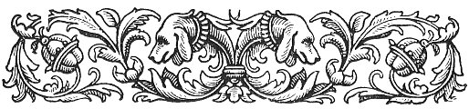
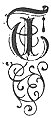
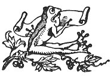

  
[Intangible Textual Heritage](../../../index) 
[Legends/Sagas](../../index)  [Celtic](../index)  [Index](index) 
[Previous](fim09)  [Next](fim11) 

------------------------------------------------------------------------

p. 141

 

# CHAPTER VII.

### SUPERSTITIONS CONNECTED WITH THE SUN, ANIMALS, TREES, PLANTS, SACRED EDIFICES, &c.

|                     |
|---------------------|
|  |

HERE is but little trace of superstitions connected with the great
objects of Nature, the mountains, rivers, glens, sea, &c., which were
probably regarded by the ancient inhabitants of Man merely with dumb awe
and reverence. But of their adoration of the Heavenly Bodies which
supplied them with light, and of the animals, trees, and plants, which
supplied their daily needs, there are significant traces. [1](#fn_102) Their religion, like those of all
primitive races, was, in effect, a vague worship of the phenomena of
nature, which they regarded as living powers. Now, of all the phenomena
which are visible to man, the Sun is at once the most awful, beneficent,
and mysterious. It is the source of light and warmth, and, when it
departs, darkness and cold follow. With darkness, fear and death are
associated, and with light, joy and life. And as the sun is the source
of light, it was considered the originator and generator of life. The
worship of the sun was a very widely extended cult, a cult of which we
have remains, even at the present day, in the ceremonial observances at
no less than four festivals during the year. Of these, the one perhaps
most distinctly connected with solar adoration is the pro- cession to
the tops of the highest hills on *Laa Lunys* (the first of August, see
[p. 120](fim09.htm#page_120)); and as the connection between the sun and
fire is naturally intimate, so it is not improbable that the fires
called bonfires, which still light up the hill-tops on the eves of

p. 142

the great festivals of *Boaldyn*, of Midsummer, and of *Sauin*, have
some connection with sun worship. A further reason in support of this
contention is afforded by the undoubted fact that the practice of
lighting these fires at such a time is evidently a very ancient one, as
in the eighth century, when the Christian synods vainly endeavoured to
put it down, it is described as having been in vogue from a remote
period. We have (in Chapter VI.) also referred to the practice of
leaping over these bonfires, and of driving cattle through them; of
rolling the fire-wheels, and of lighting fires to the windward of
fields. We have given the popular notion that these ceremonies were
performed with a view to driving away Fairies, Witches, and all evil
influences; and have alluded to the wide-spread notion of the purifying
power of fire. But, as we have just indicated, it is probable that their
object, in the earliest times, was the worship of the sun; and it would
seem that primitive man imagined that he could thus influence or charm
the sun into providing him with a due amount of sunshine for his own
welfare and that of his animals and crops; and it would seem, also, that
as the flames of these bonfires mimicked the sunshine, they were
supposed to promote fertility, for, as we have already seen (in Chapter
VI.) the crops were supposed to flourish only as far as the bonfires
were visible. These bonfires, according to the testimony of Julius
Cæsar, were used by the ancient Celts for sacrificing human beings; and
from another source we learn that it was considered that the fertility
of the year would be in accordance with the number of victims. The
funeral pyre of Balder, himself the sun-god, being lit on Midsummer-eve,
is significant of the same custom among the Scandinavians; and, when we
remember that the Gaelic Highlanders, as late as the middle of last
century, pretended to burn a man on their *Need*-fires, a sign of the
reality of the burning at an earlier epoch, we may conjecture that a
similar practice once prevailed in Man.

The Moon and the Stars, as mitigators of darkness, were also recipients
of adoration, but in a much less degree. As regards the moon, with the
exception of the belief that too much gazing at it would deprive those
who did so of their senses, the only superstitions left are in
connection with amatory questions. For it was supposed that, if the new
moon were invoked in due form, the applicant would learn in a dream the
identity of his or her future partner. But it was absolutely necessary
that this invocation, the words of which are unfortunately lost, should
he addressed to the moon in the open air, as, if it passed through
glass, there would be no response. It was also supposed that the best
time for marrying, or engaging in any important under-taking, was when
the moon was full.

p. 143

As regards Animals, Trees, and Plants when, in previous chapters, any
mention has been made of the superstitions connected with them, we have
for the most part merely given the popular explanation of the sacrifice
of the former, and the use of the latter, on such occasions as the eves
of *Boaldyn*, *Sauin*, and Midsummer, *i.e.*, as being charms to ward
off the influence of Fairies and Witches, or to expel disease; and, in
the absence of such explanation, we have refrained from giving one of
our own. But in this chapter, where all the superstitions on this
subject have been brought together, we propose to briefly investigate
their true primary connection, which, as already stated, is probably
with the earliest known form of religion, *i.e.*, that of the worship of
the phenomena of nature.

It seems highly probable, indeed, that the belief in the efficacy of
such charms against Fairies and Witches, was encouraged by the early
teachers of Christianity as a means of diverting the minds of their
converts from their worship of nature or its spirit, personified by
animals and trees. Animal worship was at one time prevalent in every
part of the world; and it is clear that man considered some animals at
least superior to himself. A mild and distant reflex of this opinion may
possibly be found in the popular modern belief that some animals "are
wiser than Christians." Dogs, for instance, are supposed to be able to
forecast a coming death, to recognise Witches, when men cannot, and to
understand human speech; and horses are accredited with seeing ghosts
when invisible to men. The luckiness or unluckiness connected with
certain animals is also possibly a remnant of this belief. It was
unlucky to meet a cat on New Year's morning, but on other occasions
there seems to have been no particular significance attached to this
animal, though there was a hazy notion that it was, especially if black,
the companion of Witches. Magpies were lucky or unlucky, according to
the number of them that were seen. The popular distich on this subject
is:--

One for sorrow, two for death,  
Three for a wedding, and four for a birth.

\[paragraph continues\] Ravens, too, had an uncanny reputation, but this
may have been, originally, because they were supposed to be Odin's
messengers; while to see a hare cross a road was deemed very unlucky.

It is also possible that a survival of a belief in animal superiority
may have originated the confidence which still exists in their weather
wisdom  . After what we have stated with reference to
the idea of the superiority of some animals entertained by primitive
man, the undoubted fact that he sacrificed them will seem very curious
at first sight. But when

p. 144

we learn that this was thought to be the very highest honour he could
pay them, and the greatest kindness he could do them, the aspect of the
question is changed. It is true, of course, that there were animals
worshipped by some tribes which its members would not venture to kill.
This cult is called *Totemism* as each tribe is supposed to be of the
kindred of its *totem* or sacred animal, and to kill, or kill and eat
it, would be the height of impiety. [1](#fn_103) On the other hand, there were animals
which were worshipped on account of their being killed and eaten. But
they were not killed and eaten on ordinary occasions, but only on
certain festivals. And, as they thought that all things must die, the
gods included, they supposed that they did particular honour to and
conferred a benefit upon the victims they sacrificed, by relieving them
from the suffering and weakness attendant upon old age; while the
benefit to themselves was gaining a communion with the Deity by eating
his body and drinking his blood. A remnant of this form of
[sacrificial](errata.htm#33) worship perhaps occurs in the Manx custom
of "hunting the wren." For we have seen that this bird was highly
honoured, being called almost universally the "king of birds," and yet
once a year it was ceremonially slain, and its feathers distributed, so
that each might receive some benefit from its divine virtue. This
divinity of the wren is also indicated by the former practice of the
Manx fishermen not to go to sea without a dead wren to protect them from
storms  .

The procession of the *laare vane*, "white mare," on twelfth-night, and
at the harvest festival, [1](#fn_103) may also
have some connection with animal worship. For it seems probable that in
Man as in St. Kilda, the "mare" once possessed a hide, that pieces
[of](errata.htm#35) this hide were plucked off like the feathers of the
wren, and that they were supposed to have similar virtues. On
Hollantide-eve, too, the last night of the old year, a calf was
sacrificed, as we have learned from the old ballad sung on that
occasion. And the bonfires at *Boaldyn*, Midsummer, and *Sauin* formerly
consumed sacrifices either of men or of beasts. But we have not to go to
tradition for instances of animal sacrifices, or even to such ceremonies
as the slaying of the wren, of which the symbolical meaning has been
lost; for we know, on the testimony of those now living, that lambs were
burnt in Man less than 50 years ago, and that not even according to
popular superstition for the discovery of 'Witches or the expulsion of
disease, but, in the words of the informants, *son oural*, "for a
sacrifice." It seems possible, too, that the practice of burning animals
to discover Witchcraft, &.c., really originated from their

p. 145

being burnt for sacrificial purposes. In all these sacrifices the notion
of laying the sins of the people on the sacrificed was probably present,
and we have this more nearly represented in the recent custom already
alluded to, [1](#fn_104) of throwing diseased
cattle, like scapegoats, out to sea, so as to ward off the disease from
their fellows.

The curious superstition about the unluckiness of letting blood,
especially that of a king or person of high rank, fall on the ground,
may also have some sacrificial meaning. We have a historical instance of
this in Man, for it is remembered to this day that when *Iliam Dhone*,
William Christian, was shot at Hango Hill in 1662, blankets were spread
where he stood, so that not one drop of his blood should touch the
earth.

The equally curious notion that all nail and hair cuttings should be
carefully destroyed may have some connection with this species of
superstition, though the reason popularly assigned for this precaution
is that it is to prevent the Witches getting hold of them, and so
gaining power over their owners. Hair was formerly supposed to have
great sanative virtues, but why it was formerly considered obligatory to
hang a criminal by a hair rope, as the following story related to Train
will show, does not appear:--

"A malefactor, who had been condemned to suffer the extreme penalty of
the law, was taken from Castle Rushen to the place of execution, where a
great concourse of people were assembled from all parts of the Island to
witness a spectacle of rare occurrence. By an old customary law, it was
ordained that a person convicted of felony should be hanged by the neck
in a hair rope; but in the case alluded to one of the constituted
authorities had given orders privately that a hempen halter should be
substituted. The innovation was discovered by some of the spectators
just as the convict was suspended from the fatal tree. The populace
instantly became so infuriated . . . that they not only had well-nigh
killed the executioner for not publicly resisting such an infringement
of the ancient statute, but also, having cut down the felon in the
agonies of death, they even . . . again hung up the dead body in a hair
halter."

The prevalence of superstitions connected with Trees in past ages will
not be wondered at when we remember that Europe was formerly almost all
one vast forest. Its primitive inhabitants lived in small clearings in
this forest, and they must have been greatly impressed, not only by the
immensity of their surroundings, but by the great changes produced in
them by the seasons. The first approach of Spring, with its budding
leaves, must have filled them with wonder and joy, and the approach of

p. 146

\[paragraph continues\] Winter, and the consequent decay of vegetation,
must have inspired them with equal wonder and sorrow. We cannot be
surprised then if they adored their mighty surroundings, and attributed
their natural changes to the agency of Deities or Spirits. In the Isle
of Man, trees seem always to have been rare, and perhaps this is why
there are so few tokens of any tree worship, though there are some signs
of an adoration of the reproductive power of Nature. Thus the invitation
to Bridget, on the first of February, to repose upon a rush or straw
couch, [1](#fn_105) is probably the remains of
some ceremony connected with the first revival of vegetation in Spring.
On May-day, [2](#fn_106) as we have seen,
branches of trees, especially of the mountain ash, were strewed upon the
thresholds, a custom which is now supposed to be practised as a
protection against Fairies and Witches, but which was probably formerly
a method of invoking the reproductive power of Nature. For trees were
supposed to produce fertilising effects on both women and cattle, and,
according to Camden, the Irish "fancy a green bough of a tree fastened
on May-day against the house will produce plenty of milk that
summer." [3](#fn_107) We have already seen that
the *Cuirn* tree, or Mountain-ash, was regarded with special veneration.
It was planted, in common with the Thorn and the Ash (*unjin*), by the
sacred wells in Man. Some of these trees are still to be found in these
positions, and votive offerings have, within living memory, been placed
on them. The *Cuirn* tree was considered an antidote to witchcraft,
though this scarcely explains why a stick of it was substituted, on Good
Friday, for the ordinary iron poker. Another significant ceremony, as
showing the adoration of nature, was the combat between winter and
summer which took place on May-day (*Laa-boaldyn*); the latter, which
was represented by a young girl, decorated with leaves, being
victorious, and thus typifying the victory of Nature's reproductive
power. [4](#fn_108) In the Isle of Man winter
was represented by a man in winter garb, but in some countries the
defeated champion was dressed to represent death, so that the contest
was still more significant of the triumph over decay. The Midsummer
celebrations seems also to have been connected with Nature as well as
Sun worship, being intended as charms to promote the fertility of the
crops. The sacrifice of Balder, too, who was both Oak-god and Sun-god,
as typified by the bonfires

p. 147

which were formerly made of oak wood, is significant of this connection;
as is also the probability that this was the day on which the Druadh cut
the mistletoe, and thus enabled Balder to be slain. [1](#fn_109) For the oak which was thus burned was
universally considered the noblest of trees, and we have seen that the
object of ceremonial sacrifice received adoration. But it is in our
harvest festival that we have retained the most characteristic survival
of the adoration of the reproductive power of nature, or of its spirit.
For the last sheaf, [2](#fn_110) called the
maiden, and the little sheaf taken from it, called the harvest doll,
were the objects of much ceremony, and the fact of their being preserved
till the following harvest would seem to indicate a belief that the
corn's life could thus be continued from one harvest to the next, and so
ensure lasting fertility. It may be noted, too, that the ceremony of the
*laare vane*, or white mare, [3](#fn_111) may
have had some connection with the last sheaf, as this sheaf is in some
counties in England and Wales to this day called "The Mare."

The following superstitions about Animals and Plants are probably not,
except as regards the Weather-Lore to be derived from them, connected in
any way with Nature worship, so that the popular explanation of their
origin will suffice:--

The Hedge-hog and the Hare were tabooed, from their supposed connection
with Witches, who took their forms upon them. The former animal was
supposed to draw milk from cows, and the latter had a very bad
reputation, though no specific misdeeds were attributed to it.

Mr. P. M. C. Kermode writes as follows concerning superstitions about
the Hare:--"Here, as elsewhere, it is the object of superstition, and
seems to be a favourite form to be assumed by a Witch. Thus, while
labourers have been at work in a field they would see the dogs pursuing
a hare which would presently be lost to sight, in a few moments the dogs
would be observed to bark and whine around a man well-known to all and
suspected of being a Witch. Of course it was he who was pursued, and,
being hard-pressed, was forced to assume his normal form, to the
mystification of the dogs. Again, a man whose cattle were suffering from
some unknown cause would learn that a hare might be seen at a certain
hour every day in a particular spot. Suspecting the meaning of this he
would load his gun, having as the only sufficient bullet a broken silver
coin, and go in pursuit. Having shot the hare, he would follow his dogs,
and find them howling by the side of a stream, while an ugly old

p. 148

crone would be seated on a boulder in the midst of it nursing her broken
leg and muttering curses. Again, dogs will give chase to a hare, and,
upon approaching it, stop suddenly and refuse to go further, even though
encouraged to do so. This, of course, is because they recognise a
Witch." [1](#fn_112) This belief that a Witch
when she had turned into a hare could only be shot with a silver bullet
was very general. The following incident, which is said to have occurred
about 30 years ago, will illustrate this:--A suspected Witch was
successfully convicted in the parish of Andreas by a sportsman, who,
seeing a hare crossing a field, fired and wounded it, and, when getting
over a hedge to secure his prey, he found that he had shot an old woman,
who was a reputed Witch.--*Oral*.

At table, no one will turn a Herring; but, when one side is eaten, the
bone is taken away, so that the rest can be eaten: for to turn the
Herring would be tantamount to overturning the boat into which it was
drawn from the ocean if it then chanced to be at sea. When a Cow had
newly calved, she was driven over a burning turf to protect her from
evil influences. Anyone removing into a new house formerly put in a Cock
before taking possession, in order to thwart any bad wishes that may
have been expressed by the last inhabitant. There was a superstition to
the effect that the cross-bone of the head of a *Bollan-fish* would
prevent anyone from straying from the most direct road to any place to
which he wanted to proceed, either by day or night. Manx sailors seldom
went to sea without one of these bones in their pocket to direct their
course at night or in hazy weather.

There is a firmly-rooted belief in the weather wisdom of animals; and,
apart from superstition, there is some reason for supposing that their
faculties in this respect are mote acute than men's. It is said that,
during the earthquake in the Riviera, in 1887, animals--especially dogs
and cats--were seen stealing out of the towns before the first shock was
felt. But, on the other hand, they frequently make mistakes, as, for
instance, when birds nest in an inclement spring, and consequently lose
their offspring. The following weather prognostics from animals are
still esteemed in the Isle of Man. [2](#fn_113)
We may divide them into prognostics of Storm, Rain, and Fine weather.
*Storms* will ensue when Seagulls come inland and Rooks fly to the
mountains; when Cattle and Sheep seek shelter, and when the
Porpoise, [3](#fn_114) or Herring-hog, is seen
gambolling

p. 149

round ships at sea. *Rain* will follow when Sparrows chirp, when Rooks
and Herons [1](#fn_115) fly low, when Rats and
Mice are rest-less, and when many Bees return to the hive and none leave
it. *Fine weather* is certain when Bats fly about at sunset, when Rooks,
Herons, and Larks fly high, when Seagulls fly out to sea, when Bees are
seen far from their hives, and Spiders spin their webs in the open air.
The few remaining weather prognostics from other sources may be also
conveniently discussed here. If the Hawthorn and Blackthorn have many
berries the ensuing winter is expected to be severe. Clover is supposed
to close up its leaves at the approach of a storm. A clear Sunrise
betokens fine weather, and so does a red Sunset; but a pale Sunset is a
sign of rain. The old Moon in the arms of the new is a certain
forerunner of storms. A Halo round the moon means rain. When the
Cumberland mountains are clearly seen, rain is expected. [2](#fn_116)

The following quaint tales about animals, though they do not come
strictly under the head of Superstitions, may certainly be considered as
belonging to Manx Folk-Lore:--The *Ushagreaisht*, or Mountain-plover, is
a favourite both in song and legend. The following ballad about it has
been sung by Manx nurses as a lullaby, to the same tune as that of "Here
we go round the Mulberry Bush," for many generations:--

*Ushag veg ruy ny moanee doo [3](#fn_117)  
C’raad chaddil oo riyr syn oie?  
Chaddil mish riyr er baare y dress,  
As ugh my cadley cha treih!* 

Little red bird of the black turf ground,  
Where did you sleep last night?  
I slept last night on the top of the briar,  
And oh! what a wretched sleep!

                \*

2 *Ushag veg ruy ny moanee doo  
C’raad chaddil oo riyr syn oie?  
Chaddil mish riyr er baare y crouw,* [4](#fn_118)*  
As ugh my cadley cha treih!* 

Little red bird of the black turf ground,  
Where did you sleep last night?  
I slept last night on the top of the bush,  
And oh! what a wretched sleep! p. 150

3 *Ushag veg ruy ny moanee doo  
C’raad chaddil oo riyr syn oie?  
chaddil mish riyr er baare y thooane*, [1](#fn_119)  
*As ugh my cadley cha treih!* 

Little red bird of the black turf ground,  
Where did you sleep last night?  
I slept last night on the ridge of the roof,  
And oh! what a wretched sleep!

                \*

4 *Ushag veg ruy ny moanee doo  
C’raad chaddil oo riyr syn oie?  
Chaddil nish riyr eddyr daa guillag,  
Myr yinnagh yn oikan* [2](#fn_120) *eddyr daa
lhuishag,  
As o my cadley cha kiune!* 

Little red bird of the black turf ground,  
Where did you sleep last night?  
I slept last night between two leaves  
As a babe 'twixt two blankets quite at ease,  
And oh! what a peaceful sleep!

We have also a legend about this bird in connection with the *Lhondoo*,
or Black-bird:--

It is said that once upon a time the haunts of the *Lhondoo* were
confined to the mountains, and those of the *Ushag-reaisht* to the
lowlands. One day, however, the two birds met on the border of their
respective territories, and, after some conversation, it was arranged to
change places for a while, the *Ushag-reaisht* remaining in the
mountains, till the *Lhondoo* should return. The *Lhondoo*, finding the
new quarters much more congenial than the old, conveniently forgot his
promise to go back. Consequently the poor *Ushag-reaisht* was left to
bewail his folly in making the exchange, and has ever since been giving
expression to his woes in the following plaintive querulous pipe:
*Lhondoo vel oo cheet, vel oo cheet?* "Black-bird are you coming, are
you coming?" The Lhondoo, now plump and flourishing, replies--*Cha-nel
dy bragh, cha-nel dy bragh!* "No never, no never!" The poor
Ushag-reaisht, shivering--*Teh fear feayr. t’eh feer feayr!* [3](#fn_121)"It's very cold, it's very cold!"

Another form of the same story is as follows:--The *Ushag-reaisht*
complains *giall oo dy horagh oo reesht* "you promised you would come
back"; *ta’n traa liauyr, as cha vel oo ayns shoh*,

p. 151

\[paragraph continues\] "the time is long and you are not here." But the
*Lhondoo* replies *Cha jig dy bragh*, "Will never come."

The following is a quaint fancy derived from the notes of the
Blackbird's and Thrush's songs. The blackbird whistles *Gow* as *smook*,
which is Anglo-Manx for "go and smoke." The thrush replies *Cha vel
thumbaga aym* "I have no tobacco," or literally "There is no tobacco at
me." To whom the blackbird again--*kionney, kionney*, "buy, buy." The
thrush is then forced to confess--*Cha vel ping aym* "There is not a
penny at me," and receives very bad advice *Gow er dayl*, "Go on trust,"
but he closes the controversy by saying, *Cha der ad dou er*, "They
won't give it me"

The following tale is told of the Herring:--

#### HOW THE HERRING BECAME KING OF THE SEA.

Long ago the fish bethought themselves that it was time for them to
choose a king in case there might be disputes among them, for they had
no Deemster to tell them what was right, so they came together to choose
a king. No doubt they all tried to put on their best appearance. It is
said that the Fluke in particular spent so much time in putting on his
red spots, that when he arrived he found the election was over and that
the Herring had been made king of the sea. Upon hearing this, he curled
his mouth on one side and said, "A simple fish like the Herring, king of
the sea!"; and his mouth has been on one side ever since. It is perhaps
on account of this importance of the herring that the Deemsters, in
their oath, swear to execute the laws of the Isle "as indifferently as
the herring's back-bone doth lie in the midst of the fish."

There is a curious tradition that all the following creatures pass the
winter in a torpid condition. They are seven in number, (though, as will
be seen, some of the names vary), and they are consequently called *ny
shiaght cadlagyn*, "the seven sleepers," having, however, no connection
with the more famous seven of Ephesus. They are *Craitnag*, "the Bat";
*Cooag*, "the Cuckoo"; *Cloghan-ny-cleigh*, "the Stone-chat "; and
*Gollan-geayee* "the Swallow"; which are found in all the lists; the
others being *Crammag*, "the Snail"; *Doallag*, "the Dormouse ";
*Foillycan*, "the Butterfly"; Shellan, "the Bee"; *Jialgheer*, "the
Lizard;" and *Cadlag*, "the sleeper," a mythical animal.

We now come to the superstitions about Trees and Plants. The *Cuirn* has
already been discussed. The Thorn tree also, especially when it grew to
a large size, was regarded with veneration, there being a very strong
[prejudice](errata.htm#36) against cutting it down. It was supposed to
be a favourite haunt of the Fairies, and there are numerous anecdotes
still current of their being seen dancing in its branches.

p. 152

The Elder tree, or *Tramman*, was vulgarly supposed to have been the
tree upon which Judas Is riot hanged himself, and it was possibly on
this account that great reliance was formerly placed on its sanative and
mystical virtues. It was used as a charm for protecting houses and
gardens from the influence of Sorcery and Witchcraft, and, even at the
present time, an Elder tree may be observed growing by almost every old
cottage in the Island. Its leaves, like those of the Cuirn, were picked
on May-eve, and affixed to doors and windows to protect the house from
witchcraft.

It was supposed that if you trod on the *Luss-y-chialg*, [1](#fn_122) "Plant of the prickle," or St. John's
wort, after sunset, on St. John's Eve, a fairy horse would rise out of
the earth and carry you about during the whole night, only leaving you
at dawn. The *Luss-ny-tree duillag*, "Plant of three leaves," or
Shamrock, was said to be a cure for tooth-ache, and the
*Luss-nay-ollee*, [2](#fn_123) "Plant of the
cattle," was efficacious for sores in the mouths of cattle, as well as
for tooth-ache.

The *Luss-yn-aacheoid*, "Plant of the sickness," or Purple
Meadow-button, was reckoned a preservative against the "Evil Eye."

The *Luss-y-chellan* is an herb which was said to keep milk from turning
sour, and butter from being discoloured.

The *Luss-ny-kiare-duillag*, "Four-leaved clover," was efficacious
against the wiles of Fairies or of Witches, and so was the *Bollan
feaill-Eoin*, "John's Feast-day plant, or Mugwort." [3](#fn_124) This yellow weed was gathered on
Midsummer-eve, and made into chaplets, which were worn on the heads of
man and beast, who were then supposed to be proof against all malign
influences. Of the metals, Iron was the only one invested with magical
power. This notion probably took its rise from a dim tradition of the
period when the people who had iron weapons overcame the earlier people
of the stone and bronze ages. The Fairies, as should be noted in this
connection, were always supposed to have used stone-headed arrows, the
numerous flint arrow heads which are found being supposed to be their
weapons. The magical power of iron, referred to above, is demonstrated
in some of the legends already given about the virtues of magic swords,
and it will also be remembered that an iron tongs sufficed to protect a
newly-born baby from the Fairies. In the days when iron was rare, it
would either be an object of veneration, or be viewed with suspicion.
Mysterious virtues are, in fact, attributed to it in the popular stories
of many nations. Even at the present day, a horseshoe is hung up over
the entrance door of a house, a stable, or a cow-house, as a

p. 153

protection against the powers of evil. We have already referred to the
strange superstition against using an iron poker to stir the fire on
Good Friday. It is remarkable, in this connection, that iron knives were
never made use of by savages in their sacrificial ceremonies, because
they supposed that the spirits objected to this metal. But for this very
reason that the spirits objected to it, it was used, as we have already
seen, as a protection against them. It is possible that the superstition
against cutting a child's nails during the first year of its life may be
connected with this objection of spirits to iron.

The virtues of Salt [1](#fn_125) as a
protection against Fairies, Magicians, &c., were universally recognised.
If milk were taken from a house, it was considered necessary to put a
pinch of salt in it, and this must be done by the mistress to prevent
the luck of the house going with it. Fishermen will not lend any salt
out of their boat, as to do so is considered unlucky, Salt was also
strewed about the threshold if a woman were approaching her confinement,
in order to drive away the fairies. It was put into a child's mouth at
birth, and laid on the breast of a corpse.

A white Stone was considered very unlucky, and nothing will induce the
fishermen to use one as ballast.

#### SUPERSTITIONS CONNECTED WITH SACRED EDIFICES.

In the first part of this chapter we have discussed the superstitions
which probably originated in the primitive Nature religion, and we may
now briefly refer to those which have had their origin in other
religions, especially the Christian. They are, for the most part,
connected with churches and *keeills*, and all ancient monuments
supposed to have been used for religious observances, which have always
been regarded with [superstitious](errata.htm#37) awe. Any sacrilege
against such edifices has always been considered by the Manx people as a
most serious sin which would bring certain punishment on the offender.

In the words of Bishop Wilson, "They have generally hated sacrileges to
such a degree that they do not think a man can wish a greater curse to a
family than in these words:--*Clogh ny killagh ayns corneil dty hie
mooar*, *i.e.*, "May a stone of the church be found in the corner of thy
dwelling-house." Many stories might he told to illustrate this feeling,
but we must content ourselves with a few specimens.

About one hundred years ago a farmer, in the parish of Jurby, during a
violent storm of thunder and lighting, drove his sheep into one of the
ancient keeills. It was afterwards observed that

p. 154

he lost all the lambs of that flock in the ensuing spring, and that many
of them were born monstrosities.

Not long ago a small windmill was erected for driving a threshing
machine, a portion of which was built of stones from an adjacent
*keeill*; but immediately it was set to work it went with tremendous
fury, and shook the whole of the premises, and had in consequence to be
taken down. The owner of the farm on which this windmill was situate
lost four head of cattle and three horses by disease within a very brief
period. All these calamities were attributed to the use of the stones
from the sacred edifice.

A portion of the roof of the *keeill* on the Rhyne farm in Baldwin was
removed to a farm-house, but such unearthly noises resulted that it was
soon restored. A somewhat similar story is told of a stone which was
taken from St. Luke's Chapel in the same neighbourhood to a farm-house,
but it had to be taken back, as those who lived in the house could not
sleep at nights for noises, sometimes resembling a calf bleating, and at
other times like a cart of stones being upset. At one time it was placed
on the earthen fence of an adjoining field, but the fence would never
stand, and the stone had to be removed again to the chapel.

Some years ago a farmer began levelling the *keeill* on Camlork farm,
but he at once "took a pain in his arm, and had to stop work some days."
Afterwards he continued his task, assisted by his wife and daughter, the
consequence was the two latter died soon after, and the man became
insane, and expired after living in that state for some time.

About thirty years ago a farmer put his sheep to graze in a field in
which there was a stone circle, the result in the following spring being
the same as in the case of the man who drove his sheep into a *keeill*.
About the same period two men were employed to remove the stones from
the circle at The Braid, in the parish of Braddan, in order to build a
wall with them. No sooner had they commenced operations than one of them
was seized with a terrible pain in one of his legs, and the other was
similarly afflicted in one of his arms. They at once desisted and went
home, but the leg of one and arm of the other were crippled and useless
for the rest of their lives. Stories are also told of ploughs being
broken without any apparent cause, when they were driven too close to
one of these circles. Even to appropriate a portion of an old cist was
sacrilege, as the following tale will show:--A man had been tempted to
take a large stone slab that formed the top of an old cist for a lintel.
No sooner had he done this than his cow sickened and a calf died, and,
more curious still, one of his hens

p. 155

was found dead on her nest. He at once recognised that this was a just
punishment for the sacrilege he had committed and restored the slab to
its original position. After this, of course, all went well.

Even sacrilege of a milder kind was resented, as will appear from the
following show:--Some thirty years ago the churchwardens of Maughold
decided to put two steps to the communion rails of the church, instead
of one, which was very high. The labourers in taking away the old steps
disinterred a number of bones, which were left exposed during the time
that two of them were absent at dinner. The third, who remained and took
his mid-day (*munlaa*) dinner in the church, distinctly heard sounds of
whispering or murmuring (*tassaneagh*) all over the church. When his
fellows returned, they at once re-interred the bones, when the
whispering ceased.

But in the following, on the contrary, which is of quite recent origin,
there seems to be no resentment at all:--There was an old Roman Catholic
Chapel at the south end of Douglas, near the Castletown-road. When this
chapel was pulled down, a house was built on its site. The woman who
occupied this house with her husband, and who often used to sit up
waiting for him to return home till a very late hour, declared that
every night when the clock struck twelve she distinctly heard the tramp
of many feet entering the room where she sat. Then there was silence,
and after a time the sound of feet again. Doubtless this was the arrival
of the ancient worshippers at mid-night mass, and their departure from
it.

As a proof of the simplicity and piety of the Manx, Vicar-General Wilks,
writing in 1777, states that they do not usually reckon the time "by
hours of the day, but by the *traa shirvaish*, *i.e.*, the service time,
viz., nine in the morning, or three in the evening, an hour, two hours,
before service time, &c."

Other superstitions connected with religion have already been mentioned.
They are the bowing of the sun on Easter Sunday morning; and the lowing
of the cattle and blooming of the myrrh plant at midnight on
Christmas-eve; the making of the branches of the *cuirn* into crosses on
May-eve; the notions that the influence of Christ is a protection from
Fairies, &c., at Christmas time, and that children were more especially
liable to evil influences before baptism.

 

 

------------------------------------------------------------------------

### Footnotes

[141:1](fim10.htm#fr_105) The question of the
real origin and significance of the ideas of primitive Man on these
subjects is still obscure, and the views given must be regarded as
merely tentative. For an able account of this question see "The Golden
Bough," by J. G. Frazer, M.A. (Macmillan & Co.), from which the writer
has derived some valuable hints.

[144:1](fim10.htm#fr_107) Thus it was taboo for
Cuchullin to eat his namesake, the dog.

[145:1](fim10.htm#fr_108) See [p.
92](fim08.htm#page_92).

[146:1](fim10.htm#fr_109) See [p.
106](fim09.htm#page_106).

[146:2](fim10.htm#fr_110) See [p.
110](fim09.htm#page_110).

[146:3](fim10.htm#fr_111) It seems probable
that the practice of making these branches into crosses is probably of
Christian origin, and, therefore, comparatively speaking of recent date,
though it must be remembered that the symbol of the cross was known
before Christianity existed.

[146:4](fim10.htm#fr_112) See p. 112.

[147:1](fim10.htm#fr_113) According to the
well-known myth, the beloved Balder was invulnerable till pierced by the
mistletoe.

[147:2](fim10.htm#fr_114) [p.
122](fim09.htm#page_122).

[147:3](fim10.htm#fr_115) pp.
[104](fim09.htm#page_104), [122](fim09.htm#page_122).

[148:1](fim10.htm#fr_116) Manx Note Book. Vol.
I., pp. 126-7.

[148:2](fim10.htm#fr_117) NOTE.--It will be
noticed that most of them are common to many countries.

[148:3](fim10.htm#fr_118) *Yn Pherkin vooar* in
Manx.

[149:1](fim10.htm#fr_119)
*Coar-ny-hastan*--"Crane of the eel" in Manx.

[149:2](fim10.htm#fr_120) There are some other
bits of weather Folk-Lore which have become proverbial, and will be
found under the heading of Proverbs.

[149:3](fim10.htm#fr_121) The first and third
lines in the first three verses are repeated three times, but in the
last verse the first line only is repeated.

[149:4](fim10.htm#fr_122) *Crouw*, "a bunch
growing on one stem or stalk."--*Cregeen*.

[150:1](fim10.htm#fr_123) *Thooane*, "a rib or
lath on the roof of a house, under the scraws. "--*Cregeen*.

[150:2](fim10.htm#fr_124) *Oikan*, "The
gradations from infancy to manhood are marked by a copious variety of
terms: *Oikan, Lhanoo, Paitchey, Poinnar, Stuggyr, Scollag, Dooiney*.
"--Rev. W. Gill. *Oikan* is the first stage of all.

[150:3](fim10.htm#fr_125) These words "*T’eh
feer feayr*" exactly represent the Plover's shrill and piteous whistle.

[152:1](fim10.htm#fr_126) Hypericum perforatum.

[152:2](fim10.htm#fr_127) Pinguicola.

[152:3](fim10.htm#fr_128) Artemisia Vulgaris.

[153:1](fim10.htm#fr_129) See stories of "Fairy
Dogs," ch. III.; "Magician's Palace," ch. V. and "New Year's Eve," ch.
VI.

------------------------------------------------------------------------

[Next: Chapter VIII. Customs and Superstitions Connected with Birth,
Marriage, and Death](fim11)
