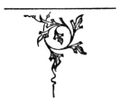

  
[Intangible Textual Heritage](../../../index) 
[Legends/Sagas](../../index)  [Celtic](../index)  [Index](index) 
[Previous](fotc03)  [Next](fotc05) 

------------------------------------------------------------------------

  
*The Feuds of the Clans*, by Alexander MacGregor, \[1907\], at
Intangible Textual Heritage

------------------------------------------------------------------------

p. 51

### TOUCHING THE DESCRIPTION OF SUTHERLAND.

Our Scottish writers have hitherto erred
in describing the situation of Sutherland; for it hath Caithness toward
the east and northeast; Strathnaver toward the north; Assint toward the
west; Ross toward the south and south-west; and the German Sea toward
the south, south-east, and east. Sutherland, in the Irish language, is
called Cattey, and the people Cattigh. Cattey did contain sometime all
the region lying betwixt Tayne and Dungesby, being divided in the midst
by a mountain called Mond, or Ord, which runneth from the south sea to
the north sea: and the country which is now called Catteyness, was first
so named, as the ness or promontory of Cattey stretching itself eastward
from the hill Ord. This is the opinion of one Andrew, Bishop of
Catteyness. And in the old English writers (such as Hoveden,
Walsinghame,

p. 52

and others) it is always written Catteynes: so that Boethius faileth in
drawing the etymology of Catteyness from Catus (the proper name of a
man) and ness; which doubtless proceeded from the ignorance of the Irish
language.

 

------------------------------------------------------------------------

[Next: The Conflict of Drumilea](fotc05)
