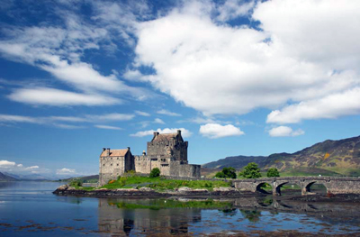

  
[Intangible Textual Heritage](../../../index) 
[Legends/Sagas](../../index)  [Celtic](../index) 

------------------------------------------------------------------------

<table width="75%">
<colgroup>
<col style="width: 50%" />
<col style="width: 50%" />
</colgroup>
<tbody>
<tr class="odd">
<td width="50%" data-valign="TOP"></td>
<td width="50%" data-valign="CENTER"><h1 id="the-feuds-of-the-clans" data-align="CENTER">The Feuds of the Clans</h1>
<h2 id="by-alexander-macgregor" data-align="CENTER">by Alexander MacGregor</h2>
<h4 id="section" data-align="CENTER">[1907]</h4></td>
</tr>
</tbody>
</table>

------------------------------------------------------------------------

[Contents](#contents)    [Start Reading](fotc00)    [Page
Index](pageidx)    [Text \[Zipped\]](fotc.txt.gz)

------------------------------------------------------------------------

This is an account of the feuds of the Highlanders of Scotland. While
most feuds stem from trivial causes, they have always been a source for
high literature, from the Iliad to the Mahabharata. These Scottish feuds
take on an epic quality of their own, as they play out their grim logic
of retribution.

------------------------------------------------------------------------

 [Title Page](fotc00)  
[Note](fotc01)  
[Contents](fotc02)  
[The Feuds of the Clans](fotc03)  
[Touching the Description of Sutherland](fotc04)  

### The Feuds of the Clans

[The Conflict of Drumilea](fotc05)  
[The Conflict of Embo](fotc06)  
[The Conflict Of Bealach-na-Broigh](fotc07)  
[The Conflict of Clachnaharry](fotc08)  
[The Conflict of Clan Chattan and Clan Kay](fotc09)  
[The Conflict of Tuiteam-Tarbhach](fotc10)  
[The Conflict of Lon-Harpasdal](fotc11)  
[The Conflict of Druimnacoub](fotc12)  
[The Conflict of Ruaig-Shansaid](fotc13)  
[The Conflict of Blar-Tannie](fotc14)  
[The Conflict of Blar-na-Pairc](fotc15)  
[The Conflicts of Skibo and Strathfleet](fotc16)  
[The Crowner Slain by the Keiths in the Chapel of St. Tayre](fotc17)  
[The Conflict of Aldicharrish](fotc18)  
[The Skirmish of Dail-Riabhach](fotc19)  
[The Conflict of Torran Dubh](fotc20)  
[The Conflict of Alltan-Beath](fotc21)  
[The Conflict of Garbharry](fotc22)  
[The Burning of the Dornoch Cathedral](fotc23)  
[The Conflicts of Allt-Gamhna and Leckmelm](fotc24)  
[Troubles in the Western Isles in the Year 1586](fotc25)  
[The Troubles Between Sutherland and Caithness in 1587–90](fotc26)  
[The Troubles Between the Earls of Huntly and Moray.](fotc27)  
[The Troubles Betwixt the Forbeses and the Gordons in the Years 1571 and
1572](fotc28)  
[The Brig of Dee](fotc29)  
[A Tumult in Ross in 1597](fotc30)  
[The Death of Sir Lauchlan Maclean in 1598](fotc31)  
[Troubles in the West Isles Betwixt the Clan Donald and the Siol Tormoit
in 1601](fotc32)  
[The Troubles Between Lord Kintail and Glengarry](fotc33)  
[Troubles in the Island of Raasay In 1611](fotc34)  
[The Troubles of the Lewis](fotc35)  
[Some Troubles Betwixt Sutherland and Caithness In 1612](fotc36)  
[The Spanish Blanks, and What Follows Thereupon](fotc37)  
