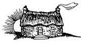
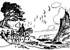
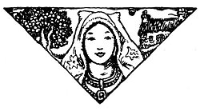
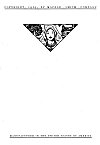

  
[Intangible Textual Heritage](../../../index)  [Legends and
Sagas](../../index)  [Celtic](../index)  [Index](index)  [Next](ftb01) 

------------------------------------------------------------------------

[Buy this Book at
Amazon.com](https://www.amazon.com/exec/obidos/ASIN/B0027ISB18/internetsacredte)

------------------------------------------------------------------------

  
*Folk Tales of Brittany*, by Elsie Masson, \[1929\], at Intangible
Textual Heritage

------------------------------------------------------------------------

p. 1

# FOLK TALES OF BRITTANY

## BY ELSIE MASSON

### EDITED BY AMENA PENDLETON

### WITH DRAWINGS BY THORNTON OAKLEY

 

#### MACRAE · SMITH · COMPANY

#### PHILADELPHIA

#### \[1929\]

###### Scanned, Proofed and Formatted at Intangible Textual Heritage, August-September, 2004 by John Bruno Hare. This text is in the public domain because it was not renewed in a timely fashion at the US Copyright Office as required by law at the time.

  [  
Click to enlarge](img/cover.jpg)  
Front Cover and Spine  

 
[  
Click to enlarge](img/endp.jpg)  
Endpapers  

  [  
Click to enlarge](img/title.jpg)  
Title Page  

p. 2

COPYRIGHT 1929, BY MACRAE · SMITH · COMPANY

 

MANUFACTURED IN THE UNITED STATES OF AMERICA

 
[  
Click to enlarge](img/verso.jpg)  
Verso  

------------------------------------------------------------------------

[Next: Foreword](ftb01)
