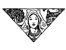
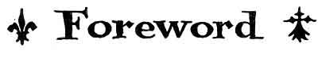
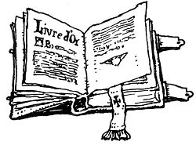

  
[Intangible Textual Heritage](../../../index)  [Legends and
Sagas](../../index)  [Celtic](../index)  [Index](index) 
[Previous](ftb00)  [Next](ftb02) 

------------------------------------------------------------------------

[Buy this Book at
Amazon.com](https://www.amazon.com/exec/obidos/ASIN/B0027ISB18/internetsacredte)

------------------------------------------------------------------------

  
*Folk Tales of Brittany*, by Elsie Masson, \[1929\], at Intangible
Textual Heritage

------------------------------------------------------------------------

p. 3

 

These tales are still characteristic of the tales told or sung in the
farmhouses, at weddings and christenings in the Breton-speaking regions
of Brittany, in spite of the disastrous modern influence of moving
pictures and popular songs.

Some of the stories in this book are unpublished hitherto in their
present form--the subjects of them being taken from the ancient folk
songs of Barzaz-Breize, or from oral tradition. Others are translated
from the old collection of legends gathered in the Breton language, from
the Breton people, by the distinguished writer and son of Brittany,
Emile Souvestre, and published in French under the title of *Le Foyer
Breton*.

I wish to express special gratitude to M. l’Abbé François Cadic, who has
allowed me the use of his remarkable series of fairy and folk tales
*Contes et Légendes de Bretagne* and *Nouveaux Contes et Légendes*,
which together with their historical commentary form what Anatole Le
Braz justly calls *Le Livre d’Or du Morbihan*.

ELSIE MASSON

*Pontivy, Morbihan  
France*  
October, 1929.

 

------------------------------------------------------------------------

[Next: Contents](ftb02)
