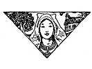
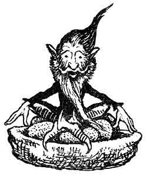
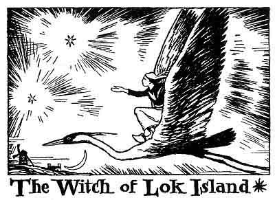
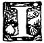
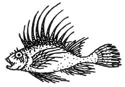

  
[Intangible Textual Heritage](../../../index)  [Legends and
Sagas](../../index)  [Celtic](../index)  [Index](index) 
[Previous](ftb06)  [Next](ftb08) 

------------------------------------------------------------------------

[Buy this Book at
Amazon.com](https://www.amazon.com/exec/obidos/ASIN/B0027ISB18/internetsacredte)

------------------------------------------------------------------------

  
*Folk Tales of Brittany*, by Elsie Masson, \[1929\], at Intangible
Textual Heritage

------------------------------------------------------------------------

p. 52

 

p. 53

# THE WITCH OF LOK ISLAND

p. 54

  [  
Click to enlarge](img/05400.jpg)  
Coral ornaments were in her hair  

p. 55

 

|                     |
|---------------------|
|  |

N olden times when miracles were common in Brittany there lived in
Lannilis a youth called Houarn Pogam and a maiden whose name was Bella
Postik. They had grown up together and loved each other with all their
hearts. When their parents had died, leaving them next to nothing, they
were obliged to go into service in the same house.

They ought to have been happy, but lovers are like the ever moaning sea.

"If only we had the means to buy a little cow and a lean pig," said
Houarn, "I would hire a bit of land from our master. Then the priest
would marry us and we could live together."

p. 56

"Yes," replied Bella with a heavy sigh, "times are so hard. Cows and
pigs were dearer than ever last week at the fair. It is certain that
Providence does not care how the world goes round nowadays."

They complained thus every day until at last Houarn became impatient.
One morning he went to the threshing-floor where Bella was winnowing
grain and told her he was going to set out to seek his fortune.

Bella was very sad on hearing the news and tried to persuade him not to
go. But he would not listen.

"Birds fly straight to the corn field," said he, "and bees to the
flowers for their honey. A man ought to have as much sense as winged
creatures. I am going to find what I want, the price of a little cow and
a lean pig. If you love me Bella you will not stand in the way of a plan
that will bring about our marriage."

The girl realized that she must consent and said: "Go with Heaven's
help, if you must, but before you go I want to give you the most
precious treasures my parents left to me."

She led Houarn to her linen press and from it took a little bell, a
knife, and a stick.

"These relics have never gone out of our family," she said. "The sound
of this bell can be heard at any distance. It warns our friends of any
danger we may be in. Whatever this knife touches will escape from the
spell of magician or of witch. And lastly this staff will guide the
bearer to

p. 57

wherever he may wish to go. I give you the knife to defend you from evil
spells, the bell so that it may warn me when you are in danger, but I
shall keep the staff and then I shall be able to reach you if you need
me."

Houarn thanked his sweetheart. They shed a few tears together, as in
duty bound when one says good-bye, and he started off toward the
mountains. Then he decided to turn south and after several days reached
the town of Pont-Aven.

One morning he was sitting at the door of the inn and saw two salt
dealers pass, leading their mules. Houarn overheard their words, and
discovered that they were talking about the witch of Lok Island. Houarn
went to them and asked what they meant, and they answered that the witch
of Lok Island was a fairy who lived in a lake in the biggest of the
Glénan Islands. They told Houarn that this witch was richer than all the
wealth of the kings of the world. Many a rash lad in search of fortune
had gone to the island to find her treasure but not one of them had ever
returned.

When Houarn heard this he at once became eager to go to the island to
seek adventure. The mule-drivers tried to dissuade him, saying that good
Christians like themselves could not see a man go to certain rack and
ruin, and they threatened to keep him back by force.

Houarn thanked them for the interest they showed in him and said he was
ready to give up the plan if they would

p. 58

pass the hat around and collect enough money for him to buy a little cow
and a lean pig. Whereupon they all changed their tune saying that Houarn
was a stubborn-headed chap and that they could not stop him anyhow.

So Houarn went down to the seashore and hailed a ferryman who took him
over to Lok Island.

He soon found the pool in the middle of the island. It was surrounded
with sea-drift covered with pale pink blossoms. Houarn noticed at the
far end of the lake in the shade of a clump of flowering broom a
sea-green boat floating on the still water. The boat looked like a
sleeping swan with its head under its wing.

As Houarn had never seen anything like this he drew near out of
curiosity. Then he stepped into the boat to examine it more closely.
Hardly had he put his foot in it than the swan awoke. Its head came out
from under its feathers, its web feet spread out in the water, and
suddenly it left the shore.

The youth uttered a cry of dismay but the swan only floated more quickly
toward the middle of the lake. Then the bird put its bill in the water
and plunged, carrying Houarn into the depths. In a moment they had
reached the witch's home.

It was a palace made of sea-shells, lovelier than anything you can
imagine. A crystal stairway led up to the door, and it was built in such
a curious way that at each step you took

p. 59

the stair sang like a forest bird. All around the palace were immense
gardens and lawns of seaweed set with diamonds instead of flowers, and
surrounding the gardens was a forest of sea trees.

Houarn stood in the doorway of the palace, and there in the first room
he saw the witch lying on a golden bed. She was dressed in sea-green
silk as fine and soft as a wave. Coral ornaments were in her black hair
which fell down to her feet. Her pink and white face was as delicately
tinted as the inside of a shell.

Houarn drew back at the sight of so delightful a being. But the fairy
rose up smiling and went toward him. Her walk was as lithesome as the
sweep of the waves on the rolling sea.

"Welcome," she said, motioning him to come in. "There is always a place
here for strangers and handsome youths like you."

Houarn felt bolder and entered the room.

"Who are you? Where do you come from? And what do you want?" asked the
witch.

"My name is Houarn," said the boy, "I come from Lannilis, and I am
looking for enough money to buy a little cow and a lean pig."

"Very well," answered the witch, "your search shall be rewarded,--you
shall have your heart's desire."

She then ushered him into a second room the walls of

p. 60

which were hung with threaded pearls. She gave him eight kinds of wine
in eight goblets of chased gold. Houarn began by drinking the eight
kinds of wine and, as he found them very nice, he drank eight times of
each, and always he imagined the witch was more and still more
beautiful. Had the world ever seen so enchanting a being?

She told him that the pool of Lok Island was connected by an underground
passage with the sea, and that all the wealth of wrecked ships was drawn
thither by a magic current.

"On my honor!" cried Houarn whom the wine had made jolly, "I am not
surprised that landlubbers speak so badly of you. People as rich as you
are always making others envious. As far as I am concerned half your
fortune would do for me."

"You shall have it, Houarn," said the witch.

"But how can you manage that?" asked Houarn surprised.

"I have lost my husband who was an elf," she answered; "and so if I am
to your taste I will be your wife."

The young man was quite breathless at what he heard. Was it possible
that he was to marry the beautiful fairy whose palace was rich enough to
contain eight barrels of marvelous wine? To be sure he had promised to
marry Bella but memories of Bella were fast becoming clouded by fumes
from the witch's brews.

Houarn told the fairy very politely that he could not refuse

p. 61

her offer, and that he was overcome with joy at the prospect of becoming
her husband.

The witch then said she would prepare the feast for the betrothal at
once. She set a table and spread it with the nicest dishes Houarn had
ever set eyes upon, as well as many he had never tasted before. Then she
went out into the garden to a fish pond and, taking a net in her hand,
leaned out over the water.

"Come hither, come hither, attorney general," she cried. "Come hither,
come hither, O, miller! O, tailor! O, beadle!"

Each time she spoke Houarn could see a fish leap into her net.

When the net was full she went back into the palace to the room next to
the one where the table was set, and taking a golden frying pan she
threw all the fishes into it.

It seemed to Houarn that amidst the sputter of the frying he could hear
whispers.

"Who is whispering in your golden frying pan, fairy?" he asked.

"It is just the sparks that the wood is throwing out," she said, blowing
up the fire.

But in a moment little voices began to mutter.

"Who is muttering?" asked the young man.

"It is the fat that is melting," she replied, tossing up the fish in the
pan.

p. 62

Soon the voices began to shout.

"Who is shouting so, fairy?" asked Houarn.

"It is only the cricket on the hearthstone," answered the witch, singing
so loudly that Houarn could hear nothing else.

Now all that was happening began to clear Houarn's wits. And as he was
beginning to be frightened he felt pangs also of remorse.

Mercy on us!" he said to himself, "is it possible that I could forget
Bella so soon for a witch who must be the daughter of Old Nick himself?
With a wife like that I shall never dare to say my prayers at night. And
I shall lose my soul as surely as a pigs' doctor."

Whilst he was thinking thus the witch brought in the fried fish and
begged him to sit down to dinner. Then she said she would fetch yet
twelve new kinds of wine for him to taste.

Houarn sat down and taking from his pocket the knife Bella had given
him, he sighed. Then he tried to eat. But hardly had the
spell-destroying knife touched the golden dish than all the fishes stood
up and became little men. Each one wore the garb of his profession or
trade. There was an attorney general with his white bib, a tailor in
violet stockings, a miller all covered with flour, and a beadle in his
surplice. And they all shouted out together as they swam in the-hot fat:

p. 63

"Houarn, save us if you wish to be saved yourself."

"Holy saints! Who are all these little men singing in the melted
butter?" cried Houarn dumfounded.

"We are Christians like yourself," they shouted back. "We too came to
Lok Island to seek our fortune. We agreed to marry the witch, and the
day after the wedding she treated us just as she had treated those who
came before us, and who are now in the big fish pond."

"Really!" exclaimed Houarn. "Can a woman who seems so young be the widow
of all these fishes!"

"And soon you will be in the same state, perhaps fried and eaten by the
new comers!" they cried back in a chorus of shrill prophesying voices.

Houarn leaped up as though already he felt himself in the golden frying
pan. He rushed toward the door hoping to escape before the witch came
back. But she had just slipped in and heard everything. Before Houarn
could reach the door she had thrown her steel net over him, and
immediately poor Houarn was turned into a frog. Then the witch threw him
into the fish pond with her other enchanted husbands.

At that very moment the little bell that Houarn wore, around his neck
gave forth a silvery note which Bella heard at far-away Lannilis, where
she was busy skimming yesterday's milk.

She uttered a cry, "Houarn is in danger!" And with no

p. 64

more ado, without asking anyone's advice she hurried to her room and put
on her Sunday dress, her shoes, and her silver cross. Then, taking the
magic staff she left the farm. When she reached the crossroad she stuck
her staff in the ground and murmured:

"O, staff of apple wood so fair,  
Lead me on land and through the air,  
Above the cliffs and o'er the sea,  
For with my lover I must be."

The staff changed at once into a chestnut steed, completely saddled and
bridled. He had a ribbon above each ear and a blue tassel on his
forehead.

Bella mounted and off they started, first at a pace, then at a trot, and
then at a gallop. At last they were traveling so swiftly that the trees
and the ditches and the church steeples flew past the girl's eyes very
much as fly the shuttles of a wool winder.

Yet longed she ever for more speed, and she urged her horse onward,
whispering in his ear:

"The horse is less swift than the swallow, the swallow less swift than
the wind, the wind is less swift than the lightning, but, steed of mine,
you must be swifter than all, for part of my heart is suffering, the
dearest half of my heart is in danger."

The horse understood her, and flew like chaff blown before

p. 65

the gale. At last they reached the foot of that rock in the mountains
that people call Hart's Leap Rock.

There the swift steed came to a halt for neither man nor beast has eve r
climbed that cloud-capped rock. Bella then repeated:

"O, staff of apple wood so fair,  
Lead me on land and through the air,  
Above the cliffs and o'er the sea,  
For with my lover I must be."

Hardly had she finished the last line when wings grew out of the horse's
flanks, and he became a mighty bird that bore her on the winds to the
very summit of the cliff .

Here Bella found a nest made of potter's clay, lined with dry moss. On
it was sitting a hobgoblin, withered and bearded and dark. He shouted
out when he saw Bella:

"Here is the fair maid who has come to save me!"

"To save you!" cried Bella. "Who are you?"

"I am Jennik, the husband of the witch of Lok Island. She it is who with
her spells confines me here."

"But what are you doing on that nest?" asked Bella.

"I am trying to hatch six stone eggs, and I shall not get my freedom
until they are hatched," answered the hobgoblin.

"Alas, poor little cockerel!" exclaimed the maiden. "How can I deliver
you?"

p. 66

"Just as you will deliver Houarn who is in the witch's power," the elf
replied.

"Ah, tell me what I must do!" cried Bella. "Even if I have to go round
the four bishoprics, on my bended knees, I shall begin at once."

"Then attend to what I say," continued the goblin.

You must go to the witch of Lok Island and introduce yourself as a young
lad. Then you will be on the lookout for your chance to snatch the steel
net she carries in her belt. Shut her in it and she will remain there
till the judgment Day."

"Where can I get boys' clothes to fit me, little pixie? asked Bella.

"You will soon see, pretty maid."

As he spoke the dwarf pulled out four of his red hairs, blew upon them
and muttered beneath his breath. Instantly the four hairs became four
tailors. The first tailor held a cabbage in his hand, the second a pair
of scissors, the third a needle, and the fourth a flatiron.

Without more ado they sat themselves around the nest with their legs
crossed and began to make a young lad's suit for Bella. With the first
cabbage leaf they made a fine laced coat. Another leaf soon became the
waistcoat, and it took two leaves to make the baggy knickerbockers.
Finally a hat was cut out of the heart of the cabbage and the stalk was
used to make the shoes.

p. 67

When Bella had put on these clothes she looked like a young nobleman for
her garments were of green velvet, lined with white satin.

"Haste! haste!" cried the pixie when he saw her ready for her adventure.
"Away to rescue Houarn!" Bella quickly mounted her great bird and in one
flight he transported her to Lok Island. Safely there she ordered him to
become again the staff of apple wood. Then getting into the swan boat
she plunged downward to the witch's palace just as Houarn had done.

At the sight of the velvet-clad youth the witch was delighted.

"By Old Nick, my first cousin!" she said to herself, "this is the
handsomest lad that ever I saw, and I think I shall love him for some
time."

So she was all graciousness at once, calling Bella her beloved. Then
they went to a table beautifully set with all manner of good things. And
there before her Bella saw the magic knife that she had given Houarn and
that he had left behind him as he had leaped toward the door.

Bella quickly took the knife and hid it in her pocket. Then, after
having partaken of the good things, she followed the witch into the
garden. The enchantress showed her the lawns set with diamonds, the
fountains with their lavender-scented sprays, and last of all the fish
pond where thousands of many-colored fish were swimming. Bella appeared

p. 68

delighted and gazed with rapture upon the gaily colored scales and
tails.

The witch seeing her so pleased at once asked her if she would not be
glad to live always in the palace.

"Will you consent to marry me?" asked the wicked fairy.

"Oh, yes indeed!" replied Bella, "but first let me try to catch one of
those pretty fishes with the steel net you have at your belt."

The witch who suspected nothing thought the request a mere whim of
boyish fancy and giving Bella the net said smiling:

"Now, fair fisherman, let us see what may be your luck. A rich catch may
await you."

"I will catch Old Nick's cousin!" cried Bella, quickly throwing the net
over the witch's head. Then she added, "Accursed witch, become in body
what you are in heart!"

The witch uttered one terrifying shriek that ended in a moan, for the
girl's wish had instantly come true: the beautiful water pixie had
become the hideous Queen of the Toadstools.

Bella hastily rolled up the net and threw it into the well, over which
she put a stone sealed with the sign of the cross. And this cannot be
lifted until the judgment Day.

Then she ran back to the fish pond, but the fish had already left it and
were moving toward her like a procession

p. 69

of many-colored monks. They piped out in their tiny voices:

"Here is our lord and master who has delivered us from the steel net and
the golden frying pan!"

"And who will give you back your human form," said Bella, taking out the
magic knife.

But just as she was about to touch the first fish with the knife, she
noticed at her feet a large green frog. It was on its knees sobbing
bitterly with its forepaws crossed upon its breast, and on a cord around
its neck there hung the magic bell. Bella felt her heart give a sudden
bound and she cried:

"Is that you, my little Houarn? Is that you, king of my joys and of my
cares?"

"It is I," groaned the frog.

Then Bella touched him with the knife, and immediately Houarn stood
before her in his own true form. They kissed each other, laughing and
crying alternately.

Bella then touched each of the fish in turn with the magic knife and all
of them became what they had been before the witch had changed them.

As Bella was touching the last fish who should arrive but the hobgoblin
of Hart's Leap Rock. He was sitting in his nest which now looked like a
chariot while six black beetles were pulling it. These had just been
hatched out of the stone eggs.

p. 70

Here I am, fair maid!" the hobgoblin called to Bella. The spell is
broken. May heaven shower blessings on thee! You have made a man of a
fowl!"

He jumped out of his chariot, and led the lovers to the witch's treasure
chest. When they opened it they found that it was full of precious
stones!

"Take as many as you like," said the hobgoblin.

So both Bella and Houarn filled their pockets, their hats, their belts,
and even their wide knickerbockers. When they had as many gems as they
could carry, Bella ordered her staff of apple wood to become a coach
large enough to hold all the people she had set free.

And thus they went to Lannilis.

At last their banns were published, and Houarn and Bella were married.
But instead of buying a little cow and a lean pig they bought all the
fields in the parish and settled down as farmers. And all the people
they had brought from Lok Island settled down there, too.

 

------------------------------------------------------------------------

[Next: Little White-Thorn and the Talking Bird](ftb08)
