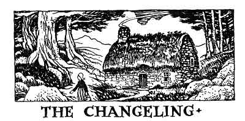

  
[Intangible Textual Heritage](../../../index)  [Legends and
Sagas](../../index)  [Celtic](../index)  [Index](index) 
[Previous](ftb09)  [Next](ftb11) 

------------------------------------------------------------------------

[Buy this Book at
Amazon.com](https://www.amazon.com/exec/obidos/ASIN/B0027ISB18/internetsacredte)

------------------------------------------------------------------------

  
*Folk Tales of Brittany*, by Elsie Masson, \[1929\], at Intangible
Textual Heritage

------------------------------------------------------------------------

p. 95

# THE CHANGELING

p. 96

  [  
Click to enlarge](img/09600.jpg)  
Mariannik and little Loik  

p. 97

 

|                     |
|---------------------|
|  |

ARIANNIK and her husband lived in a thatched cottage. It was hidden in a
lonely heath like a bird's nest in a tree. In the summer the thatch was
covered with flowers and matched the heath itself. in winter it looked
like a rough, furry coat thrown over the cottage's shoulders to keep it
warm.

Within, the cottage danced in firelight. Here was an ancient linen press
on which were carved curious figures. In the corner stood the box bed,
its sliding doors cut in fanciful lace patterns. The chest, the table,
and the benches were polished till they shone in the light from the
burning logs. Near the fireplace was the cradle, also of carved wood,
and in the cradle was Mariannik's and her husband's treasure, the
darling of the cottage, Loik, their little son.

One day Loik was sleeping peacefully, the fire was crackling merrily,
and the cat seated on the warm hearthstone

p. 98

was purring and washing her face. Mariannik got up and looked out of the
window.

"The sun is shining now," she said, "but I know it is going to rain,
because pussy is washing behind her ears; that is a sure sign. I'll go
and fetch a bucket of water before the rain muddies the spring."

She kissed Loik and set out for the fountain where she filled her
bucket. As she was coming back she saw a tiny, crested bird singing on a
hawthorn bush, and this is what he sang:

"Mariannik, be quick, be quick,  
For in the cradle is no Loik."

"You silly bird!" exclaimed Mariannik, "Loik cannot walk," but all the
same with a flutter at her heart she hurried across the heath to the
cottage.

She opened the door and felt at once that something terrible had
happened. The fire had gone out. The cat's back was bristling. She
hastened to the cradle where, instead of seeing Loik's round and rosy
face, Oh, lack-a-day! she beheld a hideous dwarf with a dark and spotted
face. He had a huge and gaping mouth; his hands and feet were evil,
threatening, jagged claws.

"Merciful heavens!" cried Mariannik. "Who, are you? What have you done
with my blessed child?"

The dwarf answered never a word, but grinned a wicked grin.

p. 99

When Mariannik's husband came in from the fields he found her weeping,
the baby gone, the dwarf howling, the cat spitting, and the cottage
cold.

They took counsel together and decided that Mariannik must go back to
the hawthorn bush where the bird had sung to her.

So back she went and when she got there, sure enough, there sat the
crested bird perched on a swinging twig.

"Little bird, little bird," cried Mariannik, "my Loik is lost, and a
wicked dwarf is in his cradle. Pray tell me what to do."

"Mariannik, Mariannik," chirped the little bird, "your Loik is not lost,
he has been stolen by the Queen of the Dwarfs. Before he can be rescued
you must make the changeling speak. Now mark well what I say. Go home
and in an eggshell prepare a meal for ten strong ploughmen. Then will
the dwarf demand of you what you are doing. Quickly, Mariannik, seize
him and beat him with all your strength. Beat him till he screams for
help. His mother, the Queen of the Dwarfs, will come and give you back
your Loik."

So Mariannik hurried to the cottage, and without a word she took an
eggshell and in it began to prepare a meal for ten strong ploughmen.

"What are you doing, mother, what are you doing? shrieked the ugly
dwarf, sitting upright in the cradle.

p. 100

"What am I doing, hideous creature, what am I doing? I am preparing a
meal for ten ploughmen in an eggshell."

"A meal for ten ploughmen in an eggshell, mother? I saw the egg before I
saw the white hen. I saw the acorn before I saw the oak tree. I saw the
tree in the enchanted woods, but I never saw a sight such as this."

"You have seen too many things, thou hideous one. Thou son of evil, I
have you now!" And Mariannik beat him with all the power of her arm.

"Help! help!" screeched the creature, calling for his mother, the Queen
of all the Dwarfs.

"Mariannik, Mariannik! Forbear from beating of my son," cried a shrill,
excited voice. "Behold I give you Loik!"

Breathless, Mariannik stopped. The yells had ceased. She looked at the
cradle in amazement. The ugly dwarf had disappeared and Loik, her
beloved child Loik, was there again. As Mariannik bent over him to kiss
him he stretched out his arms to her and said:

"Mother, mother, dear little mother, what a long sleep I have had."

------------------------------------------------------------------------

[Next: The Foster Brother](ftb11)
