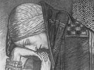

  
[Intangible Textual Heritage](../../../index)  [Sagas and
Legends](../../index)  [Celtic](../index)  [Index](index) 
[Previous](gafm83)  [Next](gafm85) 

------------------------------------------------------------------------

[Buy this Book at
Amazon.com](https://www.amazon.com/exec/obidos/ASIN/B002BH3EVC/internetsacredte)

------------------------------------------------------------------------

  
*Gods and Fighting Men*, by Lady Gregory, \[1904\], at Intangible
Textual Heritage

------------------------------------------------------------------------

# Part II Book X: The Death of Bran

ONE day Finn was hunting, and Bran went following after a fawn. And they
were coming towards Finn, and the fawn called out, and it said: "If I go
into the sea below I will never come back again; and if I go up into the
air above me, it will not save me from Bran." For Bran would overtake
the wild geese, she was that swift.

"Go out through my legs," said Finn then. So the fawn did that, and Bran
followed her; and as Bran went under him, Finn squeezed his two knees on
her, that she died on the moment.

And there was great grief on him after that, and he cried tears down the
same as he did when Osgar died.

And some said it was Finn's mother the fawn was, and that it was to save
his mother he killed Bran. But that is not likely, for his mother was
beautiful Muirne, daughter of Tadg, son of Nuada of the Tuatha de
Danaan, and it was never heard that she was changed into a fawn. It is
more likely it was Oisin's mother was in it.

But some say Bran and Sceolan are still seen to start at night out of
the thicket on the hill of Almhuin.

------------------------------------------------------------------------

[Next: Part II Book X: The Call of Oisin](gafm85)
