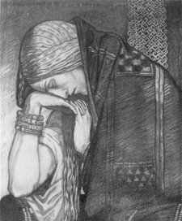

  
[Intangible Textual Heritage](../../../index)  [Sagas and
Legends](../../index)  [Celtic](../index) 

------------------------------------------------------------------------

[Buy this Book at
Amazon.com](https://www.amazon.com/exec/obidos/ASIN/B002BH3EVC/internetsacredte)

------------------------------------------------------------------------

<table width="75%">
<colgroup>
<col style="width: 50%" />
<col style="width: 50%" />
</colgroup>
<tbody>
<tr class="odd">
<td width="50%" data-valign="TOP"> 
Deidre of the Sorrows, by John Duncan</td>
<td width="50%" data-valign="CENTER"><h1 id="gods-and-fighting-men" data-align="CENTER">Gods and Fighting Men</h1>
<h4 id="the-story-of-the-tuatha-de-danaan-and-of-the-fianna-of-ireland" data-align="CENTER">The Story of the Tuatha De Danaan and of the Fianna of Ireland,</h4>
<h2 id="by-lady-augusta-gregory" data-align="CENTER">by Lady Augusta Gregory</h2>
<h4 id="section" data-align="CENTER">[1904]</h4></td>
</tr>
</tbody>
</table>

------------------------------------------------------------------------

[Contents](#contents)    [Start Reading](gafm00)    [Text
\[Zipped\]](gafm.txt.gz)

------------------------------------------------------------------------

|                                                                                                                           |
|---------------------------------------------------------------------------------------------------------------------------|
|  |

This is Lady Augusta Gregory's retelling of the first and third cycles
of the mythic history of Ireland: the Mythological and the Fenian. Yeats
wrote that "I think this book is the best that has come out of Ireland
in my time."--J.B. Hare

------------------------------------------------------------------------

 [Title Page](gafm00)  
[Dedication](gafm01)  
[Preface by W B Yeats](gafm02)  

### Part I

[Part I Book I: Fight with the Firbolgs](gafm03)  
[Part I Book I: Reign of Bres](gafm04)  
[Part I Book II: The Coming of Lugh](gafm05)  
[Part I Book II: The Sons of Tuireann](gafm06)  
[Part I Book III: The Great Battle of Magh Tuireadh](gafm07)  
[Part I Book II: Hidden House of Lugh](gafm08)  
[Part I Book III: The Landing](gafm09)  
[Part I Book III: The Battle of Tailltin](gafm10)  
[Part I Book IV: Bodb Deag](gafm11)  
[Part I Book IV: The Dagda](gafm12)  
[Part I Book IV: Angus Og](gafm13)  
[Part I Book IV: The Morrigu](gafm14)  
[Part I Book IV: Aine](gafm15)  
[Part I Book IV: Aoibhell](gafm16)  
[Part I Book IV: Midhir and Etain](gafm17)  
[Part I Book IV: Manannan](gafm18)  
[Part I Book IV: Manannan at Play](gafm19)  
[Part I Book IV: His Call to Bran](gafm20)  
[Part I Book IV: His Three Calls to Cormac](gafm21)  
[Part I Book IV: Cliodna's Wave](gafm22)  
[Part I Book IV: Call to Connla](gafm23)  
[Part I Book IV: Tadg in Manannan's Islands](gafm24)  
[Part I Book IV: Laegaire in the Happy Plain](gafm25)  
[Part I Book V: Fate of the Children of Lir](gafm26)  

### Part II

[Part II Book I: The Coming of Finn](gafm27)  
[Part II Book I: Finns Household](gafm28)  
[Part II Book I: Birth of Bran](gafm29)  
[Part II Book I: Oisin's Mother](gafm30)  
[Part II Book I: The Best Men of the Fianna](gafm31)  
[Part II Book II: The Lad of the Skins](gafm32)  
[Part II Book II: Black, Brown, and Grey](gafm33)  
[Part II Book II: The Hound](gafm34)  
[Part II Book II: Red Ridge](gafm35)  
[Part II Book III: The Enemies of Ireland](gafm36)  
[Part II Book III: Cael and Credhe](gafm37)  
[Part II Book III: Conn Crither](gafm38)  
[Part II Book III: Glas Son of Dremen](gafm39)  
[Part II Book III: Help of the Men of Dea](gafm40)  
[Part II Book III: The March of the Fianna](gafm41)  
[Part II Book III: The First Fighters](gafm42)  
[Part II Book III: The King of Ulsters Son](gafm43)  
[Part II Book III: The High King's Son](gafm44)  
[Part II Book III: The King of Lochlann and his Sons](gafm45)  
[Part II Book III: Labran's Journey](gafm46)  
[Part II Book III: The Great Fight](gafm47)  
[Part II Book III: Credhe's Lament](gafm48)  
[Part II Book IV: King of Britains Son](gafm49)  
[Part II Book IV: Cave of Ceiscoran](gafm50)  
[Part II Book IV: Donn, Son of Midhir](gafm51)  
[Part II Book IV: Hospitality of Cuanna's House](gafm52)  
[Part II Book IV: Cats Heads and Dog Heads](gafm53)  
[Part II Book IV: Lomna's Head](gafm54)  
[Part II Book IV: Illbrec of Ess Ruadh](gafm55)  
[Part II Book IV: The Cave of Cruachan](gafm56)  
[Part II Book IV: The Wedding at Ceann Slieve](gafm57)  
[Part II Book IV: The Shadowy One](gafm58)  
[Part II Book IV: Finn's Madness](gafm59)  
[Part II Book IV: The Red Woman](gafm60)  
[Part II Book IV: Finn and the Phantoms](gafm61)  
[Part II Book IV: The Pigs of Angus](gafm62)  
[Part II Book IV: The Hunt of Slieve Cuilinn](gafm63)  
[Part II Book V: Oisin's Children](gafm64)  
[Part II Book VI: Birth of Diarmuid](gafm65)  
[Part II Book VI: How Diarmuid Got His Love-Spot](gafm66)  
[Part II Book VI: The Daughter of King Under-Wave](gafm67)  
[Part II Book VI: The Hard Servant](gafm68)  
[Part II Book VI: The House of the Quicken Trees](gafm69)  
[Part II Book VII: The Flight from Teamhair](gafm70)  
[Part II Book VII: The Pursuit](gafm71)  
[Part II Book VII: The Green Champions](gafm72)  
[Part II Book VII: The Wood of Dubhros](gafm73)  
[Part II Book VII: The Quarrel](gafm74)  
[Part II Book VII: The Wanderers](gafm75)  
[Part II Book VII: Fighting and Peace](gafm76)  
[Part II Book VII: The Boar of Beinn Gulbain](gafm77)  
[Part II Book VIII: Tailc, Son of Treon](gafm78)  
[Part II Book VIII: Meargach's Wife](gafm79)  
[Part II Book VIII: Ailne's Revenge](gafm80)  
[Part II Book IX: The Quarrel with the Sons of Morna](gafm81)  
[Part II Book IX: Death of Goll](gafm82)  
[Part II Book IX: The Battle of Gabhra](gafm83)  
[Part II Book X: The Death of Bran](gafm84)  
[Part II Book X: The Call of Oisin](gafm85)  
[Part II Book X: The Last of the Great Men](gafm86)  
[Part II Book XI: Oisin's Story](gafm87)  
[Part II Book XI: Oisin in Patrick's House](gafm88)  
[Part II Book XI: The Arguments](gafm89)  
[Part II Book XI: Oisin's Lament](gafm90)  
[Notes](gafm91)  
[Pronunciation and Place Names](gafm92)  
