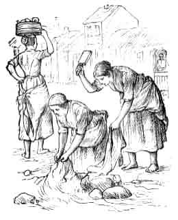

  
[Intangible Textual Heritage](../../../index)  [Sagas and
Legends](../../index)  [Celtic](../index) 

------------------------------------------------------------------------

<table width="75%">
<colgroup>
<col style="width: 50%" />
<col style="width: 50%" />
</colgroup>
<tbody>
<tr class="odd">
<td width="50%" data-valign="TOP"> 
</td>
<td width="50%" data-valign="TOP"><h1 id="the-irish-sketch-book" data-align="CENTER">The Irish Sketch-book</h1>
<h2 id="by-william-makepeace-thackeray" data-align="CENTER">by William Makepeace Thackeray</h2>
<h4 id="section" data-align="CENTER">[1845]</h4></td>
</tr>
</tbody>
</table>

------------------------------------------------------------------------

[Title Page](isb00)  
[A Summer Day in Dublin or there and thereabouts](isb01)  
[A Country-house in Kildare--sketches of an Irish family and
farm](isb02)  
[From Carlow to Waterford](isb03)  
[From Waterford to Cork](isb04)  
[Cork--the Agricultural Show--Father Mathew](isb05)  
[Cork--The Ursuline Convent](isb06)  
[Cork](isb07)  
[From Cork to Bantry; with an account of the city of
Skibbereen](isb08)  
[Rainy Days at Glengariff.](isb09)  
[From Glengariff to Killarney](isb10)  
[Killarney--Stag-hunting on the Lake.](isb11)  
[Killarney--The Races--Muckross](isb12)  
[Tralee--Listowel--Tarbert](isb13)  
[Limerick](isb14)  
[Galway--Kilroy's Hotel--Galway Nights' Entertainments--First Night: An
evening with Captain Kenny](isb15)  
[More rain in Galway--A walk there--and the second Galway Night's
Entertainment](isb16)  
[From Galway to Ballinahinch](isb17)  
[Roundstone Petty Sessions](isb18)  
[Clifden to Westport](isb19)  
[Westport](isb20)  
[The Pattern at Croaghpatrick](isb21)  
[From Westport to Ballinasloe](isb22)  
[Ballinasloe to Dublin](isb23)  
[Two Days in Wicklow](isb24)  
[Country Meetings in Kildare--Meath--Drogheda.](isb25)  
[Dundalk](isb26)  
[Newry, Armagh, Belfast--from Dundalk to Newry](isb27)  
[Belfast to the Causeway](isb28)  
[The Giant's Causeway--Coleraine--Portrush](isb29)  
[Peg of Limavaddy](isb30)  
[Templemoyle--Derry](isb31)  
[Dublin At Last](isb32)  
