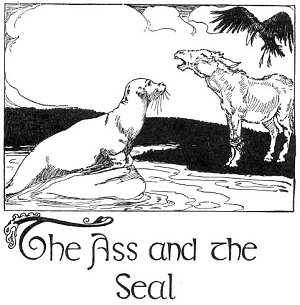

  
[Intangible Textual Heritage](../../../index)  [Sagas and
Legends](../../index)  [Celtic](../index)  [Index](index) 
[Previous](kis09)  [Next](kis11) 

------------------------------------------------------------------------

The Ass and the Seal

X

 

A seal that had spent a curious fore-noon paddling around the island of
Ilaun-Beg drew itself up on a rock the better to carry on its
investigations. It was now within five yards of the actual island. On
the little beach there were three curraghs in which the island-men went
over the sea; they were turnedbottom up and heavy stones were placed
upon them to prevent their being carried away by the high winds. The
seal noted them as he rested upon the flat rock. He noted too a little
ass that was standing beyond the curraghs, sheltering himself where the
cliffs hollowed in.

Now this ass was as curious as the seal, and when he saw the smooth
creature that was moving its head about with such intelligence he came
down to the water's edge. Two of his legs were spancelled with a piece
of straw rope, but being used to such impediment he came over without
any awkwardness. He looked inquiringly at the seal.

The gray-headed crow of the cliff lighted on a spar of rock and made
herself an interpreter between the two. "Shaggy beast of the Island,"
said the seal, "friend and follower of men, tell me about their fabulous
existence."

"Do you mean the hay-getters?" said the ass.

"You know well whom he means," said the gray-headed crow viciously.
"Answer him now."

"You gravell me entirely when you ask about men," said the ass. "I don't
know much about them. They live to themselves and I live to myself.
Their houses are full of smoke and it blinds my eyes to go in. There
used to be green fields here and high grass that became hay, but there's
nothing like that now. I think men have given up eating what grows out
of the ground. I see nothing, I smell nothing, but fish, fish, fish."

The gray-headed crow had a vicious eye fixed on the ass all the time he
was speaking. "You're saying all that," said she, "because they let the
little horse stay all night in the house and beat you out of it."

"My friend," said the seal, "it is evident that men deceive you by
appearances. I know men. I have followed their boats and have listened
to the wonderful sounds they make with their voices and with
instruments. Do they not draw fish out of the depths by enchantments? Do
they not build their habitations with music? Do they not draw the moon
out of the sea and set it for a light in their houses? And is it not
known that the fairest daughters of the sea have loved men?"

"When I'm awake long o' moonlit nights I feel like that myself," said
the ass. Then the recollections of these long, frosty nights made him
yawn. Then he brayed.

"What it is to live near men," said the seal in admiration. "What
wonderful sounds!"

"I'd cross the water and rub noses with you," said the ass, "only I'm
afraid of crocodiles."

"Crocodiles?" said the gray-headed crow.

"Yes," said the ass. "It's because I'm of a very old family, you know.
They were Egyptians. My people never liked to cross water in their own
country. There were crocodiles there."

"I don't want to waste any more time listening to nonsense," said the
gray-headed crow. She flew to the ass's back and plucked out some of the
felt. "I'll take this for my own habitation," she said, and flew back to
the cliff.

The ass would have kicked up his heels only two of his legs were
fastened with the straw rope. He turned away, and without a word of
farewell to the seal went scrambling up the bank of the island.

The seal stayed for a while moving his head about intelligently. Then he
slipped into the water and paddled off. "One feels their lives in
music," he said; "great tones vibrate round the island where men live.
It is very wonderful."

"That," said the King's Son, "is the first story in 'The Breastplate of
Instruction,'--'The Ass and the Seal.' And now you must tell me a story
while we are crossing the field of blue flowers."

"Then it will be a very little story," said Fedelma. They crossed a
little field of blue flowers, and Fedelma told

------------------------------------------------------------------------

[Next: Part XI: The Sending of the Crystal Egg](kis11)
