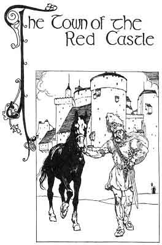
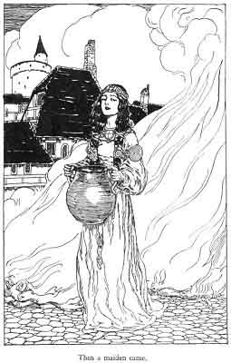

  
[Intangible Textual Heritage](../../../index)  [Sagas and
Legends](../../index)  [Celtic](../index)  [Index](index) 
[Previous](kis37)  [Next](kis39) 

------------------------------------------------------------------------

The Town of the Red Castle

 

Flann was the name that the Old Woman of Beare gave to Gilly of the
Goatskin when he came back to tell her that the Swan of Endless Tales
had been hatched out of the Crystal Egg. He went from her house then and
came to where the King of Ireland's Son waited for him. The two comrades
went along a well-traveled road. As they went on they fell in with men
driving herds of ponies, men carrying packs on their backs, men with
tools for working gold and silver, bronze and iron. Every man whom they
asked said, "We are going to the Town of the Red Castle, and to the
great fair that will be held there." The King's Son and Flann thought
they should go to the Town of the Red Castle too, for where so many
people would be, there was a chance of hearing what went before and what
came after the Unique Tale. So they went on.

And when they had come to a well that was under a great rock those whom
they were with halted. They said it was the custom for the merchants and
sellers to wait there for a day and to go into the Town of the Red
Castle the day following. "On this day," they said, "the people of the
Town celebrate the Festival of Midsummer, and they do not like a great
company of people to go into their Town until the Festival is over.

" The King of Ireland's Son and Flann went on, and they were let into
the town. The people had lighted great fires in their market-place and
they were driving their cattle through the fires: "If there be evil on
you, may it burn, may it burn," they were crying. They were afraid that
witches and enchanters might come into the town with the merchants and
the sellers, and that was the reason they did not permit a great company
to enter.

The fires in all their houses had been quenched that day, and they might
not be lighted except from the fires the cattle had gone through. The
fires were left blazing high and the King's Son and Flann spent hours
watching them, and watching the crowds that were around.

Then the time came to take fire to the houses. They who came for fire
were all young maidens. Each came into the light of one of the great
fires, took coals from a fire that had burnt low, placed them in a new
earthen vessel and went away. Flann thought that all the maidens were
beautiful and wonderful, although the King's Son told him that some were
black-faced, and some crop- headed and some hunchbacked. Then a maiden
came, who was so high above the rest that Flann had no words to speak of
her.

 

She had silver on her head and silver on her arms, and the people around
the fires all bowed to her. She had black, black hair and she had a
smiling face--not happily smiling, but proudly smiling. Flann thought
that a star had bent down with her. And when she had taken the fire and
had gone away, Flann said, "She is surely the King's daughter!"

"She is," said the King of Ireland's Son. "The people here have spoken
her name." "What is her name?" asked Flann. "It is Lassarina," said the
King's Son, "Flame-of-Wine."

"Shall we see her again?" said Flann.

"That I do not know," said the King's Son. "Come now, and let us ask the
people here if they have knowledge of the Unique Tale."

"Wait," said Flann, "they are talking about Princess Flame-of-Wine." He
did not move, but listened to what was said. All said that the King's
daughter was proud. Some said she was beautiful, but others answered
that her lips were thin, and her eyes were mocking. No other maidens
came for fire. Flann stood before the one that still blazed, and thought
and thought. The King's Son asked many if they had knowledge of the
Unique Tale, but no one had heard of it. Some told him that there would
be merchants and sellers from many parts of the world at the fair that
would be held on the morrow, and that there would be a chance of meeting
one who had knowledge of it. Then the King's Son went with one who
brought him to a Brufir's--that is, to a House of Hospitality maintained
by the King for strangers. As for Flann, he sat looking into the fire
until it died down, and then he slept before it.

------------------------------------------------------------------------

[Next: Part II](kis39)
