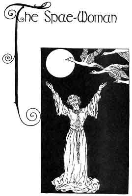

  
[Intangible Textual Heritage](../../../index)  [Sagas and
Legends](../../index)  [Celtic](../index)  [Index](index) 
[Previous](kis58)  [Next](kis60) 

------------------------------------------------------------------------

The Spae-Woman

 

I

There are many things to tell you still, my kind foster-child, but
little time have I to tell you them, for the barnacle-geese are flying
over the house, and when they have all flown by I shall have no more to
say. And I have to tell you yet how the King of Ireland's Son won home
with Fedelma, the Enchanter's daughter, and how it came to pass that the
Seven Wild Geese that were Caintigern's brothers were disenchanted and
became men again. But above all I have to tell you the end of that story
that was begun in the house of the Giant Crom Duv--the story of Flann
and Morag.

The barnacle-geese are flying over the house as I said. And so they were
crossing and flying on the night the King of Ireland's Son and Fedelma
whom he had brought from the Land of Mist stayed in the house of the
Little Sage of the Mountain. On that night the Little Sage told them
from what bird had come the wing that thatched his house. That was a
wonderful story. And he told them too about the next place they should
go to--the Spae-woman's house. There, he said he would find people that
they knew--Flann, the King's Son's comrade, and Caintigern, the wife of
the King of Ireland, and Fedelma's sister, Gilveen.

In the morning the Little Sage of the Mountain took them down the
hillside to the place where Fedelma and the King's Son would get a horse
to ride to the Spae-Woman's house. The Little Sage told them from what
people the Spae-Woman came and why she lived amongst the poor and
foolish without name or splendor or riches. And that, too, was a
wonderful story.

 

Now as the three went along the river-side they saw a girl on the other
side of the river and she was walking from the place towards which they
were going. The girl sang to herself as she went along, and the King's
Son and Fedelma and the Little Sage of the Mountain heard what she
sang,--

A berry, a berry, a red rowan berry,  
A red rowan berry brought mc beauty and love.

But drops of my heart's blood, drops of my heart's blood,  
Seven drops of my heart's blood I have given away.

Seven wild geese were men, seven wild geese were men,  
Seven drops of my heart's blood are there for your spell.

A kiss for my love, a kiss for my love,  
May his kiss go to none till he meet me again.

If to one go his kiss, if to one go his kiss,  
He may meet, he may meet, and not know me again.

The girl on the other bank of the river passed on, and the King's Son
and Fedelma with the Little Sage of the Mountain came to the meadow
where the horse was. A heavy, slow-moving horse he seemed. But when they
mounted him they found he had the three qualities of Finn's steeds--a
quick rush against a hill, the gait of a fox, easy and proud, on the
level ground, and the jump of a deer over harriers. They left health and
good luck with the Little Sage of the Mountain, and on the horse he gave
them they rode on to the Spae-Woman's house.

------------------------------------------------------------------------

[Next: Part II](kis60)
