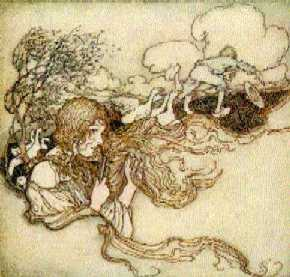

  
[Intangible Textual Heritage](../../../index)  [Sagas and
Legends](../../index)  [Celtic](../index) 

------------------------------------------------------------------------

<table width="75%">
<colgroup>
<col style="width: 50%" />
<col style="width: 50%" />
</colgroup>
<tbody>
<tr class="odd">
<td width="50%" data-valign="TOP"></td>
<td width="50%" data-valign="TOP"><h1 id="legendary-fictions-of-the-irish-celts" data-align="CENTER">Legendary Fictions of the Irish Celts</h1>
<h2 id="by-patrick-kennedy" data-align="CENTER">by Patrick Kennedy</h2>
<h4 id="section" data-align="CENTER">[1891]</h4></td>
</tr>
</tbody>
</table>

------------------------------------------------------------------------

[Title Page](lfic000)  
[Preface](lfic001)  
[Dedication](lfic002)  
[Household Stories](lfic003)  
[Jac and His Comrades](lfic004)  
[The Bad Stepmother](lfic005)  
[Adventures of Gilla na Chreck an Gour](lfic006)  
[Jack the Master and Jack the Servant](lfic007)  
[I'll be Wiser the next Time](lfic008)  
[The Three Crowns](lfic009)  
[The Corpse Watchers](lfic010)  
[The Brown Bear of Norway](lfic011)  
[The Goban Saor](lfic012)  
[The Three Advices which the King with the Red Soles gave to his
Son](lfic013)  
[Legends of the 'Good People'](lfic014)  
[The Fairy Child](lfic015)  
[The Changeling and his Bagpipes](lfic016)  
[The Tobinstown Sheeoge](lfic017)  
[The Belated Priest](lfic018)  
[The Palace in the Rath](lfic019)  
[The Breton Version of the Palace in the Rath](lfic020)  
[The Fairy Nurse](lfic021)  
[The Recovered Bride](lfic022)  
[Faction-fight among the Fairies](lfic023)  
[Jemmy Doyle in the Fairy Palace](lfic024)  
[The Fairy Cure](lfic025)  
[The Sea Fairies](lfic026)  
[The Black Cattle of Durzy Island](lfic027)  
[The Silkie Wife](lfic028)  
[The Pooka of Murroe](lfic029)  
[The Kildare Pooka](lfic030)  
[The Kildare Lurikeen](lfic031)  
[The Adventures of the 'Son of Bad Counsel'](lfic032)  
[Witchcaft, Socery, Ghosts and Fetches](lfic033)  
[The Long Spoon](lfic034)  
[The Prophet before his Time](lfic035)  
[The Bewitched Churn](lfic036)  
[The Ghosts and the Game of Football](lfic037)  
[The Cat of the Carman's Stage](lfic038)  
[Cauth Morisy looking for Service](lfic039)  
[Black Stairs on Fire](lfic040)  
[The Witches Excursion](lfic041)  
[The Crock found in the Rath](lfic042)  
[The Enchantment of Gearhoidh Iarla](lfic043)  
[Illan Eachtach and the Lianan](lfic044)  
[The Misfortunes of Barrett the Piper](lfic045)  
[The Woman in White](lfic046)  
[The Queen's County Ghost](lfic047)  
[The Ghost in Graigue](lfic048)  
[Droochan's Ghost](lfic049)  
[The Kiranelagh Spirit](lfic050)  
[The Doctor's Fetch](lfic051)  
[The Apparition in Old Ross](lfic052)  
[Ossianic and Early Legends](lfic053)  
[Fann Mac Cuil and the Scotch Giant](lfic054)  
[How Fann Mac Cuil and his Men were Bewitched](lfic055)  
[Qualifications and Duties of the Fianna Eirionn](lfic056)  
[The Battle of Ventry Harbour](lfic057)  
[The Fight of Castle Knoc](lfic058)  
[The Youth of Fion](lfic059)  
[Fion's First Marriage](lfic060)  
[How Fion selected a Wife](lfic061)  
[Pursuit of Diarmuid and Grainne](lfic062)  
[The Flight of the Sluggard](lfic063)  
[Beanriogain na Sciana Breaca](lfic064)  
[Conan's Delusions in Ceash](lfic065)  
[The Youth of Oisin](lfic066)  
[The Old Age of Oisin](lfic067)  
[Legend of Loch na Piasta](lfic068)  
[The King with the Horse's Ears](lfic069)  
[The Story of the Sculloge's Son from Muskerry](lfic070)  
[Fios Fath an Aaon Sceil](lfic071)  
[An Broan Suan Or](lfic072)  
[The Children of Lir](lfic073)  
[Lough Neagh](lfic074)  
[Killarney](lfic075)  
[Legend of the Lake of Inchiquin](lfic076)  
[How the Shannon acquired its Name](lfic077)  
[The Origin of the Lake of Tiis](lfic078)  
[The Building of Ardfert Cathredral](lfic079)  
[How Donaghedee got its Name](lfic080)  
[The Borrowed Lake](lfic081)  
[Kilstoheen in the Shannon](lfic082)  
[The Isle of the Living](lfic083)  
[Fionnutuin Mac Bochna](lfic084)  
[The Firbolgs and Danaans](lfic085)  
[Inis na Muic](lfic086)  
[The Bath of the White Cows](lfic087)  
[The Quest for the Tain-Bo-Cuilagne](lfic088)  
[The Progress of the Wicked Bard](lfic089)  
[Legends of the Celtic Saints](lfic090)  
[St Patrick](lfic091)  
[How St Patrick received the Staff of Jesus](lfic092)  
[The Fortune of Dichu](lfic093)  
[St Patrick's Contest with the Druids](lfic094)  
[The Baptism of Aongus](lfic095)  
[The Decision of the Chariot](lfic096)  
[Conversion of the Robber Chief, Macaldus](lfic097)  
[Baptism after Death](lfic098)  
[The Vision of St Brigid](lfic099)  
[Death and Burial of St Patrick](lfic100)  
[The Corpse-freighted Barque](lfic101)  
[St Brigid's Cloak](lfic102)  
[St Brigid and the Harps](lfic103)  
[Arran of the Saints and its Patrons](lfic104)  
[St Feancheas's Visit to Arran](lfic105)  
[St Brendain's Voyage](lfic106)  
[The Island of the Birds](lfic107)  
[The Sinner Saved](lfic108)  
[A Legend of St Mogue of Ferns](lfic109)  
[O' Carroll's Warning](lfic110)  
[How St Eloi was cured of Pride](lfic111)  
[St Lateerin of Cullin](lfic112)  
