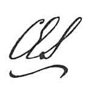

  
[Intangible Textual Heritage](../../../index)  [Legends and
Sagas](../../index)  [Celtic](../index)  [Index](index) 
[Previous](mab01)  [Next](mab03) 

------------------------------------------------------------------------

[Buy this Book at
Amazon.com](https://www.amazon.com/exec/obidos/ASIN/B001W0Z8PY/internetsacredte)

------------------------------------------------------------------------

  
*The Mabinogion*, tr. by Lady Charlotte Guest, \[1877\], at Intangible
Textual Heritage

------------------------------------------------------------------------

p. vii

# PREFACE TO THE SECOND EDITION.

THE Arthurian Legends have at all times furnished a congenial subject to
the students of Romance; and in the eight-and-thirty years which have
elapsed since the first part of this Translation appeared, my
"Mabinogion" have found their way into the hands of the learned both
among ourselves and on the Continent.

More recently, however, the publication of the "Idyls of the King"--and
among them of "Enid," which is founded on my version of "Geraint"--has
interested a much wider circle of readers in the Legends, and there has
arisen a demand for a new and more popular edition of my work, which it
is the object of the present issue to supply.

It will be found to differ from its predecessor in the omission of the
Welsh text, of all Welsh quotations in the Notes, and of the French
Metrical Romance of the "Chevalier au Lion." The notices relating to the
corresponding versions of the Tales in other European languages have
also been condensed.

p. viii

It is, then, under these altered conditions, and in the absence of all
means of comparison on their part, that I ask my new readers to believe
that I have striven to preserve in Saxon English the primitive
simplicity of the Welsh original.

To these remarks it only remains for me to add, that the text of the
Mabinogion exists in the Llyfr Coch o Hergest (or Red Book of Hergest)
preserved in the Library of Jesus College, Oxford, and that for the
accurate copy which I used, I was indebted to the learned labours of the
Rev. John Jones (Tegid), Fellow of that College, and to the courtesy of
the late Mr. Justice Bosanquet, for whom the transcript in question was
originally made.

 

LANGHAM HOUSE, LONDON,  
   18*th* *January*, 1877.

------------------------------------------------------------------------

[Next: Contents](mab03)
