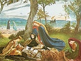

  
[Intangible Textual Heritage](../../../index)  [Legends and
Sagas](../../index)  [Celtic](../index)  [Index](index) 
[Previous](mab07)  [Next](mab09) 

------------------------------------------------------------------------

[Buy this Book at
Amazon.com](https://www.amazon.com/exec/obidos/ASIN/B001W0Z8PY/internetsacredte)

------------------------------------------------------------------------

  
*The Mabinogion*, tr. by Lady Charlotte Guest, \[1877\], at Intangible
Textual Heritage

------------------------------------------------------------------------

p. 67

### NOTE ON THE FOREST OF BRECELIANDE,

###### AND THE

### FOUNTAIN OF BARANTON.

THE Forest of Brécéliande, in Brittany, the scene of the leading
incident in the Chevalier au Lion, has ever been one of the most
favoured haunts of Romance, and one whose marvels the Trouvères have
most delighted to celebrate. Amongst those whose names have contributed
to add to the renown of this remarkable spot, is the mighty Enchanter,
Merlin, whose prison it became through the artifices of his Lady love.
The manner of his being incarcerated there is very circumstantially
detailed in the Romance which bears his name, as quoted by Mr. Southey,
in the Preface to the Morte d'Arthur.

Merlin, having become enamoured of the fair Viviane, [1](#fn_17) was weak enough to impart to her various
important secrets of his art, [2](#fn_18) being
impelled by a fatal destiny, of which he was at the same time fully
aware. The Lady, however, was not content with his devotion, unbounded
as it seems to have been, but "cast about," as the Romance tells us, how
she might "detain him for evermore," and with a view of learning some
mode of accomplishing this object, she one day addressed him in these
terms,--"Sir," said she, "I would have you teach and show me how to
enclose and imprison a man

p. 68

without a tower, without walls, without chains, but by enchantment
alone, in such manner that he may never be able to go out, except by
me." Aware of her design, Merlin shook his head, and evinced great
reluctance to comply with her request. But Viviane, "for her great
treason," began to fawn and to flatter him, and used many subtle
arguments to prove that he ought to perform her will, whatever it might
be. So at last he said to her, "Certes, lady, yes, and I will do it;
tell me what you would have." "Sir," said she, "I would that we should
make a fair place and a suitable, so contrived by art and by cunning,
that it might never be undone, and that you and I should be there in joy
and in solace." "My lady," said Merlin, "I will perform all this." "
Sir," said she, "I would not have you do it, but you shall teach me, and
I will do it, and then it will be more to my will." "I grant you this,"
said Merlin. Then he began to devise, and the damsel put it all in
writing. And when he had devised the whole, then had the damsel full
great joy, and showed him greater semblance of loving him than she had
ever before made; and they sojourned together a long while. At length it
fell out that, as they were going one day hand in hand through the
forest of Broceliande, they found a bush of white thorn which was laden
with flowers; and they seated themselves under the shade of this white
thorn upon the green grass, and they disported together and took their
solace, and Merlin laid his head upon the damsel's lap, and then she
began to feel if he were asleep. Then the damsel rose and made a ring
with her wimple round the bush and round Merlin, and began her
enchantments such as he himself had taught her; and nine times she made
the ring, and nine times she made the enchantments; and then she went
and sate down by him, and placed his head again upon her lap; and when
he awoke, and looked round him, it seemed to him that he was enclosed in
the strongest tower in the world, and laid upon a fair bed. Then said he
to the dame, "My

p. 69

lady, you have deceived me unless you abide with me, for no one hath
power to unmake this tower, save you alone." She then promised she would
be often there, and we are told that in this she held her covenant to
him. "And Merlin never went out of that tower where his mistress Viviane
had enclosed him. But she entered and went out again when she listed;
and oftentime she regretted what she had done, for she had thought that
the thing which he taught her could not be true, and willingly would she
have let him out if she could."--(T. 2. f. 134.)

From the same authority, it appears that after this event Merlin was
never more known to hold converse with any mortal but Viviane, except on
one occasion. Arthur having for some time missed him from his Court,
sent several of his Knights in search of him, and among the number Sir
Gawain, who met with a very unpleasant adventure while engaged in this
quest. Happening to pass a damsel on his road, as he journeyed along,
and neglecting to salute her, she revenged herself for his incivility,
by transforming him into a hideous dwarf. He was bewailing aloud his
evil fortune as he went through the Forest of Brécéliande, when
"suddenly he heard the voice of one groaning on his right hand;" and
"looking that way he could see nothing save a kind of smoke which seemed
like air, and through which be could not pass." Merlin then addressed
him from out the smoke, and told him by what misadventure be was
imprisoned there. "Ah, Sir," he added, "you will never see me more, and
that grieves me, but I cannot remedy it; and when you shall have
departed from this place, I shall never more speak to you, nor to any
other person, save only my mistress." And after this he comforted Gawain
under his transformation, assuring him that he should speedily be
disenchanted, and he predicted to him that he should find the King at
Carduel, in Wales, on his return, and that all the other Knights who had
been on the like quest, would arrive there the same day as himself. And
all this came to pass as Merlin had said.--(T. 2. f, 146.) [1](#fn_19)

It is evident that the wonders ascribed by Chrestien de Troyes to

p. 70

the Fountain of Baranton, in this famous Forest, were not the creation
of his own fancy, but were in his time already in no small repute; for
we find his precursor Wace so much impressed with the desire to be an
eye-witness of them, that he actually made a journey to the spot for
that purpose. In his Roman de Rou be relates the whole affair with
admirable naïveté. After adverting to the marvels of the slab, he tells
us, that if what the Bretons say is true, Fairies are often to be seen
sporting on the Fountain's bank; but he very frankly owns that he met
with nothing but disappointment to repay the trouble of his expedition,
and he reproaches himself for his folly in having ever undertaken it.

The passage is brought in by the mention of the Barons who accompanied
William of Normandy to the conquest of England, some of whom he says
were

              "de verz Brecheliant,  
Dune Bretunz vont sovent fablant,  
Une forest mult lunge è lée,  
Ki en Bretaigne est mult loée;  
La Fontaine de Berenton  
Sort d'une part lez le perron;  
Aler i solent venéor  
A Berenton par grant chalor,  
Et o lor cors l'ewe puisier  
Et li perron de suz moillier,  
Por ço soleient pluée aveir;  
Issi soleit jadis pluveir  
En la forest tut envirun,  
Maiz jo ne sai par kel raisun.  
Là solt l'en li fées véir,  
Se li Bretunz disent veir,  
Et altres merveilles plusors;  
Aigres solt avéir destors  
E de granz cers mult grant plenté,  
Maiz li vilain ont deserté.  
Là alai jo merveilles querre,  
Vis la forest è vis la terre; p. 71  
Merveilles quis, maiz nes' trovai;  
Fol m'en revins, fol i alai,  
Fol i alai, fol m'en revins,  
Folie quis, per fol me tins."--v. 11514-11539.  
                Roman de Rou, publié par F. Pluquet.  
                  Rouen, 1827--ii. 143, 4.

Huon de Méry, a subsequent trouvère, set out on a similar errand, and
was either more fortunate, or less ingenuous than Wace. One cannot help
suspecting him of reckoning rather largely upon the credulity of his
readers, in the narrative he gives of his journey however, he shall tell
his story in his own words.

Being one of those who accompanied an expedition made by the "Rois Loeys
en Bretaingne," he considered the opportunity thus afforded him of
visiting its Forest of wonders too tempting to be overlooked.

"Por çou que n'iert pas mult lontaingne  
La forès de Brecéliande,  
Mes cuers ki souvent me commande  
Faire autre cose ke mon preu,  
Me fist faire, aussi comme veu,  
Ke ge en Brecéliande iroie,  
Ge m'en tornai et pris ma voie  
Vers la forest, sans plus atendre,  
Kar la Vreté voloie aprendre  
De la périlleuse fontaine,  
Une espée ou ot fer d'Andainne  
Dont lameure n'estoit pas double  
Et un hauberc à maille double  
Portai qui puis m'orent mestier,  
Sans tenir voie ne sentier  
Chevauchai iiij. jours entiers.  
Adonc m'aparut uns sentiers  
Qui par une gaste lande,  
Me mena en Brecéliande,  
Mult est espesse et oscure,  
En la forest par aventure  
Perdi le sens de mon sentier,  
Car li solaus s'aloit couchier,  
Qui avoit faite sa journée.  
Mais la clartés est ajornée  
De la lune qui lors leva." p. 72  
  \*    \*    \*    \*    \*  
"Cele nuis resambla le jour.  
Sans faire alonge ne séjour,  
Ce fu la quinte nuis de mai;  
La fontainne mult esgardai  
Ke la trouvai par aventure.  
La fontaine n'iert pas oscure  
Ains ert clere com fins argens,  
Mult estoit li praales gens.  
Qui sombroioit de desous l'arbre  
Le bachin, le perron de marbre,  
Et le vert pin et la caière  
Trouvai en icele manière,  
Comme l'a descrit *Crestiens*  
En plus clère eve crestiens . . . .  
Ne sambla pas que ce fust cresme.  
Quant le bachin ting en ma main,  
Car tout aussi le puisai plain  
Com se la vousisse espuisier.  
Quand ge mis la main au puisier,  
Lors vi le firmament doubler.  
Quant oi puisié, lors vi doubler  
Le torment, quant l'eve versai,  
Je qui, tous seus le sai,  
Ne talent n'en ai du mentir,  
Mais le chiel oï desmentir  
Et eselarcir de toutes pars.  
De plus de .vc. mile pars  
Ert la forès enluminée;  
Se tous li chiex ert queminée  
Et tous li mons ardoit ensamble,  
Ne fesist-il pas, ce me samble,  
Tel clarté, ne si grant orage.  
.C. fois maudis en mon corage  
Par cui conseill ting là mon oirre,  
Car à cascun cop de tonnoirre  
La foudre du ciel descendoit  
Qui tronçounoit et porfendoit  
Parmi le bois, caines et fals.  
Or escoutés com ge fui fals  
Et tresperdus et entrepris,  
K'encor plain bachin d'iaue pris p. 73  
Et seur le perron le flasti  
Mais se le ciel ot bien glati  
Et envoiés foudres en terre.  
Lors double la noise et la guerre  
Ke j'oï mené à tout le monde,  
Can del' tounoire à la réonde  
Toute la terre vi tranbler  
Ge cuidai bien que assambler  
Fesist del' chiel et terre ensamble.  
Ce fu folie, ce me samble,  
De .ij. fois le bachin widier,  
Mais ce fu pair mon fol cuidier,  
Car le tans apaisier cuidai  
Quant le secont bachin widai;  
Mais lors perchui que cil qui cuide  
Qu'il a de seus la teste wide.  
  \*    \*    \*    \*    \*  
Lours commencha à aprochier  
Li jours dont l'aube ert ja' venue;  
Joie firent de sa venue  
Trestout li oiseillon menu  
Ke à voleter ai véu  
De par tout Berchéliande.  
En broche, n'en forest, n'en lande  
N'en vit mais nus tant amassés  
Sus le pin en ot plus amassés.  
Ke n'en vit Kalogrinans.  
Et faisoient de divers cans  
Une si douce mélodie  
Ke à ma mort, ni à ma vie,  
Ne kéisse avoir autre gloire.  
Encore, quant me vient en mémoire,  
En mon cuer en ai si grant joie  
Qn'encore me sanlle qu'eus ge oie;  
M'est-il tous vraiement avis  
Que c'est terrestre paradis.  
              Tournoiement Ante-Crist, [1](#fn_20) MS. du Roi,  
                No. 541. S. F. (fol. 72. col. 2. v. 5)

p. 74

The Fairies, who are reported to haunt the Forest of Brécéliande, appear
to have patronized children in an especial manner, and to have delighted
in showering down gifts upon such as were brought there soon after their
birth to receive their benediction. There is extant in the Bibliothèque
du Roi (MS. du Roi, n. 7989--4 Bal.) a fragment of a curious Romance,
named Brun de la Montague, which is founded entirely upon this
circumstance. It is printed in Le Roux de Lincy's Livre des Légendes.
The outline of the story, is as follows:--

Butor de la Montague, on the birth of his infant son, is desirous that
he should receive a Fairy's blessing; and after revolving in his mind
the names of all the "lieux fäes" [1](#fn_21)
with which he is acquainted, he determines on sending him to the haunt
of the Fairies in the "bois Bersillant." The little Brun is accordingly
conveyed thither by a trusty Knight, and placed on the margin of the
enchanted fountain. It is not long before the Fairies [2](#fn_22) appear, and the child is endowed with the
choicest gifts which they have in their power to bestow. One of them,
however, envious of the extreme brightness of his prospects, dooms him
to misfortune and disappointment in love.

On his return to his parents, one of the benevolent Fairies, who had
taken a particular liking to him, disguises herself, and becomes his
nurse. The MS. breaks off abruptly, just as the story of his disastrous
love-adventure is about to commence. [3](#fn_23)

I shall conclude this Note with a description of the state of the

p. 75

famous Forest of Brécéliande, in our own times, from an account of a
visit made to it by the Vicomte de la Villemarqué, and published by him
in the Revue de Paris for May, 1837.

"J'avais tant de fois, dans mon enfance, entendu parler de Merlin, et
lu, dans nos romans de chevalerie bretonne, de si merveilleuses choses
sur son tombeau, la forêt de Brécilien, la fontaine de Baranton, et la
vallée de Concoret, que je fus pris d'un vif désir de visiter ces lieux,
et qu'un beau matin je partis.

"Ploërmel est la ville la plus voisine de Concoret; de là an bourg la
route est longue et difficile; toujours des chemins creux, des
montagnes, des bois, on des landes sans fin."

\*        \*        \*        \*        \*        \*        \*

"La plaine qu'on appelle en breton Concoret, [1](#fn_24) et dans les romans da moyen-âge le
*Val-des-Fées*, est un immense amphithéâtre couronné de bois sombres,
jadis nommés Broc'hallean, [2](#fn_25)
aujourd'hui par corruption Brécilien. A l'une de ses extrémités, coule
une fontaine près de laquelle on voit deux pierres couvertes de mousse
que domine une vieille croix de bois vermoulue; c'est la fontaine de
Barandon et le tombeau de Merlin; là dort, dit-on, le vieux druide, au
murmure des eaux et du vent qui gémit dans les bruyères d'alentour.

"De cette hauteur, l'œil embrasse toute la vallée, et un horizon sans
bornes de bois, de champs remplis de blés on de genets aux fleurs
jaunes, de paroisses et de lointains clochers.

"Brécilien était une de ces fôrets sacrées qu'habitaient les prêtresses
du druidisme dans les Gaules; son nom et celui de sa vallée
l'attesteraient à défaut d'autre témoignage; les noms de lieux sont les
plus sûrs garans des événemens passés."

All the old traditions which give an interest to the Forest continue to
be current there. The Fairies, who are kind to children, are still
reported to be seen in their white apparel upon the banks of the
Fountain; and the Fountain itself (whose waters are now considered
salubrious) is still said to be possessed of its marvellous
rain-producing properties. In seasons of drought, the inhabitants of the
surrounding parishes go to it in procession, headed by their five great
banners, and their priests, ringing bells and chanting Psalms. On
arriving at the Fountain, the Rector of the Canton dips the foot of the
Cross into its waters, and it is sure to rain before a week elapses.

p. 76

The Fountain of Baranton is supplied by a mineral spring, and it bubbles
up on a piece of iron or copper being thrown into it.

"Les enfans s'amusent a y jeter des épingles, et disent par commun
proverbe: '*Ris donc, fontaine de Berendon, et je te donnerai une
épingle*.'" [1](#fn_26)

------------------------------------------------------------------------

### Footnotes

[67:1](mab08.htm#fr_17) This Viviane is said to
be the daughter of a Vavasour of high lineage, called Dyonas, from
Dyane, a goddess of the sea. He married a niece of the Duchess of
Burgundy, with whom he received as a dowry half the Forest of Briogne;
the other half was granted him soon after in reward for his good
services. Under the title of the "Lady of the Lake" Viviane is well
known.

[67:2](mab08.htm#fr_18) Of the nature and extent
of the powers with which Merlin was endowed, Spenser has left us a most
marvellous account.

"For he by wordes could call out of the sky  
Both sunne and moone, and make them him obey;  
The land to sea, and sea to maineland dry,  
And darksom night he eke could turne to day; p.
68

Huge hostes of men he could alone dismay,  
And hostes of men of meanest thinges could frame,  
Whenso him list his enimies to fray:  
That to this day, for terror of his fame,  
The feendes do quake when any him to them does name."  
                                 Faerie Queens, b. iii. c. 3. st. xii.

What wonder is it then that he should elsewhere characterize him as the
being

            "Which whylome did excell  
All living wightes in might of magicke spell."  
Ibid. b. i. c. 7. at. xxxvi.

[69:1](mab08.htm#fr_19) Preface--Morte d'Arthur,
xliii--xlviii.

In the "Prophecies of Merlin," though the result is the same, the
circumstances attending his disappearance are differently related. There
the scene is laid, not in Brécéliande, but in the Forest of Arvantes,
and Merlin's living sepulchre is not a white-thorn bush, but a tomb
which he had constructed for himself, and which Viviane persuaded him to
lie down in, under pretence of trying whether it would be large enough
for her to be buried in it with him. As soon as he had entered it,
Viviane put down the lid, and closed it so effectually, p. 69 by arts which he himself had taught her, that
it never after could be opened.--See Morte d'Arthur, ii. 463-8.

It is this version that Ariosto appears to have followed; but he places
in the South of France, somewhere in the neighbourhood of the Garonne,
the tomb in which

"Col corpo morto il vivo spirto alberga."  
                                     Orlando Furioso, C. iii.

[73:1](mab08.htm#fr_20) Livre des Legendes. Par
le Roux de Lincy. Intro. 230, 4. Paris, 1836.

Huon de Mery was a Monk of St. Germain des Prés, near Paris. He wrote
the Poem above quoted about A.D. 1228. See Warton's History of English
Poetry, ii. 121.

[74:1](mab08.htm#fr_21)

"a des lieux faës ès marches de Champaigne,  
Et ausi en a il en la roche grifaigne,  
Et si croy qu'il en a aussi en Alemaigne,  
Et on bois Bersillant, par desous la montaigne;  
Et non por quant ausi en a il en Espaigne,  
Et tout cil lieu faë sont Artu de Bretaigne."  
                                     Livre des Légendes, 264.

[74:2](mab08.htm#fr_22) The following is the
description given of these Ladies in the Romance;--

Les dames dont je di si estoient faées  
Qui si très noblement estoient asesmées.  
Leur cors furent plus blanc que n'est noif sor gelée,  
Et si très chierement estoient atournées.  
Car de couronnes d'or furent tontes dorées  
Et de blaus dras de soie estoient aournées;  
En mi de la portrine estoient escollées.  
Se uns hom en eust erré .ij. c. mile journées  
Ne fussent point par li trois plus belles trouvées  
Et s'eust conversé en cent mile contrées."  
                                           Liv. des Lég. 267-8.

[74:3](mab08.htm#fr_23) Ibid. 260, 284.

[75:1](mab08.htm#fr_24) "*Kun-kored*, vallée des
druidesses."

[75:2](mab08.htm#fr_25) "Le bois de la Nonne, de
l'Hermite, de la Solitaire."

[76:1](mab08.htm#fr_26) Revue de Paris. Tome 41.
7 Mai, 1837, pp. 47-58, article "*Visite ou Tombeau de Merlin*," par
Théodore de la Villemarqué.

------------------------------------------------------------------------

[Next: Llyn Dulyn in Snowdon](mab09)
