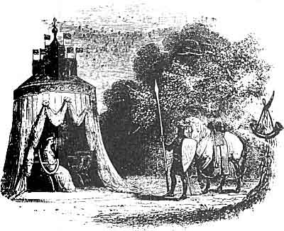

  
[Intangible Textual Heritage](../../../index)  [Legends and
Sagas](../../index)  [Celtic](../index)  [Index](index) 
[Previous](mab13)  [Next](mab15) 

------------------------------------------------------------------------

[Buy this Book at
Amazon.com](https://www.amazon.com/exec/obidos/ASIN/B001W0Z8PY/internetsacredte)

------------------------------------------------------------------------

  
*The Mabinogion*, tr. by Lady Charlotte Guest, \[1877\], at Intangible
Textual Heritage

------------------------------------------------------------------------

p. 185

 

### NOTES TO GERAINT THE SON OF ERBIN.

141a EASTER--CHRISTMAS--WHITSUNTIDE.--*Page*
[141](mab13.htm#page_141).

RITSON, in a note to his "Metrical Romancëes," mentions, that our early
historians, as Roger Hoveden, Matthew Paris, &c., often advert to the
custom of the ancient monarchs of France and England, of holding a cour
plénière, or plenary court, at the three principal
[feasts](errata.htm#2) of Easter, Whitsuntide, and Christmas. On those
occasions "they were attended by the earls and barons of the kingdom,
their ladys and children; who dine'd at the royal table with great pomp
and eclat; minstrels flocking thither from all parts; justs and
tournaments being perform'd, and various other kinds of divertisements,
which lasted several days."--III. 235.

These three principal festivals, or *prif wyl*, "Pasc, Nadolic, a
Sulgwyn," are commemorated as such in one of the Triads, lvii.

 

141b CHURCHES WERE SET APART FOR
MASS.--*Page* [141](mab13.htm#page_141).

IN another part of this work, the word Offeren is rendered *offering*;
but here it has been thought advisable to use the more general term

p. 186

\[paragraph continues\] *Mass*, although
the former seems to correspond best with the language of the day.

Thus Chaucer, in his description of the Wif of Bathe, tells us, that

In all the parish wif ne was ther non,  
That to the *offring* before hire shulde gon,  
And if ther did, certain so wroth was She,  
That she was out of alle charitee."  
                                       Pro. v. 451-4.

 

141c STEWARD OF THE HOUSEHOLD.--*Page*
[141](mab13.htm#page_141).

HE was the chief of all the officers of the Court, who had each to pay
him a fee of twenty-four pence upon their installation. On him devolved
the important care of providing food for the kitchen, and liquor for the
mead-cellar; and he had the charge of the king's share of booty, until
the king desired to dispose of it, when he was allowed to choose from it
a steer, as his own share. It was his particular duty, "to swear for the
king." Besides his clothes, and four horse-shoes, and various
perquisites of the skins of beasts, he was entitled to a "male hawk,
from the master of the hawks, every feast of St. Michael."--Welsh Laws.

 

141d MASTER OF THE HOUSEHOLD.--*Page*
[141](mab13.htm#page_141).

THE post of Master of the Household was one of much honour and
distinction; and in the Laws of Howel Dda it is ordained that it should
be filled by the king's son or nephew, or one of dignity sufficient for
so high a situation. Gwalchmai was therefore peculiarly eligible to it
from the relation in which he stood to King Arthur.

The privileges attached to this office were important, while its duties
do not appear to have been of a very arduous nature; one of them
consisted in giving the harp into the hands of the domestic bard at the
three great festivals.

The Master of the Household had the largest and most central house in
the town for his lodging. He was entitled to the second most honourable
dish in the Court, and to be served first after the king; and his
allowance was three dishes and three hornfuls of the best liquor in the
Court. Besides other perquisites, some of which were in money, he
claimed his clothes at the three great festivals, and also his horses,
his dogs, his hawks, and his arms, from the king; and from the smith of
the Court he had four horse-shoes once a year, with their complement of
nails.

p. 187

142a GRYNN, AND PEN PIGEON, &c.--*Page*
[142](mab13.htm#page_142).

THESE personages appear to have received their names altogether from the
office which they held; and we cannot expect to find any very authentic
records concerning "Sight the son of Seer," and "Ear the son of Hearer,"
which is the interpretation of Drem vab Dremhitid, and Clust vab
Clustveinyd.

To these two worthies, however, the following allusion is made in a
composition attributed to Iolo Goch, 1400.

"When will that be?

"When Bleuddyn Rabi Rhol is as quick-sighted as Tremydd ap Tremhidydd,
the man who could discern a mote in the sunbeam, in the four corners of
the world.

"When the ears of deaf Deicin Fongam of Machynlleth are as good as those
of Clustfain ap Clustfeinydd, the man who could hear the sound of the
dewdrop, in June falling from the grass stalk, in the four corners of
the world."

It may be well to remark in this place, that several of the characters
which are incidentally introduced in Geraint ab Erbin, appear again in
others of the Mabinogion, where they will be more particularly noticed.

 

142b DIAPERED SATIN.--*Page*
[142](mab13.htm#page_142).

HAVE ventured thus to translate the words Pali caerawg," though the
strict meaning of "caerawg" is "mural"; and Dr. Owen Pughe, in his
Dictionary, gives it the signification of "kersey-woven," as applied to
a particular kind of cloth, and says that the epithet is derived "from
the similitude of its texture to the work in stone walls." In speaking
of satin, it seemed, however, more appropriate to use the term diapered,
which Wharton, who has a long note upon the subject (Eng. Poe. II. 9,
1824), believes, properly, to signify "embroidering on a rich ground, as
tissue, cloth of gold, &c." Thus, in the Squire of Low Degree, the King
of Hungary promises his daughter "clothes of fyne golds" for her head.

With damaske Whyte and asure blewe,  
Well dyaperd with lyllyes newe."

And Chaucer talks of

\* \* "a stede bay, trapped in stele,  
Covered with cloth of gold diapred wele."  
                                   Cant. T. v. 2159.

 

p. 188

142c FOREST OF DEAN.--*Page*
[142](mab13.htm#page_142).

THE history of the Forest of Dean is much too interesting and important
to be compressed within the limits of a note; the very derivation of its
name having alone afforded materials for very lengthened discussion.
Many suppose that it was so called in consequence of the Danes having
taken up their residence there; and Giraldus Cambrensis appears to have
inclined to this opinion, at least if we may judge from the name by
which he designates it, Danubiæ Sylva, which is similar to that used by
Asser Menevensis, in speaking of Denmark. [1](#fn_50) It argues, however, greatly against this
etymology, that Dean was a common name in forests among the Celts, both
of Britain and Gaul. Besides Ardennes in France, and Arden in
Warwickshire, many forest towns still bear the appellation, as Dean in
Rockingham Forest, Dean in the New Forest, &c. From this circumstance,
it has occurred to me that the name was very probably derived from the
Welsh or Celtic word DIN, which signifies "a fortified mount, or fort."
For Sharon Turner informs us, on the authority of Cæsar, Strabo, and
Diodorus Siculus, that the Britons "cleared a space in the *wood*, on
which they built their huts and folded their cattle; and they fenced the
avenues by ditches and barriers of trees. *Such a collection of houses
formed one of their towns*."--Ang.-Sax. B. I. c. v. Din is the root of
Dinas, the Welsh word in actual use for a city.

The Rev. T. Price, in his History of Wales, gives it as his opinion,
that the Forest of Dean was the original Feryllwg, or land betwixt the
Wye and the Severn, which at one time formed a part of one of the five
divisions of Wales. The name of Feryllwg, corrupted into Ferleg and
Ferreg, he supposes to have been given to this district from the
iron-works with which it abounded, the word Feryll signifying "a worker
in metal." It appears also to have been considered as one of the three
Gwents, and to have borne the appellation of "Gwent Coch yn y Dena," or
the *Red* Gwent in the Deans, for which epithet it is most likely
indebted to the colour of its ferruginous soil.

In the time of Giraldus Cambrensis, this district "amply supplied
Gloucester with iron and venison." The renowned Spanish Armada was
strictly charged to destroy its noble oaks, which were then considered
of the highest importance to our naval pre-eminence.

I will not here enter into detail upon the mining history of the Forest
of Dean, as I shall probably have occasion again to allude to

p. 189

it. it is said that the peculiar and extensive mining privileges of its
inhabitants were confirmed to them by the grant of one of our
sovereigns, in acknowledgment for the good service done him by its
archers against the Scots; for, like most foresters, they were skilful
bowmen. The yew-tree, sacred to archers, which is still seen to mark the
site of almost every ancient mine in the forest, might seem to have a
fanciful allusion to the nature of the grant, and a lingering desire to
perpetuate the recollection of its origin.

 

142d CHIEF HUNTSMAN.--*Page*
[142](mab13.htm#page_142).

IN the Laws of Howel Dda, this important personage ranks as the tenth
officer of the Court, and his duties and immunities are very clearly
defined. From Christmas to February he was to be with the king when
required, and took the seat appointed for him in the palace, which was
"about the recess with the domestic chaplain." After the 8th of February
he was to go with his dogs, his horns, and his greyhounds to hunt the
young stags until the feast of St. John, which is in the middle of
summer; and during that time he was not bound to make compensation (that
is, in a Court of Law) to any one who had a claim upon him, except it
were one of his fellow-officers. He was to hunt deer from the feast of
St. John till the ninth day of winter; and unless he could be taken
before he had risen from his bed, and put on his boots, he was not
obliged to render compensation to any who had a claim upon him during
all that period. From the ninth day of winter to the 1st of December he
went to hunt badgers, and was not accountable for his conduct to any
except his fellow-officers; and after that he was employed in sharing
the skins of the beasts that had been slain, to a portion of which he
had himself a right. His lodging was in the kilnhouse, and his allowance
was three hornfuls of liquor and a dish of meat. The value of his horn
was one pound, and it was to be of buffalo-horn (buelin).

142e CHIEF PAGE.--*Page*
[142](mab13.htm#page_142).

THE Chief Page, or Penn Mackwy, appears to have been the officer
designated in the Welsh Laws as the Gwas Ystavell, and, as that name
implies, he was required to attend to the arrangements of the king's
chamber. It was his business to seek the burden of straw for the king to
lie on, to make his bed, and to spread the clothes upon it; and in his
keeping were the king's treasures, "his cups, his

p. 190

horns, and his rings," for the losing of which he was punished. He
lodged in the royal chamber, and, except during the three great
festivals, acted as cupbearer to the king.

142f GWENHWYVAR SAID TO ARTHUR, "WILT THOU
PERMIT ME, LORD TO GO TO-MORROW TO SEE AND HEAR THE HUNT OF THE
STAG?"--*Page* [142](mab13.htm#page_142).

IT was formerly very customary for ladies to join in the pleasures of
the chase; and Strutt informs us that when they did so it was usual to
draw the game into a small compass by means of inclosures; and temporary
stands were erected for them, from which, when not contented with being
merely spectators of the sport, they shot at the game with arrows as it
passed by. This appears to be the manner in which the hunting party was
to be conducted, which was promised by the king of Hungary to his
daughter in the old romance of the Squire of Low Degree, where he tells
her,

"A lese of grehound with you to stryke,  
And hert and hynde and other lyke,  
Ye shal be set at such a tryst,  
That herte and hynde shall come to your fyst."---765-8.

Strutt is of opinion that the ladies had even separate hunting parties
of their own.--Sports and Pastimes, p. 12.

 

143a GIVE IT TO WHOM HE PLEASES.--*Page*
[143](mab13.htm#page_143).

GAWAIN (Gwalchmai) gives a different counsel in the French Romance of
Eric and Enide, and endeavours to dissuade the King from the hunting of
the White Stag.

"Monsignor Gauvain ne plot mie  
Quant il ot la parole oïe.  
Sire, fet-il, de ceste cace  
N'aurois vous ja ne gré, ne grâce,  
Nous savons bien trestot pieça  
Quel costume le blanc cerf a;  
Qui le blanc cerf ocire puet,  
Par raison baisier li estuet  
Le plus bele à quanqu'il cort,  
Des puceles de vostre cort;  
Mais en porroit venir molt grant  
Error, A il çaians cinq cens p. 191  
Damoiselles de halt paraiges  
Filles à Roi gentis et saiges  
Ne n'i a nul qui n'ait ami  
Chevalier vaillant et hardi  
Qui tost desrainer la voldroit  
Ou fust à tort, ou fust à droit  
Que cele qui li atalente  
Ert la plus bele et la plus gente.  
Li Rois respont ce sai ge bien  
Mais porce nel lairrai jo rien;  
Mais ne puest estre contredite  
Parole, puisque Rois l'a dite."

This recalls the words which Chaucer puts into the mouth of "Pluto, that
is the King of Faerie," when urged by his Queen to deviate from a
resolution once declared:

"I am a king, it sit me not to lie."  
                        Cant. Tales, 1. 10189.

 

143b CADYRNERTH THE SON OF PORTHAWR
GANDWY.--*Page* [143](mab13.htm#page_143).

CADYRNERTH the son of Porthawr Gandwy appears to have been a very
courtly personage, and a man of most polished manners; as in one Triad
we find him ranked with the courteous Gwalchmai for his urbanity towards
guests and strangers; [1](#fn_51) and in another
he is said to have preferred residing with King Arthur to exercising the
sovereignty over his own dominions, which was, doubtless, in some
measure because the refined habits of the Court were more congenial to a
person of his cultivation and taste.

"The three sovereigns of the Court of Arthur, Goronwy the son of Echel
Vorddwytwll, and Cadreith the son of Porthfawr Gadw, and Ffleidwr Fflam
the son of Godo; [2](#fn_52) because they were
princes possessing territory and dominion, and in preference to which
they remained as knights in the Court of Arthur, as that was considered
the chief of honour and gentility in the opinion of the Three Just
Knights." [3](#fn_53)

Nor is this characteristic lost sight of in the present Tale, for, a
little further on, while every one else is engrossed by the pleasures of
the chase, we find all Cadyrnerth's ideas of propriety violated by
Gwenhwyvar's riding up with no other retinue than a single handmaiden;

p. 192

and he hastens to Arthur, to make him acquainted with so flagrant a
breach of etiquette, who instantly rectifies it by commanding Gildas and
the scholars of the Court to attend her.

 

143c GOREU THE SON OF CUSTENNIN.--*Page*
[143](mab13.htm#page_143).

HE is recorded as the deliverer of Arthur from the three imprisonments
assigned to him in the Triads.

"The three supreme prisoners of the Island of Britain, Llyr Liediaith,
in the prison of Euroswydd Wledig, [1](#fn_54)
and Madoc, or Mabon, [2](#fn_55) son of Modron,
and Geyr the son of Geyrybed, or Geiryoed; [2](#fn_55) and one more exalted than the three, and
that was Arthur, who was for three nights in the Castle of Oeth and
Anoeth, and three nights in the prison of Wen Pendragon, and three
nights in the dark prison under the stone ------ And one youth released
him from these three prisons; that youth was Goreu the son of Custennin,
his cousin."--Tr. L.

The Castle of Oeth and Anoeth is spoken of in the Mabinogion and in
another series of the Triads it is named as the prison of the
above-mentioned Geyr. In this version, Arthur is not alluded to, but all
the members of the families of the other prisoners are said to have
shared their captivity, which is designated as the most complete ever
known to have taken place.--Tr. 61.

 

144a HEAVEN PROSPER THEE, GERAINT.--*Page*
[144](mab13.htm#page_144).

THE name of Geraint ab Erbin is familiar to all lovers of ancient Welsh
literature, through the beautiful Elegy composed on him by his fellow
warrior, the venerable bard Llywarch Hên. He was a Prince of Dyvnaint
(Devon), and fell fighting valiantly against the Saxons, under Arthur's
banner, in the battle of Llongborth.

Before Geraint, the terror of the foe,  
I saw steeds fatigued with the toil of battle,  
And after the shout was given, bow dreadful was the onset.

                      \_\_\_\_\_\_\_\_

At Llongborth I saw the tumult,  
And the slain drenched in gore,  
And red-stained warriors from the assault of the foe. p. 193

Before Geraint, the scourge of the enemy,  
I saw steeds white with foam,  
And after the shout of battle, a fearful torrent.

At Llongborth I saw the raging of slaughter,  
And an excessive carnage,  
And warriors blood-stained from the assault of Geraint.

                      \_\_\_\_\_\_\_\_

At Llongborth was Geraint slain,  
A valiant warrior from the woodlands of Devon,  
Slaughtering his foes as he fell." [1](#fn_56)

Llongborth, where this fatal conflict took place, is by some believed to
have been Portsmouth, and the name literally signifies the Haven of
Ships. But the Rev. T. Price supposes it to be Langport, in
Somersetshire. This opinion he founds on the similarity of the names,
and the locality; Langport being situated on the river Parret, the
Peryddon of the Welsh bards, and the Pedridan of the Saxon Chronicle.

From the Triads we learn that Geraint was also a naval commander.
Gwenwynwyn the son of Nav, and March the son of Meirchion, are ranked
with him as such; and we are told that with each of them were six score
ships, having six score men in each.--Tr. 68.

In the Gododin of Aneurin he is Spoken of in terms of high
eulogium.--Myv. Arch. I. 13.

Geraint ab Erbin has had the honour of being canonized. It is said that
a church was dedicated to him at Caerffawydd, or Hereford. Four of his
sons, Selyf, Cyngan, Iestin, and Cado, or Cataw, are also included in
the list of Saints, and were members of the college of St. Garmon.
Garwy, another of his sons, appears in a very different character from
his brothers, in the Triads, where he is celebrated as one of the three
amorous and courteous knights of the Court of Arthur.--Tr. 119.

We can hardly identify Geraint ab Erbin with the Geraint Carnwys or
Garwys of Gruffydd ab Arthur, who, in the Brut, is called Gerin de
Chartres; and in Robert of Gloucester, "Gerẏn erl of Carcoẏs." This hero
figures in Arthur's very latest battles, whereas Geraint ab Erbin, as we
have already seen, fell at Llongborth, in

p. 194

an encounter with the Saxons, which must have taken place at an earlier
period of that monarch's reign;--according to Dr. O. Pughe, about the
year 530. [1](#fn_57)

In the Life of Saint Teiliaw, the second bishop of Llandaff, mention
occurs of a person named Gerennius, and an account is given of his
death, which is described as having taken place very differently from
that of the subject of Llywarch Hên's Elegy. It is probable, however,
that the same person is alluded to; but the whole narrative is of too
legendary a character to be received as history, especially in
opposition to the testimony of an eye-witness. In this composition, it
is stated that Saint Teiliaw, when retiring to Armorica with a number of
his countrymen, in order to escape from a pestilence, called Pestis
Flava, [2](#fn_58) which was then desolating
Britain, was, on his way, hospitably entertained by Gerennius, or
Geraint, King of Cornwall, to whom, on his departure, the Saint
confidently promised that he should not die until he had received the
Holy Communion at his hands. Accordingly when the King approached his
death, Teiliaw was miraculously informed of his situation, and
immediately made preparations to fulfil his promise, and at the same
time to return to his own country, the pestilence having then subsided.
As they were going to embark, Teiliaw desired his followers to take with
them a huge sarcophagus, which he had destined for the reception of
Gerennius's body; and on their declaring their inability to comply, on
account of its great magnitude, inasmuch as ten yoke of oxen could
scarcely move it from its place, the Saint instructed them that it
should, by Divine assistance, he conveyed across the sea before the prow
of the ship; which was accordingly done, and the sarcophagus reached the
shore without the intervention of human aid. Having landed at the port
called Dingerein, [3](#fn_59) Teiliaw proceeded
forthwith to visit the King, whom be found still alive, but who, after
the ministration of the Holy Ordinance, immediately expired; and his
remains were placed by the Saint in the above-mentioned
sarcophagus. [4](#fn_60)

p. 195

148a SPARROW-HAWK.--*Page*
[148](mab13.htm#page_148).

A SIMILAR prize was contended for at the nuptials of Maximilian and Mary
of Burgundy, when there were great jousts and rejoicing. In the very
interesting Chronicle of the events of the reign of these two
illustrious persons, translated from the Flemish by M. Octave
Delepierre, and published at Brussels, it is recorded that upon that
joyful occasion, "Le Margrave de Brandebourg remporta un des prix, qui
consistait en un faucon d'or."

 

151a THAT THOU WILT GO TO
GWENHWYVAR.--*Page* [151](mab13.htm#page_151).

THIS custom of sending a conquered foe as a present to the victorious
knight's lady-love forms a frequent incident in chivalric Romances. It
is admirably ridiculed by Don Quixote, when he desires the released
criminals to go and offer themselves to his Dulcinea.

In the old French poem, entitled the Combat des Trente, which celebrates
the encounter which took place in Brittany between thirty English and
thirty French knights, during the reign of Edward III, Pembroke calls to
Beaumanoir to surrender, telling him that he will not kill him, but will
send him as a present to the lady of his affections.

"Rent toi tost Biaumanoir je ne tochiray mie,  
Mais je feray de toy un present a ma mie."

 

151b EDEYRN THE SON OF NUDD.--*Page*
[151](mab13.htm#page_151).

OF Edeyrn ap Nudd but little is known, except that he was one of the
most valiant knights of Arthur's Court, and that in the celebrated
expedition against the Emperor of Rome he was sent by his royal master,
with five thousand men under his command, to the aid of Gawain and the
other ambassadors to the Roman camp, who were treacherously assailed in
returning from their mission. Gruffydd ab Arthur. Myv. Arch. II. 339. In
Wace's Brut, l. 12,336 (as in the romance of Eric and Enide), he is
called Yder le fils Nut, or Nu.

In the account of the antiquities of Glastonbury, attributed to William
of Malmesbury, the author says, "It is written in the Acts of the
illustrious King Arthur, that at a certain festival of the Nativity, at
Caerleon, that monarch having conferred military distinction upon a
valiant youth of the name of Ider the son of King Nuth, in order to
prove him, conducted him to the hill of Brentenol, for the purpose

p. 196

of fighting three most atrocious giants. And Ider going before the rest
of the company, attacked the giants valorously, and slew them. And when
Arthur came up he found him apparently dead, having fainted with the
immense toil he had undergone, whereupon he reproached himself with
having been the cause of his death, through his tardiness in coming to
his aid; and arriving at Glastonbury, he appointed there four-and-twenty
monks to say mass for his soul, and endowed them most amply with lands,
and with gold and silver, chalices, and other ecclesiastical ornaments."

The name of Edeyrn ab Nudd occurs in the Catalogue of Welsh Saints,
where he is noticed as a bard, who embraced a life of sanctity, and to
whom the Chapel of Bodedeyrn, under Holyhead, is dedicated. [1](#fn_61)

 

152a SAT ACCORDING TO THEIR PRECEDENCE IN
HONOUR.--*Page* [152](mab13.htm#page_152).

PRECEDENCE at table was formerly considered a point of great importance,
and was even a subject of legislation with the Welsh. In the Laws of
Howel Dda, all the officers of the palace have their places in the hall
very particularly allotted to them; some having their seats above, and
some below the partition. [2](#fn_62) This
partition may be supposed to answer to the raised platform called the
dais, still seen at the upper end of all ancient baronial halls, and
where the table was placed, at which the lord and his guests, and the
most distinguished of his retainers, sat at meat. The honour of being
admitted to it was greatly esteemed, of which innumerable instances
might be adduced from passages in the older writers. Chaucer, to give a
favourable idea of the consideration in which some of the characters in
his Prologue were held, says,

"Wel semed eche of hem a fayre burgeis,  
To sitten in a gild halle, on the *deis*."--v. 372.

 

153a THIS IS HOW ARTHUR HUNTED THE
STAG.--*Page* [153](mab13.htm#page_153).

STRUTT gives a description of the various preparations formerly made or
a royal hunting party, from a treatise, entitled, "The Maister of the
Game," written for the use of Prince Henry, by the Master of the Game to
Henry IV. It exists in the Harleian MSS., and is an enlargement of one
previously composed in French, by William Twici, or Twety, grand
huntsman to Edward II. The name of John Gyfford

p. 197

is coupled with that of Twety in an English version, of nearly the same
date. It was from these two that the treatise upon hunting, contained in
the Book of St. Alban's, was compiled.

As the passage is very curious, I shall make no apology for giving it at
length.

"When the king shall think proper to hunt the hart in the parks or
forests, either with bows or greyhounds, the master of the game, and the
park-keeper, or the forester, being made acquainted with his pleasure,
shall see that everything be provided necessary for the purpose. It is
the duty of the sheriff of the county, wherein the hunting was to be
performed, to furnish fit stabling for the king's horses, and carts to
take away the dead game. The hunters and officers under the forester,
with their assistants, were commanded to erect a sufficient number of
temporary buildings for the reception of the royal family and their
train; and, if I understand my author clearly, these buildings are
directed to be covered with green boughs, to answer the double purpose
of shading the company and the hounds from the heat of the sun, and to
protect them from any inconveniency in case of foul weather. Early in
the morning, upon the day appointed for the sport, the master of the
game, with the officers deputed by him, ought to see that the greyhounds
were properly placed, and the persons nominated to blow the horn, whose
office was to watch what kind of game was turned out, and, by the manner
of winding his horn, signify the same to the company, that they might,
be prepared for its reception upon its quitting the cover. Proper
persons were then to be appointed, at different parts of the inclosure,
to keep the populace at due distance. The yeomen of the king's bow, and
the grooms of his tutored greyhounds, had in charge to secure the king's
standing, and prevent any noise being made to disturb the game before
the arrival of his majesty. When the royal family and the nobility were
conducted to the places appointed for their reception, the master of the
game, or his lieutenant, sounded three long mootes, for the uncoupling
of the hart hounds. The game was then driven from the cover, and tamed
by the huntsmen and the hounds so as to pass by the stands belonging to
the king and queen, and such of the nobility as were permitted to have a
share in the pastime; who might either shoot at them with their bows, or
pursue them with the greyhounds, at their pleasure. We are then informed
that the game which the king, the queen, or the princes or princesses,
slew with their own bows, or particularly commanded to be let run, was
not liable to any claim by the huntsmen or their attendants; but of all
the rest that was killed they had certain parts assigned to them by the
master of

p. 198

the game, according to the ancient custom."--Sports and Pastimes, 18,
19.

 

153b CAVALL WAS HIS NAME.--*Page*
[153](mab13.htm#page_153).

THE dog Cavall is mentioned in another of the Mabinogion--that of
Kilhwch and Olwen.

 

153c HORN FOR SLAYING.--*Page*
[153](mab13.htm#page_153).

THE several incidents of the chase were wont to be announced by the
different ways in which the horn was sounded. A list of these various
modes of winding the horn is given in the Book of Sir Tristram, where we
find,--

"14. The death of the bucke eyther with bowe hounds or grehoundes,--One
longe note.

15\. Knowledge of the same,--Two short and one longe.

16\. The death of the bucke with houndes,--Two longe notes and the
rechace." [1](#fn_63)

 

153d GILDAS THE SON OF CAW.--*Page*
[153](mab13.htm#page_153).

GILDAS was one of the numerous Sons of Caw, who sought refuge with
Arthur, and were hospitably received by him, when their father, who was
a prince of Strath Clyde, was expelled from his possessions by the
inroads of the Saxons. It is said that Gildas was a member of the
congregation of Cattwg, and also that he established a school, or
college, at Caer Badon, or Bath. He is well known as the author of an
"Epistle" on the vices and miseries of his country, and of the
Lamentations over the Destruction of Britain, which procured for him the
title of the British Jeremiah. Some identify him with the poet Aneurin,
but his history has been a subject of much controversy.

 

155a CARDIFF.--*Page*.
[155](mab13.htm#page_155).

WHETHER regarded as the scene of Roman [2](#fn_64) and Norman enterprise, or of British
patriotism and valour, [3](#fn_65) Cardiff is a
spot to which

p. 199

much historical interest must ever attach. Its annals, however, do not
always refer to deeds of open and honourable warfare; and some of the
events which have taken place within its precincts are of a nature to
excite feelings of pity and regret.

Among the early recollections that its name revives, is that of the
unfortunate Robert, Duke of Normandy, who suffered there his
six-and-twenty years of hopeless captivity. The tower which tradition
has assigned as the dungeon he occupied, is pointed out at the Castle to
this day, and is a most venerable ruin; [1](#fn_66) and there is still extant a spirited poem
in the Welsh language, which he is said to have composed to beguile the
tedious hours of his imprisonment. It is addressed to a solitary oak on
the summit of Pennarth Point, which was visible from the scene of his
sufferings, and is as follows, together with the explanatory heading.

"When Robert, Prince of Normandy, was imprisoned in Cardiff Castle, by
Robert, son of Amon, he acquired the Welsh language, and seeing the
Welsh bards there at the festivals, he admired them, and became a bard;
and these are verses which he composed,--

        'Oak that grew on battle mound,  
        Where crimson torrents drench'd the ground;------  
Woe waits the maddening broils where sparkling wine goes round!

        Oak that grew on verdant plain,  
        Where gush'd the blood of warriors slain;------  
The wretch in hatred's grasp may well of woes complain!

        Oak that grew in verdure strong,  
        After bloodshed's direful wrong;------  
Woe waits the wretch who sits the sons of strife among!

        Oak that grew on greensward bourn,  
        Its once fair branches tempest-torn;------  
Whom envy's hate pursues shall long in anguish mourn p. 200

        Oak that grew on woodcliff high,  
        Where Severn's waves to winds reply;------  
Woe waits the wretch whose years tell not that death is nigh!

        Oak that grew through year of woes,  
        Mid battle broil's unequall'd throes;-------  
Forlorn is he who prays that death his life may close!'" [1](#fn_67)

About the year 1091, the Normans were called into Glamorganshire by the
native princes, who were in a state of enmity and warfare, and unwisely
sought for foreign aid against each other. The Normans took advantage of
their weakness and dissensions, and remained to conquer the province for
themselves. Their leader, Robert Fitz-Hammon, while he divided the
principal lordships among the twelve knights who had accompanied him in
the expedition, retained that of Cardiff, as the most important, for his
own portion of the spoil. His family did not, however, enjoy his
newly-acquired possessions in uninterrupted tranquillity; for his
descendant, William, Earl of Gloucester, having endeavoured to wrest a
large tract of mountainous and woody country from a native chieftain,
named Ivor Bach, or Ivor the little; "a man," as Giraldus describes him,
"of small stature, but of immense courage," [2](#fn_68) provoked the resolute Welshman to
hostilities. One of Ivor's strongholds is said to have been the fortress
of Castell Coch, whose beautiful ruin is one of the most picturesque
ornaments of the lovely valley of the Taff; another was the rugged
mountain-keep of Morlais, whose mound still forms a striking feature in
the outline of the rising ground behind Merthyr and Dowlais, and in the
vicinity of which is a spot [3](#fn_69) which
local tradition yet points out as the scene of one of his battles.

The Castle of Cardiff was at that time surrounded with high walls,
guarded by one hundred and twenty soldiers, a numerous body of archers,
and a strong watch; the city also contained many stipendiary troops.
Notwithstanding all these precautions, however, the daring chief,
descending from his fastnesses, scaled the castle walls in the dead of
night, and carried off the Earl and Countess, together with their only
son, into the woods; nor did he set them free until he not only
recovered all of which he had been unjustly

p. 201

deprived, but also had ceded to him a large additional extent of
territory.

In a curious old composition, printed in 1825, by Sir Thomas Phillipps,
and entitled, "A Book of Glamorganshire Antiquities, by Rice Merrick,
Esq., 1578," it is mentioned that "the Earle gave him of his owne Landes
a Meadow near Romney, of whose name it is at this day called Morva Yvor.
And unto Griffith, Sonne to Yvor Petit, another Medowe of his name,
called Morva Ryffidd, which at this day retayne those names."--29, 30.
The same authority goes on to state that Sir Gilbert de Clare, successor
to the Earl of Gloucester, gave his daughter in marriage to Griffith the
son of Ivor, "by whome hee had diverse Sonnes, whose Grandchildren were
starved in Cardiff Castle, having their eyes put out (Griffith ab Rys ab
Gre\_ ab Ifor Petit being the heire) by Sir Richard de Clare their
ffather's Cousen-German, saving Ho: Velḡ. then being with his Nurse; of
whom God multiplied a great people."--59.

There is a curious story in Giraldus Cambrensis, of a mysterious warning
which King Henry II. received at Cardiff, where he passed the night on
his return from Ireland, the first Sunday after Easter. It was
accompanied by a prophecy, the due fulfilment of which the worthy
historian has not neglected to note.

The great name of Owain Glendower is also connected with the history of
Cardiff. Leland tells us, that "In the year 1404, and in the fourth year
of the reign of King Henry, Owen Glendwr burnt the southern parts of
Wales, and besieged the town and castle of Caerdyf. The besieged sent to
the king for succour; but he neither came in person or sent them any
assistance. Owen, therefore, took the town, and burnt it all except one
street, in which the friars minors dwelled; which, together with their
convent, he left standing for the love he bore them. He afterwards made
himself master of the castle, and destroyed it, carrying away a rich
booty which he found deposited there. But when the friars petitioned to
him for their books and chalices, which they had lodged in the castle,
he replied, why did you put your goods in the castle? If you had kept
them in your convent, they would have been secure."--Collect. I. 313.

 

155b SURETY FOR EDEYRN.--*Page*
[155](mab13.htm#page_155).

THE knights of old were very good-natured in coming forward as surety
for one another; and of this we have an instance in the interesting Lai
de Lanval, ("Poemes de Marie de France," I. 232). Ellis, in a note upon
Mr. Way's English version of this tale, gives a

p. 202

curious anecdote on the subject of pledges or securities, out of the
Life of St. Louis.

"On his return from Egypt to France, being in danger of shipwreck, his
queen vowed to St. Nicholas a vessel of silver, and, as a further
security to the saint, insisted that Joinville should become her pledge
for the execution of the promise."--Fab. II. 225.

The Welsh legislator of the 10th century seems to have given the subject
of bail or surety his particular attention, and his celebrated code
contains a long series of enactments relating to it. The following is a
specimen of their character:

"If a surety and debtor meet upon a bridge formed of a single tree, the
debtor must not refuse to do one of these three things: either to pay,
to give a pledge, or to go to law; and he must not move the toe of one
foot towards the heel of the other," (that is to say, he must not stir
from the spot,) "until he does one of these three things."

 

155c GWALLAWG THE SON OF LLENAWG.--*Page*
[155](mab13.htm#page_155).

IN the Triads, we find him celebrated with Dunawd Fur and Cynvelyn
Drwsgl, as one of the pillars of battle of the Island of Britain, which
is explained to mean that these chieftains were skilled in the
disposition of the order of battle, and were battle leaders, superior to
all others that ever existed. [1](#fn_70)--Tr.
71. Myv. Arch. II. 69.

And in a subsequent Triad, he is called one of the "Grave-slaughtering
ones," from his having avenged his wrongs from his grave.--Tr. 76. Myv.
Arch. II. 69.

Amongst the compositions of the early bards in the Myvyrian Archæology,
there are several pieces expressly in honour of Gwallawg. In some of
these the scenes of his battles are named, and one of then, signifies
that his fame extended from Caer Clud to Caer Caradawc, that is, from
Dumbarton to Salisbury.

His name occurs in Llywarch Hên's Elegy upon Urien Rheged; and he has
been already spoken of ([p. 34](mab06.htm#page_34)) as one of the three
northern kings, who united themselves with that prince for the purpose
of opposing the progress of Ida's successors.--See also Turner's
"Anglo-Saxons," B. III. c. iv.

p. 203

In Gruffydd ab Arthur, [1](#fn_71) he is
mentioned as one of the knights who were present at Arthur's coronation;
and his death is recorded to have taken place in the last conflict
between that Sovereign and the Romans. The "Englynion y Beddau" place
his tomb in Carrawc.

 

155d MORGAN TUD.--*Page*
[155](mab13.htm#page_155).

THIS sapient personage is very probably the same as that Morgan the Wise
who prepared the ointment which restored Owain to a state of health and
sanity, in the romance of Ywaine and Gawin, and whom Ritson, [2](#fn_72) on what grounds, I know not, considered to
be the same as the celebrated schismatic Pelagius. His reputation
appears to have extended to Brittany, where the inhabitants still call
by the name of Morgan Tut an herb, to which they ascribe the most
universal healing properties. Morgant was the name of the Bishop of Caer
Vudei, (Silchester,) in Arthur's reign. [3](#fn_73) But the appellation is a very common one
in Wales.

 

155e CHIEF PHYSICIAN.--*Page*
[155](mab13.htm#page_155).

THE chief physician, from the nature of his office, was necessarily in
very constant attendance upon the royal person; and this was carried so
far, that not only was he unable to leave the palace without the king's
permission, but it was ordained by the law of the land, that his seat in
the hall should be near to that occupied by the monarch. His lodging was
appointed him with the Pennteulu, or the master of the household, and he
received his linen clothes from the queen, and his woollen clothes from
the king. He was obliged to supply medicine gratis to all the
four-and-twenty officers of the Court, except in the case of one of the
three dangerous wounds, which are explained to be a blow on the head
penetrating the brain, a thrust in the body penetrating the intestines,
and the breaking of one of the limbs. And for every one of these three
dangerous wounds he was entitled to one hundred and eighty pence and his
meat. He was to take security of the family of the wounded man

p. 204

\[paragraph continues\] (that he should
not be prosecuted), in case he should die of the medicines administered
to him; and if he neglected this precaution, he had to answer for the
consequence. The price of some of his medicaments was established by
law. For a plaster of red ointment, he was allowed to charge twelve
pence, and eight pence for one of medicinal herbs.

 

157a ENID THE DAUGHTER OF YNYWL.--*Page*
[157](mab13.htm#page_157).

THROUGHOUT the broad and varied region of romance, it would be difficult
to find a character of greater simplicity and truth than that of Enid
the daughter of Earl Ynywl. Conspicuous for her beauty and noble
bearing, we are at a loss whether most to admire the untiring patience
with which she bore all the hardships she was destined to undergo, or
the unshaken constancy and devoted affection which finally achieved the
triumph she so richly deserved.

The character of Enid is admirably sustained throughout the whole tale;
and as it is more natural, because less overstrained, so, perhaps, it is
even more touching than that of Griselda, over which, however, Chaucer
has thrown a charm that leads us to forget the improbability of her
story.

There is a Triad, in which Enid's name is preserved as one of the
fairest and most illustrious ladies of the Court of Arthur.--Tr. 108.

The bards of the Middle Ages have frequent allusions to her in their
poems; and Davydd ap Gwilym could pay no higher compliment to his
lady-love than to call her a second Enid.

Mr. Tennyson has turned the tale of Geraint and Enid into noble blank
verse, heightening the picture with some additional touches of his own.

 

159a GWEIR GWRHYD VAWR.--*Page*
[159](mab13.htm#page_159).

WE find him noticed in the Triads as one of the three stubborn ones of
the island of Britain, whom no one could turn from their purpose. Tr.
78.

 

159b GWREI GWALSTAWD IEITHOEDD.--*Page* 159.

THIS singular personage acts a somewhat conspicuous part in another of
the Mabinogion, Kilhwch and Olwen, in which he is described knowing all
languages, and being able to interpret even those of the birds and the
beasts. In an old Welsh composition, attributed to Iolo Goch, and
printed in the "Cydymaith Diddan," before quoted, he is alluded to under
the corrupted appellation of Uriel Wastadiaith,

p. 205

and is spoken of as having had so wonderful an aptitude for acquiring
languages, that he never heard one with his ears, that he would not
utter it with his tongue as fast as he heard it.

 

159c BEDWYR THE SON OF BEDRAWD.--*Page*
[159](mab13.htm#page_159).

BEDWYR was one of the most valiant of Arthur's knights, and rendered him
valuable service in the different wars in which be was engaged. In the
king's household too he filled a very important office, that of chief
butler, and there is no doubt, from the estimation in which he was ever
held by his sovereign, that he acquitted himself equally well of the
duties which devolved upon him in that capacity.

His name is often coupled with that of the seneschal, Sir Kai, and their
fortunes in many respects appear to have been very similar. They were
the two knights whom Arthur selected as his sole companions in his
expedition to St. Michael's Mount, to avenge the death of Helen, the
niece of Howel ab, Emyr Llydaw (already adverted to, [p.
134](mab11.htm#page_134)). And he took the same means of recompensing
the valour and fidelity of both, by bestowing upon each of them the
sovereignty of a valuable French province, which Robert of Gloucester
quaintly records in these words,--

"He ʒef þat lond of Normandẏe Bedwer ẏs boteler,  
And þat lond of Aungeo Kaxe ẏs panter."--I. 187.

Finally, they both shared the same fate, being slain side by side, while
fighting against the Romans in the last engagement of that war, in which
they had so greatly distinguished themselves. Arthur, whose supremacy
was established by the event of that glorious encounter, was careful to
pay every tribute to the memory of the faithful knights who had fallen
in his service. He caused Bedwyr to be interred at Bayeux, which he had
founded himself, as the capital of his Norman dominions, and Kai to be
buried at Chinon, which town, as Wace [1](#fn_74) informs us, derived its name from that
circumstance. [2](#fn_75) The etymology, it must
be confessed, is not very apparent.

The names of these two heroes occur together in the Triads, where Kai is
styled one of the Three Diademed Chiefs of battle, superior

p. 206

to both of whom was the subject of this note, Bedwyr the son of Pedrawc.
T. 69.

The place of Bedwyr's sepulture is thus recorded in the "Graves of the
Warriors," together with that of another chieftain, whose name is not
given.

The grave of the son of Ossvran is in Camlan,  
After many a conflict.  
The grave of Bedwyr is in the woody steep of Tryvan.

There is a lofty mountain bearing the name of *Trivaen*, at the head of
the valley of Nant-ffrancon, in Snowdon. Dunraven Castle, in
Glamorganshire, is also, in ancient writings, called Dindryvan, but
whether either of these is the place mentioned in the above stanza, it
is not easy to determine.

 

160a THE SEVERN.--*Page*
[160](mab13.htm#page_160).

THE derivation of the name of this majestic river involves a very pretty
though tragical story.

King; Locryn, the son of the Trojan Brutus, and sovereign of these
realms, fell in love with Astrild, the King of Germany's beautiful
daughter, who came over to this island in the retinue of Homber, [1](#fn_76) King of Hungary, when that monarch
undertook his disastrous expedition to endeavour to dispossess Albanak,
Locryn's brother, of his dominions in the North. Locryn, as soon as he
beheld the damsel, determined to wed her, but unfortunately he had
before become betrothed to Gwendolen, the daughter of Corineus, Duke of
Cornwall, the conqueror of Gog and Magog; and this stern slayer of
giants, on hearing of the change in his intention, declared that he
would not brook so great an insult to his family. This declaration of
Corineus was not to be disregarded, particularly as he made it more
impressive by taking his great axe in his hand, which, in the king's
presence,

                "So grisliche he schok & faste,  
þat þe kyng quakede & ys men, so sore heo were a gaste."

\[paragraph continues\] So Locryn deemed
it expedient to marry Gwendolen, but he could not wean his affections
from the beautiful Astrild, and he had a secret subterraneous habitation
contrived, where he concealed her

p. 207

during Corineus's lifetime, giving out, when he visited her, that he
went to sacrifice to his gods. On the death of Corineus he did not
consider it necessary to keep up this deception any longer, but
dismissed Gwendolen, and elevated Astrild to the rank of Queen.
Gwendolen, however, was far from submitting tamely to this indignity;
and summoning her father's Cornish vassals to her aid she brought them
into the field against her faithless husband, who was slain in the first
encounter. Astrild and her daughter Averne then fell into the power of
Gwendolen, who, according to old Robert of Gloucester, was a "sturne
wommon," and caused them both to be drowned in the Severn.

"And for yt was hire lorde's doʒter þat mayde Auerne,  
And for honour of hire lord, and for heo was of hys kynde,  
Heo wolde þat hire name euer more in mynde,  
And lette clepe [1](#fn_77) þat watur after
Auerne,  
And seþþe þorȂ diuerse tonge me clepede hit Seuerne,  
And deþ a letre per to, and no more y wys,  
In þis manner þike water Seuerne y cleped is".--I. 27.

Havren, the Welsh name for this river, bears a very near affinity to
that of Gwelldolen's innocent and unfortunate victim, Averne.

 

160b BOUNDARIES.--*Page*
[160](mab13.htm#page_160).

IN Wales, the penalties for disturbing boundaries were severe. Howel Dda
enacted, that whoever should destroy a boundary between two villages, by
ploughing it up, should forfeit to the king the oxen with which he
ploughed, together with the wood and iron of the plough, and the value
of the ploughman's right foot, [2](#fn_78) and
the driver's left hand; and that he should pay fourpence to the owner of
the land, and also restore the boundary to its original state.

Parochial perambulations were formerly performed with much solemnity in
the principality, the procession being headed by the clergyman and the
[ceremony](errata.htm#3) begun and ended with a form of prayer, the
surplice and Prayer Book being carried by an attendant, to be used when
required. Remains of this custom are still observable in some districts.
Upon an appointed day, the inhabitants of the adjoining parishes meet at
a certain spot, and proceed along the boundary line, which in the
cultivated land is generally

p. 208

a brook or a hedge-row, until they come to some particular object,
which, where no natural line of demarcation exists, serves as a mark of
division. This is frequently a stone or mound of earth, or perhaps an
ancient carn or tumulus, especially in the mountainous part of the
country. Here the procession halts, and the clergyman asks if they are
all agreed upon the boundary, and being answered in the affirmative, the
parties then range themselves around, each on his proper side of the
earn, at the same time baring their heads, while the clergyman ascends
to the top with the book in his hand, and with a loud voice pronounces
the words "Cursed is he that removeth his neighbour's landmark," upon
which all the people answer "Amen." He then descends, and they proceed
to some similar object, where the same proceedings are repeated.

A person who has witnessed this ceremony assures me that its effect is
exceedingly striking, especially when occurring upon some lonely part of
the mountain. The sudden halt round the carn, the clergyman ascending
with the book in his hand,--the baring of the head,--the
imprecation,--and the simultaneous response, altogether form a rite so
extremely impressive, that it cannot fail to contribute greatly towards
preserving a recollection of the spot, and affording to landmarks in
lonely situations a protection against removal, to which by design or
accident, they might otherwise be liable.

 

160c VARIETY OF MINSTRELSY AND OF
GAMES.--*Page* [160](mab13.htm#page_160).

CHAUCER has a pretty passage illustrative of what were the diversions
admitted in a baronial hall on similar occasions of state, and one which
is highly descriptive of the manners of the age in which it was written.

"This Theseus, this duk, this worthy knight,  
When he had brought hem into his citee,  
And inned hem, everich at his degree,  
He festeth hem, and doth so gret labour  
To esen hem, and don hem all honour,  
That yet men wenen that no mannes wit  
Of non estat ne coud amenden it.  
The minstralcie, the service at the feste,  
The grete yeftes to the most and leste,  
The riche array of Theseus paleis,  
Ne who sate first ne last upon the deis, p.
209  
What ladies fayrest ben or best dancing  
Or which of hem can carole best or sing,  
Ne who most felingly speketh of love;  
What haukes sitten on the perche above,  
What houndes liggen on the floor adoun  
Of all this now make I no mentioun."  
                       Knightes Tale, v. 2192-2208.

 

161a DIGANHWY.--*Page*
[161](mab13.htm#page_161).

CONFUSED as the geography of Romance is known to be, yet we
[can](errata.htm#4) hardly suppose that this is Diganwy on the Conway,
in North Wales. May it not have been an error of the scribe's for
Trefynwy, the Welsh name for Monmouth?

 

162a WINDOWS OF GLASS.--*Page*
[162](mab13.htm#page_162).

THE terms of admiration in which the older writers invariably speak of
glass windows would be sufficient proof, if other evidence were wanting,
how rare an article of luxury they were in the houses of our ancestors.
They were first introduced in ecclesiastical architecture, [1](#fn_79) to which they were for a long time
confined. Mr. Hallam remarks that French artificers were brought to
England to furnish the windows in some new churches in the seventh
century. [2](#fn_80) "It is said," he continues,
"that in the reign of Henry III. a few ecclesiastical buildings had
glazed windows. [3](#fn_81) Suger, however, a
century before, had adorned his great work, the Abbey of St. Denis, with
windows not only glazed, but painted; [4](#fn_82) and I presume that other churches of the
same class, both in France and England, especially after the
lancet-shaped window had yielded to one of ampler dimensions, were
generally decorated in a similar manner. Yet glass is said not to have
been employed in the domestic architecture of France before the
fourteenth century; [5](#fn_83) and its
introduction into

p. 210

\[paragraph continues\] England was, very
likely, by no means earlier. Nor, indeed, did it come into general use
during the period of the Middle Ages. Glazed windows were considered as
movable furniture, and probably bore a high price. When the earls of
Northumberland, as late as the reign of Elizabeth, left Alnwick Castle,
the windows were taken out of their frames, and carefully laid
by." [1](#fn_84)--Middle Ages. 1834. III.
425-6 [2](#fn_85)

A monastery having a hall

"With wyndowes of glass, wrought as a chirche,"

is spoken of in Pierce Plowman's Crede as an instance of the extreme
luxury of the monks; [3](#fn_86) and they occur
in some of the descriptions of very great regal splendour given by the
old romancers. In Candace's Chamber, described in the Geste of
Alexander,

"Theo wyndowes weoren of riche glas:  
Theo pinnes weore of ivorye." [4](#fn_87)

\[paragraph continues\] And they were
sometimes even painted. The King of Hungary's daughter, in the "Squyer
of Lowe Degre," is represented

"In her oryall there she was,  
Closyd well with royall glas,  
Fulfylled yt was with ymagery.  
Every windowe by and by,  
On eche syde had ther a gynne,  
Sperde with manie a dyvers pynne.  
Anone that ladie fayre and fre,  
Undyd a pynne of yvere." [5](#fn_88)

From both these quotations, their very fastenings appear to have been of
the most costly materials.

 

163a LLOEGYR.--*Page*
[163](mab13.htm#page_163).

LLOEGYR is the term used by the Welsh to designate England. The writers
of the Middle Ages derive the name from the son of the

p. 211

\[paragraph continues\] Trojan Brutus,
Locryn (already alluded to, [p. 206](#page_206)), and whose brother,
Camber, bequeathed his name to the Principality.

But, from another authority, that of the Triads, we collect that the
name was given to the country by an ancient British tribe, called the
Lloegrwys.

 

174a THEIR SHIELDS LOST ALL THEIR
COLOUR.--*Page* [174](mab13.htm#page_174).

THE custom of painting and decorating shields is one which might be
illustrated by innumerable instances. Sharon Turner says that they were
ornamented with gold and brilliant colours, and that some knights placed
on them the portrait of their favourite lady. Among these he
particularizes the Count of Poitou; and he quotes a German poet, who
describes a knight "with a shield fulgens auro, and a helmet
vermiculated with amber."--Middle Ages, c. xiv.

Notices of arms ornamented with gold are frequently met with in the
works of the Welsh Bards. Gwalchmai the son of Meilir, who flourished in
the twelfth century, speaking of himself, says,--

"Bright is my sword, gleaming in battle,  
Glittering and bright is the gold on my buckler."

\[paragraph continues\] And that he does
not allude to the temporary decorations of the tournament is evident,
from his immediately mentioning several of the battles of Owain Gwynedd,
in which he was himself engaged.

 

178a WOMAN'S SADDLE.--*Page*
[178](mab13.htm#page_178).

THE saddles used by the ladies of former days were often very richly
decorated, and frequent descriptions of their costliness occur in the
old Romances. The Lady Triamour, in that of Sir Launfal is represented
to have ridden on a saddle of the most magnificent kind when she visited
Arthur's Court.

"Here sadelle was semyly sett,  
The sambus [1](#fn_89) were grene felvet,  
     Ipaynted with ymagerye,  
The bordure was of belles, [2](#fn_90)  
Of ryche gold and nothyng elles,  
     That any man myte aspye. p. 212

In the arsouns, before and behynde,  
Were twey stones of Ynde,  
     Gay for the maystrye;  
The paytrelle [1](#fn_91) of her palfraye  
Was worth an erldome, stoute and gay,  
     The best yn Lumbardye."--v. 949-60.

Strutt accuses the ladies of former times of not having adopted a very
feminine mode of riding on horseback, particularly when they joined in
hunting expeditions; and he quotes the authority of certain
illuminations in ancient MSS. [2](#fn_92) which
is, I fear, rather conclusive evidence. But the mention of the Lady's
saddle and riding-dress [3](#fn_93) in Geraint
ab Erbin, will, I trust, rescue the ladies of the present Tale from the
imputation of so unbecoming a practice, and show that they wore a
peculiar and appropriate costume whenever they rode out. Catherine de
Medicis is said to have been the first who rode like the ladies of the
present age, with a high crutch to her saddle.--Mém. de Chev. II. 336.

 

181a ENCHANTED GAMES.--*Page*
[181](mab13.htm#page_181).

THE extent to which the belief in magic was carried, even by the most
enlightened, during the Middle Ages, is really wonderful, and we cannot
be surprised at its being frequently employed in the machinery of
Romance, when an historian like Froissart gravely tells us of castles
that were lost and won by means of optical deceptions. In the case he
cites they were produced by an enchanter, "a conning man in nigromancy,"
who was with the army of the Duke of Anjou and the Earl of Savoy, then
lying before the city of Naples. This magician proposed, by his art, to
put into the power of these

p. 213

two princes the castle which they were besieging, and which he boasted
having already delivered to Sir Charles de la Paye, who was then in
possession of it. Shocked, however, at his treachery towards his former
employer, they assured him that he should "never do more enchauntments
to deceyve hym, nor yet any other," and repaid his offers of service by
causing him to be beheaded on the spot.

The Welsh have preserved some curious Triads on the subject of magic,
stating the names of their principal enchanters (who are styled, "Men of
Illusion and Phantasy") to have been "Math ab Mathonwy, who declared his
illusion to Gwdion the son of Don; Menyw the son of Teirgwaedd, who
taught his illusion to Uthyr Pendragon; and Rhuddlwm the Giant, who
learnt his illusion from Eiddilig the Dwarf, and Coll the son of
Collfrewi."--T. 90.

The same names occur in other Triads relating to this subject, with the
addition of that of Drych ail Cibddar.

May it not be fairly presumed, that it is to the Coll mab Collfrewi
above mentioned, whose fame had descended to his times, that Chaucer
alludes in the following lines?--

"There saw I Coll Tragetour, [1](#fn_94)  
Upon a table of sicamour,  
Play an uncouth thing to tell,  
I saw him carry a wind-mell,  
Under a walnote shale."  
                           House of Fame, B. III.

The Welsh Chronicle, entitled Brut y Tywysogion, states, that in the
year 1135, Gruffudd ab Rhys, Prince of South Wales, after recovering his
dominions, made a great feast in Ystrad Towi, to which he invited all
that chose to come from the neighbouring provinces, and entertained them
with minstrelsy and manly games, and with exhibitions of magic and
illusions (hud a lledrith).--Myv. Arch. II. 558.

------------------------------------------------------------------------

### Footnotes

[188:1](mab14.htm#fr_50) Asser Menevensis speaks
of a great fleet of Pagans Corning to Britain, "de Danubio."--Annales de
rebus gestis Ælfredi.

[191:1](mab14.htm#fr_51) T. xc. The other was
Gadwy the son of Geraint.

[191:2](mab14.htm#fr_52) T. xv.

[191:3](mab14.htm#fr_53) T. 114.

[192:1](mab14.htm#fr_54) Probably Ostorius, the
Roman commander.

[192:2](mab14.htm#fr_56) In the Triads contained
in the Llyfr Coch, these names are written Mabon, and Geiryoed (Myv.
Arch. II. 6); and in the Mabinogion it is Mabon vab Modron.

[193:1](mab14.htm#fr_57) See the remainder of
the Elegy in Llywarch Hên's Poems, edited by Dr. Owen Pughe.

[194:1](mab14.htm#fr_58) Poems of Llywarch Hên.
p. 3.

[194:2](mab14.htm#fr_59) Called in Welsh "Y Fâd
Felen."

[194:3](mab14.htm#fr_60) Perhaps Gerrans, near
Falmouth, which, as Hale suggests, was probably named after
Geraint.--(Davies Gilbert's Hist. of Cornwall, II. 50.) The Welsh
Chronicle mentions the Castle of Dingeraint (Cilgerran), on the river
Teivy, in Pembrokeshire, as fortified in the 12th century; but it is
more likely that the former is the place referred to here.

[194:4](mab14.htm#fr_61) The Life of Saint
Teiliaw forms part of the Liber Landavensis, published by the Welsh
Manuscript Society.

[196:1](mab14.htm#fr_62) Rees's Welsh Saints, p.
298.

[196:2](mab14.htm#fr_63) Myv. Arch. III. 363.

[198:1](mab14.htm#fr_64) Reprint of the Book of
St. Alban's, p. 83, the original edition of which by Wynkn de Worde, bl.
let. 1486, was the first treatise upon hunting that ever issued from the
press.

[198:2](mab14.htm#fr_65) It is asserted by some
that Cardiff was known to the Romans by the name of Tibia Amnis.

[198:3](mab14.htm#fr_66) Besides the contests
upon record, the situation of Cardiff makes it probable p. 199 that it was the scene of many others of
which no notice remains. From the expression,

"And an armed band  
Around Cogawn Penardd,"

it is possible that it is the neighbourhood of Cardiff that is alluded
to in the poem called Armes Brydain (Myv. Arch. I. 49), and attributed
to Taliesin, as there is a place called Cogan Penarth in the vicinity of
this town.

[199:1](mab14.htm#fr_67) A representation of
this tower is introduced in the first vignette to the tale of Geraint ab
Erbin, while the last vignette presents a view of the Keep as it
appeared in 1840 and 1841. Unhappily the hand of restoration has since
defaced the beauty of those interesting ruins.

[200:1](mab14.htm#fr_68) The original poem is
printed in the "Gentleman's Magazine" for 1794. The translation given in
the text is due to Mr. Taliesin Williams (ab Iolo), and first appeared
in the notes to his poem of "Cardiff Castle."

[200:2](mab14.htm#fr_69) Giraldus Cambrensis,
from whom this account is taken.

[200:3](mab14.htm#fr_70) Pant Cad Ivor, which
is, according to the tradition of the place, the Valley of the Battle of
Ivor.

[202:1](mab14.htm#fr_71) In another series of
the Triads, Urien ap Cynvarch's name is substituted for that of
Gwallawg, as one of the pillars of battle.--(Tr xxxi Myv Arch. II. 14.)

[203:1](mab14.htm#fr_72) Myv. Arch. II. 320,
347. He is there mentioned in the different versions of the Brut under
the designation of Gwallawc of Amwythic (Shrewsbury), and also under
that of the Earl of Salisbury. Robert of Gloucester also calls him
"Galluc, erl of Salesbury," from the Gallucus Salesberiensis of Geoffrey
of Monmouth. In the Cambrian Biography, Dr. Pughe says that he was a
chieftain of the Vale of Shrewsbury; and Camden confounds him with the
celebrated Galgacus, though he lived some centuries later.

[203:2](mab14.htm#fr_73) Met. Rom. III. 239.

[203:3](mab14.htm#fr_74) Gruff. ab Ar. Myv.
Arch. II. 325.

[205:1](mab14.htm#fr_75) Brut. l. 13,404.

[205:2](mab14.htm#fr_76) The Welsh Brut names
Diarnum as the place of Kai's sepulture (Myv. Arch. II. 352), and in the
Latin of Geoffrey of Monmouth it is said he was buried at Caen.

[206:1](mab14.htm#fr_77) He ended his days in
the Humber, which took its name from that circumstance.

[207:1](mab14.htm#fr_78) Clepe, to call.

[207:2](mab14.htm#fr_79) The value of a foot was
fixed by law, to be six cows and one hundred and twenty pence.

[209:1](mab14.htm#fr_80) Paulus Silentiarius, a
poet and historian of the 6th century, (about A.D. 534), speaks of the
brightness of the sun's rays passing through the eastern windows of the
Church of St. Sophia, at Constantinople, which windows were covered with
glass. St. Jerome, about the beginning of the fifth century, also
mentions glass windows. I suppose the question as to whether the
ancients were acquainted with this mode of applying glass, is set at
rest by the discoveries made of late years at Pompeii.

[209:2](mab14.htm#fr_81) "Du Cauge, v. Vitreæ.
Bentham's History of Ely, p. 22."

[209:3](mab14.htm#fr_82) "Matt. Paris, Vitæ
Abbatum St. Alb. 122."

[209:4](mab14.htm#fr_83) "Recueil des Hist. t.
xii. p. 101."

[209:5](mab14.htm#fr_84) "Paulmy, t, iii. p.
132. Villaret, t. xi. p. 141. Macpherson, p. 679."

[210:1](mab14.htm#fr_85) Northumberland
Household Book, preface, p. 16. Bishop Percy says, on the authority of
Harrison, that glass was not commonly used in the reign of Henry VIII."

[210:2](mab14.htm#fr_86) Æneas Silvius,
afterwards Pope Pius II., in his Treatise, De Moribus Germanorum,
written in the 15th century, records that there were then glass windows
in all the houses of Vienna.

[210:3](mab14.htm#fr_87) Warton's Hist. Eng.
Poetry, II. 140.

[210:4](mab14.htm#fr_88) Ibid. III. 409.

[210:5](mab14.htm#fr_89) Ibid. II. 8.

[211:1](mab14.htm#fr_90) The sambus or sambuca,
was a kind of saddle-cloth, and its ornaments were usually very
splendid. To such an excess were they at one time carried, that
Frederick, King of Sicily, in a sumptuary law, Const. c. 92 (quoted by
Warton, Hist. Poet. I. ccxiii.), forbad women, even of the highest rank,
to use sambuca, or saddle-cloth, on which were gold, silver, or pearls.

[211:2](mab14.htm#fr_91) Of the well-known
custom of decking the harness and trappings of horses p. 212 with bells, many instances might be
mentioned. Chaucer says of the monk,--

"And when he rode, men mighte his bridel here  
Gingeling in a whistling wind as clere,  
And eke as loude, as doth the chapell belle."--Pro. v. 169-71.

\[paragraph continues\] Which our "hoste
of the Tabard" humorously alludes to at a subsequent stage of the
Pilgrimage, v. 14,800.

A traditional recollection of this custom is still preserved amongst the
Welsh, who say that the Fairies may sometimes be seen riding over the
mountains, on horses decorated with small silver bells, of a very shrill
and musical sound.

[212:1](mab14.htm#fr_92) Breastplate.

[212:2](mab14.htm#fr_93) MS. in Royal Lib.
marked 2 B. vii. Sports and Pastimes, p. 12.

[212:3](mab14.htm#fr_94) See [p.
178](mab13.htm#page_178).

[213:1](mab14.htm#fr_95) Treggetour, a juggler.

------------------------------------------------------------------------

[Next: Notice of Various Other Versions](mab15)
