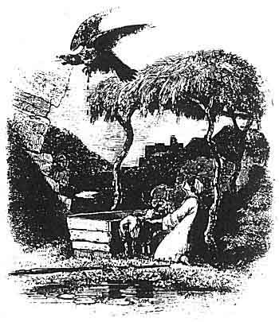
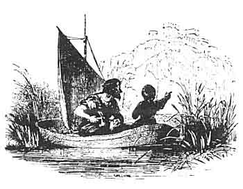

  
[Intangible Textual Heritage](../../../index)  [Legends and
Sagas](../../index)  [Celtic](../index)  [Index](index) 
[Previous](mab26)  [Next](mab28) 

------------------------------------------------------------------------

[Buy this Book at
Amazon.com](https://www.amazon.com/exec/obidos/ASIN/B001W0Z8PY/internetsacredte)

------------------------------------------------------------------------

  
*The Mabinogion*, tr. by Lady Charlotte Guest, \[1877\], at Intangible
Textual Heritage

------------------------------------------------------------------------

p. 434

 

### NOTES TO MATH THE SON OF MATHONWY.

413a MATH THE SON OF MATHONWY.--*Page*
[413](mab26.htm#page_413).

THE fame of Math ab Mathonwy's magic, in which he would seem to have
excelled all the enchanters of Welsh fiction (except, perhaps, the
mighty Merlin and his own pupil, Gwydion the son of Don), is preserved
in two separate Triads (xxxi. and xxxii.), where, he is styled a man of
illusion and phantasy, and where one of the chief enchantments of the
Island is attributed to him.

Another version of the latter has already been given.--See page
[213](mab14.htm#page_213).

The mystical arts of Math appear to have descended to him from his
father, whose magic wand is celebrated by Taliesin, in the Kerdd
Daronwy. It is there asserted that when this wand grows in the wood,
more luxuriant fruit will be seen on the banks of the Spectre
waters. [1](#fn_203)

Taliesin also frequently speaks of the powers of Math himself.--See the
Cadd Goddeu, Marwnad Aeddon o Vôn, &c. [2](#fn_204)

p. 435

The Tale of Math ab Mathonwy has been already printed, with a
translation in the Cambrian Quarterly.

 

413b GOEWIN, DAUGHTER OF PEBIN.--*Page*
[413](mab26.htm#page_413).

THE singular occupation assigned to this damsel in the Tale, is by no
means inconsistent with the ancient customs of Wales. By the laws of
Howel Dda, we learn that there was an officer at the king's court,
called "The Footholder," whose especial duty was such as that title
implies. The following particulars are given concerning him.

"The Footholder is to sit under the King's feet

He is to eat from the same dish as the King.

He shall light the candles before the King at his meal.

He shall have a dish of meat and liquor, though he is not top join in
the feast.

His land shall be free, and he shall receive a horse from the King and
shall have a share of the visitors' gift money."

 

413c CAER DATHYL.--*Page*
[413](mab26.htm#page_413).

CAER DATHYL in Arvon (the present Caernarvonshire), where Math is said
to have held his court, and whence Gwydion set out on his mischievous
journey, has been already noticed. The remains of this fortress are now
called Pen y Gaer. They are situated on the summit of a hill, about a
mile distant from Llanbedr, in Caernarvonshire, midway between Llanrwst
and Conway. It appears to have been well defended by deep moats, which
yet surround it. Foundations of circular buildings may still be traced
in its vicinity. From this place Gwydion's route was in a southerly
direction, and he found Pryderi at a place called Rhuddlan Teivi
(possibly Glan Teivy, about a mile and a half from Cardigan Bridge),
where we are told that his palace then was. Returning with his prize, he
passed by Mochdrev (or Swine's Town), in Cardiganshire, to Elenid, most
likely an error of the transcriber's for Melenid, a mountain near
Llanddewi Ystrad Enni, in Radnorshire, which gives its name to the whole
Cantrev. Thence, by the Mochdrev, between Keri and Arwystli, in
Montgomeryshire, we find him entering the Commot of Mochnant (Swine's
Brook), which is partly in Montgomery, and partly in Denbighshire, and
in which the town of Castell y Moch (Swine's Castle) would seem to point
out another allusion to the singular companions of his hasty retreat.
Gwydion stopped at a third

p. 436

\[paragraph continues\] Mochdrev, in
Denbighshire, now a village between Conway and Abergele, in the ancient
Cantrev of Rhos, and rejoined his prince at Caer Dathyl, after placing
his booty, in safety in the strongholds of Arllechwedd, a name applied
formerly to two commots (Upper and Lower) of Arvon, which are at this
time cursorily called Uchav and Isav.

The places between which Math the son of Mathonwy took his stand, and
awaited the approach of the injured Pryderi, may be recognised as Maenor
Penardd, near to Conway, and Maenor Alun, now Coed Helen, near
Caernarvon. Nant Call, to which the men of the South were compelled to
retreat, is a brook crossing the Dolpenmaen and Caernarvon road, about
nine miles from the latter town. The course of the two armies may be
easily traced from Nant Call to the well-known locality of Dolpenmaen
(in the ancient Cantrev of Dunodig, now the hundred of Eivionydd);
thence across the Traeth Mawr to Melenryd, and at length along the
picturesque valley of Ffestiniog to Maen Twrog, where the expedition
terminated in the ignoble victory obtained by Math through the agency of
enchantment, and in the death of the gallant son of Pwyll. We are here
told that he was buried at Maen Twrawg; the Beddau Milwyr, however, as
has already been mentioned, place the grave of Pryderi at Abergenoli,
"where the wave beats against the shore."

 

414a GWYDION THE SON OF DON.--*Page*
[414](mab26.htm#page_414).

GWYDION, as already seen in Triad 85 (cited page
[273](mab17.htm#page_273)), was one of the three famous tribe-herdsmen
of the Island, and tended the cattle of Gwynedd Uch Conwy. He was also a
great astronomer, and as such was classed with Gwynn ab Nudd, and
Idris. [1](#fn_205) The Milky-way is after him
termed Caer Gwydion: similar honours indeed appear to have been paid to
the whole family of Don. Himself gave his name to the constellation of
Cassiopeia, in Welsh, Llys Don, the Court of Don; and Caer Arianrod,
Corona Borealis, is so called after his daughter Arianrod, one of the
heroines of the present Tale.

Gwydion was an enchanter, and, as has been already noticed, learnt his
magical arts from Math himself. As such he is repeatedly alluded to in
the poems of the Welsh, especially in those of Taliesin. The remarkable
instances of his powers of incantation, as displayed in the present
Tale, are thus related in the composition ascribed to that Bard,
entitled Kadeir Kerridwen.

p. 437

"Gwydion the son of Don, of toil severe,  
Formed a woman out of flowers,  
And brought the pigs from the South,  
Though he had no pigstyes for them  
The bold traveller out of plaited twigs  
Formed a cavalcade,  
And perfect saddles." [1](#fn_206)

In another place (Cad Goddeu) Taliesin says of him,--

Minstrels have sung,  
Armies have admired,  
The exalting of Britons,  
Achieved by Gwydion." [2](#fn_207)

He appears in the double character of seer and poet, in the lines
(already quoted, page [280](mab17.htm#page_280)) composed by him on the
Cad Goddeu, or Battle of the Trees, in which his brother Amaethon fought
against Arawn king of Annwn, about a white roebuck and a whelp, which he
had carried off from the realms of darkness. The party who should guess
the name of a particular person among his opponents in this fight, was
to be victor, and Gwydion, by his divinations, accomplished the required
condition on behalf of Amaethon, in consequence of which he prevailed.

Two of his other brothers, Govannon and Eunydd, are also celebrated by
the Bards, and to the latter of them magic powers are especially
assigned.--See Marwnad Aeddon o Vôn. Myv. Arch. I. p. 70.

The grave of Gwydion ab Don has not been left unrecorded; it was in
Morva Dinllev, the scene of one of his adventures with Llew Llaw Gyffes.

 

421a ARIANROD.--*Page*
[421](mab26.htm#page_421).

THE "Silver circled " daughter of Don, was one of the three beauteous
ladies of the Island.--Tr. 107.

It has already been noticed (page [436](#page_436)) that the Welsh name
the constellation of the Corona Borealis after her, Caer Arianrod.

Besides Dylan Eil Don and Llew Llaw Gyffes, we find that Gwenwynwyn and
Gwanar were sons of Arianrod, by her alliance with Lliaws ab
Nwyvre.--See Tr. 14.

p. 438

421b DYLAN THE SON OF THE WAVE.--*Page*
[421](mab26.htm#page_421).

THIS passage would appear to point at a Triad on the subject of this
"Trydydd anvad ergyd," but none is to be found among those printed in
the Myvyrian Archaiology.

In the Llyvyr Taliesin, preserved in the Hengwrt Collection, there is a
short composition attributed to Taliesin, entitled "Marwnad Dylan Ail
Ton." It is printed in the Cambro-Briton, I. 150.

 

422a THE CASTLE OF ARIANROD.--*Page*
[422](mab26.htm#page_422).

THE Rev. P. B. Williams, in his "Tourist's Guide through
Caernarvonshire," speaking of Clynnog in that county, says: "There is a
tradition that an ancient British town, situated near this place, called
Caer Arianrhod, was swallowed up by the sea, the ruins of which, it is
said, are still visible during neap tides, and in fine weather."

 

424a LLEW LLAW GYFFES.--*Page*
[424](mab26.htm#page_424).

THE incident related in the tale of the journey of Llew Llaw Gyffes (the
Lion with the steady hand), with Gwydion mab Don, in the disguise of a
maker of gold-coloured shoes, to seek a name and arms from his mother
Arianrod, forms the subject of a Triad which has already been
quoted. [1](#fn_208)

Llew Llaw Gyffes was one of the three crimson-stained ones of the
Island, than whom, however, Arthur was more conspicuous, for where he
had trod neither herb nor grass sprang up for the space of a year.--Tr.
xxiv.

His grave is noticed in the Englynion y Beddau Milwyr Ynys Prydain, as
being protected by the sea. [2](#fn_209)

Melyngan mangre, the horse of Llew Llaw Gyffes, was one of the chief
war-horses of the island. [3](#fn_210)

 

424b DINLLEV.--*Page*
[424](mab26.htm#page_424).

DINAS DINLLE is situated on the sea-shore, about three miles southward
from Caernarvon, in the parish of Llantwrawg, on the confines

p. 439

of a large tract of land, called Morva Dinlleu. The remains of the
fortress consist of a large circular mount, well defended by earthen
ramparts and deep fosses.

 

426a BLODEUWEDD.--*Page*
[426](mab26.htm#page_426).

THE story of Blodeuwedd, the fair Flower-aspect, has ever been popular
with the poets. Taliesin's lines relating to her romantic origin have
been already given in the note upon Gwydion ab Don, and Davydd ap Gwilym
has a very pretty poem on the subject of her transformation into an owl,
where, after some preliminary questions as to the cause of her singular
and retired habits, the poet proceeds to inquire her history and her
name. The bird replies that formerly by nobles at the banquet she was
called Blodeuwedd, and she swears by St. David that she is a daughter of
a lord of Mona, equal in dignity to Meirchion himself.

And she goes on to say that Gwydion, the son of Don, on the Conway,
transformed her with his magic wand from her state of beauty to her
present misery, because she once presumed to love Goronwy, the tall and
comely, the son of Perf Goronhir, lord of Penllyn.

 

426b MUR Y CASTELL.--*Page*
[426](mab26.htm#page_426).

MUR Y CASTELL, on the confines of Ardudwy, also called Tomen y Mur, is
about two miles south of the Cynvael or Ffestiniog River, and distant
about three miles from the Llyn y Morwynion, or Lake of the Maidens, in
which the unfortunate damsels of Blodeuwedd met their untimely fate.

 

432a TRIBE OF GORONWY PEBYR.--*Page*
[432](mab26.htm#page_432).

A TRIAD (xxxv.) recites the circumstance of the want of devotion evinced
by his tribe, as detailed in the text.

"The three disloyal Tribes of the Isle of Britain.--The Tribe of Goronwy
Pebyr of Penllyn, who refused to stand instead of their lord to receive
the poisoned dart from Llew Llaw Gyffes, by Llech Goronwy, at Blaen
Cynvael, in Ardudwy. And the Tribe of Gwrgi and Peredur, who deserted
their lords in Caer Greu, where there was an appointment for battle next
morning against Eda Glinmawr,

p. 440

and they were both slain. And the third, the Tribe of Alan Vyrgan who
returned back by stealth from their lord, leaving him and his servants
going to Camlan, where he was slain."

Penllyn, of which Gronw was lord, is a commot on the borders of Llyn
Tegid, or Bala Lake.

 

 

------------------------------------------------------------------------

### Footnotes

[434:1](mab27.htm#fr_204) Myv. Arch. I. p. 63.

[434:2](mab27.htm#fr_205) Myv. Arch. I. p. 30,
70.

[436:1](mab27.htm#fr_206) Tri. 89, sec. ii. p.
325.

[437:1](mab27.htm#fr_207) Myv. Arch. I. p. 66.

[437:2](mab27.htm#fr_208) Myv. Arch. I. p. 29.

[438:1](mab27.htm#fr_209) See [p.
411](mab25.htm#page_411).

[438:2](mab27.htm#fr_210) Myv. Arch. I. p. 80.

[438:3](mab27.htm#fr_211) Tr. Meirch. ii. ix.

------------------------------------------------------------------------

[Next: The Dream of Maxen Wledig](mab28)
