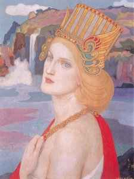

  
[Intangible Textual Heritage](../../../index)  [Sagas and
Legends](../../index)  [Celtic](../index) 

------------------------------------------------------------------------

<table width="75%">
<colgroup>
<col style="width: 50%" />
<col style="width: 50%" />
</colgroup>
<tbody>
<tr class="odd">
<td width="50%" data-valign="TOP"></td>
<td width="50%" data-valign="TOP"><h1 id="myths-and-folk-lore-of-ireland" data-align="CENTER">Myths and Folk-lore of Ireland</h1>
<h2 id="by-jeremiah-curtin" data-align="CENTER">by Jeremiah Curtin</h2>
<h4 id="section" data-align="CENTER">[1890]</h4></td>
</tr>
</tbody>
</table>

------------------------------------------------------------------------

[Title Page](mfli00)  
[The Son of the King of Erin and the Giant of Loch Lein](mfli01)  
[The Three Daughters of King O'Hara](mfli02)  
[The Weaver's Don and the Giant of the White Hill](mfli03)  
[Fair, Brown and Trembling](mfli04)  
[The King of Erin and the Queen of the Lonesome Island](mfli05)  
[The Shee an Gannon and the Grugach Gaire](mfli06)  
[The Three Daughters of the King of the East and the Son of a King in
Erin](mfli07)  
[The Fisherman's Son and the Grugach of Tricks](mfli08)  
[The Thirteenth Son of the King of Erin](mfli09)  
[Kil Arthur](mfli10)  
[Shaking-Head](mfli11)  
[Birth of Fin MacCumhail](mfli12)  
[Fin MacCumhail and the Fenians of Erin in the Castle of Fear
Dubh](mfli13)  
[Fin MacCumhail and the Knight of the Full Axe](mfli14)  
[Gilla na Grakin and Fin MacCumhail](mfli15)  
[Fin MacCumhail The Seven Brothers and the King of France](mfli16)  
[Black, Brown and Gray](mfli17)  
[Fin MacCumhail and the Son of the King of Alba](mfli18)  
[Cuculin](mfli19)  
[Oisin in Tir Na N-Og](mfli20)  
[Notes](mfli21)  
