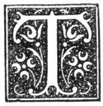

  
[Intangible Textual Heritage](../../../index)  [Legends and
Sagas](../../index)  [Celtic](../index)  [Index](index) 
[Previous](nes11)  [Next](nes13) 

------------------------------------------------------------------------

p. 50

# CHAPTER IX.

### THE HOUSE.

"Tempora mutantur."

|                     |
|---------------------|
|  |

HE house was built of various kinds of materials, according to the
means, and rank, and taste of the owner, and according to the supply of
the materials. It might be of stones and clay; of alternate courses of
stone and turf; of rounded, water-worn stones, embedded in clay, mixed
with chopped straw or heather; of such clay alone, or of turf alone. The
inside of the walls was plastered with clay, and whitewashed with lime.
The couples were placed first, and consisted of five or six parts--two
upright posts resting on the ground, the two arms of the couple, called
*hoos*, fixed to the top of the upright posts or *legs*, and the two
braces, the lower one named the *bauk*, and the upper the *croon piece*.
The couple *leg* and the *hoo* were at times braced together by a small
piece of wood. The couples were bound together by a beam laid along the
top called the *reef-tree*. The spaces between the upright posts were
filled in by the wall. Across the couples were fixed the *pans*, to the
number of three or four on each side of the roof. On these, and parallel
to the couples, were laid the *kaibers*, pieces of trees split with axe,
or of bog-fir. Such a roof was called *pan* and *kaiber*. Over all were
placed the *dyvots*. The whole was covered with thatch either of straw,
heather, or broom. At times, however, there were only the *dyvots*; but
so well were they laid on as to be proof against all kinds of weather
except the very wildest.

On laying the foundation of a house, there was the indispensable *foonin
pint*. The workmen were regaled with whisky or ale, with bread and
cheese. Unless this was done, happiness and health would not rest on the
house. It is told of a manse

p. 51

on the banks of the Spey that the minister refused to give the usual
*foonin pint*, and that, out of revenge, the masons built into the wall
a piece of a gravestone. The consequence was, the house proved
unhealthy, and the ministers very short-lived.

When the house was taken possession of, there was a feast--the
*hoose-heatin* or *fire-kinlin*.

There was but one door; and a few yards, or it might be a few feet only,
in front of it lay the midden, in a deep hole half filled with
water--the sewage of the kitchen and the farm buildings--green as
grass--the *green brees*. The *peat-neuck*, over which rested a goodly
number of hens, faced the entrance door, and on either side of it was a
door. One of these doors opened into the kitchen, and the other led to
the remaining apartments of the house.

The kitchen was open from floor to roof. The floor was earthen, and not
very level or smooth. The roof was as black as soot could make it.
Between some of the couples were hung strong boards, on which were
ranged *kebbacks* of various sizes and ages, and it might be a few dried
cod or ling with a bag of home-grown mustard. From others of them were
suspended bunches of onions, carefully wrapped-up bunches of hyssop,
peppermint, wormwood, and other herbs famed as decoctions in sickness of
man and beast, a bunch or two of the pith of the rush to serve as wicks
for the lamp (the *eely dolly*) during -winter, a bunch of *stars* or
*bruckles* to *redd* the tobacco pipes, and at times a bundle or two of
harrow-*tynes* to dry and harden. On others were laid a few pieces of
bog-fir, from which to cut fir-candles.

The fire-place was wholly open. The hearth was raised a few inches above
the level of the floor, and the *crook* dangled over it from the
*rantle*-tree. There was a niche or *bole* in the wall on each side of
the hearth--the one containing a tobacco-pipe or two, a tobacco-box, a
*can’le-gullie*, and perhaps a few books or pamphlets. In. the other was
a wooden box in the shape of a house, with a round hole in the exposed
end; it was the *saat-backet*.

On the one side-wall hung the *bench*, on which were ranged the plates
and spoons and bowls, and under it stood the *dresser*,

p. 52

with its row of *caps* and small *cogs*, and underneath the dresser were
placed the pots and pans and pails, the milking-cogs and vessels for
holding milk. By the other side-wall stood the *settle* or *deis*, with
its table, fixed to the wall and folding down over it, in the centre.

Opposite the fire-place, and forming frequently part of the partition
between the kitchen and the adjoining apartment, stood a *box-bed*, or a
*box-bed* and a cupboard, or it might be two *box-beds*; a kind of bed
made of wood, closed in on three sides and top, and shut by a sliding or
folding door, on the top of which was stowed away a variety of things,
as boxes for holding nails, hammers, axes, pieces of old iron, shoes,
&c., &c.

Light was admitted by one, or at most two, small windows, often of four
panes of glass only, and disclosed walls not too dazzling for the eyes
by their pure white. At times there was no glass; merely a board to stop
the aperture.

In one corner at the foundation was a hole. It was the *doghole*--an
opening to allow the dog to come and go at pleasure. In another corner
under the eaves was another hole. It was for the out-going and in-coming
of the hens when the door was shut.

Leaving the kitchen, and opening the door observed on entering, you
found yourself in a long passage, or *trance*, and at the end of it was
the room, or *but ein*. It contained a few chairs and a table, an
eight-day clock, a chest of drawers, a looking-glass, and a *bun
breest*, that is, a wooden bed, and a cupboard or two with panelled
doors. The floor was earthen, the ceiling was wood, the walls were
whitewashed; there was no grate; the window was somewhat larger than
that of the kitchen. Doors opened from the trance into one or more
smaller rooms, used as bed-rooms.

There was little difference between the houses of the agricultural and
the fishing folk and what they contained, except in the implements of
their callings. Lines, hair for "tippens," hooks, fishhakes, in later
times herring nets, buoys, and sometimes a boat sail, had their place in
the fisherman's house.

In some cases there was but one door for the cows and the

p. 53

family, and before you could reach the kitchen you had to pass through
part of the byre.

On removing from one house to another it was accounted unlucky to get
possession of a clean house. "Dirt's luck," says the proverb. If one,
who was removing from a house, was jealous of the successor, and wished
to carry off the good fortune of the house, the out-going tenant swept
it clean on leaving it.

There were two other methods of taking away the luck from a house. The
one was for the tenant who was leaving to mount to the roof and pull up
the *crook* through the *lum*, instead of removing it in the usual way
by the door.

The other was by *trailing the raip*. A rope of straw was twisted from
left to right--the *vrang wye*--and pulled round the house contrary to
the course of the sun.

To avert all evil from those who were entering a house others had
quitted, if there was suspicion that evil had been left on it, a cat was
thrown into it before any of the new in-dwellers entered. If evil had
been left on it, the cat in no long time sickened and died.

------------------------------------------------------------------------

[Next: Chapter X. Evenings at the Fireside](nes13)
