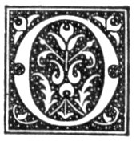

  
[Intangible Textual Heritage](../../../index)  [Legends and
Sagas](../../index)  [Celtic](../index)  [Index](index) 
[Previous](nes12)  [Next](nes14) 

------------------------------------------------------------------------

p. 54

# CHAPTER X.

### EVENINGS AT THE FIRESIDE.

<table>
<colgroup>
<col style="width: 100%" />
</colgroup>
<tbody>
<tr class="odd">
<td>"Let not Ambition mock their useful toil, 
  Their homely joys, and destiny obscure; 
Nor Grandeur hear with a disdainful smile 
  The short and simple annals of the poor."</td>
</tr>
</tbody>
</table>

|                     |
|---------------------|
|  |

N the hearth was piled a great fire of peat, which burned with a strong
flame, filling the kitchen with a genial warmth, and casting a ruddy
glare on the roof and walls and motley furniture. Over the fire hung a
large iron pot, heaped high with turnips and *shillicks*. It was the
*bait-pot*, and its contents formed part of the food of the farm-horses.
Beside the fire stood another pot, covered with a slab of stone. It was
the *lit-pot*--that is, a pot used for the dyeing of wool, for the most
part of a blue colour, and giving forth, when the wool was turned, a
very strong smell of ammonia.

Light was given either by pieces of bog-fir laid on the fire, or by
*fir-can’les*--that is, thin splinters of bog-fir, from one to two and a
half or three feet long, fixed in a sort of candlestick, called the
*peer-man* or *peer-page*. The *peer-man* was of various shapes. A
common kind consisted of a small roundish block of stone, perforated
with a hole in the centre, in which was inserted a piece of wood about
three feet in height, having on the top a cleft piece of iron, into
which the candle was fixed with the flame towards the door.

A third kind of lighting was by an iron oil-lamp, that bore the name of
the *eely dolly*. This lamp was formed of two parts, called *shalls*.
Both parts were alike in shape and somewhat resembled certain species of
bivalve shells, as the cow-shell, and

p. 55

both had a long spout. The parts fitted into each other, the one being a
little smaller than the other. The under part had a handle fixed
perpendicularly to the side opposite the spout, which was for affixing
it to the wall or other convenient place. On the inner side of this
perpendicular handle was a knob with notches, on which was hung the
smaller *shall*, which contained the oil and the wick. The notches in
the knob were for regulating the supply of the oil. The oil used was
made from the livers of the haddock cod, ling and other fish caught on
the coast, and was distinguished by the name of *black oil*. The wick
consisted for the most part of the pith of the common rush--*rashin
wicks*--and in later times of cotton thread. The lamp had no cover, and
when dirty was usually cleaned by burning.

At the one corner of the hearth sat the father, and at the other the
mother. Between the two sat the family, and it might be a servant or
two, for all were on a footing of equality, the servant being a
neighbour's son or daughter of exactly the same rank and means. All were
busy. One of the women might be knitting, another making, and another
mending, some article of dress. Of the men, one might be making candles
from bog-fir--*cleavin can’les*-another manufacturing harrow-tynes of
wood, a third sewing brogues, and a fourth weaving with the *cleeck* a
pair of mittens. If there were children in the family at school there
was silence or but little conversation, for lessons were being prepared;
and every now and again the anxious learner handed the book to the
mother or other member of the family, and repeated the lesson. If the
lesson was not correctly repeated, the book was handed back with the
injunction to be busy, and the learner resumed his work and continued
his labour till the lesson was thoroughly prepared. When the
school-books were laid aside the song and the ballad and the story
began. The songs of Burns and other sweet singers of Scotland were
varied with those of poets of less note, and with such ballads as "The
Haughs of Cromdale," "The Duke o’ Gordon's Three Daughters," "Sir James
the Rose," "Gregor's Ghost," "Andrew Lammie." Many of the inferior songs
were

p. 56

of a questionable morality, and some of them were even obscene. Yet they
were sung with a kind of *naïveté* and unconsciousness of their
immorality that did away in a great measure with any demoralising
tendency they might otherwise have had. The songs of local poets also
had their place. Frequently such took a satirical turn, a farmer famed
as a hard taskmaster, who "keppit's fouck on mete meal ail taul’
puckles," being the victim. Some of them were in celebration of country
balls, and to each couple of guests, "a lad and his lass," was devoted a
stanza of four lines, in which both the foibles and the graces of the
enamoured were hit off, and at times with truth and burlesque humour.

The story was for the most of the supernatural--of fairies and their
doings, of waterkelpie, of ghosts, of witches and their deeds, of
compacts with the Devil, and what befell those who made such compacts,
of men skilled in *black airt*, and the strange things they were able to
do. Sometimes riddles formed the subject of amusement. As tale succeeded
tale, and the big peat fire began to fade, the younger members of the
family crept nearer and nearer the older ones, and, after a little,
seated themselves on their knees, or between them and the fire, with the
eyes now fearfully turned to the doors, and now to the chimney, and now
to this corner, whence issued the smallest noise, and now to the next,
in dread of seeing some of the uncanny brood.

Sometimes the stories were of pirates, whom the young imagination
painted as wild beasts of the sea, creating strange, undefinable
feelings; of oceans bound in eternal ice and darkness, with bright,
shining lands beyond, with their hills of gold and silver sparkling
through the darkness, exciting vague longings to be away in search of
wonders, notwithstanding all the dangers and terrors.

Sometimes there were stories from history, oftenest of the wars between
England and Scotland, but so disfigured as to be almost unrecognisable
from the facts themselves. Other stories might be heard, such as "The
Miller's Tale" of Chaucer, which were told without the least conception
that there was any indecency in them. The stories of George Buchanan and
the English

p. 57

\[paragraph continues\] Professor, and of the professor of Signs from
Spain on a visit at King's College, Aberdeen, were greatly in
favour. [1](#fn_48)

The family was not always alone. Civilities were interchanged by one or
more neighbours spending the evening with them, or in common language,
by *geein thim a forenicht*. On such occasions it was no unusual thing
for the young women to carry with them their spinning-wheels on their
shoulders, and their wool or flax under their arms. Then might be seen
three or four spinning-wheels going at once, skilful fingers busy at the
*stent*, and each spinner vieing with the other who should first
complete it, and not a foot was stirred till it was completed. One or
two of the younger members of the family were engaged in twisting or
reeling thread. [2](#fn_49) While the women were
busy, the young men were not idle. If not employed in something useful,
they were amusing themselves in such trials of strength as could be made
indoors--as "drawing the sweer-tree," or in such games as the "tod and
the lam's," the "glaicks," the "dams," or "dambrod." When the work was
done, all sat down to a simple, wholesome supper, which was reverently
prefaced by grace from the goodman. Then came the hearty good-night with
the hearty invitation, "Haste ye back," and the cordial promise, "Aye,
aye, but haste ye in aboot some forenicht." The young men accompanied
the *forenichters* to their home, carrying their spinning-wheels, and
whispering words of love.

Now and again there was a *quarterer* in the family. There was a class
of respectable beggars, whose vocation was not looked upon as
disreputable. Such commonly confined their wanderings to a particular
district of the country, and made their rounds with great regularity.
Within that district there were certain houses at which they invariably
lodged or quartered. Whether male or female, they were generally welcome
guests, and, were hospitably entertained. Their fund of general
information, which was most readily imparted to all who would lend an
ear, their ability to give the current news of the country, and often
their knowledge of simples, which several of them

p. 58

carried with them, and their skill in rubbing sprains and treating
bruises, burns, scalds, and such like, their proficiency at times in
music, and their neat-handedness in repairing such domestic utensils as
might be out of order, always opened for them a door.

The chapman, with his pack of cloth, or cutlery, or books, was also a
frequent guest, and by his fair speech usually contrived to gain the
goodwill of the females. A napkin, a dress, a pair of scissors, sold a
few pence below the usual price, was ample payment for all the trouble
he caused.

It may not be out of place to notice here the occasional presence of a
person of no small importance in the family--the tailor. The greater
part of the ordinary clothing was spun at home and woven by a weaver in
the neighbourhood. It was not given out to be made up. The tailor was
summoned to the house, and great was the preparation for him. He was
treated with more than ordinary respect, and on his arrival was
installed in the room. The goodwife produced her webs, and gave her
orders with many an injunction not to make many "*clippans*," and not to
"*brock the claith*." The tailor handled the cloth knowingly, and
praised it; and the goodwife looked pleased, and ceased to say one word
about *clippans* or *brocks*. The tailor set to work, and plied his
needle and thread early and late--sometimes assisted by the
females--till the webs had become *hapwarms*, fit to defend the coldest
blast. Now the goodwife "is not afraid of the snow, for all her
household are clothed with double garments."

------------------------------------------------------------------------

### Footnotes

[57:1](nes13.htm#fr_48) Cf. *F. L. Record*, vol.
ii. pp. 173-176; and vol. iii. pt. i. pp. 127-129.

[57:2](nes13.htm#fr_49) *Songs of the Russian
People*, p. 32, by W. R. S. Ralston.

------------------------------------------------------------------------

[Next: Chapter XI. Fairies](nes14)
