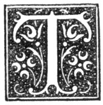

  
[Intangible Textual Heritage](../../../index)  [Legends and
Sagas](../../index)  [Celtic](../index)  [Index](index) 
[Previous](nes20)  [Next](nes22) 

------------------------------------------------------------------------

p. 102

# CHAPTER XVIII.

### PLACE RHYMES.

|                     |
|---------------------|
|  |

HE name of Thomas the Rhymer even yet is well-known in the North, and
his sayings are spoken of with much deference by many of the old folks.
These sayings have now lost their virtue. They were to stand true only
till "the saut cam abeen the mehl," that is, till the price of salt
exceeded that of meal. This was the case at the time a heavy tax was
levied on salt. So high was the price of salt that the poor could not
afford it; and those living on the sea-coast were in the habit of using
sea-water in the boiling of potatoes, and such other articles of food.
Hence the proverb, "to set one up wi’ saut."

Many of the rhymes on places are attributed to Thomas the Rhymer.

Aikeybrae is a small hill in the parish of Deer. On it there was, at no
very distant period, a number of stones, which bore the name of Cummin's
Craigs, near which one of the Cumyns, Earl of Buchan, was, according to
tradition, thrown from his horse, and killed. He called Thomas the
Rhymer Thomas the Liar. Thomas, upon this, uttered the doom of his
slanderer in the following words:--

"Tho’ Thomas the Lyar thou callest me,  
A sooth tale I shall tell to thee:  
By Aikey-side  
Thy horse shall ride,  
He shall stumble, and thou shalt fa’;  
Thy neck-bone shall brack in twa,  
And dogs shall thy banes gnaw,  
And, maugre all thy kin and thee,  
Thy own belt thy beir shall be."

The site of the stones is now believed to be occupied by a quarry.

p. 103

The following is the tradition about the lands of Auchmedden in
Aberdour. Thomas the Rhymer's prediction was that--

"As long’s there's an eagle in Pennan,  
There will be a Baird in Auchmedden."

For long a pair of eagles built their nest in the cliffs near the
village of Pennan, and the Bairds protected them with the greatest care,
and fed them by placing daily on a ledge of rock near their eirie a
quantity of food. William Baird joined Prince Charlie, and was an
officer of his bodyguard at Culloden. He continued in hiding for some
years, and afterwards took up his abode at Echt House, where he died in
1777. Auchmedden was not confiscated, but Mr. Baird was obliged to sell
it in 1750 to relieve himself of the debt he had contracted to support
the cause of the Stuarts; it was bought by the Earl of Aberdeen. At that
time the eagles left their home. Lord Haddo, eldest son of the Earl of
Aberdeen, married Christian Baird of Newbyth. The eagles returned, and
continued to build their nest till the estate passed from the Aberdeen
family to the Honourable William Gordon. Again the birds disappeared.
When the estate came into the hands of Robert Baird, about the year
1855, one eagle took up its abode in the Pennan Rocks, but it soon after
disappeared.

"The water o’ Awn (Avon) rins sae clear,  
It wud deceive a man o’ a hundred year."

The river Avon flows in a strong stream, clear as crystal, from Loch
Avon, a lonely loch hemmed in by Cairngorm, Ben Maedhui, and Benamain,
in the top of Banffshire. It flows past Inchrory, Tomintoul, and falls
into the Spey. During its whole course it is remarkable for the
clearness of its water. Many cases of drowning are said to have happened
arising from the ignorance of those who attempted to ford it at places
where the water is much deeper than it looks, owing to its clearness.

Banff forms the subject of various proverbs. One in use in the North
is:--

"Gang t’ Banff  
An buff ben-leather."

p. 104

Another is:--

"Gang t’ Banff  
An bottle skate."

The one in use in the West of Scotland is:--

"Gang t’ Bang and bettle \[or bittle\] beans."

In Lothian the saying is:--

"Gang t’ Banff and bind bickers."

"Gae to Banff  
An buy bend-leather."

"Banff it is a boroughs toon,  
A kirk withoot a steeple,  
A midden o’ dirt at ilky door,  
A very unceevil people."

Whatever may have been the truth of this saying at one time, it has lost
its sting now. Its church has a handsome steeple. The town is a model of
cleanness. Another version puts the assertion in the last line in
another light, and in the true light:--

"Bang it is a boroughs toon,  
A kirk withoot a steeple,  
A bonnie lass at ilky door,  
And fine ceevil people."

"Gang t’ Birse  
An bottle skate."

In parts of Banffshire this is spoken to one who is importunate in
asking, to get rid of him.

"Boyne fouck; Buchan bodies;  
Strila lairds; barfit ladies."

This saying, no doubt, has come from the Boyne, and shows in what
estimation the "fouck" of the Boyne held their neighbours.

"Buck, Belrinnes,  
Tap o’ Noth, an Bennochie,  
Is four laun marks fae the sea."

This is a saying applicable to the Moray Firth.

p. 105

The rhyme about the Cabrach, attributed in the district to Jane Maxwell,
Duchess of Gordon, is:--

"I hae a kintra caa’d the Cabrach,  
The folk's dabrach,  
The water's Rushter,  
An the corn's trushter."

The Rushter, or Royster, is a stream that flows about a mile north of
the church, having its source in the heights to the westward.

"Cairnmuir an Cairnbyke,  
Rumblin Steens and Stoney Dykes.  
Atween the centre an the pole  
Great Cæsar lies intil a hole."

On Cairnmuir and Cairnbyke, which are in the parish of Pitsligo, were at
one time several tumuli. Who Cæsar was cannot be divined.

"Caul Carnousie stans on a hill,  
And mony a fremit ane gangs theretil."

Carnousie is a fine estate with a neat old-fashioned mansion, situated
on a height above the Deveron, in the parish of Forglen. It has been
thought that the words of the last line have reference to the frequent
change of owners.

"A’ the wives o’ Corncairn  
Drilling up their harn yarn;  
They hae corn, they hae kye,  
They hae webs o’ claith forbye."

Corncairn is a district in Banffshire, not far from the Knock. The rhyme
praises the thrift of its goodwives.

The rhyme about the parish of Cruden is:--

"Crush-dane the field and parish then were styled,  
Tho’ time and clever tongues the name hath spoiled."

Culblean was burnt, and Cromar harriet,  
And dowie’s the day John Tam was marriet."

In explanation of these lines tradition has the following to say. During
the wars of Montrose and Dundee, the district of Strathdee was visited
by bands of MacGregors from Rannoch,

p. 106

and Grants and Macintoshes from Badenoch, to reduce to order the
disaffected. After a time they themselves took to evil ways, and
plundered wherever they could. The marriage of one of the Cromar men was
to be celebrated with great pomp, and the indwellers were invited to a
man. This was known to the freebooters, and a foray on a grand scale was
planned. On the marriage day, when the country was left defenceless,
they swept over the district, carried off the cattle and flocks of the
inhabitants, and burnt several of their dwellings. This aroused the
vengeance of the people, and they arose to drive their enemies from
their hiding-places. The only effectual way of doing this was by setting
fire to the forest of Culblean.

Another tradition says that it was Mackay, after the battle of
Killicerankie, that set fire to the forest, in forcing the Pass of
Ballater, and at the same time wasted the Strath of Dee with fire and
sword, and levied a contribution on the day John Tom was married-an
event set forth in the lines:--

"Wo to the day John Tom was married,  
Culblean was burned, and Cromar was harried."

Cullen, in Banffshire, seems to have stood low in public opinion:--

"Aiberdeen ’ill be a green  
An Banff a borrows toon,  
An Turra ’ill be a restin place,  
As men walk up and doon;  
Bit Cullen ’ill remain the same,  
A peer fool fisher toon."

"Fin the ween cums aff o' Cullycan  
It's naither gude for baist nor man."

This is a weather-saw current in Macduff. Cullycan is a headland to the
east of the borough. The saw embodies the evil effects of the east
winds.

"Daach, Sauchin, an Keithock Mill,  
O’ Tam o’ Rivven owned the will;  
Balveny, Cults, and Clunymoire,  
Auchindroin, an many more."

"Tam o’ Rivven" was Thomas Gordon of Ruthven, who fell fighting against
the Abbot of Grange. Tradition says that

p. 107

\[paragraph continues\] Thomas Gordon, of Ruthven, laid claim to certain
lands that belonged to the Abbey of Grange, on the Balloch Hill. The
Abbot of Grange was not a man to stoop to give up what belonged to the
Church, and he made ready to uphold his claim in the only way open to
him by arms. Tam, with his followers, met the brave Abbot and his men on
the north shoulder of the Little Balloch. Both Tam and the Abbot were
killed. The spot where the Abbot fell is called the Monk's Cairn, and is
about 300 yards north-cast of the top of the hill. At the bottom of the
hill is a hollow called the Gordon's How, to which Tam was carried
wounded to death. Here, beside a spring of water, the Gordon died. The
words of the rhyme show the wide extent of Tam o’ Rivven's domains.

"When Dee and Don shall rin in one,  
And Tweed shall rin in Tay,  
The bonnie water of. Uric  
Shall bear the Bass away."

The Bass is a pretty artificial mound, perhaps a Hill of Justice, on the
banks of the Urie, near Inverurie.

When a church was in the act of building at Deer, owing to some cause no
one was wise enough to account for, no progress could be made. At last a
voice was heard crying:--

"It is not here, it is not here,  
That ye’re to big the kirk o’ Deer,  
But on the tap o’ Tillery,  
Where many a corpse shall after lie."

\[paragraph continues\] "A church accordingly was built on a knoll or
small mount, embraced by a semicircular bend of the Ugie, and, as was
customary, a piece of ground was set apart for a burial-place, so that
the weird is fully verified in the great numbers of interments that have
taken place during the lapse of centuries in a wide and populous
parish."

"Dipple, Dindurcas,  
Dandilieth, and Devey (Delvey),  
Is the four bonniest haughs  
On the banks o’ the Spey."

"A mile o’ Don 's worth twa o’ Dee,  
Except for salmon, stone, and tree."

p. 108

The following extract from "View of the Diocese of Aberdeen" explains
this rhyme. "The banks of the Dee consist of a thin, dry soil, abounding
with wood and stone, and overgrown frequently with heath; whereas those
of Don consist of soil more deep and fat, affording good corn-fields.
Some even go so far as to affirm that not only the corn, but also the
men and beasts are taller and plumper on Don than on Dee."

The Old Bridge of Don--the Brig o’ Balgownie--was, built five centuries
and a half ago. Byron refers to it in "Don Juan" in the following
lines:--

"As Auld Langsyne brings Scotland, one and all,  
Scotch plaids, Scotch swords, the blue hills, and clear streams,  
The Dee, the Don, Balgownie's Brig's *black wall*,  
All my boy feelings, all my gentler dreams."

He adds this note--"The Brig of Don, near the Auld town of Aberdeen,
with its one arch and its black, deep, salmon-stream below, is in my
memory as yesterday. I still remember, though perhaps I may misquote the
awful proverb which made me to pause to cross it, and yet lean over it
with childish delight, being an only son, at least by the mother side.
The saying, as recollected by me, was this, but I have never heard nor
seen it since I was nine years of age:--

"Brig o’ Balgownie, black's yer wa’;  
Wi’ a wife's ae son, and a meer's ae foal,  
                        Doon ye shall fa’."

Another version of the first line is:--

"Brig o’ Balgownie tho’ wicht be your wa’."

The second line has another version.--

"Wi’ a mither's ae son, and a mare's ae foal."

"Caul may the ween blaw  
Aboot the yits o’ Eden."

This saying relates to the old castle of Eden, a lonely keep in ruins,
not far from the present mansion on the banks of the Deveron. The
tradition is that a vassal of the laird of Eden had incurred his lord's
displeasure; he was condemned to die,

p. 109

and no entreaty of his wife was able to soften the lairds heart. When
entreaty failed she uttered curses, and one of them was the words given
above.

According to the following Fochabers must have enjoyed all unenviable
notoriety:--

"Aw sing a sang, aw ming a mang,  
A cyarlin an a kid;  
The drunken wives of Fochabers  
Is a’ rinnin wid."

Of Fraserburgh, now the great centre of the herring fishing on the
north-east coast, the rhyme is:--

"Aberdeen will be a green,  
An Banff a borough's toon,  
But Fraserbroch ’ill be a broch  
When a’ the brochs is deen."

There are two versions of a "prophecy" about Fyvie Castle:--

"Fyvyns riggs and towers  
Hapless shall your mesdames be,  
When ye shall hae within your methes,  
From harryit kirk's land, stanes three--  
Ane in Preston's tower,  
Ane in my lady's bower,  
And ane below the water-yett,  
And it ye shall never get."

"Fyvie, Fyvie, thou’se never thrive  
As lang’s there's in thee stanes three:  
There's ane intill the highest tower,  
There's ane intill the ladye's bower,  
There's ane aneth the water-yett,  
And thir three stanes ye’se never get."

The tradition is as follows: The walls of Fyvie Castle stood wall-wide
for seven years and a day waiting for the arrival of Thomas the Rhymer.
At last he appeared before the walls, and a violent storm of wind and
rain burst over the place; round the spot where Thomas stood, however,
there was a dead calm as he spoke the fate of the castle. The tradition
goes on to say that two of the stones have been found, but the one below
the "water-yett," that is, the gate leading to the Ythan, has as yet
baffled search.

p. 110

"If evyr maydenis malysone  
Dyd licht upon drye lande,  
Let nocht bee funde in Furvye's glebys,  
Bot thystl, bente, and sande."

Furvie, or Forvie, was at one time a separate parish; it now forms part
of the parish of Slains. Much, if not most of it, is now covered with
sand. Tradition says that the proprietor to whom the parish belonged
left three daughters as heirs of his fair lands; they were however
bereft of their property, and thrown houseless on the world. On leaving
their home they uttered the curse contained in the foregoing words. In
course of no long time a storm, which lasted nine days, burst over the
district, and turned the parish of Forvie into a desert of sand; this
calamity is said to have fallen on the place about 1688.

"Schoudy,  
Poudy,  
A pair o’ new sheen,  
Up the Gallowgate, doon the Green."

Both the Gallowgate and the Green are in Aberdeen.

"The Grole o’ the Gehrie (Garioch),  
The bowmen o’ Mar:  
Upon the Hill o' Benochie  
The Grole wan the war."

This seems to refer to some skirmish between the Marmen and the Garioch
men that was fought out on Bennochie. Tradition has no voice in it.

"Fin a dyke gangs roon the Bog o’ Gicht,  
The Gordon's pride is at its hicht."

Much of what now forms the beautiful policies of Gordon Castle was the
"Bog of Gight," and the common saying in years not very long gone past
was, that the last Duke of Gordon died about the time the "Bog" was
wholly inclosed.

"Twa men sat down on Ythan brae,  
The ane did to the tither say,  
'An what sic men may the Gordons of Gight hae been?'"

The castle and the estate of Gight, in the parish of Fyvie, came about
the year 1479 into the possession of William Gordon,

p. 111

third son of the second Earl of Huntly, by a sister of the Earl of
Erroll. He was killed at the battle of Flodden in 1513.

"When the heron leaves the tree  
The laird o’ Gight shall landless be."

On the 12th May, 1785, Catherine Gordon of Gight married the Honourable
John Byron. The estate was sold soon after the marriage. Tradition says
that about the time of the marriage the falcons, which had built their
nest for many a year in a fine tree near the castle, left and took up
their abode in the woods of Haddo House.

Another prophecy was:--

"At Gight three men a violent death shall dee,  
And after that the land shall lie in lea."

In the year 1791 Lord Haddo fell from his horse on the "Green of Gight,"
and was killed. Some years after a servant on the home farm met a
violent death. The third violent death took place not many years ago.
The home farm was to be turned into lea. Part of the house had to be
pulled down. One of the men engaged in this work remarked that the
prophecy had not come to pass. Shortly after, part of the wall fell upon
him, and crushed him to death.

"The guile, the Gordon, an the hiddie-craw  
Is the three worst things that Moray ever saw."

"The guile" is the marigold (*Chrysanthemum segetum*), only too
plentiful in some of the lighter sandy soils of Morayshire, and hinders
in no small degree the crops. Pennant suggests that "the Gordon" may
refer to the plundering expeditions of Lord Lewis Gordon, a son of the
Marquis of Huntly, and the companion of Montrose in his wars.

"A misty May and a dropping June  
Brings the bonny land of Moray aboon."

Much of Morayshire is of a sandy nature, and the crops in May and June
require a good deal of moisture, or else they become stunted.

p. 112

Inverugie, in the parish of St. Fergus, was the seat of the Earl
Marischal. Thomas the Rhymer had his saying against the family, which he
uttered from a stone which stood near the castle:--

"Inverugie by the sea,  
Lordless shall thy land be;  
And underneath thy hearth-stane  
The tod shall bring her birds hame."

Concerning the stone the prophecy is:--

"As lang's this stane stands on this craft  
The name of Keith shall be alaft;  
But when this stane begins t’ fa’  
The name of Keith shall wear awa’."

The stone was removed in 1763, and built into the church of St. Fergus,
which was then in course of erection.

In 1715 the property of the Earl Marischal was attainted. The estate of
St. Fergus was then bought from the Crown by the York Buildings Company.
The trustees of this Company sold it in 1761 to George, Earl Marischal,
son of the attainted earl. It was bought in 1764, the year after the
stone was removed, by Lord Pitfour, one of the senators of the College
of Justice, and it remains in the possession of that family.

"Fae Kilbirnie t’ the sea  
Ye may stap fae tree till tree."

Kilbirnie is not far from the Ord, a few miles to the west of Banff. The
rhyme indicates a very different state of matters in by-gone days from
what now exists. The tract of land at present between Kilbirnie and the
sea is all under the plough, and few trees are growing to adorn the
landscape.

"He (or she) is like the dogs o’ Keith, he's aye on hoch."

This saying is applied to one who is much given to going about in an
idle way.

"Marna shall be claid in reed  
An Mormond hill rin doon wi’ bleed,  
An a’ the peace that ever’ll be  
’Ill be atween Mormond an the sea."

Marna lies in the parish of Strichen; and Mormond, partly in Strichen,
and partly in Fraserburgh and Rathen.

p. 113

"The four great landmarks on the sea  
Is Mount Mar, Lochnagar, Clochnaben, and Bennochie."

These are all hills in Aberdeenshire, and two of them are well known in
poetry.

There is a shorter version of this saw which contains the names of but
two hills. "The chief hill here (in Garioch) is that of Bennochie. It
has seven heads, the chief of which, being a round peak, is called *The
Top*; which, being seen afar off, and also affording a wide prospect to
one who stands upon it, has given occasion to the name; for Bin-na-chie
signifies *The Hill of Light* (though others expound it as *The Hill of
the Pap*, because of the resemblance The Top bears to a nipple): and
accordingly there is an old verse which says:--

"There are two landmarks off the sea,  
Clochnabin and Bennochie."

"Pit fae ye, Pitfodels,  
There's men i’ the Mearns."

It is difficult to tell what is the meaning of those words.

"The Pot o’ Pittentyoul,  
Fahr the deel gya the youl."

The "Pot o’ Pittentyoul is a small but romantic rook pool in a little
stream called the "Burn o’ the Riggins," which flows past the village of
Newmills of Keith. On the edge of the pool are some hollows worn away by
the water and the small stones and sand carried down by the stream.
These hollows, to a lively imagination, have the shape of a seat, and
the story is, that the devil at some far-back time sat down on the edge
of the pool, and left his mark.

"Fin the rumble comes fae Pittendrum,  
The ill weather's a’ t’ cum;  
Fin the rumble comes fae Aberdour,  
The ill weather's a’ our."

This is a saw respecting the weather sometimes heard repeated in the
parish of Pitsligo. Pittendrum lies on the east side of the parish, and,
when a storm is approaching from the east, the swell

p. 114

of the sea, which comes before the storm bursts, breaks on the beach not
far from Pittendrum. Hence the noise. Aberdour lies to the west of the
parish.

Rattrayhead is a ridge of rocks running out into the sea on the. coast
of the parish of Crimond; it is dangerous to shipping, and has seen many
a wreck. Its safeguard has been put into the following lines:--

"Keep Mormond Hill a handspike high,  
And Rattray Brigs y’ill not come nigh."

"The road t’ the Kirk o’ Rivven (Ruthven),  
Fahr gangs mair dead nor livin."

Ruthven, in Cairnie, had once a church, and the churchyard is still in
existence.

"At two full times, and three half times,  
Or threescore years and ten,  
The ravens shall sit on the stanes o’ St. Brandon  
And drink o’ the blood o’ the slain."

The stones of St. Brandon, the patron saint of Banff, stood on a field
about a mile to the west of Banff. Tradition has it that a battle
between the Scots and the Danes was fought on this field. Near the same
place is the Brandon How (pronounced locally Brangin How), where long
ago St. Brandon's Fair was held; this fair is now held in Banff. Rain,
called "the Brangin sob," is looked for about this time.

In the parish of Cruden, not far from the Hawklaw, There is a well
dedicated to St. Olaus, whose virtues are set forth in the words:--

"St. Olav's well, low by the sea,  
Where pest nor plague shall never be.

"The Brig o’ Turra  
’S half-wye atween Aberdeen and Murra."

Or,

"The Brig o’ Turray  
’S half-way between Aberdeen and Elgin in Murray."

Turriff was noted for a skirmish between the Royalists and Covenanters.

"This infall (known afterwards commonly by the name of

p. 115

\[paragraph continues\] 'the Trott o’ Turra,' in derisione) fell out May
fourteenth, 1639, earlye in the morning." "Weary fa’ the Trott o’ Turra"
was for long on the lips of the folk as a kind of proverb.

"Little Ugie said to Muckle Ugie  
  'Where shall we twa meet?'  
'Doon in the Haughs of Rora  
  When a’ man is asleep.'"

Another version of the first line is,

"Ugie said t’ Ugie."

The two streams that form the Ugie meet in the parish of Longside, on
the Haughs of Rora.

### DRUIDICAL CIRCLES.

"Druidical Circles" and monoliths were looked upon with awe; and there
were few that would have dared to remove them. Here is a tradition of a
monolith on the farm of Achorrachin in Glenlivet. The farmer was
building a steading, and took the stone as a lintel to a byre-door.
Disease fell upon the cattle, and most unearthly noises were heard
during night all round the steading. There was no peace for man or
beast. By the advice of a friend the stone was taken from the wall, and
thrown into the river that ran past the farm. Still there was no peace.
The stone was at last put into its old place in the middle of a field.
Things then returned to their usual course. The stone stands to the
present day in the middle of the field, and in some of its crevices were
seen, not many years ago, small pieces of mortar.

At Killishmont, near Keith, Banffshire, was a piece of ground called
"the Helliman Rig." It lay on the top of a rising ground, and commanded
a very wide view of the country, stretching for many miles over the
hills of Banff and Moray. In a part of it the rock--a kind of
slate--came to the surface. In the rock were cut out nine cups in three
rows. Tradition has it that a tenant long ago began to cultivate it. No
sooner had the plough touched it than one of the oxen fell down dead. It
is not very many years since it was brought tinder cultivation.

p. 116

\[paragraph continues\] Unfortunately the piece of the rock containing
the cups was broken and lost.

Such a piece of land was at times called the "Guidmahn's Craft." The
matter of dedicating a piece of land to the devil engaged the attention
of the Church.

"Att Botarie, 25th November, 1646--The said day, compeired
William Seifvright and George Stronach, in Glas, and being accused of
sorcerie, in alloting and gining over some land to the old goodman (as
they call it), denyed the same; and, becaus it vas so alledgit, they
promised to manure said land. The brethren, taking the mater to their
consideratioun, continowed their censure till the performance of this
their promis."

Sir William Gordon, of Lesmore, on an occasion of a visitation of the
parish of Rhynie ("13th Augusti, 1651"),

being asked whither or no ther was any land in that parisch that was
giuen away (as is commonly said) to the goodman, and used not to be
laboured; answered, it was reported to him that ther \[was\] some of
that in his owne maines, bot that he had a mynd, be the assistance of
God, to cause labour the samen; quherupon he was commended for his
ingennitie in declareing it, and exhorted to take paines shortly to haue
it laboured." [1](#fn_73)

### CAVES.

It is told of many of the caves along the sea-coast that bagpipers had
entered them and walked along them playing, sometimes for a short
distance and sometimes for miles, according to the length of each cave,
till they came below this and the next farm-kitchen, and this and the
next rising ground, but that by some spell on them they could never
return, and that at times they might still be heard discoursing music at
the spots at which their progress inland underground was stopped.

The same belief was entertained of many of the eaves inland.

------------------------------------------------------------------------

### Footnotes

[116:1](nes21.htm#fr_73) *Extracts from the
Presbytery Book of Strathbogie*, pp. 71, 208, 209. Spalding Club. Cf.
Henderson, p. 278.

------------------------------------------------------------------------

[Next: Chapter XIX. Place Names and Family Characteristics](nes22)
