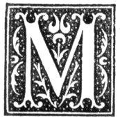

  
[Intangible Textual Heritage](../../../index)  [Legends and
Sagas](../../index)  [Celtic](../index)  [Index](index) 
[Previous](nes23)  [Next](nes25) 

------------------------------------------------------------------------

p. 149

# CHAPTER XXI.

### TIMES AND SEASONS AND WEATHER.

### THE DAYS OF THE WEEK.

|                     |
|---------------------|
|  |

ONDAY was, accounted an unlucky day on which to begin a piece of work.
There were parents who would not enter their children at school on this
day.

With regard to the weather, the saw is:--

"A harn Monanday macks a linen week."

Tuesday was regarded as a lucky day for entering on any new work, and
for sending children to school for the first time.

Wednesday is aye weather-true,  
Futher the meen be aul or new."

Friday was specially avoided as the day on which to begin any piece of
work. It was very unlucky for a ship to sail on this day. [1](#fn_118)

A Friday with fine weather during a time of wet is called a "flatterin’
Friday," and is supposed to indicate a continuance of wet weather.

Saturday was looked upon by some as a day of luck to enter into any
undertaking.

A new moon on Saturday was looked upon as the forerunner of stormy
weather:--

A Saiterday meen an’ a Sunday's prime  
Gehn she cum ance in saiven year  
She comes in gueede time." [2](#fn_119)

### THE MONTHS.

"Feberwarry sud fill the dyke  
Wi’ black or fite,  
Aither wi’ caff or strae,  
Or it gae."

p. 150

The month of March is an important month in the North with respect to
the preparation of the soil for receiving the seed. It holds a prominent
place in folk-lore in the shape of proverbs and saws. One proverb is:--

"A peck o’ March dust is worth a king's ransom."

Another is:--

"A peck o’ March dust is worth its waicht in goud."

Other proverbs about March are:--

"March and come in like an adder's head, an gang oot like a peacock's
tail."

"March sud come in like a boar's head, an gang oot like a peacock's
tail."

"March sud come in like a lion an gang oot like a lam’."

There are two versions of the rhyme about the "borrowing days":--

"March borrowed from April  
Three days, and they were ill;  
The first it wiz snaw an sleet,  
The second it was caul an weet,  
The third it was sic a freeze  
The birds' nibs stack t’ the trees."

"March said to April--  
I see three hoggs on yonder hill,  
In ye wad lend me dayis three  
I'll dee ma best t’ gar them dee." [1](#fn_120)

Of an April day, when there were alternate showers and sunshine, with a
good breeze and large clouds fleeting across the blue sky, it was said,
"It's an April day, it's sheetin an glintin."

Of May there are various and contradictory sayings:--

"May comes in wi’ warm shoors  
An raises a' the grais;  
An a' the floors o’ May an June  
They do incraise."

But there is another side to this picture of the first days of May; they
were supposed to come accompanied by cold and wet, and hence they were
called the "gab o’ May."

Crops in the North of Scotland depend a good deal on the weather in May,
and this fact is embodied in several proverbs.

p. 151

"Him it leuks at’s crap in May  
Gangs mournin for aye."

"May makes the hay."

"A misty May an a drappy June  
Pits the fairmer in gueede tune."

"A misty May an a drappy June  
Macks the crap come in soon."

"A misty May and a drappy Jeene  
Macks an eer hairst, an seen deen."

Washing the face with dew gathered on the morning of the first day of
May kept it from being tanned by the sun and becoming freckled. [1](#fn_121)

"If Candlemas day be clear and fair,  
The half o’ winter is t’ gang and mair;  
If Candlemas day be dark and foul,  
The half o’ the winter is deen at Yule." [2](#fn_122)

If the wind is in the north on the Rood-day, bad weather follows.

The wind was said to blow during the quarter--the "raith"--in that
direction in which it blew during the first day of the quarter.

### THE MOON.

It was unlucky to see the new moon for the first time through a window,
or with empty hands. [3](#fn_123) To have
something in the hand on the first sight of the new moon was lucky, and
indicated a present before the moon had waned. The money in the pocket
must be turned when the first sight of the new moon was caught. [4](#fn_124) Some there were who, on catching the
first sight of the new moon, kissed the one next them.

The "mairt" or the pig, that was to be salted, must be killed when the
moon was on the increase, else the meat would not keep well. Rennet made
from an animal killed except when the moon was waxing was of no
use. [5](#fn_125)

p. 152

Fish hung in moonlight was supposed to acquire poisonous qualities.

It was looked upon as dangerous to sleep with the moon shining on the
face. The whole face, but particularly the mouth, became twisted. This
was especially believed in by sailors. Sleeping in the moonlight might
cause madness.

The moon was supposed to exercise great influence in the ripening of the
grain--as much, in fact, as the sun, if not more.

A halo round the moon is called "a broch," and is thought to indicate a
fall of rain or snow. Hence the proverb, "A broch aboot the meen ’ill be
aboot the midden afore mornin."

A small bright circle round the moon is called in some districts a
"cock's eye," and is supposed to indicate unsettled weather.

When the new moon is seen soon after her coming in, it is regarded as a
sign of foul weather.

When the new moon looks as if "lying on her back," that is also supposed
to indicate foul weather.

If the "old" moon is seen as it were lying in the bosom of the new, it
is still regarded as a sign of a coming storm, as it was in days of
old:--

"I saw the new moon late yestreen,  
Wi' the auld moon in her arm;  
And I fear, I fear, my master dear,  
That we shall come to harm."

Another weather saw drawn from the moon is:--

"Auld meen mist,  
New meen drift."

### MOCK SUN.

A mock sun is in some parts called a "ferrick," and is believed to
indicate the coming weather according to its position--east or west of
the sun, or "behind" or "before" the sun. Hence the saying:--

"A ferrick afore  
Ayont the score;  
A ferrick ahin  
Y’ill shortly fin."

p. 153

### THE RAINBOW.

When a rainbow appears the following rhyme is shouted at the top of the
voice: [1](#fn_126)--

"Rainbow, rainbow,  
Brack an gang hame,  
The cow's wi’ a calf,  
The yow's wi’ a lam,  
An the coo ’ill be calvt  
Or ye win hame."

Another version of it is:--

"Rainbow, rainbow,  
Brack an gang hame;  
Yir father an yir mither's aneth the layer-stehn;  
Yir coo's calvt, yir mare's foalt,  
Yir wife ’ill be dead  
Or ye win hame."

A shorter cry is:--

"Rainbow, rainbow,  
Brack an gang hame,  
Yir father an mither 's aneth the grave stehn."

### THUNDER, &c.

During thunder it was not unusual for boys to take a piece of thin wood
a few inches wide and about half-a-foot long, bore a hole in one end of
it, and tie a few yards of twine into the hole. The piece of wood was
rapidly whirled round the head, under the belief that the thunder would
cease, or that the thunderbolt would not strike. It went by the name of
"thunner-spell."

### SNOW.

It was a common saying in parts of Banffshire that the snow of the
coming winter made its appearance--"cast up"--during harvest in the
large, white, snowy-looking clouds that rise along the horizon. They
were called "Banff bailies," and at all seasons of the year were looked
upon as the forerunners of foul weather.

When it was snowing heavily the following was repeated:--

"Ding on, ding on, ding on drift,  
A’ the fisher wives is comin fae the kirk."

p. 154

When snow is falling in flakes ("flags") the saying is that the folks in
Orkney are plucking geese.

### RAIN.

A shower of rain was greeted with the words:--

"Ding on, ding on daily,  
Ilky drap’t fill cap."

A saw about rain with respect to the hours of the day is

"Rain afore seven  
Fair afore eleven." [1](#fn_127)

In wet weather, when a clear opening-called in some districts (Keith) "a
borie"--appears near the sun at sunset, it is looked upon as indicating
a continuance of foul weather.

When rain comes from the south-west with a somewhat clear horizon, with
the appearance that the rain would cease in a short time, it is called
"a lauchin rain," and is believed to last for some time.

When there was much dust blowing along the roads in summer, rain was
regarded not far distant. The common saying was that the dust would soon
be laid.

### MIST.

On some parts of the Moray Firth the following was a weather-saw:--

"Fin the mist comes fae the sea,  
Dry weather it ’ll be;  
Fin the mist comes fae the hill,  
Ye'll get wattir t’ yer mill."

### CLOUDS.

When the wind is south and carrying large heavy clouds northward, the
saw is that "the Earl of Moray will not be long in debt to the Earl of
Mar." By this is meant that the wind will soon veer towards the north,
and that there will be unsettled weather.

p. 155

Small clouds--"packies, pack-merchans"--moving eastwards from south,
south-west, or west, indicate that the wind will soon blow from south or
south-west.

"An evenin red and a mornin gray  
Is the appearance o’ a bonnie day."

### THE WIND.

If the wind is blowing from the south or south-west, and a cloud begins
to appear in the north-west horizon, a sudden burst of a heavy storm is
at, hand; and if any of the fishing boats are at sea not a moment is
lost in making for land.

If, in the evening, the west and north-west horizon become covered with
cloud, with the wind to the south or south-west, if the wind remains in
the same quarter, the following day will be fine, but if the wind shift
to the north-west, or, as the saying is, go into the face of the cloud,
stormy weather follows.

The wind that blows from the west or north-west but towards evening
veers to north is called "the wife it gangs oot at even." A breeze is at
hand (Pittulie).

Along the Moray Firth the fishermen call the noise of the waves "the
song of the sea." If the song is towards the east the wind will shortly
blow from east or south-east. If a "long song" is heard from the bar at
Banff, the wind will blow from the west.

The swell that often comes before the storm goes by the name of "the dog
afore his maister," and the swell that remains after the storm has
ceased, "the dog ahin his maister."

------------------------------------------------------------------------

### Footnotes

[149:1](nes24.htm#fr_118) Cf. *F. L. Record*,
vol. i. p. 13 (50, 52) and vol. ii. p. 205.

[149:2](nes24.htm#fr_119) Cf. *Choice Notes*,
p. 288.

[150:1](nes24.htm#fr_120) Cf. Henderson, p. 95.

[151:1](nes24.htm#fr_121) Cf. Henderson, pp.
85, 86, and *Choice Notes*, pp. 18, 19.

[151:2](nes24.htm#fr_122) *Ibid*. p. 76, and
*Choice Notes*, pp. 180, 293, 294.

[151:3](nes24.htm#fr_123) Cf. *F. L. Record*,
vol. i. p. "(28), and *Choice Notes*, p. 175 (9).

[151:4](nes24.htm#fr_124) Cf. Henderson, p.
114.

[151:5](nes24.htm#fr_125) Cf. *F. L. Record*,
vol. i. p. 11 (29), and vol. ii. p. 32.

[153:1](nes24.htm#fr_126) Cf. Henderson, p. 24.

[154:1](nes24.htm#fr_127) *Choice Notes*, pp.
292, 296.

------------------------------------------------------------------------

[Next: Chapter XXII. Christmas, New Year's Day, &c.](nes25)
