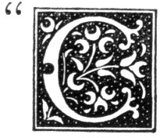

  
[Intangible Textual Heritage](../../../index)  [Legends and
Sagas](../../index)  [Celtic](../index)  [Index](index) 
[Previous](nes25)  [Next](nes27) 

------------------------------------------------------------------------

p. 169

# CHAPTER XXIII.

### COUNTINGS-OUT.

|                      |
|----------------------|
|  |

OUNTINGS-OUT" form a curious item of folklore and seem to be common
among different nations in a variety of forms. The following have been
collected in Banffshire and Aberdeenshire. Those who wish to look more
into this subject may be referred to a paper on the "Anglo-Cymric Score"
in the Transactions of the Philological Society, London (volume for
1877-79, pp. 316-372), by Mr. Ellis, one of the vice-presidents of the
society. The following were in use in Fraserburgh:--

The following were in use in Fraserburgh:--

"Eenrie, twaarie, tickerie, teven,  
Allaby, crockery, ten, or elaiven,  
Peen, pan, fusky dam,  
Wheedlum, whadlum, twenty-one."

"Eetum, peetum, penny pump,  
A’ the laadies in a lump;  
Sax or saiven in a clew,  
A’ made wi’ candy glue."

"One, two, three, four,  
Tack a mell an ding ’im our."

"One, two, three, four, five, six, siven,  
A’ that fisher dodds widna win t’ haven."

"Eerinnges, oranges, two for a penny,  
A’m a good scholar for coontin so many."

"Ink, pink,  
Penny, stink."

"Hetum, petum, penny pie,  
Pop a lorie, jinkie, jye.  
An, tan, toap,  
Stall ye oot by  
For a bonny penny pie."

p. 170

Anerie, twaarie, tickerie, saiven,  
Hallabie, cockabie, ten, a belyven,  
Pin, pan, muskie, dan,  
Tweedlum, twadlum, twenty-one."

"I saw a doo flee our the dam,  
Wi’ silver wings an golden ban;  
She leukit cast, she leukit west,  
She leukit fahr t’ light on best;  
She lightit on a bank o’ san’  
T’ see the cocks o’ Cumberlan’.  
Fite puddin, black trout,  
        Ye're oot."

"As I geed up the brandy hill  
I met my father--he geed wull,  
He hid jewels, he hid rings,  
He'd a cat wi’ ten tails,  
He'd a ship wi’ saiven sails,  
He'd a haimmer dreeve nails.  
Up Jack, doon Tam,  
Blaw the bellows, aul’ man."

"Mr. Smith's a very good man,  
He teaches his scholars noo an than,  
An fin he's deen, he tacks a dance  
Up t’ London, doon t’ France.  
He wears a green beaver wi’ a snoot,  
Tarry cedle, ye're oot."

"Endy tendy, ticker a been,  
I sent a letter to the Queen,  
The Queen o’ Jerusalem sent it t’ me,  
Ocus, pocus, one, two, three."

"Eentie, teentie, tippenny bun,  
The cat geed oot to get some fun,  
To get some fun played on a drum  
Eentie, teentie, tippenny bun."

"Mr. Mundie, foo’s yir wife  
'Verra sick, an like t’ die.'  
'Can she eat ony butcher meat?'  
'Yes; more than I can buy.  
Half a horse, half a coo,  
Half three-quarters o’ a soo.  
She mak’s her pottage very thin;  
A pound o’ butter she puts in.'  
Fite puddin, black troot,  
           Ye're oot".

p. 171

The following flourished long ago in the parish of Tyrie:--

"Eetum, peetum, jinkie, jie,  
Staan ye oot by."

"Eetum, peetum, penny pie,  
Staan ye oot by."

"Eetum for peetum,  
The King cam t’ meet him,  
And dang John Hamilton doon."

Pitsligo gives:--

"Item, peetun, peeny pie,  
Pop a lorie, jinkie jye,  
Ah day doot,  
Staan ye oot by."

Rathen gives:--

"Anery, twaaery, tickery, seiven,  
Allaby, crackaby, ten an eleiven,  
Pin, pan, musky dan,  
Tweedletum, twadletum, twenty-one."

The following were in use in Portsoy:--

"Eerie, aarie,  
Biscuit Mary,  
Pim, pam, pot."

"Enerie, twaarie, tickerie, ten,  
Allabie, crackabie, ten, or eleevin,  
Pim, pam, musky dam,  
Queevrie, quaavrie, English man."

"Eerie, aarie, ackertie, ann,  
Feelicie, faalicie, mixin, John,  
Queevrie, quaavrie, Irish man,  
Stinklum, stanklum, buck."

"Eetum, peetum, penny pie,  
Cock-a-lorie, jinky jye,  
Staan ye oot by  
For a bonnie penny pie."

"As I geed up the aipple tree,  
A’ the aipples stack t’ me.  
Fite puddin, black trout,  
I choose you oot  
For a dirty dish clout."

p. 172

"Eringies, orangies,  
Two for a penny,  
Come all ye good scholars  
That counted so many.  
The rose is red, the grass is green,  
The days are gane  
That I hae seen.  
Kettie, my spinner,  
Cum doon t’ yir dinner,  
And taste a leg of frog.  
Mr. Frog is a very good man,  
He takes a dance up to France  
Noo an than."

The foregoing was in use when the number to be counted out was large.

"Yokie, pokie, yankie, fun,  
How do you like your potatoes done?  
First in brandy, then in rum,  
That's how I like my potatoes done."

1n the following formula the syllable *ca* must be added to the end of
each word:--

"I wud gee a’ my livin’  
That my wife were as fite an as fair  
As the swans that flee our the milldam."

Keith furnishes the following:--

"Anerie, twaarie, tickrie, ten,  
Epsom, bobsum, gentle men,  
Pim, pam, whisky dam,  
Feedlum, fadlum, twenty-one."

"Eerie, airie, ackertie ann,  
Hunches, bunches, English man,  
Back oot, back in,  
Back throw the heelie pin.  
Peter cam t’ oor door,  
Playin at the pipes,  
Cum a riddle, fizz oot."

"Anerie, twaarie, tickerie, ten,  
Bobsie, munsie, gentle men,  
Ting, tang, muskie dam,  
Feedlum, fan, twenty-one."

p. 173

"Heetum, peetum, penny pie,  
Pop a lorie, jinkie jye,  
Eadie, ootside,  
Staan ye oot by."

"Anery, twaaery, tickery seven,  
Halaby, clackaby, ten and eleven,  
Teish, tosh, maca bosh,  
Tid, taddle, tiddle, stink."

Banff furnishes the following:--

"John, rod, tod, rascal."

"Eenitie, feenitie, ficer, ta  
Fae, el, del, domina,  
Irky, birky, story, rock,  
An, tan, toust."

"Eenitie, teenitie, tippinny bun,  
The cat geed oot to get some fun,  
She got some fun,  
She played the drum,  
Eenity, teenity, tippinny bun."

"Ease, ose, man's nose,  
A potty fon o’ water brose."

"The moose ran up the clock,  
The clock struck one,  
Doon the moosie ran,  
Ickety, dickety, dog, dan."

"Ane, twa, three, four,  
Mary at the cottage door  
Eating cherries off a plate,  
Five, six, seven, eight."

"Eerie, aarie, ecertie, ann  
Bobs in vinegar I began  
Eat, at  
Moose, rat,  
I choose you oot for a pennie pie,  
Pur."

"Mr. Mungo, foo’s yir wife?'  
'Very sick an like t’ die.'  
'Can she eat any butcher meat?'  
'Yes; more than I can buy. p. 174  
Half a sow,  
Half an ox, half a quarter of a cow;  
She likes her porridge very thin,  
A pound of butter she puts in.'  
I choose you oot  
For a penny pie, put,"

"Fussle Beardie hid a coo  
Black an fite aboot the moo,  
Wizna that a dainty coo  
Belongt to Fussle Beardie."

"Fussle Beardie hid a horse;  
It hault the cairtie through the moss,  
Broke the cairtie, hangt the horse  
Wizna that a dainty horse  
Belongt t’ Fussle Beardie."

"Rob Law's lum reeks  
Roon about the chimney-cheeks."

"Rise, Sally Walker, rise if you can,  
Rise, Sally Walker, an follow your gueedeman,  
Come, choose to the East,  
Come, choose to the West.  
Come, choose to the very one I love best."

"As I gaed up the brandy hill  
I met my father; he geed will.  
He'd jewels, he'd rings,  
Held mony fine things,  
He'd a cat wi’ ten tails,  
He'd a ship w' saiven sails.  
Up Jack, down Tom,  
Blow the bellows, old man.  
Old man had a coat,  
He rowed aboot i’ the ferry-boat;  
The ferry-boat's our dear,  
Ten poun’ i’ the year.  
I've a cherry, I've a chest,  
I've a bonny blue vest,  
I've a dog amo’' the corn,  
Blawin’ Willie Buck's horn.  
Willie Buck hiz a coo,  
Black an fite aboot the moo,  
It jumpit our the Brig o’ Muck,  
An ran awa fae Willie Buck."

p. 175

"Anerie, twaarie, tickerie, teven,  
Hallaby, crackeby, tenaby, leven,  
Pim, pam, musky, dam,  
Feedlum, faadlum, twenty-one."

"Ees, aas, oos, ink,  
Peas, pottage, sma’ drink,  
Twa an twa’s a tippenny loaf,  
Twa an twa’s it."

"Humble, humble, Mister Fumble,  
Three score an ten,  
Learn me to double a hundred  
Over an over again."

Black fish, fite troot,  
Eerie aarie, ye're oot."

"John Smith, a folla fine,  
Cam t’ shoe a horse o’ mine.  
    Shoe a horse,  
    Ca a nail,  
Ca a tacket in its tail.  
Black fish, fite troot,  
Eerie, aarie, ye're oot."  
Mr. Dunn's a very good man,  
He teaches scholars, now and than;  
And when he's done he takes a dance  
Up to London, down to France.  
He wears a bonnet wi’ a green snoot  
Eerie, aarie, ye’er oot."

"'Mr. Murdoch, how's your wife?'  
'Very ill, and like to die.'  
'Can she eat any meat?'  
'Yes, as much as I can buy;  
She makes her porritch very thin,  
Pounds o’ butter she puts in.'  
Black fish, fite troot,  
Eerie, aarie, ye're oot."

 

------------------------------------------------------------------------

[Next: Chapter XXIV. Washing Day](nes27)
