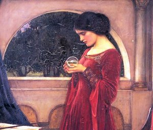

  
[Intangible Textual Heritage](../../../index)  [Legends and
Sagas](../../index)  [Celtic](../index)  [Prophecy](../../../pro/index) 

------------------------------------------------------------------------

[Buy this Book at
Amazon.com](https://www.amazon.com/exec/obidos/ASIN/0766136337/internetsacredte)

------------------------------------------------------------------------

<table width="75%">
<colgroup>
<col style="width: 50%" />
<col style="width: 50%" />
</colgroup>
<tbody>
<tr class="odd">
<td width="50%" data-valign="TOP"></td>
<td width="50%" data-valign="CENTER"><h1 id="the-prophecies-of-the-brahan-seer" data-align="CENTER">The Prophecies of the Brahan Seer</h1>
<h2 id="by-alexander-mackenzie" data-align="CENTER">by Alexander Mackenzie</h2>
<h4 id="section" data-align="CENTER">[1899]</h4></td>
</tr>
</tbody>
</table>

------------------------------------------------------------------------

[Contents](#contents)    [Start Reading](pbs00)

------------------------------------------------------------------------

|                                                                                                                           |
|---------------------------------------------------------------------------------------------------------------------------|
|  |

Kenneth Mackenzie, also known as Coinneach Odhar or the Brahan Seer, was
a legendary Scottish clairvoyant. Tradition dates his birth to the early
17th century in Uig, on the island of Lewis. This is the northernmost
island of the Outer Hebrides, a chain of islands to the west of
Scotland's northern coast. Legend has it that he came into his talent
after napping on a fairy hill and finding a small stone in his coat,
which allowed him to view the future. Predictably, legend has it that he
was eventually burned to death as a sorcerer by being immersed in a
barrel of burning tar. Before his death he forespoke the doom of the
noble Mackenzie family who had him executed: the last male heir of this
line would be deaf. In the 19th century this came true, as the last of
the Mackenzies lost his hearing in his youth.

He is inevitably compared with Nostradamus. However, unlike Nostradamus,
many of predictions attributed to the Brahan Seer are very
straightforward and literal, instead of being cloaked in word games,
riddles and allegory. For instance, a typical prediction is that a
specific church roof would collapse when a magpie made a nest in it for
three years running. There are predictions of the birth of a two-headed
calf, a boulder falling over, and the plaintive death of a French
expatriate in the Isles, mourned by a local woman. Other reputed
predictions were of "a chariot without horse or bridle", and "fiery
chariot\[s\]" which could interpreted as a premonition of railroads or
automobiles ([p. 35](pbs07.htm#page_35)), and "hills strewn with
ribbons", ([p. 10](pbs04.htm#page_10)) which sound like powerlines, but
this is about as futuristic as he gets. Unlike Nostradamus, none of his
predictions are about geopolitics, global war, or the distant future.

The problem with the Brahan Seer is that there is no contemporary or
historical record of any such individual ever existing. This is not
surprising given the paucity of Scottish written sources from that
period. This book, written by the noted Scottish folklorist Alexander
Mackenzie, is *the* primary source for the Brahan Seer legend, and it
was written in the late 19th century. The fact is, there are no Brahan
Seer manuscripts or old editions with known provenance which could be
used to back-test his predictions, as with Nostradamus. These accounts
are oral tales which doubtless 'grew in the telling.' Given the Scottish
fascination with 'second sight' and story-telling, it is not impossible
that the Seer's best predictions were invented after the fact to match
up with events, and a generation or two later ended up as being accepted
as fact. Indeed, it appears that people are still creating Brahan Seer
lore. Some of the material you will find elsewhere on the Internet about
him doesn't appear in this book: draw your own conclusions.

However, the narrative is a gripping tale with a punchline delayed by
two centuries. There is definitely a subversive subtext in the story arc
of a man of humble origins who gains magical powers, and foretells the
doom of the landed nobility before his brutal execution. Whether or not
he was 'The Scottish Nostradamus,' the tale of the Brahan Seer can be a
source of national pride for Scottish people everywhere.

--J.B. Hare, Sept. 13, 2006

------------------------------------------------------------------------

 [Title Page](pbs00)  
[Contents](pbs01)  
[The Brahan Seer and Second Sight, By Andrew Lang](pbs02)  
[General Introduction](pbs03)  
[Prophecies Which Might Be Attributed to Natural Shrewdness](pbs04)  
[Unfulfilled Prophecies](pbs05)  
[Prophecies as to The Fulfilment of Which There is a Doubt](pbs06)  
[Prophecies Wholly Or Partly Fulfilled](pbs07)  
[Sketch of the Family of Seaforth](pbs08)  
[Seaforth's Dream](pbs09)  
[Seaforth's Doom](pbs10)  
[The Seer's Death](pbs11)  
[The Fulfilment of the Seaforth Prophecy](pbs12)  
