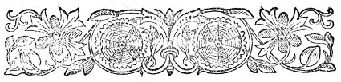
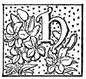
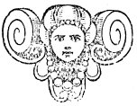

  
[Intangible Textual Heritage](../../../index)  [Legends and
Sagas](../../index)  [Celtic](../index)  [Prophecy](../../../pro/index) 
[Index](index)  [Previous](pbs03)  [Next](pbs05) 

------------------------------------------------------------------------

[Buy this Book at
Amazon.com](https://www.amazon.com/exec/obidos/ASIN/0766136337/internetsacredte)

------------------------------------------------------------------------

*Prophecies of the Brahan Seer*, by Alexander Mackenzie, \[1899\], at
Intangible Textual Heritage

------------------------------------------------------------------------

p. 9

 

### PROPHECIES WHICH MIGHT BE ATTRIBUTED TO NATURAL SHREWDNESS.

|                     |
|---------------------|
|  |

E no doubt predicted many things which the unbeliever in his prophetic
gifts may ascribe to great natural shrewdness. Among these may be placed
his prophecy, 150 years before the Caledonian Canal was built, that
ships would some day sail round the back of Tomnahurich Hill. A
gentleman in Inverness sent for Coinneach to take down his prophecies.
He wrote several of them, but when he heard this one, he thought it so
utterly absurd and impossible, that he threw the manuscript of what he
had already written into the fire, and gave up any further communication
with the Seer. Mr. Maclennan gives the following version of
it:--"Strange as it may seem to you this day, the time will come, and it
is not far off, when full-rigged ships will be seen sailing eastward and
westward by the back of Tomnahurich, near Inverness." Mr. Macintyre
supplies us with a version in the Seer's vernacular Gaelic:--"Thig an
latha ’s am faicear laraichean Sasunnach air an tarruing le srianan
corcaich seachad air cul Tom-na-hiuraich." (The day will come when
English mares, with hempen bridles, shall be led round the back of
Tomnahurich.) It is quite possible that a man of penetration and great
natural shrewdness

p. 10

might, from the appearance of the country, with its chain of great
inland lakes, predict the future Caledonian Canal. Among others which
might safely be predicted, without the aid of any supernatural gift,
are, "that the day will come when there will be a road through the hills
of Ross-shire from sea to sea, and a bridge upon every stream". "That
the people will degenerate as their country improves." "That the clans
will become so effeminate as to flee from their native country before an
army of sheep." Mr. Macintyre supplies the following version of the
latter:--Alluding possibly to the depopulation of the Highlands,
Coinneach said "that the day will come when the Big Sheep will overrun
the country until they strike (meet) the northern sea". Big sheep here
is commonly understood to mean deer, but whether the words signify sheep
or deer, the prophecy has been very strikingly fulfilled. The other two
have also been only too literally fulfilled.

Mr. Macintyre supplies another version, as follows: "The day will come
when the hills of Ross will be strewed with ribbons". It is generally
accepted that this prediction finds its fulfilment in the many good
roads that now intersect the various districts of the country. Other
versions are given, such as 'a ribbon on every hill, and a bridge on
every stream' (Raoban air gach cnoc agus drochaid air gach alltan); 'a
mill on every river and a white house on every hillock' (Muillinn air
gach abhainn agus tigh geal air gach cnocan); and 'that the hills of the
country will be crossed with shoulder-halts' (criosan guaille). Since
Kenneth's day mills were very common, and among the most useful
industrial institutions of the country, as may be evidenced by the fact
that, even to this day, the proprietors of lands, where such
establishments were once located, pay Crown and Bishop's rents for them.
And may we not discover the fulfilment of

p. 11

\[paragraph continues\] "a white house on
every hillock" in the many elegant shooting lodges, hotels, and
school-houses now found in every corner of the Highlands.

Mr. Maclennan supplies the following:--There is opposite the shore at
Findon, Ferrintosh, two sand banks which were, in the time of the Seer,
entirely covered over with the sea, even at the very lowest spring ebbs.
Regarding these, Coinneach said, "that the day will come, however
distant, when these banks will form the coast line; and when that
happens, know for a certainty that troublesome times are at hand".
"These banks," our correspondent continues, "have been visibly
approaching, for many years back, nearer and nearer to the shore." This
is another of the class of predictions which might be attributed to
natural shrewdness. It is being gradually fulfilled, and it may be well
to watch for the "troublesome times," and so test the powers of the
Seer.

Other predictions of this class may occur as we proceed, but we have no
hesitation in saying that, however much natural penetration and
shrewdness might have aided Kenneth in predicting such as these, it
would assist him little in prophesying "that the day will come when
Tomnahurich," or, as he called it, Tom-na-sithichean, or the Fairy Hill,
"will be under lock and key, and the Fairies secured within". It would
hardly assist him in foreseeing the beautiful and unique cemetery on the
top of the hill, and the spirits (of the dead) chained within, as we now
see it.

Since the last edition of the "Prophecies" appeared, our attention has
been called to the following paragraph published in the *Inverness
Advertiser*, in 1859; that is *before* it had been turned into a
Cemetery--"Tomnahurich, the far-famed Fairies' Hill, has been sown with
oats. According to tradition, the Brahan prophet who lived 200 years
ago,

p. 12

predicted that ships with unfurled sails would pass and repass
Tomnahurich; and further, that it would yet be placed under lock and
key. The first part of the prediction was verified by the opening of the
Caledonian Canal, and we seem to be on the eve of seeing the realization
of the rest by the final closing up of the Fairies' Hill." This
paragraph was in print before the prediction was fulfilled.

 

------------------------------------------------------------------------

[Next: Unfulfilled Prophecies](pbs05)
