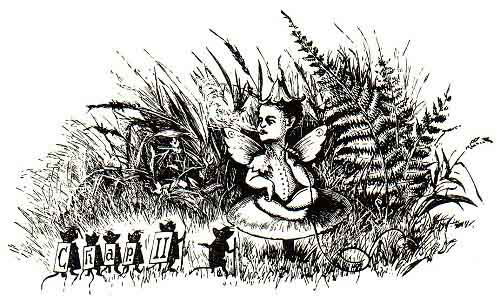
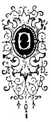
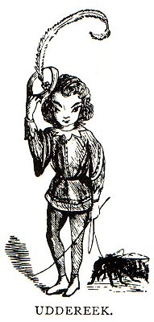
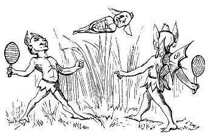

  
[Intangible Textual Heritage](../../../index) 
[Legends/Sagas](../../index)  [Celtic](../index)  [Index](index) 
[Previous](phy04)  [Next](phy06) 

------------------------------------------------------------------------

 

### CHAPTER II

|                     |
|---------------------|
|  |

NE summer evening Kitty was seated as usual under the shade of the
fuchsia trees at the cottage door, her delicate fingers busy with the
yarn, while her spinning-wheel whirled round and round with a pleasant
and homely hum, its treadle worked with the prettiest little foot in the
island. Old Kerruish had gone to the DOONEY-MOOAR, the great man of the
parish of Ballaugh, to carry home some work he had just completed, and
Kitty was singing to herself a sweet, plaintive air, while awaiting his
return.

Pausing in her song, she turned her head, the better to listen for the
old man's footsteps as he came up the glen, when she suddenly saw,
standing beside her, what she took to be a little child. Her first
impression was that it was one of neighbour Mylrea's children, who had
wandered up the glen from the valley below, having come up the course of
the stream, as the little ones frequently did, in search of trout, which
they had a dexterous and somewhat unorthodox method of catching, by
means

p. 8

of routing about under the stones with a stick, and frightening the fish
to a rudely-constructed hand-net.

A second glance at once showed her she was mistaken. It was not little
Tommy Mylrea. What stood before her was no mortal child, but little
fairy mannikin of most gallant and graceful bearing. Kitty had never
before seen anything so charming or imagined aught so lovely.

"Sweet maid," said he, taking her hand in his and raising it to his

<table data-align="LEFT">
<colgroup>
<col style="width: 100%" />
</colgroup>
<tbody>
<tr class="odd">
<td data-valign="CENTER"> 
UDDEREEK</td>
</tr>
</tbody>
</table>

lips with a grace and style that would have been envied by any gentleman
of the court of the "Grand Monarque," "continue thy song, and be not in
the least alarmed."

"Who and what are you?" she exclaimed, withdrawing her hand from his
impassioned grasp, and feeling, in spite of an inner conviction, that he
was hardly a "canny" visitor, most agreeably impressed by the wee
creature's face and manner.

"Lovely Kitty--*Ben-my-chree*--I am your most devoted admirer, your
slave. In me you see no mortal, but a fairy mannikin, whose heart has
for long past been truant to his race, and devoted, oh, I cannot tell
how truly and intensely fixed on thee. Nay, sweet maiden," continued the
little man, again seizing her hand, and overcoming the coy resistance
she at first displayed, I would not harm thee for all the elfin world.
Often and often have I watched thee here, and witnessed how thou hast
heard, unheeded, the rhapsodies poured into thine ear by the mortal
admirers of thy wondrous and unequalled beauty, as they have offered
thee their love. I was here when Evan Christian urged his suit, and was
sent away with a bitter and bad feeling in his heart, and the knowledge
that only on your father's death can he have any hopes of gaining your
affection. I looked on from under yonder hart's-tongue fern when Bob
Faragher vowed he would work his fingers to the bone for you, and prayed

p. 9

you to become the mistress of Ballasaig. I saw his dejected look and
heard his heavy sigh, as before turning down the glen by the peat-stack,
he cast a parting and a longing look as you carried your spinning-wheel
into the cottage. I have heard all their avowals, and seen how each one
has been refused. Oh, how I chuckled as I saw them depart, baffled and
disappointed; but my heart, sweet Kitty, my love, is beyond them all.
Nothing that any mortal, any mere man, ever felt or can feel at all
approaches the intense adoration, the worship I now offer to you, dear
Kitty--*Mooar-Ben-my-chree*--and that love I now lay at your feet."

The poor girl was utterly powerless to resist so passionate and so
earnest an appeal as the handsome little mannikin poured forth with a
volubility that admitted of no interruption. His presence completely
fascinated and overpowered her. It seemed as if her heart, which had so
long and so stoutly withstood the assaults of all her mortal swains, was
suddenly captured by the *coup de main* of her elfin lover. She was
spell-bound, and had at once to give way before his impetuous attack,
and surrender at discretion. Her whole inner being was changed. She felt
that now, but never before, she knew what love--fiery, intense,
passionate, consuming love--really was. It took possession of her whole
soul. The dart of Cupid had pierced her lovely bosom to the very haft.
The tender but all-potent passion had absorbed her life and taken entire
possession of her very existence. She felt a perfect agony of pleasure,
as with wrapt attention to his every word and all oblivious to
everything around but him, she listened while he continued to address
her.

"Hear me, dearest maid, and let me plead my cause. I hold a high
position at my elfin sovereign's court, and the fairest of our fairy
maids in vain display their beauteous charms to me. Thou, sweet Kitty,
and thou alone, possess the love, the heart of Uddereek."

Springing lightly up on to her spinning-wheel, the little lover threw
his arms around her neck and passionately covered her sweet, rosy,
pouting lips with his fervent kisses.

Kitty was enthralled, and unresistingly submitted to the gallant
Uddereek's

p. 109

love, ardent as it was, and it was with feelings akin to deep regret
that after a while, when the sound of her father's footsteps were heard
coming up the glen, she saw him making preparations to depart.

"Hark! What sounds are those? I must now away. Kitty, *Ben-my-chree*, I
hear thy father drawing near. No one must be a witness to our love.
Should it e’er be known at the elfin court that I have dared to love, or
even, *Fact-y-tooil-graigh*, cast a longing eye on mortal maid, I know
not what dreadful fate might befall me. But, *Kitty-ma-cushla* (my
darling Kitty), for thee and thy love I would risk all, if it were a
thousandfold as much, and brave the direst vengeance of the fairy power.
But the better to keep the secret, both from mortal and fairy ken, of
our meetings and our love, I will await thee, my own, each evening at
the twilight hour under the blue rowan tree in the *Magher-Glass*, Glen
Aldyn (in the green field of Glen Aldyn), down there in the valley,
beside where the limpid stream springs frisking o’er the rocks and
dashes down into the lower *Gully-Mooar*."

Once again clasping her in his tiny arms and impressing a passionate
kiss upon her lips, and murmuring a soft, tender farewell, he vanished
from before her as suddenly as he came.

Kitty, who thought she had fallen asleep, and that all had been a
glorious and delicious dream, sat entranced and musing after he had
gone, gazing intently on the spot where Uddereek had disappeared. She
felt half pleased half frightened at the new, strange sensation her
heart now for the first time experienced. On the morning of that day she
had risen a simple girl; now she was a perfect woman, with all woman's
feelings. She felt, come weal, come woe, her whole future existence was
bound up in that of her elfin lover. She sat on gazing vacantly before
her, and when old Billy Nell drew near the cottage and gave the
accustomed signal of his return home, he was surprised at its not being
answered, and at hearing nought of Kitty's voice. He turned into the
garden, but instead of her hurrying forward to meet him as was her wont,
she was sitting silent and still, looking vacantly into space. No
blithesome song, no busy truddle of

p. 11

the spinning-wheel as usual welcomed the old man's return. The distaff
was on the ground at her feet, the wheel was overturned and lay against
the house wall, where the fairy man had cast it when he sprang away in
his flight; the yarn was broken and entangled, and Kitty sat utterly
heedless of his approach.

She noticed him not, but her lips moved. He approached her and listened,
as she gently murmured--

"*Ogh-cha-nee*, Woe's me. *Ta-graigh-ayn*, I love him."

The old man listened with astonishment to her mutterings. He called her
by name, and instantly she jumped up, and, passing her hands before her
eyes, as if awakening out of a trance or sleep, she welcomed him home in
her old fond loving way, and after relieving him of his staff and
kelpie, hastened to prepare their frugal evening meal of griddle cakes
made of placket meal and salt herrings, washed down with fresh
butter-milk and followed by a dish of *Pinjean* (*Anglice*,
curds-and-whey), for the making of which in perfection Kitty was famous.

 

------------------------------------------------------------------------

[Next: Chapter III](phy06)
