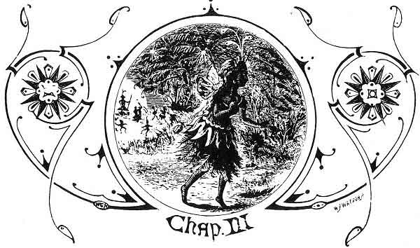
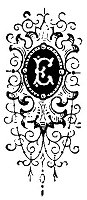
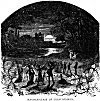
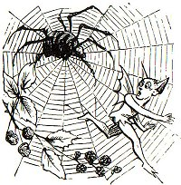

  
[Intangible Textual Heritage](../../../index) 
[Legends/Sagas](../../index)  [Celtic](../index)  [Index](index) 
[Previous](phy05)  [Next](phy07) 

------------------------------------------------------------------------

p. 12

 

### CHAPTER III

|                     |
|---------------------|
|  |

VERY evening, punctually as the twilight hour approached, did Kitty
Kerruish feel an irresistible fascination steal over her that drew her
to the trysting-place under the blue rowan tree in the Magher-Glass of
Glen Aldyn to meet her elfin lover; and there she would sit, listening
with rapture to the passionate and extatic avowals of his love, mingled
with the most eloquent praises of her beauty, which the mannikin gently
whispered into her intoxicated ear, as he lay like some fair child upon
her lap, with his arms encircled round her neck.

One evening, to tease her lover--for Kitty, like all her sex, dearly
loved to tease--she told him she did not half believe his protestations
of affection, and that he would not be willing to make any great
sacrifice to prove them.

Uddereek vowed she wronged him, and called upon her to name any test,
any sacrifice she wanted him to make. At that moment she either could
not or would not think of any; but presently he mentioned that the

p. 13

following night the fairy king and queen would hold a grand court and
feast in Glen Rushen, in the southern part of the island, near
Ballasalla, in honour of RE-HOLLYS-VOOAR-YN-ONYR, the royal festival of
the harvest moon, and that every elfin in Ellan Vannin would have to
attend. He

[  
Click to enlarge](img/01300.jpg)  
MAGHER-GLASS OF GLEN KUSHEN  

described to her wondering and delighted ear how the dancing would be
kept up till the moon ceased to shine, and sank behind the head of South
Barrule, and the ruddy rays of the coming sun began to show signs of
rising from the eastern sea.

p. 14

"Ah, Uddereek!" said Kitty, teasingly, "you will enjoy all that, and
soon forget, for the time at any rate, all about me, or that you ever
saw or thought of poor Kitty."

"No, Cushla," the little man replied. "I shall be alone amid the elfin
throng, and in spite of all the feasting and the music, all the dancing
in the ring, all the revels in the ferns and sweet wild flowers, I shall
wish myself far away from it all, and long to be with thee, dear Kitty."

"I just don't believe one word about it," she said, laughingly, and
still intent on plaguing her little elfin lover. "Some fairy maid, whose
beauty far surpasses mine, will captivate your heart, and you will soon
forget your mortal love."

"Never! never!" he hastily interrupted. "I swear, my darling, never! And
to prove to you how false and how unjust are your suspicions, I will
leave the elfin gambols, and immediately the king and queen have risen
from the feast and the revels have fairly commenced,, will slip away,
and meet you here, dearest Kitty, three hours after the sun has set."

No woman but would have been pleased and satisfied at such a proof of
her power and attractions, and Kitty Kerruish felt gratified and
delighted as she laughingly replied--

"I will be here to meet you; and mind, sir, I shall expect you."

Little did she dream, poor lass! of the dire consequences that would
result from his temerity and her exactitude, or at how dear a cost to
both of them this proof of his love would be obtained.

 

------------------------------------------------------------------------

[Next: Chapter IV](phy07)
