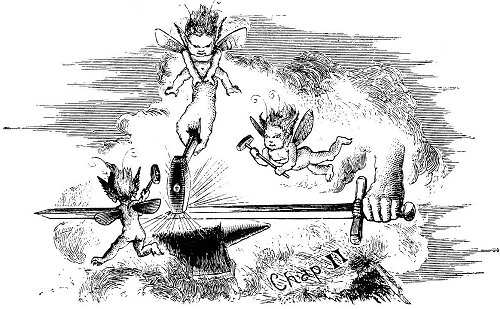
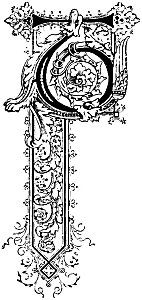
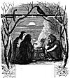
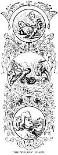
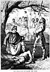
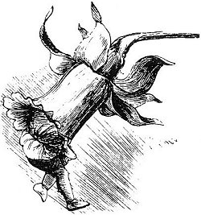

  
[Intangible Textual Heritage](../../../index) 
[Legends/Sagas](../../index)  [Celtic](../index)  [Index](index) 
[Previous](phy13)  [Next](phy15) 

------------------------------------------------------------------------

p. 69

 

### CHAPTER II.

|                     |
|---------------------|
|  |

HE other jarls of Man, hearing of the fate of their friend and neighbour
Kitter, and fearing a general rising of the Manx peasantry against them,
assembled together to take counsel for their united defence. Their
suspicions were unanimously fixed on Eaoch, the cook, who they believed
had purposely been the cause of his master's death, and of being in
league with the country people to destroy or drive from the island all
the nobles of Norwegian descent.

He had been arrested almost immediately, and was accused before King
Olave Goddardson, who, being a just man, ordered him to be brought face
to face with his accusers. Great preparations were made for the trial
the king commanded should be held. The jarls took good care that the
jury should consist exclusively

p. 70

of their own order, and though King Olave did all in his power to secure
him a fair hearing, Eaoch met with but scant justice. A speedy
conviction resulted, and sentence of death was pronounced. The cook
heard his sentence with perfect composure, and so soon as it was
pronounced he claimed the privilege then allowed by both Norwegian and
Manx law to all native born subjects condemned to death, of choosing the
place and manner of his own execution.

His application was granted by his royal judge as a matter of course,
and on hearing the king's consent to his request the condemned cook
exclaimed:

"The death I choose is this. I will place my head on one of your
majesty's legs, and it shall there be cut off with your majesty's great
sword MACABUIN, which was made by LOAN MACLIBHUIN, the dark smith of
Drontheim."

On hearing this every one was horror-struck, for they saw in a moment
the cunning of the varlet, who knew full well the magic properties of
the great sword, and calculated on the kings refusal to run so great a
risk of losing his leg and most likely his life.

Every one, nobles and common people alike, begged and prayed of the king
to refuse the prisoner's preposterous request, the compliance with which
would be placing himself in such imminent danger, for the powers and
properties of the great sword were very terrible.

The great sword, MACABUIN, had been made specially for King Olave by
LOAN MACLIBHUIN, the dark smith of Drontheim, assisted by fairies and
bugganes, who superintended its forging and tempering. It would sever
anything and everything its edge was brought in contact with, even solid
iron or granite rock, and when once it began to cut, there was no
knowing where it would stop. When he first received this wonderful sword
King Olave was bade to try its powers, and being at the time encamped
between Douglas and Laxey he struck two huge stones one after the other
and cave them in twain. There the stones stand to this day, where they
may be seen near the roadside, and are pointed out to the visitors when
going from

p. 71

Douglas to see the great wheel of Laxey Mines. It is said of these
stones that whenever they hear the cock crow at sunrise they clap
together with a great noise.

[  
Click to enlarge](img/07100.jpg)  
THE WITCHES' CONCLAVE  

Knowing the wondrous properties of this sword, no wonder all the people,
with whom the king was very popular and much beloved, dreaded the
effects of carrying out the cook's request, and fearing for his
majesty's safety, begged of him not to submit to it.

p. 72

There was no compromise possible in the matter. Either the king must run
this terrible risk of having his leg cut off, or the condemned man be
liberated.

Olave Goddardson was a true knight, and his word once given nothing
could induce him to forfeit it. In spite of bishops and priests offering
him indulgence and absolution, he insisted on keeping his plighted word
to the condemned varlet, Eaoch, and no inducement could prevail upon him
to do aught derogatory to his fair fame as a man and a king.

The preparations for Eaoch's execution were therefore proceeded with,
the whole island bewailing what was considered must necessarily result
in the death of their beloved king.

With a view if possible of overcoming the terrible cutting properties of
the great sword all the witches in the island were consulted, and they
held a midnight meeting at the full of the moon on the summit of
Snaefell, the highest mountain in the island.

Their weird consultations were presided over by Oda, the very crone who
had caused all the mischief by making the pot of fat boil over, and so
setting fire to Jarl Kitter's castle.

After much discussion among the ancient wise ladies, and consulting of
many mystic records, together with the working of several incantations,
a charm was at last decided upon and prepared, to be placed on the Royal
Leg, prior to the condemned cook laying his head upon this extraordinary
block of his own selection.

It was only at the urgent solicitations and prayers of his subjects that
the king consented to allow the charm to be used.

TOADSKINS, flayed from the reptiles alive;

Twigs OF THE ROWAN TREE, [1](#fn_2) twisted round
and bound together with GREY HAIRS plucked from the CHINS of MAIDEN
WOMEN, and

ADDERS' EGGS.

Each to the number of nine times nine were skilfully amalgamated

p. 73

together, and cunningly formed

<table data-align="RIGHT">
<colgroup>
<col style="width: 100%" />
</colgroup>
<tbody>
<tr class="odd">
<td data-valign="CENTER"><a href="img/07300.jpg"> 
Click to enlarge</a> 
THE WITCHES' CHARM 
</td>
</tr>
</tbody>
</table>

into a pad or cushion of seven times seven layers.

The day fixed upon for the execution of Eaoch the cook at length
arrived, and an immense concourse of people assembled from all parts of
the Isle of Man at the TYNWALD MOUNT, the spot where all public
ceremonials took place, and where, at the present day, Her Majesty Queen
Victoria's representative presides at the proclamation of the Manx laws
that have been passed during the past session of the House of Keys--the
insular parliament--and on her behalf he gives the royal assent to the
same once every year--the first Monday in July, which is kept as a
general holiday. [1](#fn_3) All the preparations
being completed for the execution, the charm was produced, and with much
ceremony and

p. 74

many mystic rites, carefully bound on the king's leg by the arch-witch
Oda herself. The assembled people looked on in eager suspense, and the
deepest anxiety was depicted on every face. The culprit having been
previously shriven, was led forth to his doom. His appearance was the
signal for a perfect storm of yells and execrations from the crowd. He
was seized by two stalwart Norsemen, and after being blindfolded, was
led up to the royal chair, where he was bid to kneel and lay his head
upon what he had himself so cunningly elected as the block--the leg of
King Olave. One of the king's body-guard, named Ulrid, a veteran
renowned in many a hard-contested fight for his undaunted courage, his
great strength, and his peculiar steadiness of hand and nerve, was
selected for executioner.

The mighty and terrible sword Macabuin, made by Loan Maclibhuin, the
dark smith of Drontheim, was brought forth from the king's armoury by
two other guardsmen, and laid with great state and ceremony before the
throne. On drawing it forth from its sheath, its bright and polished
blade reflected back the brilliant rays of the midday sun, glittering
and flashing like a sword of fire, dazzling the eyes of all beholders.
Lifting up the sword with the greatest caution, and bracing every nerve
of his powerful and brawny arms, in order to keep its destructive powers
well in check, he laid its edge gently upon the neck of Enoch.

Not a sound was heard. All the vast multitude looked on in silence and
with bated breath, terribly anxious for the result of the magic charm,
which alone could counteract the fearful powers of the dreadful sword,
and stay its descent before reaching the brave king's leg.

Great was the trepidation of the whole assembled court on beholding that
even the strong and steady hand of the king's most trusty guardsman
could not stay the onward and downward progress of the wondrous weapon,
when once its edge began to cut.

The sword Macabuin made but short work of the neck of Eaoch, severing it
clean from his body, without a single hitch or hesitation on passing
through the bone. Straight through it went; and, much to the horror of

p. 75

 

[  
Click to enlarge](img/07500.jpg)  
THE EXECUTION OF EAOCH THE COOK  

 

p. 76

those near the king, it continued still to cut, in spite of the efforts
of the guardsman to restrain its progress, dividing asunder slowly, but
steadily and surely, layer after layer of the preventive charm, till it
reached the very last grey maiden's hair, and then it stopped. The spell
was broken, and the magic power of the great sword Macabuin was at an
end. The executioner once again had a perfect control over the weapon,
and lifting it up from the royal leg, which had not received the
slightest injury, he waved the blood-stained blade triumphantly around
his head.

Great was the joy and loud the shouts (almost as loud as those of the
dead cook's) of every one when they saw the success of the potent charm,
and that their beloved king remained uninjured. Fires were speedily
kindled on the mountain tops, and from hill to hill the joyful news was
spread throughout the whole length and breadth of the island, "The king
is saved," "Long live the king!"

Olave jumped up directly the executioner had lifted up the sword from
his leg, and kicked the ghastly bleeding head on one side. He then
proceeded in solemn procession, attended by all his court and thousands
of his assembled people, to Peel, and entering the cathedral of St.
Germain's, returned thanks, and offered many precious gifts at the
shrine of that saint in gratitude for his wonderful preservation.

 

 

 

------------------------------------------------------------------------

### Footnotes

[72:1](phy14.htm#fr_2) The Rowan is the ash tree.

[73:1](phy14.htm#fr_3) The Tynwald Hill is a
mound of earth composed of ground brought from every parish in the
island, and is situated on the roadside at St. John's, as near as
possible in the centre of the island. It has been used for these
purposes from time immemorial, and gives its name to the highest court
of law in the island, the Court of Tynwald, which is presided over by
the Lieutenant-Governor in person.

------------------------------------------------------------------------

[Next: Chapter III](phy15)
