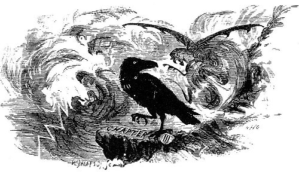
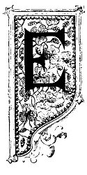
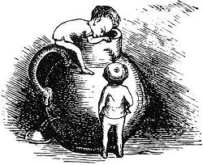

  
[Intangible Textual Heritage](../../../index) 
[Legends/Sagas](../../index)  [Celtic](../index)  [Index](index) 
[Previous](phy14)  [Next](phy16) 

------------------------------------------------------------------------

p. 77

 

### CHAPTER III.

|                     |
|---------------------|
|  |

AOCH'S extraordinary execution, with the particulars of King Olave's
steadfast courage and escape, soon became the topic of conversation far
and wide, and was the theme of many a travelling minstrel's song. In
time the news reached the shores of Norway and the city of Drontheim,
where it came at last to the ears of Loan Maclibhuin, the swarthy smith
of that ilk.

When he heard of the stratagem and weird device adopted by the Manx
witches, and submitted to by the king to thwart the efficacy of his
*chef d'œuvre*, the great sword Macabuin, he stormed and raged with
frantic fury, uttering curses and denunciations on the king, on the
witches, and on the whole Manx people. He summoned his confidential
servant and chief hammerman, an old cripple named HIALLUS-NAN-URD, and
bid him start at once to the Isle of Man, and go to the court of King
Olave Goddardson, at Peel Castle, with a message he imparted to him in
secret.

Hiallus-nan-urd had only one leg, having lost the other in the service

p. 78

of his master while assisting that wonderful smith in the manufacture of
the great sword Macabuin. Swords, however, were not the only articles
manufactured in the Drontheim smithy, and Loan Maclibhuin had cunningly
contrived for his crippled servant an artificial limb, which, though not
worked either by steam or clockwork and springs, like the leg of Mynheer
von Clam, was a very curious piece of mechanism, and, unlike that of the
Dutchman, though it "never got tired," was under the perfect control of
its owner.

The hammerman started off, and in due time reached Peel Castle, where he
demanded to be admitted to an audience with his Majesty of Man. On being
ushered into the royal presence, he then and there taunted the king with
unknightly conduct in having offered insult to his own good sword--the
great sword Macabuin, which had been made expressly for and presented to
him by the dark smith, Loan Maclibhuin of Drontheim, and he concluded
with challenging the king to walk with him from Peel Castle to the
smithy at Drontheim.

Such a challenge, publicly given before his whole court, coupled with so
grave an accusation, could not be refused without ineffable disgrace and
a total loss of caste. The honour of Olave Goddardson was at stake, and
he had no alternative but to accept the challenge of the offended Loan
Maclibhuin. This he did in spite of a solemn warning given to him by Oda
the witch, who, scenting the arrival of the strange one-legged
ambassador from Norway, and auguring no good from his visit, had
hastened to the court at Peel Castle, and was present at the meeting
between him and he king.

She privately informed Olave Goddardson that the challenge was only a
ruse to decoy him to his destruction, for the dark smith was at that
very time engaged upon the construction of another magic sword, which
was to possess even more wonderful powers than the once celebrated, but
now dishonoured, Macabuin, in his Majesty's possession. She also
informed him that news had been brought to her by a raven, with three
white spots on its breast, that had arrived the night previous direct
from Norway, of its having been prophesied by Haco-Norjid, a noted
wizard of that country,

p. 79

that the new sword now being made by Loan Maclibhuin, the dark smith of
Drontheim, would be a wonderful success, and possessed of supernatural
and invincible powers far beyond that of Macabuin, or of any other
weapon ever yet produced in the world; but that in order to insure this
success it was necessary that the steel should be tempered in live royal
blood.

Oda at once divined that it was the dark smith's intention to entrap
King Olave Goddardson into visiting his smithy at Drontheim for the sole
purpose of making him the victim whose royal blood should give the
required temper and miraculous powers to the great sword he was now
engaged upon.

On hearing Oda's communication the king thanked her for the warning, but
told her it was too late to withdraw from the challenge.

Followed by the good wishes and prayers of all his people, King Olave
started off on his journey to walk with Hiallus-nan-urd, the one-legged
hammerman of Loan Maclibhuin, from Peel Castle to the smithy at
Drontheim. No sooner had they started than a large black raven, with
three white spots upon its breast, was seen to rise into the air, and,
after three flights round the towers of Peel Castle, to take the same
course as the travellers, keeping steadily over the king's head. Oda,
the Manx witch, was determined that King Olave should, in case of need,
receive due warning of any danger or treachery that might threaten his
safety while away, and that raven was intrusted by her with a special
mission for that with strict instructions ever to keep a close watch on
the one-legged hammerman, and on no account to allow him to arrive at
the smithy at Drontheim before the king.

 

 

------------------------------------------------------------------------

[Next: Chapter IV](phy16)
