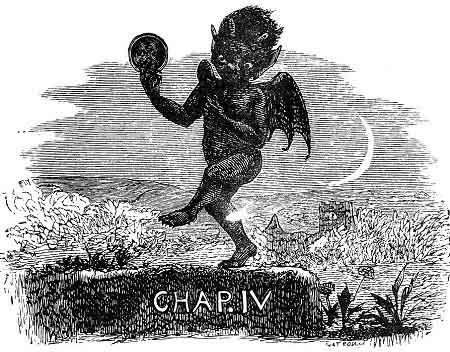
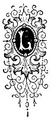
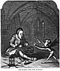
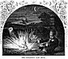
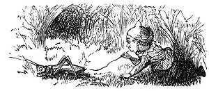

  
[Intangible Textual Heritage](../../../index) 
[Legends/Sagas](../../index)  [Celtic](../index)  [Index](index) 
[Previous](phy19) 

------------------------------------------------------------------------

p. 107

 

### CHAPTER VI.

|                     |
|---------------------|
|  |

ONG after all about Brodar Merune and the tricks of the buggane had been
forgotten and faded from the memory of the Manx people, some worthy and
well-disposed persons determined to put the church into a proper state
of repair, and render it fit and complete for the services of the
neighborhoods, which was getting more populated than when the building
was begun, and much in want of church accommodation. Accordingly, after
a number of parish meetings, at which steps were taken to raise the
needful funds, the good work was commenced; but before much progress had
been made, an old crone who lived in a hovel by the roadside, came to
Robert Quayle, the DOONEY-MOOAR, or the chief man of the parish, who had
been deputed to superintend the work of restoration, and reminded him of
the old, forgotten tale of the buggane and his destroying the first roof
of the church.

p. 108

Old Maggie Gill, for such was the crone's name, warned Robert Quayle and
all those engaged in the good work that their efforts would be utterly
useless, and their labour only thrown away.

The resuscitation of the old tale of the buggane caused much gossip and
discussion in all the district round about, and the subject of the
completion of the church was on every one's mind.

One day a very sanctimonious old tailor, named Timothy Mylrea, well
known in that part of the country, and who was aspiring, if the church
was completed, to fill the united offices of clerk and sexton, came to
the Dooney-Mooar and told him he had on the previous night dreamed that
Saint Trinion himself appeared to him, and said that if he, Timothy
Mylrea, would, when the roof was finished, sit in the middle of the
aisle during the night and make a pair of red cloth breeches, all
complete, and walk nine times round the church, it would for ever
frustrate the power of the malignant buggane to destroy the roof or
otherwise injure the building, and dispel the charm that had hitherto
for so many years either hindered or prevented its completion. He
volunteered to do this, provided the coveted appointments of clerk and
sexton were bestowed upon him. This was agreed to in the event of his
being successful, and the work was commenced and pushed forward to
completion. On the evening of the day on which the church roof was
finished the valiant Timothy betook himself and his work to Saint
Trinion's, and, with the good wishes of all his friends and neighbours,
proceeded to make the red cloth breeches.

On entering the church and looking round, he saw that all was right and
no one there but himself. He closed the door, lit and fixed three
candles, arranged his work around him, sat down cross-legged on the
floor, and commenced. Having cut out the breeches, he looked up and down
and all about. No one appeared, and he took courage. He began to
whistle, but his shrill piping sounded somewhat discordant and strange
beneath the groined and arched roof of the church, and it suddenly
struck Tim Mylrea that whistling was rather out of place in such an
edifice. He threaded his needle and basted his work together. He gave
another look

p. 109

around the church, and finding no one appeared, his courage waxed
stronger, and he began to sing--

  King Orry of old  
  Was a Viking bold,  
And far, far from the North came he;  
  His ships full of men--  
  Ten hundred and ten--  
Came sailing straight over the sea.  
  The sea, the sea,  
  Came sailing over the sea.

  A fierce lot they were  
  That came with him there,  
And sailed up the fair River Lhane;  
  All trembled with fear,  
  And hid, far and near,  
From terrible Orry the Dane.  
  The Dane, the Dane,  
  From terrible Orry the Dane.

  "From whence do you come,  
  Bold Rover?" asked one,  
"And where is your home--let us know?"  
  "My home is now here,  
  It once was up there,  
In the land of cold, frost, and snow."  
  And snow, and snow,  
  In the land of cold, frost, and snow.

  He stretched forth his sword  
  As he spoke the word,  
And pointed right up in the sky-- p. 110  
  "The fair Milky Way  
  Was home yesterday,  
Now here is my home till I die.  
  I die, I die,  
  Now here is my home till I die."

  Orry ruled in Man,  
  And the land began  
To thrive and to flourish with ease;  
  For good laws he made,  
  And taught the folks trade,  
And founded the old house of Keys. [1](#fn_4)  
  Of Keys, of Keys,  
  And founded the old House of Keys.

By the time his song was ended the breeches had far progressed towards
completion, for stitching away as fast as his fingers could work, he had
got one leg quite finished. Looking round again and seeing no one,
neither elf nor mortal, Tim was getting quite elated, and thought it
must be all stuff and nonsense about the buggane, and that there were no
such things after all. Hearing a noise, he again looked up, and there
straight before him, sure enough, was a head, appearing just out of the
ground, and grinning most horribly at him with great goggle green eyes,
distended nostrils, a wide mouth, and fierce fangish-looking teeth;
altogether about the very ugliest sight Timothy Mylrea had ever beheld.

One glance was sufficient to convince him it was the veritable buggane
himself, and that all his ideas of there being no such things were
erroneous. But he was a plucky fellow was Tim Mylrea, and continued on
with his work, keeping his eyes steadfastly fixed on the breeches and
stitching away like a patent sewing machine.

p. 111

 

[  
Click to enlarge](img/11100.jpg)  
TIM MYLREA AND THE BUGGANE.  

 

p. 112

"Timothy Mylrea," shouted the buggane, "what are you doing here?"

Tim took no notice, but went on with his work faster than ever.

 

"Do you see my head?" said the elf.

 

"Hee! hee!" replied Tim.

"Do you see my great eyes and my long teeth?" howled the buggane,
getting enraged that the tailor was not frightened.

"Hee! Hee!" again replied the busy man, stopping his work one instant to
snuff his candle with his fingers and pitch the severed wick at the head
before him after which he went on with the breeches, which were now
nearly completed.

Having by this time risen entirely out of the ground, the ugly little
fellow, now furious at this last mark of Mylrea's contempt, began
capering about in front of him, and grinning in his face all the time in
the most hideous manner.

"Tim, you brute!" yelled the buggane. "You wretch! Do you see my strong
arms, my ten fingers, my sharp nails, my big----"

Ere he could utter another word, up jumped the tailor, and, seizing his
work, rushed as fast as he could out of the church. Hardly had he got
clear of the door than down came the roof with an awful crash, that made
him jump more nimbly than ever he did before. Hearing the fiendish,
laugh of the buggane, he bounded off as hard as his legs would carry
him, with the red breeches under his arm, along the road towards
Douglas, and the infuriated little buggane after him. It was run tailor,
run buggane. Away they went. Sure mortal man never ran so quick as poor,
terrified Timothy, who, had he been possessed of the "three legs of
Man," could not have got over the ground faster than he did with two.

Turning his head once to look over his shoulder, he saw his horrid,
raving pursuer close upon his heels, with extended jaws and panting
forth dreadful suffocating, sulphurous fumes that would have choked poor
Mylrea had he not kept out of their reach. The buggane's hands were
stretched forth, his claw-armed fingers were ready to clutch and tear
him to pieces. The poor fellow's breath was almost gone, and he thought
he really must

p. 113

give up and fall into the terrible little creature's power, when at a
turn of the road he caught sight of the Kirk Braddon before him, and,
taking fresh courage and putting on a spurt, he redoubled his efforts.

If only he could reach the church he would be safe he knew, so he took
fresh heart and made one more last effort. Running with increased speed
the last few yards, he reached the churchyard wall, and, springing over
like a deer into the consecrated enclosure, sank exhausted on the
ground.

There, beneath the shadow of the church and once on holy soil, he felt
safe from all the bugganes and elfins in the island. After taking a few
breaths he looked up, and there on the wall could he see his arch enemy
grinning, if possible, more horribly than ever, and spitting at him with
all his might a perfect shower of sparks and liquid fire.

Fearing the little brute might injure him if any of his hellish spittle
reached him, he got up and staggered nearer the church, where he lay
down, crouching close to the sacred edifice, and just beneath the
chancel window. The buggane, seeing his intended victim had really
escaped, gave full vent to his maddened and infuriated rage, which now
knew no bounds. After dancing and jumping about on the top of the
churchyard wall--he dared not come actually within the precincts of the
consecrated ground--and dancing about in the road outside, yelling out
most dreadful curses and denunciations to the trembling and exhausted
tailor, he made one last expiring effort to annihilate the poor
frightened Timothy Mylrea. Seizing his own head in both his hands, and
wrenching it off his body, the buggane hurled it over the wall, and,
falling at the feet of Mylrea, it exploded like a torpedo, with a report
that resounded over the country for miles, echoing from mountain to
mountain like a peal of thunder. The noise of the explosion brought the
alarmed people from their houses, running from all directions towards
whence the noise proceeded to see what calamity had happened. There, in
Kirk Braddon churchyard, was Timothy Mylrea found by his neighbours,
and, wonderful to say, perfectly unscathed, but most wofully frightened.

On somewhat recovering himself he related all his adventures of the
night

p. 114

to the anxious crowd, all eager to hear what had befallen him; and,
sanctimonious and well-conducted man that he was, he actually swore that
nothing on earth should ever tempt him to volunteer to face the fairies
or bugganes again, and that as long as he lived he would give the
roofless church of Saint Trinion as wide a berth as possible.

[  
Click to enlarge](img/11400.jpg)  
THE BUGGANE'S LAST SHOT  

A long discussion ensued among the heads of the parish as to what had
caused him to fail at the last moment, as he had evidently up to the
time of leaving the church complied with the instructions Saint Trinion
had given

p. 115

when he appeared to him in his dream and told him to make the red
breeches. While the argument was going on the parson took up the nether
garments to examine them, when he discovered that they were all
complete, except one solitary button, which Mylrea had omitted to sew
on, in his hurry to leave the church and get away from the little
grinning buggane.

Whether, if he had not forgotten the button, the fully completing the
red breeches would have broken the charm of the buggane's power and
driven him from the church for ever, was long an open question, and one
frequently discussed over many a glass of grog. Certain it is, however,
that no one else has ever since attempted either to replace the roof on
Saint Trinion's church or to exorcise the buggane that even to this day
is said to haunt the ruins.

\*         \*         \*         \*         \*         \*

The roofless church, now a mere picturesque ruin, stands in a field a
little way from the roadside on the highway between Douglas and Peel, as
a lasting memorial of

The buggane's vow, that Saint Trinion should

never have a whole church in

Ellan Vannin.

 

------------------------------------------------------------------------

### Footnotes

[110:1](phy20.htm#fr_4) The House of Keys is the
name of the Manx Parliament, which was originally founded by King Orry
the Dane.

 
