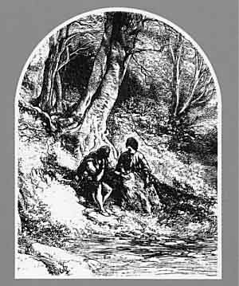

  
[Intangible Textual Heritage](../../../index)  [Legends &
Sagas](../../index)  [Celtic](../index)  [Index](index)  [Next](pt301) 

------------------------------------------------------------------------

## POPULAR TALES

###### OF

# THE WEST HIGHLANDS

##### ORALLY COLLECTED

##### WITH A TRANSLATION

### BY THE LATE J. F. CAMPBELL

#### NEW EDITION

#### VOLUME III

#### ALEXANDER GARDNER OF PAISLEY AND LONDON

#### \[1890\]

###### Scanned at Intangible Textual Heritage, April, 2004. John Bruno Hare, redactor. This text is in the public domain. These files may be used for any non-commercial purpose, provided this notice of attribution is left intact.

   
Frontispiece

------------------------------------------------------------------------

[Next: Contents](pt301)
