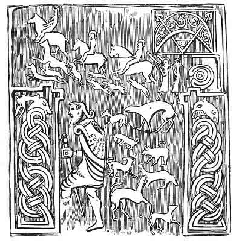

  
[Intangible Textual Heritage](../../../index)  [Legends &
Sagas](../../index)  [Celtic](../index)  [Index](index) 
[Previous](pt330)  [Next](pt332) 

------------------------------------------------------------------------

p. 298

### LXXVII.

### JOHN, SON OF THE KING OF BERGEN.

From Angus Mackinnon (tailor), South Uist.

1--COMHRAG.

"’Tis the track of the youth beside the ford,  
And the great impetuous stride.

2

"’Tis not the daughter of Locha Luin,  
And 'tis not Diarmaid of the clear eye.

3

"It is not one of the band of Fionn  
That wended last night in the heavy glen.

4

"I gathered my garments and wended forth;  
The gathering was hard throughout the moss.

5

"I was rushing and bounding,  
And the big man hard striding.

6

Then at the time I caught him,  
And the precious woman between two scaurs.

7

I asked so quietly of him,  
Great man, whence comest thou thus

8--SEATHAN.

But little one, there, little man,  
Though thou asked, it was not wise.

p. 299

### SEATHAN MAC RIGH BEIRBH.

1

S lorg an òga seach an t-àth  
’S an ceum rodh a tha ro dhian;

2

Cha 'n i nighean Locha Luin;  
’S cha 'n e Diarmaid an ruisg ghlain;

3

Cha 'n e h-aon a chuideachd Fhinn;  
A dh' imich an raoir 'san troma ghleann.

4

Thruis mi m' aodach 's thar mi as;  
Feadh na mointich bu gharbh truis.

5

Bha mise na m' ruith 's na m' leum,  
’S am fear mor 's e 'na chruaidh cheum.

6

An sin an uair a rug mi air,  
’S a' bhean leig eadar da sgoir.

7

Gn 'n d' fhiosraich mi dheth gu foil,  
"Fhir mhoir ciod as mar seo?"

8

"Ach fhir bhig sin--ach fhir bhig,  
Gad a dh' fharraid cha bu ghlic.

p. 300

9

"Thou hadst need bring the whole of the Een,  
To find out the race of a single man."

10--COMHRAG.

"If I should bring the whole of the Een,  
A whole bone wouldn't be thy body within.

11

"That which they would not crush with their hands,  
Sure with their breath they would consume.

12

"That was the time, when his weapon he cast,  
The mighty spear that was in his grasp.

13\.

"That he cast it beyond me, behind,  
Seventeen feet into the ground."

11--SEATHAN.

"Thy trimmed shaft has touched my heart,  
And the leech will not make my healing.

15\.

"Farewell, and arise to thy house,  
Yellow-haired youth of the curling locks."

16--COMHRAG.

"For thee, it is all the worse,  
That thou didst not declare thy race.

17,

"That the head huntsman of Fionn.  
Gave thee battle in the heavy glen."

18--SEATHAN.

"I am John, son of Bergen's king,  
Son of the fierce one of the sturdy tread."

p. 301

9

"Cha b' uilear dhuit an Fhinn uile  
’Thoirt gu slionneadh an aon duine.

10

"An Fhinn uile na 'n d' thugainn ann  
An cnaimh slan cha bhiodh a'd' cholainn;'

11

"A' chuid nach pronnadh iad le 'n lamhan,  
’S dearbh gu 'n loisgeadh iad le 'n anail."

12

An sin an uair a thilg e arm,  
An t-sleagh mhor a bha 'na dhorn.

13

Gu 'n d' chuir e i tharum siar  
Seachd troidhe diag anns an talamh.

14

"Bhoin do chrann gleusta do m' chri,  
’S cha dean an lighich mo leigheas."

15

"Beannachd dhuit 's eirich gu teach,  
Oganaich bhuidhe 'chuil chlannaich.

16

"Gur h-ann duitse 's measa sin,  
Nach d' rinn thu do shloinneadh a dheanadh.

17

"Gu 'n d' thug gille cinn Choin Fhinn  
Comhrag diots' anns an troma ghleann."

18

"Mise Seathan, Mac Righ Beirbh,  
Mac an fhir ghairg bu mhor trosd.

p. 302

19--COMHRAG.

"MY name shall be, on coming home,  
Combat of five hundred pounds."

I have not found this fragment anywhere else. This seems to describe a
raid made by the son of the King of Bergen, who carried off a woman, and
was tracked and overtaken, and slain in a rift by Comhrag of the five
hundred hounds, Fionn's head huntman. I am responsible for the division
into stanzas of two lines. Siar generally means west; here it means
behind, probably, for the same reason, that south and to the right are
synonymous. A man facing the rising Sun has his back to the west, and
his right hand to the south (deas). The left hand (lamh thosgail), to
the north, and the sun (air a Bhevltaobh), on his mouth side, on Baal's
side. This may be fancy, but unless some explanation is found, it does
not appear how a man can have a north and south hand, and a western
back.

J. F. C.

From Angus MacKinnon, tailor, Dallabrog, South Uist, who is a little
dark-haired man, with quick-moving grey eyes, and lively, kindly manner.
He wears neither shoes, nor stockings, nor bonnet, and seemingly never
has. He sings these pieces with considerable pathos, and has a tolerably
good voice. He appears to me to be about seventy years of age.

Beirbhe. Dictionaries translate Beirbhe, Copenhagen, but it is more
probably the Gaelic form of Bergen, which was formerly the capital of
Norway, which is part of the Gaelic Lochlann, as well as Denmark. How
Bergen may have passed into the Gaelic Beirbhe, may be illustrated by
the frequency with which bh passes into g, or gh, and vice versa; thus,
ubh or ugh, an egg; dubh, or dugh, black, etc., *oov oog*, *doo*.

H. M‘L.

September 16, 1860.

p. 303

19

Gur h-e b' aimn dhomh tighinn gu teach  
Comhrag nan coig ceudan con.

 

<table>
<colgroup>
<col style="width: 100%" />
</colgroup>
<tbody>
<tr class="odd">
<td>
 
HOUNDS AND HUNTSMEN, ORNAMENTS AND CHARACTERISTIC SYMBOL--Copied from the</td>
</tr>
</tbody>
</table>

------------------------------------------------------------------------

[Next: LXXVIII. The Master and his Man.](pt332)
