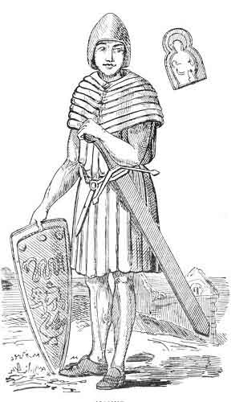

  
[Intangible Textual Heritage](../../../index)  [Legends &
Sagas](../../index)  [Celtic](../index)  [Index](index) 
[Previous](pt337)  [Next](pt339) 

------------------------------------------------------------------------

p. 363

### THE LAY OF MAGNUS.

A poem so called is known in Ireland, and is preserved in MSS. in
Dublin, according to writers in the transactions of the Ossianic
Society.

A poem of 172 lines, "Comhrag Fhein agus Mhannis" was published in 1786,
in Gillies' collection. An Irish version was published by Miss Brooke,
1789. I have compared my version with the poem in Gillies. I find that
they vary from each other; in words, in lines, and even in whole
stanzas; but the two might be fused so as to produce a third, perfectly
genuine, and more complete than either. The version orally collected in
1860 goes a step beyond the other, printed in 1786, and I feel certain
that it is historical. This story is in substance the same as "Fingal,"
and might be the germ of that poem. Irish writers claim it as Irish, and
assert that the Lay of Magnus was MacPherson's original for part of
Fingal. It first appeared in print in Scotland, and it is still repeated
there, wherever it was composed. Irish collectors have copies taken down
orally in Scotland long ago.

Now, if Magnus can be identified, it would fix the earliest possible
date for the poem, and a later date for the poet than is usually given
to Oisean, by Scotch and Irish writers; and this opinion agrees with
Miss Brooke's.

The prose tale is also about Magnus; it was written by MacLean. I heard
it recited by old MacPhie in 1860. He is failing fast, and cannot
dictate slowly; I miss several of the measured prose passages, which I
heard him repeat with the utmost fluency, when he

p. 364

was allowed to go his own pace. The story is manifestly incomplete; and
it reminds me of one which old MacPhie repeated a second time for me. He
then gave disjointed incidents, and broken sentences, instead of a
connected story in very good language, with few repetitions, with
curious rhythmical passages interspersed, which he gave the first time.

It is hard to say what this story means, unless it is Celtic mythology
engrafted upon a bit of Norwegian history.

I give it with all its shortcomings, because, if Celtic mythology is
ever to be discovered, it will be found in some such shape.

We have here, at all events--

The King of the World, whose life is in that of a horned, deadly or
hurtful or venomous animal; and his son Brodram.

The King of Light, who is conquered by a lion; and his son, the white
long-haired one, whose life is in that of three fish; who has twelve
bald ruddy daughters; who marry twelve men, the foster-brothers of Manus
the hero.

Balcan, the smith, who has twelve apprentices; and his son, who is a
sailor, and has a wonderful spotted ship, and twelve sailors.

In short, there are many things which suggest solar worship and
mythology--Aries, Taurus, Leo, Pisces--12 hours of day, 12 of night, 12
months, 12 signs of the zodiac, Light, the Smith or artificer Balcan;
the sailor, his son:--Vulcan and Neptune, &c. But while there is much to
suggest inquiry, there is nothing definite.

The poem, on the contrary, is definite enough, and in that respect it
resembles other poems which I have collected, and differs from the prose
romances.

p. 365

 

   
MANUS.

 

p. 366

I have endeavoured to restore this dress from various authorities. From
grave stones; two in Iona, and two in Islay, of which I happened to have
very rough sketches; and from tradition.

I leave the legs bare, because there is no indication of any covering on
the legs of the sculptured figures, and because Magnus the great was
called "barelegs" when he adopted the dress of the islands, and because
there is no mention of any covering for the legs in the traditional
descriptions of dress. On the contrary, at page 442, vol. ii., it
appears that the warriors had shoes, but that their legs were bare.

Some stones indicate that the arms were clothed in some material, with
longitudinal folds; others indicate no covering.

The shape of the shield is from a stone at Iona. On some there are
traces of armorial bearings.

The lion, snake, and griffin, are from the story as repeated to me by
old MacPhie. "His boss-covered, hindering, sharp-pointed shield on his
left arm, with many a picture to be seen thereon. Lion and Creveenach,
and deadly serpent." A lion and a serpent appear in the Welsh romance of
the Lady of the Fountain, which this story resembles in some degree.

The helmet and sword are copied from stones, some of which are roughly
carved in relief nearly six inches above the surface.

The tippet and shirt are very like the dress commonly worn by the Lapps
of the Luleo river, and by little Scotch children at the present day.

The Lapps wear a loose deer-skin shirt, and a belt round the waist, and
a tall conical cap. In rainy weather they slip a tippet over their
heads, which is tied round the forehead, and protects the chin, throat,
and shoulders, covering all but the face.

Scotch children wear a kilt and sleeve-waistcoat in one, into which they
slip, and which, with a shirt, often constitutes their whole attire.

The warrior's outer dress was probably some such garment made of
leather, with iron scales. The same Gaelic word means patched cloak, and
coat of mail, and such a dress seems to be meant at page 205, vol. ii.
The virgin and child are from the stone in Kilnaughton church, Islay,
and the symbol indicates a Christian warrior and a date.

------------------------------------------------------------------------

[Next: LXXXIV. Manus](pt339)
