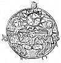
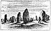
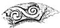
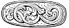

  
[Intangible Textual Heritage](../../../index)  [Legends &
Sagas](../../index)  [Celtic](../index)  [Index](index) 
[Previous](pt419)  [Next](pt421) 

------------------------------------------------------------------------

# CELTIC ART.

 

[  
Click to enlarge](img/34800.jpg)  
Bosses from St. Sebald, Nuremburg. plate xxviii., Grammar of Ornament,
''Byzantine.''  

 

Celtic art, like Gaelic mythology, points eastwards, and to a very early
origin. It may be new to many to hear of "Celtic art," but nevertheless
it is classed in the Grammar of Ornament by Owen Jones, who is an
acknowledged authority in such matters. In books and sculptures, and in
ornaments of known date, from the fourth and fifth centuries to the
eleventh or twelfth; in ornamental writings, on stone, pottery, and
metal,

p. 349

found in the British Isles, there is a peculiar style of interlaced
Ornament, which is not to be found in Germany or in Norway, though it is
similar to Anglo-Saxon ornaments found in England. Something of the kind
has been found about Mount Athos, and in a few places in continental
Europe where Irish or Anglo-Saxon

 

[  
Click to enlarge](img/34900.jpg)  
Sculptured stone in a mound at Gavr Innis in Brittany--See page 361.  

 

missionaries have been. And as Britain was formerly celebrated for
basket-work, it has been ingeniously suggested that these patterns,
which can be imitated in basketwork, were copied from ancient British
osier patterns, and so spread eastwards to Rome, and. Byzantium, and the
East. It is said that in the

p. 350

oldest manuscripts, foliage is not represented. Basket work might well
be the foundation of pottery and of defensive armour. It is quite common
for herd boys to make bottles and shields of rushes, and even conical
helmets and long swords of the same materials, and therewith to hold
sham fights, with the cattle for spectators. Early British clay vessels
seem to bear the mark of similar workmanship, and the crow, in No.
viii., advises the girl to carry water by stuffing a sieve with clay. A
basket covered with leather makes a good shield. Boats were so made, and
a basket lined with sunbaked clay would serve to carry water, and the
shape of the basket might well suggest decorations, but I would rather
believe that the basket-makers brought their patterns from the East. At
all events the interlaced design given below was taken from a bronze
which belongs to a set on which the signs of the Zodiac, elephants,
camels, lions, and Eastern emblems are represented, together with
similar designs.

The Western tombstones of Iona are rich in such patterns, and so are the
crosses of Ireland, the sculptured stones of Scotland, and crosses at
Sandbach, in Cheshire. The pattern on the cover is taken from a stone in
Islay, the tail-piece is from an ancient Gaelic manuscript; several
interlaced designs will be found in vol. iii., and these complicated
knots appear to be the distinguishing feature of ancient British Celtic
art.

But on crosses and other monuments in Scotland these interlaced patterns
are often found associated with other designs; with human figures, and
those of monsters, and with certain symbols which have not yet been
explained.

On the bronze vessels, from one of which the pattern below was copied, a
great number of figures and symbols

p. 351

are also engraved, and as their meaning is generally clear enough, and
the style of ornament is the same with that which is called "Celtic,"
the bronzes and the sculptured stones may perhaps throw light upon each
other. One of these Scotch hieroglyphics is very roughly drawn at page
220, vol. iii., and is better represented at page 499, *Prehistoric
Annals of Scotland*.

 

[  
Click to enlarge](img/35100.jpg)  
Interlaced Pattern from an Eastern Bronze, supposed to be of Hindu
workmanship.  

 

In the one case it forms part of a very rudely sculptured stone, of
unknown date and origin, in the other it is part of a design copied from
a suit of silver armour discovered in Scotland. It may be described as
three spiral lines starting from a common centre, and comprised

p. 352

within a circle, and these spiral lines are characteristic of Celtic art
according to Owen Jones. In the silver ornament this symbol is twice
repeated, and is associated with the "Z ornament," the "crescents," and
the head of some creature which seems to have horns. The question is,
what do these symbols mean? for they are frequently repeated on
sculptural stones in Scotland.

I have imagined that they have an astronomical signification, and that
they may have related to solar worship before they were adopted as
ornaments on crosses.--See page 356, vol. iii.

The Isle of Man has always been the stronghold of fairies, and it was
the refuge of the Druids; the Druids were astronomers, as it is said,
and the Manxs penny bears a device which is the same in principle as the
three spiral lines, though these have grown into three armed legs; and
thereby bangs a popular tale, and it is this:--

"Some fishermen long ago arrived on the shore of an island which they
had never seen or heard of, because it was always enveloped in a magic
cloud, raised by little Manain, the Son of the Sea. They landed, and
presently there came rolling on the mist something like a wheel of fire,
with legs for spokes, and the portent so frightened the men that they
fled to their boats." But the charm was broken, the Isle of Man had been
discovered, and its possession has been disputed by men and fairies ever
since.

The "legs of Man" then have to do with a wheel of fire.

It is common in the Highlands now to speak of the "wheel of the sun, and
it was the custom not long ago to ascend some high hill on Easter Sunday
to see

p. 353

the sun rise, and "Whirl round like a mill wheel, and give three leaps."
But a peasant of a practical turn of. mind rebuked a friend, saying--

"Fool! And dost thou think to see the sun rise from there, when she
rises beyond Edinburgh, and so many hills as there are in the way?"

The characteristic spirals, the circle, the wheel, and the sun are thus
associated by Celtic traditions and devices. The design given below was
traced from the bronze vessel already mentioned, and it represents the
sun, with three lines starting from its centre. These

 

[  
Click to enlarge](img/35300.jpg)

 

are not exactly the "Legs of Man," but they are drawn on the same spiral
principle, and the spaces enclosed are filled by three human faces,
rudely carved. The design resembles that on the "Norrie's law relics "
found in Fife, and in the east it clearly related to fire or light.

But the design given above is only one of a great

p. 351

many on the same vessel; all bound together and enclosed by endless
lines, turning, and twisting, and sprouting into heads, leaves, and
buds; and twelve of the designs represent the signs of the Zodiac. Thus
the particular style of ornament which experts have agreed to call
"Celtic" and "Byzantine," here occurs on a "Hindu" sacred bronze
almanac, and the sun in "Leo" has the spiral lines in its centre, so
these once had an astronomical meaning.

The Lion's tail grows into a serpent, and the interlaced ornament
sprouts into a whole crop of buds, and monstrous heads, over which the
lion stalks triumphant. "Aries" is a man riding on a monstrous ram with
a flourishing tail; "Taurus" is mounted on a bull; "Gemini" are dancing
about two bulls' heads; "Cancer" has got the sun in his claws; "Leo" is
described above; "Virgo," men gathering autumn fruits; "Libra" is a lady
playing on a guitar; "Scorpio" a man fighting with two scorpions;
"Sagittarius" is a Centaur shooting back at a monster which grows out of
the end of his own tail; "Capricornus" is looking back, and riding on a
goat; "Aquarius" has a bird; and "Pisces" his two fish; so there is no
doubt of the meaning of these designs at all events.

A six-pointed star, made of interlaced triangles and curves and
interlaced patterns, is in the inside of the bronze vessel, and as the
star is surrounded by fish, it is to be argued that the symbol relates
to water, though it is also surrounded by forty-nine points like rays.

But the Scotch crosses, and standing stones, and sarcophagi on which
interlaced designs appear, often represent animals with which Scotch
artists could not well be familiar. There is an elephant on a very
beautiful cross in Islay; there is a camel on another

p. 355

stone, figured in the "*Sculptured Stones of Scotland*." On the St.
Andrews sarcophagus there are lions, and apes with globes, a griffin,
and a knot of snakes; and though the system of ornament might be of home
growth, the most patriotic of Scotch antiquaries must refer these to
some foreign source. The question now is, Whence did the Scotch artists
borrow these ideas, which they could not have got at home? Beneath the
signs of the Zodiac, on the eastern bronze, is a kind of frieze of
figures, all fighting, and marching sunwise round the bowl. Beneath
Aries are two men mounted on a camel, one shooting arrows backwards, the
other shooting forwards at the tail of a nondescript animal like a hare.
The falconer, in the wood-cut below, is between "Cancer" and "Leo."
Beneath "Virgo" is a man on foot resisting the progress of the others
with a long spear, and also an elephant with several riders; and beneath
these is a procession of birds, probably to indicate that the whole has
to do with the powers of the air. Beneath them are human-headed snakes.
Above the signs of the Zodiac is another frieze, comprising forty-two
human figures engaged in all sorts of occupations--playing the harp and
the tambourine, fighting and drinking; and above all these, on the cover
of the vessel, are eight compartments, of which one is figured above;
and the rest are in like manner occupied by figures which appear to
represent divinities or the heavenly bodies. Two of these comprise
legends which are almost effaced; one is in a "Persian" character, the
other has not been identified, and neither has been read. Still it is
evident that this is of Eastern, probably "Hindu" workmanship; that the
designs relate to matters connected with the heavens, and the gods; that
the sun is one of these, and that the style

p. 356

of ornament is that which is called "Celtic." With these designs are
animals which are associated with like designs on stones in Scotland;
camels, elephants, lions, horses, hawks, rams, bulls, goats, snakes,
fish, dragons, and monsters.

"Celtic ornament," then, is found in the far East and in the far West;
and the foreign animals associated

 

[  
Click to enlarge](img/35600.jpg)  
Figure dressed in the belted plaid, from the St. Andrews Sarcophagus.  

 

with "Celtic ornament" in Scotland are associated with a similar style
of ornament on ancient Hindu vessels. The meaning of the symbols in the
latter case is sufficiently

p. 357

plain. It seems possible that the others may have a like signification.

With this view, the horseman on the St. Andrews sarcophagus may have the
same meaning as the horseman figured below.

 

[  
Click to enlarge](img/35700.jpg)  
Figure between Leo and Gemini, on a chased silver inlaid Hindu bronze.  

 

They are dressed in some national costume; the one wears a belted plaid
and has bare legs; the other appears to have a Persian dress, but both
carry hawks and swords, and are fighting lions, without any apparent
reference in the one case to a bronze bowl, or in the other to a
sarcophagus. In both cases the figures are marching "sunwise;" in the
one case the figure clearly has to do with astronomical symbols; it is
possible that the St. Andrews stone and the Eastern bowl may have been
sculptured with a like intention.

Another curious ancient bronze sacrificial vessel was brought from Java
in 1817 by my friend, Mr. John Crawford, and proves that the signs of
the Zodiac were associated with Hindu worship, in a place nearly as
remote from Central Asia as Scotland is. The vessel

p. 358

was found amongst the ruins of Hindu temples, and bears a date
equivalent to A.D. 1320. It is a rough casting, and the style of art is
different. In the inside, at the bottom, is an eight-pointed star, with
some rude figure in a circle within the star. On the outside are twelve
symbols, with twelve figures above them. These are--

1\. A ram, or some other horned and bearded animal of a like kind, above
which is a long-armed, long-bearded, large human figure, in profile.
Both are facing the same way--"sunwise," westwards.

2\. A bull, or cow, with a bump; above which is a human figure with a
crown, or a glory; seen full face, and therefore stationary.

3\. Instead of "Gemini," something like a triple claw emerging from a
sleeve, or a cloud, and pointing back at the bull; above which is a
short, thick, human figure, with a helmet, or a monstrous head, with a
bill like that of a goose, facing the usual way. [1](#fn_35)

4\. A crab with his claws upwards, ready to run either way sideways;
above is a man carrying something over his shoulder on a stick,
[and](errata.htm#17) walking sunwise about the bowl.

5\. Instead of "Leo," a two-legged dragon, without wings, and with a
long tail, facing sunwise; above which is the stationary figure in No. 2
repeated.

6\. A draped female figure, moving sunwise; above which is a stationary
female figure, very like the male figure in No. 5.

7\. The scales. The figure above is moving sunwise, but is not easily
made out.

p. 359

8\. A scorpion, facing sunwise; above is a repetition of the figure in
No. 2.

9\. A bent bow, with an arrow on the string pointing sunwise; above is a
monstrous bird, like an eagle, walking the other way.

10\. Instead of "Capricornus," a creature like a lobster, crayfish, or
shrimp; all of which walk forwards, and swim backwards. This symbol,
therefore, corresponds to the crab, which walks sideways in either
direction; and it probably indicates the Southern tropic, or Northern
winter.

11\. A jar, above which is a man walking sunwise, and carrying
something; probably "Aquarius" in his Javanese dress.

12\. A fish, with something like an elephant's trunk, the head as usual
pointing sunwise, or to the right of the vessel. Above the fish is the
same figure which is repeated in 2, 5, 8, 10, and 12. The human figures
are dressed in some scanty costume which bears a resemblance to Javanese
dresses; it is therefore probable that the vessel was made in the
country where it was found.

Java is to the south of the equator, and consequently, stars which seem
to move along the equator or ecliptic there appear to move about an
observer or a vessel set upright, in a direction contrary to that in
which they seem to move in the northern hemisphere. The sun, during the
greater part of the year, is to the north of an observer whose head is
towards the South Pole, and there appears to him to move East, North,
West, South, from his right hand towards his left from morning to
evening. But the symbols of constellations on the Java sacrificial
vessel, like those on the Hindu bowl, are facing in the opposite
direction; the direction in which the constellations would appear to
move about the

p. 360

vessels if they were placed on their bases north of the tropic of
Cancer.

When the sun in our spring seems to move northwards, up, and back, from
"Aries" to "Taurus," the ram and the bull seem to move from East to
West, and from left to right, and down, and to the south of the sun, on
the ecliptic, because the earth is moving. But to an observer in the
southern hemisphere who has put his head the other way through the hoop,
towards the South Pole, the constellations seem to pass the sun, and
rise and set, still moving from East to West, but from *right* to
*left*, not from left to right. On the Java bronze they are facing to
the right, consequently it is probable that the symbols were not
invented in Java or south of the line, but somewhere in the northern
hemisphere, and the agricultural operations represented in the signs of
the Zodiac agree with northern seasons. [1](#fn_36) But if these symbols were invented in
Central Asia, or in Babylon, 3000 years ago, or in Egypt or Greece, it
is just as likely that they should have arrived in Scotland, as it is
that they should have got to Java 540 years ago. It is thus proved that
certain symbolic creatures have been associated with astronomy; that in
Java, India, Greece, and Rome, they have been associated with worship;
and in India with a particular style of ornament. That style of ornament
is found in Scotland, on sculptured stones of unknown date, and
associated with the figures of the animals, which in Rome, Greece,
India, and Java, have represented constellations. The meaning of these,
and of certain Scotch symbols, [2](#fn_37) is

p. 361

unexplained, but it is not unreasonable to suppose that they once had a
similar meaning in India and in Scotland, when there are so many hands
pointing towards Central Asia as the common starting place of so many
human races.

It would be going too far to call the ram on the St. Andrews stone
"Aries," and the lion "Leo;" but till something has been found out
concerning the stone-falconer of the long locks, and the naked legs, and
the flowing dress, he may perhaps pass for a relative of the Eastern
bronze falconer who is fighting a lion, between "Cancer" and "Leo,"
amongst twisted snakes, and branches and buds, under the sway of the sun
and moon, and of diverse many-armed graven images, whose meaning is not
so clear.

Perhaps the oldest bit of Celtic ornamental art known is to be found in
Gavr Innis, in Brittany. A large sepulchral mound was opened some years
ago, and was found to cover a passage formed of large boulders, one of
which is figured above, [p. 349](#page_349). The cut is taken from a
very hasty sketch, made in August, 1855, in a very bad light. The design
appears to be a rude attempt to represent the inside of a house, like
the tomb itself, or such as a Lapp hut, or an Icelandic house, or a
Highland cottage, now is. A sketch of part of the interior of a Lapp hut
will be found in vol. iii., frontispiece. Such dwellings are thus
made--a number of rough sticks or trunks of small trees, or big stones,
are set in the ground about the plan or floor of the house, which in
Gaelic is called "làrach," and in Scotch "stance." If the house is to be
of sticks and round, the sticks slope over towards the centre, and form
a cone. If it is to have a passage, like Icelandic houses, stakes or
large stones are set in two rows, and planted nearly

p. 362

upright. If it is to be square, the passage walls are separated and
repeated, and the roof is a pyramid.

This, so far, is an imitation of, and only an improvement on the
frame-work of a round or square tent.

The next step is to place sticks across the others to keep them steady,
and in the Gavr Innis design, as in the sketch of the Lapp hut, this
appears to be indicated. In Highland stone and turf cottages, the
partitions are still made of hurdles plastered with clay.

In the Morea, the shepherds still make temporary conical wattled huts in
which they live, but as the climate is warm, a thatch of branches is
sufficient.

The frame-work being made, the hut is covered outside with birch bark,
turf, or some contrivance to "stop up the sieve," or "line the basket;"
and then big stones, and earth, and rubbish, and turf, and other
available materials, are heaped up and stamped down to keep out the wind
and cold, till there remains a hollow, conical, or pyramidal mound, on
which, after a time, the grass grows. To extend this principle, it is
only necessary to place the cone or pyramid of earth upon the upright
passage walls. To make this a really comfortable dwelling, it is only
necessary to line the sides with planks; and many comfortable hospitable
dwellings, in which well-educated, polite ladies and gentlemen now
reside in Iceland, are mainly built of boulders and turf, lined with
planks, and look like a nest of green hillocks at a distance. The long
passages in tombs at Gavr Innis, and in Greece, are very like those in
old Icelandic houses which I have seen. No material, it is said, resists
cold so well as earth; and as fuel and timber are scarce in the north,
so Highland cottages are like Icelandic houses.

The architectural design on the passage wall of the

p. 363

tomb in Gavr Innis appears to represent the inside view of such a
building, with its stakes, stones, and turf, but the waving lines cannot
be so explained. They look like serpents, and there are similar designs,
like a serpent pierced by a zig-zag line, on stones in Scotland. (See
vol. iii., 309.) In the immediate neighbourhood of Gavr Innis, there are
great numbers of "standing stones," like those which exist in England,
etc. Some of enormous size have fallen and are broken, but others remain
erect. At Carnac [1](#fn_38) there is an array
of smaller stones which extends for about three miles. There must have
been many thousands of them arranged in rows at some period, and many
hundreds still remain erect. It is hard to believe that this enormous
work had not a religious meaning. If so, then, similar monuments on a
smaller scale, such as "Stonehenge" in England, and "Calenish" in Lewes,
and standing stones and barrows all over the world, even to the
obelisks, and pyramids, and temples of Egypt, may be but various growths
of the primitive ideas of dwellings, tombs, and temples. From a tree
came a post, a gnomon, and a pillar; from a tent came a hut, and thence
a house; from a sepulchral mound came a cairn, and thence a pyramid;
from stakes and poles grew columns; from sloping tent-sticks came
rafters and a roof, and thence a covered temple, with rows of pillars;
and so architectural ornaments might take their origin from wattled
branches, leaves, basketwork, hurdles, and mats; plaited straw, rushes,
and hair, honeysuckle, and birch roots.

Specimens of the style of design, which is called Celtic, will be found
at pp. 137, 303, vol. iii., and on

p. 364

 

[  
Click to enlarge](img/36400.jpg)  
A bit of Carnac, sketched in 1855.  

 

p. 365

the cover of this book; and the nearest good hairdresser or maker of
straw mats will imitate the design on page 137.

Thus sacred ivy, matted about a sacred oak, may have suggested the
interlaced ornaments on stone pillars and Christian crosses; and
basket-work may have suggested the patterns on gold and silver filigree,
on stone and clay vessels and pottery, on carved powder-horns and dirks,
and generally the designs attributed to Celtic art. Honeysuckle is the
object of superstitious observances at this day. It winds sunwise about
trees, and its long stem would be a good material for making these
basketwork designs.

But the fact that such designs are found upon works of art manufactured
in the far East, seems to prove that "Celtic art" was not invented in
the British Isles, but imported at some early date.

It was not brought by the Northmen, for there is nothing like it in
Scandinavia. For a similar reason it was not brought by the Normans,
Anglo-Saxons, or Romans; stones and manuscripts on which it occurs are
older than the Saracenic period; and unless the Celts brought the germ
of it from the far East, with their religion and language, and their
popular tales, it is hard to explain the occurrence of similar eastern
animals, monsters, and "runic knots" on the sculptured stones of
Scotland, and on "Hindu" bronzes.

There are plenty of cases in which Greek or Italian art can be traced in
the Hebrides. The ornament figured below is from a stone which was found
in the ancient stronghold of the MacDonalds in Islay.

It is rude enough, much broken, and the stone is worn away, seemingly by
the hands of those who used

p. 366

it. It is very old, but the style of ornament is not "Celtic."

 

<table>
<colgroup>
<col style="width: 100%" />
</colgroup>
<tbody>
<tr class="odd">
<td><a href="img/36600.jpg"> 
Click to enlarge</a> 

Part of the edge of a hollowed stone, found about 1830 under the ruins at the east end of the chapel on the island in Loch Fionnlagain, the chief place of the MacDonalds in Islay. The inside of the chapel was a place of burial, and this looks like a holy-water font. 
</td>
</tr>
</tbody>
</table>

 

It is the style which is to be found in wooden Norwegian churches, said
to be as old as A.D. 1100, and which is characteristic of more modern
Norwegian carving, on knife-handles, powder-horns, wooden chests, and
such like articles. A glance at the following woodcut will show what is
meant.

 

<table>
<colgroup>
<col style="width: 100%" />
</colgroup>
<tbody>
<tr class="odd">
<td><a href="img/36601.jpg"> 
Click to enlarge</a> 

End of a powder-horn, carved by a peasant in Gulbrandsdal, Norway, about 1850. Similar designs are common in Norwegian carvings, even on a wooden church as old as 1100, according to the dates upon it. I have never seen a so-called Runic knot in Scandinavia like those which are common in Scotland. 
</td>
</tr>
</tbody>
</table>

 

p. 367

Celtic art, then, appears to be of Eastern origin, like "Celtic nations"
and "languages," and like Gaelic popular tales.

The well-known superstitions observances connected with Halloween have
been referred to Eastern solar worship. [1](#fn_39) The Reverend James Robertson, minister of
Callander, described them in 1791, and alluded to the stone circles of
Scotland as to Druidical temples. He tells that in his day, in hamlets,
a fire was lighted at sundown, made entirely of ferns gathered on
Halloween. The neighbours assembled, and each, according to seniority,
placed a marked stone at the edge of the ashes till a circle was made
about the site of the fire, which was then abandoned.

Next morning the place was visited, and if any of the party found his
foot-print in the ashes, and his stone removed from its place, he was
doomed to die before the twelve months expired.

I have often seen the site of fires surrounded by stones placed there by
children; and once, on a beautiful Easter Thursday evening (April 5),
just at sundown, many fires suddenly appeared blazing and smoking on the
hill-tops in the Isle of Man. In about ten minutes they all vanished as
suddenly as they had appeared, and a Manksman, who was asked to explain
the cause, looked much disturbed, and went his way in haste without
answering.

"Bealtainn," yellow May day, is in spring; and All Saints, All Hallows
or Halloween, "Samhuinn," 1st of November, is late in autumn--so there
are Pagan as

p. 368

well as Christian observances connected with these two seasons.

The following passage from Mr. Robertson's letter adds to the list of
things which were done sunwise in his day in the Highlands:--

 

"To this day, when the Highlanders go round anything with a degree of
religious veneration, they go round in the same direction as the sun
goes round the world on this side the equator, *i.e.*, from east to
west, by the south side. This is the direction in which a bride is
placed by her bridegroom when they stand up to be married; the direction
in which the bridegroom turns round the bride to give the first kiss
after the nuptial ceremony; the direction in which they go at least half
round a grave before the coffin is deposited; the direction in which
they go round any consecrated fountain, whose waters are supposed to
have some medicinal virtues which they expect to receive by immersion or
drinking.

"I have heard it said, that in certain places of the Highlands the
people sometimes took off their bonnets to the sun when he appeared
first in the morning."

 

It seems, then, that the ancient eastern veneration for the sun and for
fire, which is recorded in the Vedas, still survives in the West
Highlands in popular superstitious observances which resemble Indian
religious ceremonies. Perhaps "Bodach," the bogle, may once have been
"Buddha," the sage; "Bramman," the fiend, "Brahme," the air; "Puath,"
the spectre; " Fohi," the god; "Cailleach," the night bag, "Cale"; and
"Aigne," thought "Agni," divine fire.

Note.--"King Arthur's table" is still preserved at Winchester. It is
hard to believe that it is the real table, but it is what people thought
it was like a long time ago, about the time of Henry the VIII.

It is round. In the centre are two five-leaved roses, which

p. 369

are surrounded by an inscription, which declares that "This is the round
table of King Arthur and his twenty-four knights." Outside the circle in
which the inscription is, the table is divided into twenty-four
radiating stripes of alternate black and white; and at the end of each,
at the edge of the table, is the name of a knight. All the names read
from the centre, consequently they read "sunwise."

King Arthur, crowned and throned with globe and sceptre, sits as though
he had sat in the midst, facing outwards, and behind his head is a kind
of glory of light, in which is his name. It has been suspected that a
real King Arthur has acquired the attributes of a Pagan sun-god; and
this looks very like it, when brought to bear upon other Celtic
traditions.

------------------------------------------------------------------------

### Footnotes

[358:1](pt420.htm#fr_35) The sun in Gemini is
north of an observer about the latitude of Bombay.

[360:1](pt420.htm#fr_36) On the Farnese globe
the signs, except Taurus, face westwards.

[360:2](pt420.htm#fr_37) Some of the symbols are
like the letters Z. V. A. O. Δ. S. ♓. See page
[309](pt417.htm#page_309).

[363:1](pt420.htm#fr_38) Gaelic *carn*, a heap
of stones; *achadh*, a field (?) stonefield.

[367:1](pt420.htm#fr_39) *Transactions of the
Society of Antiquaries of Scotland*, vol. iii., p. 223. Other ceremonies
are described in Armstrong's Dictionary. See Bealtuinn.

------------------------------------------------------------------------

[Next: Music](pt421)
