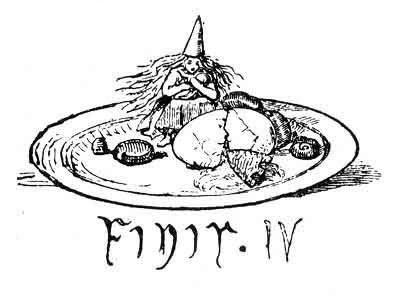

  
[Intangible Textual Heritage](../../../index)  [Legends &
Sagas](../../index)  [Celtic](../index)  [Index](index) 
[Previous](pt425) 

------------------------------------------------------------------------

p. 428

### FAIRY EGGS.

Of these curious beans I have now a large collection. Seven different
kinds are thrown up on the Scotch coasts, of which four are roughly
shewn in the woodcut. The largest and commonest sort is very like a bean
which grows on the Andaman Islands. It is curious if worthless nuts
thrown up by the sea in Scotland grow near India. In 1825 these nuts
were mentioned in letters from the Irish Highlands. The Irish then laid
them under their pillows to keep away the fairies, and it was supposed
that they drifted from "South America." A Highland woman has twice
refused to part with a gray one, which she "had from her mother," and
which is "good against fire." I have seen one which was left to a girl
by her nurse, and bad been silver mounted. A minister told me that they
were blessed by the priests and worn by Roman Catholics *only*, but I
think this was a mistake. Protestants keep them, I know.--See
Introduction, Vol. i.

There is no reason to believe that the stories now current in the
Highlands are nearly exhausted by this collection; whole districts are
as yet untried, and whole classes of stories, such as popular history
and robber stories, have scarcely been touched; and yet new stories come
in regularly. MacLean, Urquhart, Carmichael, Dewar, and others, have
many more written down, but not copied fairly out. 791 is the number now
reached, and the manuscripts would fill a wheelbarrow. Three more
volumes would hardly contain the collection: all taken down from the
mouths of the people within the last three years; and yet it is commonly
said that there are "*no current popular traditions*." One half of the
world seems to know very little about the other; but here ends the list
of what came out of

FAIRY EGGS.

 

 
