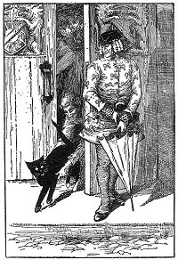

  
[Intangible Textual Heritage](../../../index)  [Legends and
Sagas](../../index)  [Celtic](../index)  [Index](index)  [Next](sfft01) 

------------------------------------------------------------------------

[Buy this Book at
Amazon.com](https://www.amazon.com/exec/obidos/ASIN/B0026FCJ10/internetsacredte)

------------------------------------------------------------------------

  
*Scottish Fairy and Folk Tales*, by George Douglas, \[1901\], at
Intangible Textual Heritage

------------------------------------------------------------------------

# SCOTTISH FAIRY AND FOLK TALES

###### Selected and Edited

###### with an Introduction by

## Sir George Douglas

###### \[b. 1856 d. 1935\]

#### A. L. Burt Company,

#### New York

#### \[1901?\]

###### Scanned, proofed and formatted at Intangible Textual Heritage April, 2003, by J. B. Hare. This text is in the public domain in the US because it was published prior to 1923.

  [  
Click to enlarge](img/front.jpg)  
So they turned Alexander Jones out, because he was stupid and said
nothing.--Page [106](sfft27.htm#page_106).  
*Frontis.--Scottish Fairy Tales*.

 

------------------------------------------------------------------------

[Next: Contents](sfft01)
