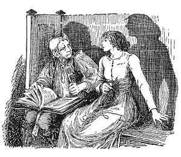
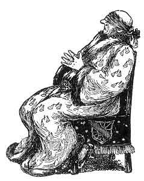
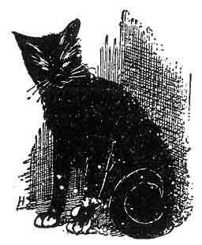

  
[Intangible Textual Heritage](../../../index)  [Legends and
Sagas](../../index)  [Celtic](../index)  [Index](index) 
[Previous](sfft26)  [Next](sfft28) 

------------------------------------------------------------------------

[Buy this Book at
Amazon.com](https://www.amazon.com/exec/obidos/ASIN/B0026FCJ10/internetsacredte)

------------------------------------------------------------------------

  
*Scottish Fairy and Folk Tales*, by George Douglas, \[1901\], at
Intangible Textual Heritage

------------------------------------------------------------------------

p. 99

 

### ALEXANDER JONES.

"JEAN, sit a wee bit east," requested the town-clerk, between the puffs
of his pipe, as he sat on the corner of the bench before his fire one
chilly evening. "You're taking ower muckle room, and mair than your
share o' the settle."

But Jean, his wife, had just got her knitting into a nasty tangle, and
was not in the best of humours, so declined to move one inch, or to
attend to what her husband was saying.

"Jean," said her husband again, "sit a wee bit east; it's no decent to
sit sae selfish. Sit a bit east,

p. 100

d'ye hear?" and the town-clerk gave his wife a rude shove to her end of
the bench.

"Wha' d'ye mean by that? and wha' d'ye mean by east?" cried his wife.
"There's nae sic thing as east to begin with, and--"

"Nae sic thing as east?" shouted the town-clerk.

"Will ye no' believe the sun himself?" and then in a loud voice he
declaimed that, as the sun went round the earth every day, and was
always rising every moment somewhere in the east, which thing he hoped
no one was fool enough to deny, everywhere was the east, all over the
place; and if there was anything ridiculous, it was to talk about west.
If everywhere was east, there was nowhere where west could be. So he
hoped his wife would not make a goose of herself, and talk nonsense.

But then his wife got up and said he did not look at it in the right way
at all. On the contrary, the sun was all the day setting somewhere in
the west, which thing she hoped no one was fool enough to contradict;
and as he was always setting somewhere, and doing it every moment,
everywhere was west, and if everywhere was west, there was no room for
east to be anywhere. So she trusted her husband would not make an ass of
himself, and mention east again.

But he shook his head, just like a dog that has been bitten behind the
ear, and was going to reply, when she kilted her petticoats, and ran
round the room in one direction to show how it was done, crying, "West,
west, west!"

This made the town-clerk very angry, and he got

 

  [  
Click to enlarge](img/10000.jpg)  
They all ran around, getting very giddy and banging their heads
together.  
Page [101](#page_101). *Scottish Fairy Tales*.

 

p. 101

tip also, and hitched his trousers, and ran round the table in the
opposite direction, yelling out, "East, east, east!" to show how he
thought it was done.

Yet it only ended by their getting very giddy, and banging their heads
together, a thing which hurt very much, and did not conduce to
good-temper or the solving of the difficulty, you may be sure.

But Alexander Jones sat quiet in the corner, and said nothing.

Still, they agreed in one thing, namely, that the question was of too
deep importance to rest there. So they went to the grocer, who had a
good-sized house up the street, and told him all about the thing, with
the ins and outs of the question; and the grocer and the grocer's wife,
and the grocer's maiden aunt by marriage on the mother's side, and the
grocer's wife's youngest married sister, and the grocer's wife's
youngest married sister's little girl, were all naturally much
interested, to say the least. But one took one view, and another took
another, and they ran round the table, some this way and some that, to
explain how in their opinion it was done. It only ended in their getting
very giddy and banging their heads together, a thing which hurt, and did
not conduce to good-temper or the solving of the difficulty, you may be
sure.

But Alexander Jones sat quiet in the corner all the time, and said
nothing.

Still, they agreed in one thing, that the question. was of too deep
importance to rest there. So the whole lot went to the innkeeper, who
had a much

p. 102

larger house than the grocer, down the street, and told him all about
the thing, with the ins and outs of the matter; and the innkeeper, and
the innkeeper's wife, and the innkeeper's maiden a-Lint by marriage on
the mother's side, and the innkeeper's wife's youngest married sister,
and the innkeeper's youngest married sister's little girl, were all
naturally much interested, to say the least. But one took one view, and
another took another, and they ran round the table, some this way and
some that, to explain how in their opinion it was done. And it only
ended by their all getting very giddy and banging their heads together,
a thing which hurt, and did not conduce to good-temper or the solving of
the difficulty, you may be sure.

But Alexander Jones sat all the time quiet in the corner, and said
nothing.

Still, they agreed in one thing., that the question was of too deep
importance to rest there. So the whole lot went to the chief magistrate,
who had the very largest house in the burgh, in the middle of the street
by the market-place, and they told him all about the thing, and the ins
and outs of the matter; and the magistrate, and the magistrate's wife,
and the magistrate's maiden aunt by marriage on the mother's side, and
the magistrate's wife's youngest married sister, and the magistrate's
wife's youngest married sister's little girl, were all naturally much
interested in the matter, to say the least. But one took one view, and
another took another, and they ran round the magistrate's table, some
this way and

p. 103

some that, to explain how in their opinion it was done; and it only
ended by their all getting very giddy and banging their heads together,
a thing which hurt, and did not conduce to good-temper or the solving of
the difficulty, you may be sure.

But Alexander Jones sat quiet in the corner, and said nothing.

Still, they agreed in one thing, that the question was of too deep
importance to rest there. So the magistrate called a meeting of the
whole populace in the town-hall.

And when the populace came to the town-hall, the chief magistrate told
them all about it, and the ins and outs of the matter; and the populace,
and the populace's wife, and the populace's maiden aunt by marriage on
the mother's side, and the populace's wife's youngest married sister,
and the populace's wife's youngest married sister's little girl, were
all naturally much interested, to say the least. But one took one view,
and another took another.

And they all wanted then to run round a table to explain how each
thought it was done; but here a difficulty arose, for, alas! there was
no table in the town-hall to run round, and what then were they to do?
Yet they were not going to be balked for a trifle like that, not they?
So they requested the chief magistrate to stand in the middle, and let
them all run round him in the direction it pleased them.

But the chief magistrate objected strongly, for he said it would make
him worse than giddy to see some folk going one way round him and some
going the

p. 104

other; indeed, it would be certain to make him sick. So he suggested
instead that Alexander Jones should be placed in the middle. Yes, why
could they not run round him? Better make use of him, he was so stupid,
and said nothing; besides, the chief magistrate wanted to run round with
the best of them himself, and why should he be cut out more than any one
else?

"No, no," cried they all. "Alexander Jones is too small, and would be
certain to be trod upon." It would not do at all, and the chief
magistrate must really do what he was asked. Hadn't they, only the other
day, given him an imitation gold badge to wear on his stom-----well,
never mind--and he must do something for them in return, or they'd take
it away, that they would.

So the poor man had to give in, but he insisted upon having his eyes
bandaged, and also on having a good chair to sit in, otherwise he knew
he would be sick; of that he felt certain.

Then they bandaged his eyes with an old dishclout they got from
somewhere; for a handkerchief would not go round his face, he had such a
very big nose; and, having seated him in a chair, they all ran round him
in a circle, some this way, some another; but they all only got very
giddy and banged each other's heads, a thing which hurt, and did not
conduce to good-temper or to the solving of the difficulty; and, worse
than all, just at the end, when they could run no longer, and were quite
out of breath, Eliza M'Diarmed, the fat widow who kept the
confectionery-shop

p. 105

fell plump against the chief magistrate, and sent him and his chair
flying all along the floor.

But Alexander Jones sat quiet in the corner, and said nothing.

   
THEY SEATED HIM IN A CHAIR-

Then the chief magistrate pulled the bandage off his eyes in a towering
passion, and said something must and should be settled there and then.
No, he would stand it no longer. He threatened, also, if they did not
agree, he would put a tax on buttons;

p. 106

which was rather clever of him, for you see, both sexes would feel that
tax equally, and he, inasmuch as his robes were all fastened by a buckle
at his neck, and a jewelled girdle round his stom----well, never
mind--it would not affect him at all.

At this the town-clerk rose, and said they must, in that case, devise
some other way of discovering the answer to this terrible riddle, and he
proposed to call in from the street Peter the road-man, for he was up
and about at all hours, late and early, and would know more than most
about the sun's movements; only, if they asked him, they must ask also
his one-eyed sister, Jessica--she, you must know, took in the chief
magistrate's washing, and so was a person of importance in the
burgh--for Peter would certainly decline to come in unless she came with
him.

Now this was, indeed, most provoking for me. Because, you see, there was
not another square inch of room left in the town-hall for another
person, and two people would have to go out to let Peter the road-man
and his sister Jessica come in.

So they turned me out for one, as being a stranger from the country,
only asked there in courtesy; and Alexander Jones for the other, because
he was so stupid, and said nothing.

Thus, you see, I never knew what decision the meeting came to, though I
am certain it did come to some, as next morning people's clothes were
still worn as usual, and buttons were at the same price in the shops as
before.

And, though disappointed greatly for my own sake,

p. 107

\[paragraph continues\] I am still more
for yours, my friends, who I must say have listened to this long story
most patiently.

But why was Alexander Jones so stupid as to sit still in the corner and
say nothing?

Oh! hush, hush now! how silly you are! Why, how on earth could he do
anything else? Alexander Jones was the town-clerk's

TOM CAT.

 

 

------------------------------------------------------------------------

[Next: The Fairies of Scotland](sfft28)
